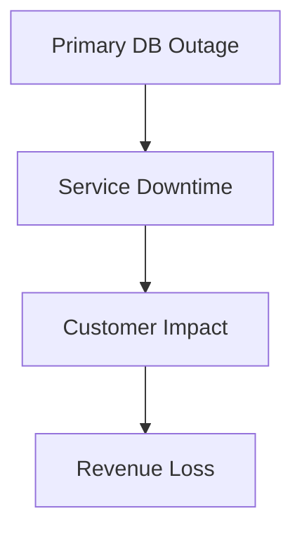

```markdown
---
title: "Mastering Failover Techniques: Building Resilient Backend Systems"
author: "Alex Carter"
date: "2023-11-15"
tags: ["backend engineering", "database design", "resiliency", "failover", "API design"]
---

# Mastering Failover Techniques: Building Resilient Backend Systems


*Graphic by [Miro](https://miro.com) demonstrating failover patterns in action.*

In today’s digital landscape, system resilience isn’t just a nice-to-have—it’s a competitive necessity. High-profile outages don’t just cost money; they erode customer trust, damage brand reputation, and expose businesses to legal risks. According to research by [Uptime.com](https://uptime.com), the average cost of downtime for a mid-sized business is **$5,600 per minute**. For enterprises, that figure can skyrocket to **$740,000 per minute**.

Yet, despite this clear economic imperative, many systems remain prone to cascading failures. Architectural decisions often focus on performance optimization at the expense of redundancy, or they implement failover mechanisms that add complexity without solving critical failure modes.

In this post, we’ll explore **failover techniques**—practical strategies to ensure your systems can gracefully transition from degraded operation to full recovery when components fail. We’ll examine the challenges of unreliable systems, dissect proven failover patterns, and walk through implementation examples. Finally, we’ll discuss common pitfalls and how to avoid them.

---

## The Problem: Why Failover Matters (And Why It’s Often Mismanaged)

### **The Fragility of Monolithic Architectures**
In older systems, monolithic databases and single-point-of-failure (SPOF) designs were the norm. When the primary database crashed, the entire service went down—no graceful degradation, no automatic recovery. Even today, many teams repurpose old monolithic databases without considering failover mechanisms, leaving them exposed to:



### **The Latency-Loyalty Paradox**
Modern users expect near-instantaneous response times. Even a 100ms delay can result in **52% higher bounce rates**, according to [Google’s research](https://blog.quixy.io/latency-impact-on-user-experience/). Worse, when failover triggers, users often experience **increased latency**—not because of the failover itself, but because the fallback mechanism (e.g., a secondary database) is underpowered or poorly synchronized.

### **The "It Won’t Happen to Us" Trap**
Teams often underestimate failure scenarios:
- **Microservices misalignment:** Failover logic works seamlessly in isolation but fails when dependencies are misconfigured.
- **Over-reliance on cloud SLAs:** While cloud providers guarantee uptime (e.g., 99.99% for AWS RDS), they don’t guarantee *your* application’s resilience. If your failover isn’t automated, a single misconfigured probe can bring down your service.
- **Race conditions in distributed systems:** Without proper synchronization, failover can lead to **split-brain scenarios**, where multiple nodes believe they’re the primary—and each overwrites the other’s data.

---

## The Solution: Failover Techniques for Resilient Systems

Failover techniques can be categorized into **three primary strategies**:
1. **Synchronous Failover:** Immediate takeover with minimal data loss.
2. **Asynchronous Failover:** Graceful transition with eventual consistency.
3. **Active-Active Failover:** Dual-primary architecture for high availability (HA).

Each has tradeoffs. Below, we’ll dive into implementation details with code examples.

---

## Components/Solutions: Building Blocks for Failover

### **1. Database Failover (Synchronous vs. Asynchronous)**
#### **Synchronous Replication (Primary-Replica)**
Ideal for low-latency requirements (e.g., financial transactions), but increases write latency.

**Example: PostgreSQL Streaming Replication (Synchronous)**
```sql
-- Configure primary (postgresql.conf)
synchronous_commit = remote_apply
synchronous_standby_names = 'replica1'
max_wal_senders = 5
wal_level = replica

-- Configure replica (postgresql.conf)
primary_conninfo = 'host=primary hostaddr=10.0.0.1 port=5432 user=repluser password=secret apply_wal_lsn=0/16ABCD'
hot_standby = on
```

**Tradeoff:** Ensures strong consistency but can bottleneck writes if replicas lag behind.

#### **Asynchronous Replication (Eventual Consistency)**
Faster writes but risks data loss if the primary fails before replication completes.

**Example: MySQL Master-Master Replication (Asynchronous)**
```sql
-- On Master 1
CREATE USER 'repl_user'@'%' IDENTIFIED BY 'secure_password';
GRANT REPLICATION SLAVE ON *.* TO 'repl_user'@'%';

-- On Master 2
CHANGE MASTER TO
  MASTER_HOST='10.0.0.1',
  MASTER_USER='repl_user',
  MASTER_PASSWORD='secure_password',
  MASTER_AUTO_POSITION=1;  -- Useful for recovery

-- Start replication
START SLAVE;
```

**Tradeoff:** Lower latency but requires application logic to handle eventual consistency (e.g., version vectors, CRDTs).

### **2. API-Level Failover (Client-Side vs. Service Mesh)**
#### **Client-Side Failover with Retries & Circuit Breakers**
Modern clients (e.g., in Node.js or Python) can automatically retry failed requests and fallback to replicas.

**Example: Node.js with Axios and Retry Logic**
```javascript
const axios = require('axios');
const { CircuitBreaker } = require('opossum');

const circuitBreaker = new CircuitBreaker(
  async () => axios.post('http://api-primary/users', { name: 'Alice' }),
  {
    timeout: 3000,
    errorThresholdPercentage: 50,
    resetTimeout: 30000
  }
);

async function createUser() {
  try {
    const response = await circuitBreaker.fire();
    console.log('Success:', response.data);
  } catch (error) {
    console.warn('Fallback to replica...');
    const fallbackResponse = await axios.post('http://api-replica/users', { name: 'Alice' });
    console.log('Fallback success:', fallbackResponse.data);
  }
}
```

**Tradeoff:** Clients must handle retries and fallbacks, adding complexity.

#### **Service Mesh Failover (Istio, Linkerd)**
A service mesh like Istio automates failover by managing load balancing, retries, and circuit breaking at the network level.

**Example: Istio VirtualService for Failover**
```yaml
apiVersion: networking.istio.io/v1alpha3
kind: VirtualService
metadata:
  name: user-service
spec:
  hosts:
  - user-service
  http:
  - route:
    - destination:
        host: user-service
        subset: v1
    retries:
      attempts: 3
      retryOn: gateway-error,connect-failure,refused-stream
    timeout: 2s
  - route:
    - destination:
        host: user-service
        subset: v2  # Fallback to v2 if v1 fails
    match:
    - ( Header("X-Failover", "true") )
```

**Tradeoff:** Requires Kubernetes and mesh setup but provides centralized control.

### **3. Multi-Region Deployments (For Global Resilience)**
For geographically distributed users, failover must span regions. Tools like **AWS Global Accelerator** or **Cloudflare Workers** can help.

**Example: AWS Global Accelerator Failover Logic**
```python
# Lambda function to detect region health
import boto3

def check_region_health(region):
    client = boto3.client('rds', region_name=region)
    try:
        response = client.describe_db_clusters(ClusterIdentifier='my-cluster')
        return response['DBClusters'][0]['Status'] == 'available'
    except Exception as e:
        print(f"Error checking {region}: {e}")
        return False

def lambda_handler(event, context):
    primary_region = 'us-east-1'
    fallback_region = 'eu-west-1'

    if not check_region_health(primary_region):
        print("Failing over to fallback region...")
        # Update DNS or load balancer to route to eu-west-1
        return {
            'statusCode': 200,
            'body': 'Switched to fallback region.'
        }
    return {
        'statusCode': 200,
        'body': 'Primary region healthy.'
    }
```

**Tradeoff:** Adds complexity but reduces latency for global users.

---

## Implementation Guide: Step-by-Step Failover Setup

### **1. Define Your RPO & RTO**
- **RPO (Recovery Point Objective):** How much data loss can you tolerate? (e.g., 5 minutes vs. 1 second).
- **RTO (Recovery Time Objective):** How quickly must the system recover? (e.g., 10 minutes vs. 1 second).

**Example:**
```markdown
| System         | RPO       | RTO       | Failover Strategy          |
|----------------|-----------|-----------|----------------------------|
| User Service   | 1 second  | 30 sec    | Synchronous DB replication|
| Analytics      | 5 minutes | 2 hours   | Asynchronous + batch sync |
```

### **2. Choose Your Failover Strategy**
| Strategy               | Use Case                          | Tools/Libraries                     |
|------------------------|-----------------------------------|-------------------------------------|
| **Active-Passive**     | Low-latency, strong consistency   | PostgreSQL Streaming, MySQL InnoDB   |
| **Active-Active**      | Global HA, eventual consistency   | Kafka, AWS Multi-AZ, CockroachDB    |
| **Client-Side**        | Simple microservices               | Hystrix, Circuit Breaker, Retries   |
| **Service Mesh**       | Kubernetes-native                | Istio, Linkerd                      |

### **3. Implement Health Checks & Monitoring**
Health checks must detect failures *before* users do. Example with Prometheus:

```yaml
# prometheus.yml
scrape_configs:
  - job_name: 'database'
    static_configs:
      - targets: ['primary-db:9187', 'replica-db:9187']
```

```sql
-- PostgreSQL exporter metrics
-- SELECT pg_is_in_recovery() AS is_replica;
```

### **4. Test Failover Manually & Automatically**
- **Manual Test:** Simulate a primary DB failure and verify:
  - Does the app detect the failure?
  - Does traffic route to the replica?
  - Are queries consistent?
- **Automated Test:** Use chaos engineering tools like **[Chaos Mesh](https://chaos-mesh.org/)** or **[Gremlin](https://www.gremlin.com/)** to randomly fail components.

**Example Chaos Mesh YAML:**
```yaml
apiVersion: chaos-mesh.org/v1alpha1
kind: PodChaos
metadata:
  name: db-pod-failure
spec:
  action: pod-failure
  mode: one
  selector:
    namespaces:
      - default
    labelSelectors:
      app: my-db
  duration: "1m"
```

### **5. Document the Failover Process**
Every team should have a **runbook** covering:
1. Steps to manually trigger failover (if automation fails).
2. Rollback procedures.
3. Contacts (e.g., on-call engineers).

---

## Common Mistakes to Avoid

### **1. Ignoring Split-Brain Scenarios**
If two replicas become disconnected (e.g., due to network partition), they might both promote themselves to primary, leading to **data corruption**.

**Solution:**
- Use **quorum-based consensus** (e.g., Raft, Paxos).
- Implement **automatic health checks** to detect partitions.

### **2. Overlooking Data Consistency**
Asynchronous failover can lead to **stale reads** or **lost writes**. Example:
- User A updates their balance to `100`.
- Primary fails before replicating to the replica.
- User B reads from the replica, sees `100`, but the actual balance is `90`.

**Solution:**
- Use **transaction IDs** or **version vectors** to track changes.
- Implement **snapshotting** for critical data.

### **3. Underestimating Latency During Failover**
Fallback replicas are often underpowered, leading to **increased response times** during failover.

**Solution:**
- **Pre-warm replicas** by pre-loading data.
- **Use read replicas** for non-critical reads.

### **4. Not Testing Failover in Production**
Many teams test failover locally but find it doesn’t work in production due to:
- Network differences.
- Dependency misconfigurations.
- Load variations.

**Solution:**
- **Canary testing:** Gradually shift traffic to the replica.
- **Blue-green deployments:** Switch all traffic at once during maintenance windows.

### **5. Forgetting to Update DNS/Load Balancers**
A failed primary won’t help if DNS still points to it.

**Solution:**
- Use **dynamic DNS** (e.g., AWS Route 53 with health checks).
- Implement **auto-scaling groups** that automatically replace failed nodes.

---

## Key Takeaways

✅ **Failover isn’t just about redundancy—it’s about resilience.**
   - Test failure scenarios *before* they happen.
   - Define **RPO** and **RTO** upfront.

✅ **Synchronous failover ensures strong consistency but at a cost.**
   - Use for critical systems (e.g., banking).
   - Accept eventual consistency for non-critical data.

✅ **Automate health checks and failover logic.**
   - Use service meshes (Istio) for Kubernetes.
   - Implement circuit breakers in client applications.

✅ **Global failover requires multi-region design.**
   - Consider **active-active** architectures for global users.
   - Use **CDNs** (Cloudflare) or **edge caching** to reduce latency.

✅ **Document and test failover procedures.**
   - Run **chaos engineering** exercises.
   - Maintain a **runbook** for emergency failovers.

✅ **Monitor failover events in production.**
   - Track **failover duration** and **data loss**.
   - Use **Prometheus/Grafana** for metrics.

---

## Conclusion: Building Failover into Your DNA

Failover isn’t an afterthought—it’s a **first-class citizen** in resilient systems. The teams that excel at failover aren’t those with the most sophisticated tools; they’re the ones that **think about failure as a design constraint**, not an exception.

Start small:
1. **Add retries to your API calls.**
2. **Set up a read replica for your database.**
3. **Test failover manually and automate the process.**

Then scale:
- Move to **active-active databases**.
- Implement **multi-region deployments**.
- Use **chaos engineering** to stress-test your system.

Remember: **The goal isn’t zero downtime—it’s minimal impact when things go wrong.** By designing failover into your architecture from day one, you’ll build systems that thrive under pressure, not just survive it.

---
### Further Reading
- [PostgreSQL Streaming Replication Docs](https://www.postgresql.org/docs/current/warm-standby.html)
- [Istio VirtualService Documentation](https://istio.io/latest/docs/reference/config/networking/virtual-service/)
- [Chaos Engineering by Gremlin](https://gremlin.com/)
- [AWS Global Accelerator](https://aws.amazon.com/global-accelerator/)
- [Circuit Breakers in Distributed Systems (Martin Fowler)](https://martinfowler.com/bliki/CircuitBreaker.html)

---
**What’s your biggest failover challenge?** Share your experiences (or horror stories) in the comments—I’d love to hear them!
```