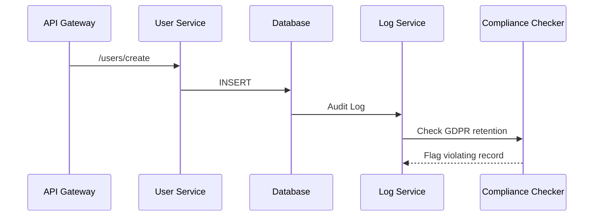
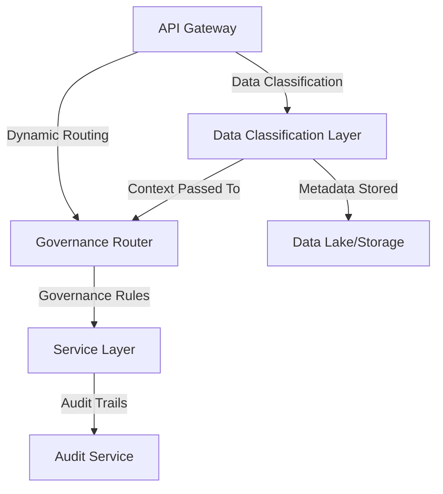

```markdown
---
title: "Governance Integration: Building APIs That Respect Data Regulations (With Code Examples)"
date: 2023-11-15
author: "Dr. Alex Carter"
tags: ["API Design", "Backend Patterns", "Governance", "Data Compliance", "Security"]
description: "Learn the Governance Integration pattern - how to build APIs that automatically respect data sovereignty, compliance, and regulatory requirements. Practical code examples included."
---

# Governance Integration: Building APIs That Respect Data Regulations (With Code Examples)

As backend engineers, we've all watched our systems grow from simple CRUD apps to complex architectures handling sensitive data. Suddenly, regulators start asking questions about where data lives, how long it's stored, who can access it, and how it's processed. **Governance Integration** isn't just about compliance - it's about building trust with users and partners while reducing legal risk.

This pattern solves the problem of "governance drift" where APIs that were designed with compliance in mind gradually become decoupled from those requirements as features are added. It's not about adding a compliance layer on top; it's about embedding governance principles into your core API design and data flow.

---

## The Problem: When APIs Forget Their "Governance"

Let's start with a real-world scenario:



This sounds good in theory, but in practice, governance often becomes an afterthought:

1. **Pseudo-Compliance**: Engineers add compliance checks only after a regulatory request, creating inconsistent enforcement.
2. **Data Silos**: Different services handle different data flows with different governance rules, leading to confusion.
3. **Performance Tax**: Complex compliance checks are added to APIs without considering their impact on latency.
4. **False Positives**: Overzealous checks create operational overhead without real protection.
5. **Geographic Inconsistencies**: User data from different countries gets handled differently due to code paths.

Common scenarios where this becomes a problem:

- A marketing team adds a feature to track user behavior without considering GDPR's right to erasure
- A new analytics dashboard starts processing user data without complying with local data residency requirements
- An international team adds a feature without realizing their country's data protection laws differ from the HQ location

---

## The Solution: Embedding Governance in Your API Fabric

Governance Integration is about **proactive compliance** - building systems where:

1. Data classification happens at ingestion
2. Processing rules are enforced at every stage
3. Compliance is a first-class concern in your architecture

The pattern consists of four key components that work together:



---

## Core Components of Governance Integration

### 1. Data Classification Middleware

This layer automatically tags incoming data with:

- Sensitive data classification (PII, PHI, etc.)
- Jurisdictional context (country/region of origin)
- Data owner information
- Retention policies

**Example Implementation (Node.js with Express):**

```javascript
// middleware/data-classifier.js
const piiPatterns = [
  { type: 'email', regex: /^[^\s@]+@[^\s@]+\.[^\s@]+$/ },
  { type: 'ssn', regex: /^\d{3}-\d{2}-\d{4}$/ },
  { type: 'phone', regex: /^\+\d{1,3}[-\s]?\d{10,15}$/ }
];

function classifyData(request, response, next) {
  const body = request.body;

  const classification = {
    pii: [],
    jurisdiction: detectJurisdiction(request),
    source: request.headers['x-user-origin']
  };

  // Check for sensitive patterns
  for (const {type, regex} of piiPatterns) {
    Object.values(body).forEach(field => {
      if (typeof field === 'string' && regex.test(field)) {
        classification.pii.push({type, value: field});
      }
    });
  }

  request.govClassified = classification;
  next();
}

function detectJurisdiction(request) {
  // Simple IP-based jurisdiction detection
  const ip = request.ip;
  // In production, use a proper IP geolocation service
  // This is just a simplified example
  return ip.startsWith('192.168') ? 'internal'
         : ip.startsWith('10.') ? 'private'
         : getJurisdictionFromIP(ip);
}

module.exports = classifyData;
```

**Usage in your API:**

```javascript
const express = require('express');
const classifyData = require('./middleware/data-classifier');

const app = express();

// Apply classification middleware
app.use(classifyData);

app.post('/users', (req, res) => {
  // Access classification metadata
  console.log('User data classified as:', req.govClassified);

  // Now make decisions based on governance context
  if (req.govClassified.jurisdiction === 'germany') {
    // Apply GDPR-specific processing
  }

  // ... rest of your logic
});
```

### 2. Governance Router

This component dynamically routes requests based on:

- Data classification
- Jurisdictional rules
- Processing requirements

**Example Implementation (Kubernetes Service Mesh - Istio):**

```yaml
# governance-router.yaml
apiVersion: networking.istio.io/v1alpha3
kind: EnvoyFilter
metadata:
  name: governance-router
spec:
  workloadSelector:
    labels:
      app: user-service
  configPatches:
  - applyTo: HTTP_ROUTE
    match:
      context: SIDECAR_INBOUND
      listener:
        portNumber: 8080
    patch:
      operation: INSERT_BEFORE
      value:
        routeConfiguration:
          routes:
          - match:
              headers:
                x-jurisdiction: "germany"
            route:
              cluster: user-service-gdpr-compliant
          - match:
              headers:
                x-sensitivity: "pii"
            route:
              cluster: user-service-pii-processor
```

### 3. Context-Aware Services

Your business logic services need to be aware of the governance context. This means:

- Access control becomes jurisdiction-aware
- Processing rules adapt to data classification
- Audit trails capture all governance decisions

**Example Service Implementation (Python with FastAPI):**

```python
# services/user_service.py
from fastapi import Depends, HTTPException
from typing import Dict, Any
from pydantic import BaseModel
import logging

logger = logging.getLogger(__name__)

class UserCreateRequest(BaseModel):
    name: str
    email: str
    phone: str | None = None

async def process_user(
    request: UserCreateRequest,
    gov_context: Dict[str, Any]  # Comes from middleware
) -> Dict[str, Any]:
    """
    Process user creation with governance awareness
    """
    result = {"status": "created", "user_id": "123"}

    # GDPR-specific processing if needed
    if gov_context.get('jurisdiction') == 'germany':
        if await is_consent_required(gov_context):
            if not request.email.endswith('@company.com'):
                raise HTTPException(
                    status_code=403,
                    detail="GDPR consent required for non-company emails"
                )

        # Add consent record to audit trail
        await add_consent_record(
            user_id=result['user_id'],
            jurisdiction=gov_context['jurisdiction'],
            consent_date=datetime.utcnow()
        )

    # PII processing
    if gov_context.get('pii', []):
        await log_pii_access(
            user_id=result['user_id'],
            pii_types=[item['type'] for item in gov_context['pii']]
        )

    return result

async def is_consent_required(gov_context: Dict[str, Any]) -> bool:
    """
    Determine if GDPR consent is required based on jurisdiction
    and data classification
    """
    # Simplified example - in reality this would check your
    # governance database or policy service
    if gov_context['jurisdiction'] == 'germany' and \
       gov_context.get('purpose') == 'marketing':
        return True
    return False
```

### 4. Governance Audit Trail

Every governance decision must be recorded:

```sql
-- audit_trail table schema
CREATE TABLE audit_trail (
    audit_id UUID PRIMARY KEY DEFAULT gen_random_uuid(),
    event_time TIMESTAMPTZ NOT NULL DEFAULT NOW(),
    resource_type VARCHAR(50) NOT NULL,
    resource_id VARCHAR(255),
    action VARCHAR(50) NOT NULL,
    jurisdiction VARCHAR(50),
    pii_types TEXT[],  -- Array of PII types (email, ssn, etc.)
    decision BOOLEAN,  -- Was this request approved/denied?
    decision_reason TEXT,
    user_context JSONB,
    metadata JSONB
);
```

**Example Audit Logging (Python):**

```python
# utils/audit_logger.py
import logging
from typing import Dict, Any
import psycopg2

logger = logging.getLogger(__name__)

async def log_audit_event(
    event_type: str,
    resource_id: str,
    decision: bool,
    reason: str,
    gov_context: Dict[str, Any],
    metadata: Dict[str, Any] = None
) -> None:
    """
    Log a governance audit event to database
    """
    conn = None
    try:
        conn = psycopg2.connect("dbname=audit user=audit")
        cursor = conn.cursor()

        pii_types = [item['type'] for item in gov_context.get('pii', [])]

        query = """
        INSERT INTO audit_trail (
            event_time, resource_type, resource_id, action,
            jurisdiction, pii_types, decision, decision_reason,
            user_context, metadata
        ) VALUES (
            NOW(), %s, %s, %s, %s, %s, %s, %s, %s, %s
        )
        """
        cursor.execute(query, (
            'user_create',
            resource_id,
            'process',
            gov_context.get('jurisdiction'),
            pii_types,
            decision,
            reason,
            gov_context,
            metadata or {}
        ))

        conn.commit()
        logger.info(f"Logged audit event: {event_type} for {resource_id}")

    except Exception as e:
        logger.error(f"Failed to log audit event: {str(e)}")
        if conn:
            conn.rollback()
    finally:
        if conn:
            conn.close()
```

**Using the Audit Logger:**

```python
# In your router code
from utils.audit_logger import log_audit_event

@app.post("/users")
async def create_user(
    user: UserCreateRequest,
    gov_context: Dict = Depends(get_gov_classification)
):
    try:
        # Process user creation
        user_data = await process_user(user, gov_context)

        # Log successful processing
        await log_audit_event(
            event_type="user_create",
            resource_id=user_data['user_id'],
            decision=True,
            reason="User created successfully",
            gov_context=gov_context
        )

        return user_data

    except HTTPException as e:
        # Log denied request
        await log_audit_event(
            event_type="user_create",
            resource_id=user_data.get('user_id', 'unknown'),
            decision=False,
            reason=str(e.detail),
            gov_context=gov_context
        )
        raise
```

---

## Implementation Guide: Building Your Governance Pipeline

### Step 1: Assess Your Governance Requirements

Start by documenting:
- **Jurisdictional rules** (where data can be stored/processed)
- **Data classification criteria** (what counts as PII, PHI, etc.)
- **Retention policies** (how long data must be kept)
- **Access controls** (who can see what data)
- **Transfer rules** (how data can be moved between regions)

**Example Requirements Document:**

```markdown
### Data Governance Policy

**Jurisdictional Rules:**
- User data from EU must be stored in EU data centers only
- User data from Brazil must comply with LGPD (no automated processing without consent)
- User data from California must comply with CCPA (right to delete)

**Data Classification:**
- Email addresses: PII - Level 1
- Phone numbers: PII - Level 1
- Credit card numbers: PII - Level 2 (extra protection required)
- IP addresses: Not PII unless tied to identifiable information
- Device IDs: PII if paired with email (Level 1)

**Audit Requirements:**
- All PII access must be logged with timestamps
- All jurisdiction-based decisions must be documented
- Right to erasure requests must be tracked and fulfilled within 30 days
```

### Step 2: Implement Data Classification

1. Start with a simple classification middleware (as shown in the examples)
2. Use a lightweight scanning approach for PII detection
3. Implement basic jurisdiction detection (IP-based is fine for starting)

### Step 3: Create Your Governance Router

1. For simple setups, use API Gateway routing rules
2. For complex scenarios, implement a dedicated governance router service
3. Consider using service mesh capabilities if you're in a microservices environment

### Step 4: Modify Your Services to Be Context-Aware

1. Update your services to accept governance context
2. Modify your business logic to respect jurisdiction rules
3. Implement PII-specific processing flows
4. Add governance-aware access controls

### Step 5: Build Your Audit Trail

1. Start with a basic audit table (as shown in the example)
2. Implement logging for all governance decisions
3. Consider using a dedicated audit service for production

### Step 6: Implement Compliance Checks

1. Add pre-processing validation for PII data
2. Implement jurisdiction-based access controls
3. Add data residency enforcement
4. Implement right to erasure (GDPR/CCPA) processing

**Example GDPR Right to Erasure Check:**

```python
# services/pii_service.py
from fastapi import HTTPException
from datetime import datetime, timedelta

async def check_erasure_request(
    user_id: str,
    gov_context: Dict[str, Any],
    requester: str
) -> bool:
    """
    Process a right to erasure (GDPR Article 17) request
    """
    # Verify requester has authorization
    if not await verify_requester(requester, user_id):
        return False

    # Check if we have governance data for this user
    pii_data = await get_user_pii_data(user_id)

    if not pii_data:
        return True  # No data to erase

    # Create erasure record
    erasure_record = {
        'user_id': user_id,
        'requester': requester,
        'timestamp': datetime.utcnow(),
        'status': 'pending',
        'jurisdiction': gov_context.get('jurisdiction'),
        'pii_types': [item['type'] for item in gov_context.get('pii', [])]
    }

    # Add to erasure queue
    await add_erasure_task(erasure_record)

    await log_audit_event(
        event_type="erasure_request",
        resource_id=user_id,
        decision=True,
        reason="Right to erasure processed",
        gov_context=gov_context,
        metadata={'erasure_record': erasure_record}
    )

    return True
```

### Step 7: Test and Validate

1. Test with sample data from different jurisdictions
2. Verify all compliance checks are working
3. Test edge cases (partial matches, ambiguous jurisdictions)
4. Measure performance impact of governance checks

---

## Common Mistakes to Avoid

1. **Over-engineering early**: Don't try to implement a full governance system before you understand your actual requirements. Start with a simple classification layer and expand as needed.

2. **Ignoring performance**: Governance checks can be expensive. Profile your implementation and optimize where necessary.

3. **Static configurations**: Don't hardcode compliance rules. Use a governance database or API that can be updated without redeploying.

4. **Inconsistent logging**: Don't just log errors - log all governance decisions, whether they succeed or fail.

5. **Forgetting about legacy systems**: If you have older systems, consider building a governance "wrapper" that can interface with them while maintaining compliance.

6. **Assuming perfect detection**: Your PII detection won't be 100% accurate. Document false positives and false negatives in your audit trails.

7. **Ignoring data in transit**: Governance isn't just about data at rest. Ensure your API requests and responses are also protected appropriately.

---

## Key Takeaways

✅ **Governance is a first-class design concern**: It shouldn't be an afterthought - it should be baked into your API design from the beginning.

✅ **Start simple**: Begin with data classification middleware and jurisdiction detection before implementing complex rules.

✅ **Use context**: All your services need to be aware of the governance context (jurisdiction, data classification, etc.).

✅ **Log everything**: Maintain a complete audit trail of all governance decisions and data access.

✅ **Design for change**: Your compliance requirements will evolve. Build systems that can adapt without major refactoring.

✅ **Performance matters**: Governance checks add overhead. Profile your implementation and optimize where needed.

✅ **Document your policies**: Keep your governance rules in a centralized location that can be easily updated and audited.

✅ **Test rigorously**: Especially test edge cases around jurisdiction boundaries and ambiguous data.

✅ **Consider compliance as code**: Store your governance rules in configuration that can be version-controlled and tested.

---

## Conclusion: Building Trust Through Compliance

Governance Integration isn't just about checking boxes for regulators - it's about building systems that respect user rights, protect sensitive data, and adapt to the evolving regulatory landscape. When done well, it becomes a competitive advantage:

- Users trust your application with their data
- Partners know they can rely on your compliance
- Your team can innovate without fear of regulatory surprises
- You future-proof your systems against new regulations

The key is to start small, automate the repetitive compliance tasks, and gradually build a governance-aware architecture. Remember that perfect compliance is a moving target