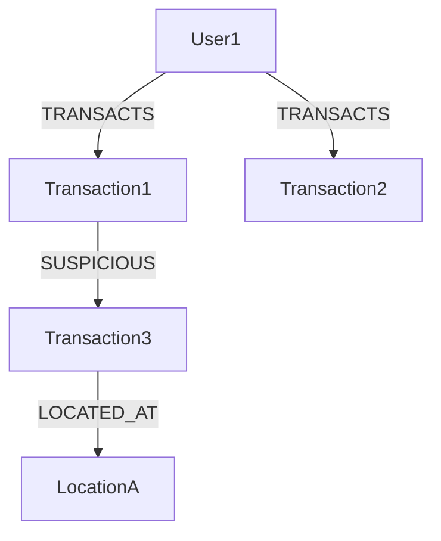

```markdown
# Unlocking Relationships: Mastering Graph Database Patterns for Backend Engineers


*How to structure complex, interconnected data like a pro*

---

## Introduction

As a backend developer, you’ve likely spent hours wrestling with data that doesn’t fit neatly into rows and columns. Whether you’re building a recommendation engine, a social network, or a fraud detection system, your data *talks*—it’s connected in ways that traditional relational databases struggle to model efficiently.

Graph databases aren’t just for storing social networks or recommendation systems anymore. They’re increasingly popular for domains like:
- **Knowledge graphs** (like Wikipedia’s or Google’s search knowledge)
- **Supply chain management** (tracking components across manufacturers)
- **Fraud detection** (analyzing suspicious transaction networks)
- **Semantic web applications** (connecting entities with meaning)

But how do you *design* for a graph database? What patterns work—and which ones might backfire? This guide explores **Graph Database Patterns**, offering practical advice, tradeoffs, and real-world examples to help you build scalable, performant graph applications.

---

## The Problem: When Relationships Break the Relational Mold

Relational databases (RDBMS) work great for simple, structured data—think user accounts with email, password, and a single `last_login` timestamp. But when your data becomes relationship-heavy, RDBMS’s strengths turn into weaknesses:

### **1. The N+1 Query Problem in Joins**
Imagine a social network where a user can have thousands of friends, and each friend has their own posts. With SQL, you might:
```sql
-- User 123 has 5,000 friends
SELECT * FROM posts WHERE user_id IN (
    SELECT friend_id FROM friendships WHERE user_id = 123
);
```
This generates **5,000 queries** if done naively (or one giant `JOIN` with performance issues).

### **2. Denormalization vs. Normalization Tradeoffs**
Graph data is inherently denormalized—entities are defined by *who they’re connected to*, not just their own attributes. RDBMS enforces strict normalization, forcing you to:
- Use expensive `JOIN` operations
- Duplicate data to avoid joins (risking consistency issues)
- Write overly complex queries (e.g., recursive Common Table Expressions)

### **3. Inefficient Path Finding**
Graphs often require **shortest-path algorithms** (e.g., "Find all collaborators of a researcher within 2 degrees"). SQL struggles with this:
```sql
-- How do you write "find all friends of friends" efficiently?
```
Most RDBMS lack native graph traversal optimizations.

### **4. Schema Rigidity**
Adding a new relationship type (e.g., "mentors" in a social network) often requires:
- Schema migrations
- New tables and columns
- Application logic changes

Graph databases handle this dynamically—just add edges!

---

## The Solution: Graph Database Patterns

Graph databases excel when your data is **highly interconnected** and **relationship-centric**. The key is to think in terms of **nodes (entities)**, **edges (relationships)**, and **properties (attributes)** rather than tables and columns.

### **Core Patterns for Graph Database Design**

#### **1. Node-Centric Design**
Before writing a single query, ask:
*"What are the most critical entities?"*
Then design your graph around them.

**Example:** A recommendation engine for an e-commerce site
- **Nodes:** Users → Products → Categories
- **Edges:** Watches ("User 123 watched Product 456"), Purchases ("User 123 bought Product 456"), Similar ("Product 101 is similar to Product 456")

```cypher
// Neo4j example: Find products similar to a user's past purchases
MATCH (u:User {id: 123})-[:WATCHED]->(:Product)-[:SIMILAR]->(p:Product)
WHERE NOT (u)-[:PURCHASED]->(p)
RETURN p LIMIT 10;
```

#### **2. Relationship First**
Edges are first-class citizens in graph databases—give them meaning with **types** and **properties**.

**Bad:** A generic `CONNECTED` relationship that does everything
**Good:** Well-defined relationships like:
- `FOLLOWS` (asymmetric, one-way)
- `COWORKS_WITH` (bidirectional)
- `SUPERVISES` (hierarchical)

```cypher
// Neo4j example: Define clear relationship types
CREATE (a:Author {name: "Jane Doe"})-
  :WRITES {publication_date: "2020-01-01"}-
  (b:Book {title: "Graph Algorithms"})-[:IS_PART_OF]->(g:Genre {name: "Tech"})
```

#### **3. Path Enumeration for Queries**
Graphs let you traverse relationships dynamically. Use **path patterns** to explore connections.

**Example:** Find all employees of employees (for org charts or fraud detection)
```cypher
// Find all direct/indirect subordinates
MATCH p=(emp:Employee)-[:MANAGES*1..2]->(sub:Employee)
WHERE emp.name = "CEO"
RETURN sub;
```

#### **4. Property Graph vs. Triple Store**
Choose your graph model based on needs:
- **Property Graphs** (Neo4j, Amazon Neptune): Nodes/edges with properties. Great for semi-structured data.
- **Triple Stores** (RDF, GraphDB): Subject-Predicate-Object triples. Ideal for semantic web.

**When to use a Property Graph?**
- Fast traversal across relationships.
- Dynamic schema (add new edges without schema changes).

**When to use a Triple Store?**
- Linked data needs (e.g., connecting academic papers to authors/keywords).
- Standards-compliance (e.g., DBpedia).

#### **5. Indexing Strategies**
Unlike SQL, graph databases don’t rely on B-trees for everything. Optimize with:
- **Node labels and properties**: Auto-indexed in Neo4j.
- **Custom indexes** for high-cardinality properties.

```cypher
// Create an index for fast lookups (Neo4j)
CREATE INDEX FOR (u:User) ON (u.email);
```

#### **6. Batch Loading Strategies**
Populating a graph database efficiently is different from bulk inserts in SQL. Use:
- **Transaction batching** (commit smaller batches to avoid memory issues).
- **CSV/JSON import tools** (e.g., Neo4j’s `LOAD CSV`).

```cypher
// Bulk load users (Neo4j)
LOAD CSV WITH HEADERS FROM 'file://users.csv' AS row
CREATE (u:User {email: row.email, name: row.name})
```

---

## Implementation Guide: Building a Graph Backend

### **Step 1: Model Your Data as a Graph**
Start with a **node-relationship diagram** (draw it!).
**Example:** A fraud detection system tracking transactions:
- **Nodes:** Users, Transactions, Accounts, Locations
- **Edges:** TRANSACTS, SUSPICIOUS, LOCATED_AT



### **Step 2: Choose Your Database**
| Database       | Language/API       | Strengths                          | Weaknesses                     |
|----------------|--------------------|------------------------------------|--------------------------------|
| Neo4j          | Cypher             | Mature, easy learning curve         | Licensing for commercial use   |
| Amazon Neptune | Gremlin/GQL        | AWS integration, scalable           | Vendor lock-in                 |
| ArangoDB       | AQL                | Multi-model (graph + document)      | Less mature than Neo4j         |
| TigerGraph     | GSQL               | High performance, distributed       | Complex setup                  |

### **Step 3: Write Efficient Queries**
**Avoid:**
- Unbounded traversals (e.g., `*..` without limits).
- Repeated traversals (cache results when possible).

**Optimized Example:**
```cypher
// Bad: Unbounded path
MATCH path=(a)-[:FOLLOWS*]->(b)
WHERE a.name = "Alice"

// Good: Limited depth + pattern
MATCH (a:User {name: "Alice"})-[:FOLLOWS]->(f:User)-[:FOLLOWS]->(b:User)
RETURN b.name;
```

### **Step 4: Integrate with Your Stack**
Graph databases often work alongside traditional databases. Use **denormalization judiciously**.

**Example:** Cache user profiles in Redis while querying graph relationships:
```python
# Pseudo-code: Hybrid architecture
def get_recommendations(user_id):
    user = cache.get(f"user:{user_id}")  # Fetch from Redis
    if not user:
        user = db.execute("MATCH (u:User {id: $id}) RETURN u", {id: user_id})

    # Query graph for recommendations
    recommendations = graph_db.execute(
        "MATCH (u:User {id: $id})-[:WATCHED]->(:Product)-[:SIMILAR]->(p:Product)
         WHERE NOT (u)-[:PURCHASED]->(p)
         RETURN p LIMIT 10",
        {id: user_id}
    )
    return recommendations
```

### **Step 5: Handle Scale**
- **Sharding**: Split by node type (e.g., users vs. transactions).
- **Caching**: Use Redis for frequent queries (e.g., "popular tags").
- **Asynchronous processing**: Offload heavy computations (e.g., pathfinding).

---

## Common Mistakes to Avoid

1. **Treating Graphs Like SQL**
   - ❌ Writing `SELECT * FROM nodes WHERE property = value`.
   - ✅ Using Cypher/Gremlin’s declarative traversal.

2. **Over-indexing**
   - ❌ Creating indexes on every property (slows writes).
   - ✅ Index only high-cardinality properties (e.g., emails, IDs).

3. **Ignoring Relationship Directionality**
   - ❌ Assuming all edges are bidirectional.
   - ✅ Define edges as `FOLLOWS` (one-way) vs. `ACQUAINTED_WITH` (bidirectional).

4. **Not Using Labels**
   - ❌ Storing all entities as `(entity {type: "User"})`.
   - ✅ Using labels: `(u:User)` for faster lookups.

5. **Deep, Unbounded Traversals**
   - ❌ `MATCH path=(a)-[:FRIENDS_WITH*]->(b)`.
   - ✅ Limit depth: `MATCH (a)-[:FRIENDS_WITH*2]->(b)`.

6. **Neglecting Schema Evolution**
   - Graphs allow dynamic schemas, but add new relationship types **carefully**—backward compatibility matters.

---

## Key Takeaways

✅ **Think in relationships, not tables.**
   - Graph databases shine when your data is about *connections*.

✅ **Define relationship types explicitly.**
   - Avoid generic edges; name them (`FOLLOWS`, `PURCHASES`, etc.).

✅ **Optimize queries for traversal.**
   - Use path patterns, limit depth, and cache results.

✅ **Combine with other data models.**
   - Use graph + document + key-value for a flexible architecture.

✅ **Start small, iterate.**
   - Model a subset of your data first; expand as you understand the patterns.

❌ **Don’t force a graph for tabular data.**
   - If your data is mostly flat (e.g., an inventory list), an RDBMS is fine.

❌ **Assume all queries are fast.**
   - Index strategically, and profile performance.

---

## Conclusion: When to Use Graph Databases

Graph databases aren’t a magic bullet—**they’re the right tool for relationship-heavy data**. If your application involves:
- **Recommendations** (collaborative filtering)
- **Fraud detection** (anomaly networks)
- **Knowledge graphs** (semantic relationships)
- **Organizational data** (hierarchies, teams)

Then a graph database can simplify your architecture, improve query performance, and make your code cleaner.

### **Final Thoughts**
- **Experiment**: Try Neo4j’s sandbox or [Amazon Neptune’s free tier](https://aws.amazon.com/neptune/pricing/).
- **Learn Cypher/Gremlin**: The query languages are intuitive once you grasp them.
- **Start small**: Model a single use case (e.g., "find friends of friends") before scaling.

Graph databases change how you think about data. By embracing **node-centric design** and **relationship-first patterns**, you’ll build systems that feel as natural as the connections they represent.

---
**Further Reading:**
- [Neo4j’s Graph Data Modeling Guide](https://neo4j.com/docs/cypher-manual/current/graph-modeling/)
- ["The Graph Database Revolution" (2022)](https://www.oreilly.com/library/view/the-graph-database/9781617296256/)
- [Amazon Neptune Best Practices](https://docs.aws.amazon.com/neptune/latest/userguide/best-practices.html)

**Happy traversing!** 🚀
```