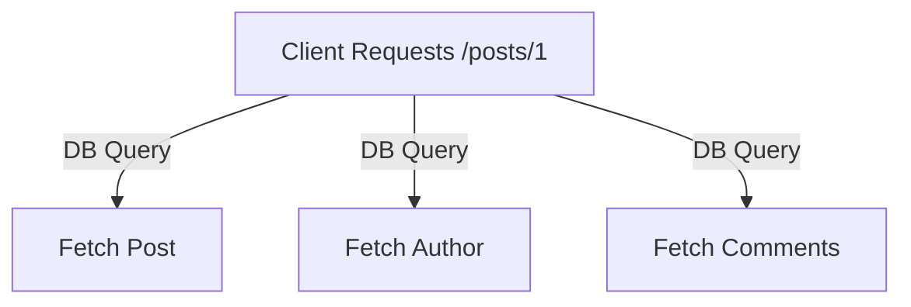

```markdown
---
title: "From Facebook’s News Feed to Global Standard: The Evolution of GraphQL"
date: 2024-05-20
authors: ["Alex Chen"]
tags: ["database-design", "api-patterns", "graphql", "backend"]
description: "How Facebook solved the over-fetched/under-fetched data problem and birthed a global standard. A deep dive into GraphQL’s history, architecture, and tradeoffs."
---

# From Facebook’s News Feed to Global Standard: The Evolution of GraphQL


In 2012, Facebook’s mobile News Feed faced a problem that seemed impossible to solve: **everyone expected the same few fields** (e.g., post text, author name, timestamp) to load instantly, while **power users wanted deep customization** (e.g., extended metadata, nested comments, rich media). REST APIs, with their fixed endpoints and rigid data shapes, couldn’t adapt.

This frustrating tension birthed **GraphQL**—a radical rethink of how APIs should work. Today, GraphQL powers everything from GitHub’s developer platform to Shopify’s e-commerce ecosystem. But how did it go from a Facebook internal tool to an industry standard? Let’s explore the history, the problems it solved, and the tradeoffs that shaped its evolution.

---

## The Problem: The REST API Dilemma

REST APIs, popularized by Fielding’s architectural principles, were designed for simplicity and statelessness. But by 2012, they faced three critical challenges at Facebook:

### **1. Over-fetching vs. Under-fetching**
REST forces clients to request entire data shapes from fixed endpoints (e.g., `/posts` returns **all** post fields for **every** client). This led to:
- **Over-fetching**: Mobile clients wasted bandwidth downloading metadata (e.g., likes count, tags) they never used.
- **Under-fetching**: Clients needed nested data (e.g., comments for a post), requiring multiple round-trips to `/posts/{id}` and `/comments`.

```http
# Example: Fetching a post + comments via REST
GET /posts/123 → { "id": "123", "text": "...", "comments": [] }  # Empty array!
GET /comments?post_id=123 → [...]  # Second trip for comments
```

### **2. Versioning Nightmares**
Every schema change (e.g., deprecating a field) required a new endpoint version (`/v2/posts`), breaking backward compatibility. Facebook’s News Feed alone changed daily.

### **3. Performance Bottlenecks**
REST’s statelessness meant each request was independent. Fetching a post + author + comments required **3+ DB queries** and **N+1 problems** (each post fetch triggered extra queries for relationships).



### **4. Client-Server Misalignment**
Developers and clients had conflicting needs:
- **Backend**: Optimized for server efficiency (e.g., precomputed fields).
- **Clients**: Wanted only what they needed (e.g., a chat app might ignore images).

---

## The Solution: GraphQL’s Core Principles

In 2012, Lee Byron (Facebook backend engineer) and collaborators designed **an API that let clients ask for exactly what they needed**. The key insights:

### **1. Single Endpoint, Dynamic Schema**
GraphQL replaced multiple REST endpoints (`/posts`, `/users`) with **one endpoint** (`/graphql`) that accepted a **query** to define exactly what data was needed.

```graphql
# Client asks for ONLY what it wants
query {
  post(id: "123") {
    text
    author {
      name
      profilePic  # Nested field
    }
    comments(limit: 3) {  # Filtered list
      body
    }
  }
}
```

### **2. Strongly Typed Schema**
The schema (defined in `.graphql` files) **enforced** what fields existed and their types—no more breaking changes from arbitrary JSON.

```graphql
type Post {
  id: ID!
  text: String!
  author: User!
  comments: [Comment]
}

type User {
  name: String!
  profilePic: String
}
```

### **3. Resolver System**
Instead of precomputing all fields, GraphQL used **resolvers**—functions that fetched data **only when needed**. This eliminated over-fetching.

```javascript
// Example resolver for a Post (Node.js)
const resolvers = {
  Post: {
    author: async (post) => {
      return await db.query('SELECT * FROM users WHERE id = ?', [post.authorId]);
    },
  },
};
```

### **4. Client-Side Caching**
GraphQL encouraged **client-side caching** (via tools like Apollo Client) to reduce server load. Unlike REST, clients could cache responses **based on GraphQL’s query variables**.

```javascript
const { data } = await client.query({
  query: GET_POST,
  variables: { id: "123" },
});
// Subsequent calls with same `id` reuse cached data.
```

---

## Implementation Guide: Building a GraphQL API

### **Step 1: Define Your Schema**
Start with a schema that reflects your app’s data model. Use **GraphQL SDL (Schema Definition Language)**.

```graphql
# schema.graphql
type Post {
  id: ID!
  title: String!
  content: String!
  author: User!
  tags: [String!]!
}

type User {
  id: ID!
  name: String!
  email: String!
}

type Query {
  post(id: ID!): Post
  posts(limit: Int): [Post]
}
```

### **Step 2: Implement Resolvers**
Resolvers fetch data and return it in the schema’s expected shape.

```javascript
// resolvers.js
const resolvers = {
  Query: {
    post: async (_, { id }, { db }) => {
      return await db.query('SELECT * FROM posts WHERE id = ?', [id]);
    },
    posts: async (_, { limit }, { db }) => {
      return await db.query('SELECT * FROM posts LIMIT ?', [limit]);
    },
  },
  Post: {
    author: async (post, _, { db }) => {
      return await db.query('SELECT * FROM users WHERE id = ?', [post.authorId]);
    },
  },
};
```

### **Step 3: Set Up a GraphQL Server**
Use a library like **Apollo Server** to expose your schema.

```javascript
// server.js
const { ApolloServer } = require('apollo-server');
const { typeDefs } = require('./schema');
const { resolvers } = require('./resolvers');

const server = new ApolloServer({ typeDefs, resolvers });

server.listen().then(({ url }) => {
  console.log(`🚀 Server ready at ${url}`);
});
```

### **Step 4: Test with GraphQL Playground**
```graphql
query {
  post(id: "1") {
    title
    content
    author {
      name
    }
  }
}
```

### **Step 5: Optimize Performance**
- **DataLoader**: Batch and cache DB queries to avoid N+1 problems.
  ```javascript
  const DataLoader = require('dataloader');
  const userLoader = new DataLoader(async (userIds) => {
    return await db.query('SELECT * FROM users WHERE id IN (?)', [userIds]);
  });

  // In resolvers:
  author: async (post) => {
    return await userLoader.load(post.authorId);
  },
  ```
- **Persisted Queries**: Cache query strings to reduce network overhead.
- **Query Complexity Analysis**: Reject overly complex queries that could overload the server.

---

## Common Mistakes to Avoid

### **1. Overusing GraphQL for Everything**
GraphQL isn’t a replacement for REST—it’s a **complement**. Use REST for:
- Simple CRUD operations (e.g., `/users`).
- Machine-to-machine APIs where clients have predictable needs.

### **2. Ignoring Query Complexity**
Unchecked queries can cause **DoS attacks** or excessive DB load. Example:
```graphql
# A query that might take hours!
query {
  posts {
    comments {
      replies {
        replies {
          ...
        }
      }
    }
  }
}
```
**Fix**: Add a `maxDepth` limit or complexity analysis.

### **3. Poor Error Handling**
GraphQL errors can propagate unpredictably. Always handle errors gracefully:
```javascript
const resolvers = {
  Query: {
    post: async (_, { id }) => {
      const post = await db.query('SELECT * FROM posts WHERE id = ?', [id]);
      if (!post) throw new Error('Post not found');
      return post;
    },
  },
};
```

### **4. Underestimating Caching**
If you skip client-side caching, you’ll hit the server repeatedly. Always cache
- Frequently accessed data (e.g., `User` objects).
- Query results by fragment (e.g., `@cacheControl` in Apollo).

### **5. Not Versioning Your Schema**
Even with GraphQL, schema changes break clients. Use:
- **Feature flags**: Hide breaking changes.
- **Deprecation warnings**:
  ```graphql
  type Post {
    oldField: String! @deprecated(reason: "Use newField instead")
    newField: String!
  }
  ```

---

## Key Takeaways

✅ **GraphQL solves the over-fetch/under-fetch problem** by letting clients define their data shape.
✅ **Single endpoint replaces REST’s versioning hell**, but require thoughtful schema design.
✅ **Resolvers enable fine-grained data fetching**, reducing DB load vs. REST’s pre-fetching.
✅ **Client-side caching is critical** to GraphQL’s performance; don’t skip it!
⚠️ **Tradeoffs**:
- **Complexity**: GraphQL’s schema and resolver system can be harder to maintain than REST.
- **Learning curve**: Developers must understand GraphQL’s type system and query syntax.
- **Tooling**: Requires libraries like Apollo for caching, subscriptions, and queries.

---

## Conclusion: Why GraphQL Won (and Where It’s Going)

GraphQL’s journey—from Facebook’s internal tool to a **$40M acquisition by GitHub**—proves its value: **it aligns APIs with client needs**. While REST remains dominant for simple cases, GraphQL excels when:
- Clients have **highly variable data requirements** (e.g., mobile apps).
- You need **real-time updates** (via subscriptions).
- Your backend is **polyglot** (multiple databases/languages).

### **The Future: GraphQL + REST Hybrid**
Modern APIs (e.g., GitHub’s) often **combine both**:
- REST for stable, versioned endpoints.
- GraphQL for flexible, client-driven queries.

### **Final Advice**
- Start small: Use GraphQL for **one complex part** of your API before migrating.
- Measure performance: Profile your queries with tools like **GraphQL Inspector**.
- Embrace the ecosystem: Libraries like **Hasura** and **Urql** can accelerate adoption.

GraphQL isn’t a silver bullet, but for the right problems, it’s **the most powerful API pattern since REST**. Now go build something great with it!

---
```mermaid
timeline
    title GraphQL’s Evolution
    section 2012-2015: Birth & Facebook
        2012 : Lee Byron solves News Feed’s data fetching problem
        2015 : Open-sources GraphQL

    section 2016-2018: Industry Adoption
        2016 : Apollo Client (experimental) → Apollo GraphQL
        2017 : GitHub adopts GraphQL for its API
        2018 : Netflix powers its UI with GraphQL

    section 2019-Present: Maturity
        2019 : Hasura launches as open-source GraphQL engine
        2020 : Shopify migrates to GraphQL
        2023 : TypeScript support in GraphQL schemas gains traction
```

---
```sql
-- Example: REST vs GraphQL DB queries
-- REST (precomputes everything)
SELECT p.id, p.text, a.name AS author_name, c.body AS comment_body
FROM posts p
LEFT JOIN users a ON p.author_id = a.id
LEFT JOIN comments c ON p.id = c.post_id
WHERE p.id = 123;

-- GraphQL (lazy-loads only needed fields)
-- Resolver for `Post` → `author`:
SELECT * FROM users WHERE id = ?;  -- Only when client asks for author
```

---
**Further Reading**:
- [GraphQL Specification](https://graphql.org/learn/)
- [Apollo State of GraphQL 2023 Report](https://www.apollographql.com/blog/state-of-graphql-2023)
- [Facebook’s Original Post](https://medium.com/facebook-developer-relations/the-graphql-data-loading-strategy-d7872f9268ab)
```