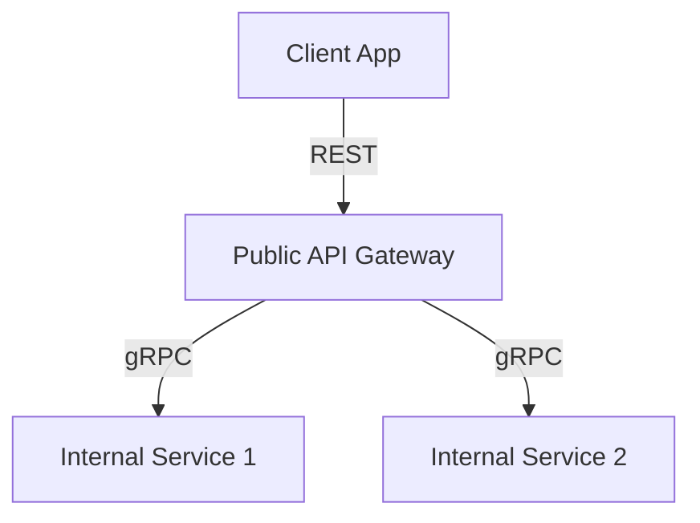

```markdown
# **Migrating from REST to gRPC: A Beginner’s Guide to Smooth Performance Gains**

*(And Why Your Next API Shouldn’t Be REST-Only)*

---

## **Introduction**

REST APIs have been the backbone of modern web services for over two decades. Simple, stateless, and easy to debug with tools like Postman, they’ve dominated the backend landscape—until they didn’t.

Today, high-performance applications—gaming backends, real-time trading systems, IoT devices, and AI inference APIs—demand something faster, more efficient, and less bloated. **Enter gRPC**, a modern RPC (Remote Procedure Call) framework developed by Google that leverages HTTP/2 and Protocol Buffers (`.proto` files) to deliver **sub-millisecond latency** and **low overhead**.

But migrating from REST to gRPC isn’t just slapping a new label on your API. It requires careful planning, design reconsideration, and sometimes a phased approach. This guide walks you through **real-world challenges, solutions, and a step-by-step migration plan**—complete with code examples—so you can make an informed decision.

---

## **The Problem: Why REST Alone Falls Short**

REST APIs work well for **CRUD-heavy, browser-based applications**, but they struggle in scenarios requiring:

### **1. High Throughput & Low Latency**
REST’s overhead comes from:
- **HTTP/1.1** (multiple connections, header bloat)
- **JSON serialization** (heavier than binary formats)
- **Statelessness** (requiring repeated authentication headers)

**Example:** A trading platform processing **10,000+ requests per second** will hit bottlenecks with REST’s per-request overhead.

### **2. Real-Time Communication**
REST relies on **polling or WebSockets**, which add complexity:
- Polling: Constantly checking for updates (inefficient)
- WebSockets: Requires maintaining persistent connections manually

**Example:** A live sports dashboard needs **instant updates**—gRPC’s streaming solves this elegantly.

### **3. Cross-Language & Cross-Platform Support**
REST APIs are **language-agnostic**, but gRPC goes further by generating **client libraries** for 90+ languages (C++, Java, Go, etc.).

### **4. Schema Evolution Challenges**
REST APIs often **break clients** when fields are added/removed. gRPC’s **Protocol Buffers** support **backward/forward compatibility** natively.

### **5. Debugging Complexity**
REST’s **one-request-per-operation** model makes debugging distributed systems tricky. gRPC’s **bidirectional streaming** and **interceptors** simplify observability.

---
### **When REST + gRPC Hybrid Works**
Not every API needs gRPC. A **hybrid approach** is often optimal:
- **REST for public-facing APIs** (e.g., mobile apps, browser clients)
- **gRPC for internal microservices** (e.g., backend-to-backend calls)

**Example:**


---

## **The Solution: gRPC Migration Pattern**

The **gRPC Migration Pattern** involves:
1. **Defining a shared `.proto` contract** (schema-first design)
2. **Gradually replacing REST endpoints** with gRPC calls
3. **Using a gateway (e.g., Envoy, NGINX)** to route traffic
4. **Monitoring performance** before full cutover

---

## **Components/Solutions**

| **Component**          | **Purpose**                                                                 | **Tools/Libraries**                          |
|------------------------|-----------------------------------------------------------------------------|---------------------------------------------|
| **Protocol Buffers**   | Define service contracts (schema)                                           | `protoc`, `grpcurl`                        |
| **gRPC Server**        | Handle RPC calls with HTTP/2                                                | `grpc-go`, `grpc-java`, `grpc-python`      |
| **API Gateway**        | Route REST → gRPC calls (optional)                                         | Envoy, Kong, NGINX                          |
| **Service Mesh**       | Secure, observe, and manage gRPC services                                   | Istio, Linkerd                              |
| **Client Libraries**   | Generate type-safe clients for any language                                 | `protoc` + language-specific plugins       |
| **Load Balancer**      | Distribute gRPC traffic efficiently                                         | Kubernetes, AWS ALB                         |
| **Observability**      | Track performance metrics (latency, errors)                                 | Prometheus, Jaeger, OpenTelemetry          |

---

## **Step-by-Step Implementation Guide**

### **Step 1: Define Your `.proto` Schema**
Start by modeling your API contracts in **Protocol Buffers**.

#### **Example: A Simple User Service**
```protobuf
// user.proto
syntax = "proto3";

package user;

service UserService {
  // GetUser by ID (Unary RPC)
  rpc GetUser (GetUserRequest) returns (User);

  // Stream all users (Server-side streaming)
  rpc StreamUsers (StreamUsersRequest) returns (stream User);

  // Bidirectional streaming (chat-like)
  rpc Chat (stream ChatMessage) returns (stream ChatResponse);
}

message GetUserRequest {
  string id = 1;
}

message User {
  string id = 1;
  string name = 2;
  string email = 3;
}

message ChatMessage {
  string user_id = 1;
  string text = 2;
}

message ChatResponse {
  string reply = 1;
}
```

**Key Benefits:**
✅ **Strong typing** (no runtime JSON parsing)
✅ **Backward/forward compatibility** (add fields without breaking clients)
✅ **Smaller payloads** (binary encoding vs. JSON)

---

### **Step 2: Generate Server & Client Code**
Compile the `.proto` file to generate server/stub code.

#### **For Go (gRPC Server)**
```sh
protoc --go_out=. --go-grpc_out=. user.proto
```

#### **Generated Server Code (Go)**
```go
// user_server.go (auto-generated)
package user

import (
	"context"
	"google.golang.org/grpc"
)

type server struct {
	UnimplementedUserServiceServer
}

func (s *server) GetUser(ctx context.Context, req *GetUserRequest) (*User, error) {
	// Fetch user from DB
	return &User{Id: req.Id, Name: "Alice", Email: "alice@example.com"}, nil
}

func main() {
	lis, _ := net.Listen("tcp", ":50051")
	s := grpc.NewServer()
	RegisterUserServiceServer(s, &server{})
	s.Serve(lis)
}
```

#### **For Python (gRPC Client)**
```sh
protoc --python_out=. --grpc_python_out=. user.proto
```

#### **Generated Client Code (Python)**
```python
# user_client.py (auto-generated)
import grpc
from user_pb2 import GetUserRequest
from user_pb2_grpc import UserServiceStub

channel = grpc.insecure_channel('localhost:50051')
stub = UserServiceStub(channel)

response = stub.GetUser(GetUserRequest(id="123"))
print(f"User: {response.name}")
```

---

### **Step 3: Deploy a gRPC Service**
Use **Docker** for isolated testing:
```dockerfile
# Dockerfile
FROM golang:1.21 as builder
WORKDIR /app
COPY . .
RUN go mod download && go build -o user-service .

FROM alpine:latest
COPY --from=builder /app/user-service .
CMD ["./user-service"]
```

Run with:
```sh
docker build -t user-service .
docker run -p 50051:50051 user-service
```

---

### **Step 4: Replace REST with gRPC (Phased Approach)**
Instead of a full rewrite, **migrate incrementally**:

#### **Option 1: Dual-Write (REST + gRPC)**
- Keep REST public
- Add gRPC for internal calls
- Use **gRPC-Web** for browser clients (if needed)

#### **Option 2: Gateway Pattern (Envoy)**
Route REST → gRPC calls transparently.

**Example: Envoy Configuration (`envoy.yaml`)**
```yaml
http_filters:
  - name: envoy.filters.network.http_connection_manager
    typed_config:
      "@type": type.googleapis.com/envoy.extensions.filters.network.http_connection_manager.v3.HttpConnectionManager
      route_config:
        name: local_route
        virtual_hosts:
          - name: local_service
            domains: ["*"]
            routes:
              - match: { prefix: "/users" }
                route:
                  cluster: user_grpc_service
                  timeout: 0.25s
                  max_stream_duration:
                    grpc_timeout_header_max: 1s
      http_filters:
        - name: envoy.filters.http.grpc_json_transcoder
          typed_config:
            "@type": type.googleapis.com/envoy.extensions.filters.http.grpc_json_transcoder.v3.GrpcJsonTranscoder
        - name: envoy.filters.http.cors
```

---

### **Step 5: Monitor & Optimize**
Use **OpenTelemetry** to track gRPC performance:
```go
import (
	"go.opentelemetry.io/otel"
	"go.opentelemetry.io/otel/exporters/otlp/otlptrace/otlptracegrpc"
	"go.opentelemetry.io/otel/sdk/resource"
	sdktrace "go.opentelemetry.io/otel/sdk/trace"
	"go.opentelemetry.io/otel/trace"
)

func initTracer() (*sdktrace.TracerProvider, error) {
	exporter, err := otlptracegrpc.New(context.Background(), otlptracegrpc.WithInsecure())
	if err != nil {
		return nil, err
	}
	tp := sdktrace.NewTracerProvider(
		sdktrace.WithBatcher(exporter),
		sdktrace.WithResource(resource.NewWithAttributes(
			semconv.SchemaURL,
			semconv.ServiceNameKey.String("user-service"),
		)),
	)
	otel.SetTracerProvider(tp)
	return tp, nil
}
```

---

## **Common Mistakes to Avoid**

### ❌ **1. Ignoring Schema Evolution**
- **Problem:** Changing `.proto` fields breaks clients.
- **Solution:** Use **field numbers wisely** (e.g., reserve high numbers for future fields).

### ❌ **2. Overusing Unary RPCs**
- **Problem:** gRPC shines with **streaming**, but unary RPCs feel like REST.
- **Solution:** Prefer **server-side streaming** for batch queries (e.g., `StreamUsers`).

### ❌ **3. Not Testing Error Handling**
- **Problem:** gRPC uses **gRPC Status Codes** (not HTTP statuses), which can confuse frontend teams.
- **Solution:** Document error responses clearly.

### ❌ **4. Forgetting gRPC-Web for Browsers**
- **Problem:** Browsers don’t support raw gRPC.
- **Solution:** Use **gRPC-Web** proxy (e.g., `grpc-gateway`).

### ❌ **5. Underestimating HTTP/2 Complexity**
- **Problem:** HTTP/2 requires **connection multiplexing**, which can overwhelm naive clients.
- **Solution:** Use **client-side load balancing** (e.g., `grpc-go`'s **round-robin**).

---

## **Key Takeaways**
✅ **gRPC excels at high-performance, low-latency use cases** (not all APIs need it).
✅ **Start with `.proto` contracts** before writing code (schema-first design).
✅ **Migrate incrementally**—don’t rewrite everything at once.
✅ **Use gateways (Envoy) for REST-gRPC coexistence**.
✅ **Monitor with OpenTelemetry** to catch bottlenecks early.
✅ **Avoid these pitfalls:** Poor schema evolution, ignoring streaming, bad error handling.

---

## **Conclusion**
Migrating from REST to gRPC isn’t just about **faster APIs**—it’s about **better architecture**. By leveraging **Protocol Buffers, HTTP/2, and streaming**, you can build systems that scale with **sub-millisecond latency** while keeping your codebase maintainable.

**Next Steps:**
1. **Start small**: Replace one REST endpoint with gRPC.
2. **Benchmark**: Compare latency before/after migration.
3. **Iterate**: Use observability to refine performance.

Ready to try? **Your first gRPC service awaits!** 🚀

---
### **Further Reading**
- [gRPC Official Docs](https://grpc.io/docs/)
- [Protocol Buffers Guide](https://developers.google.com/protocol-buffers)
- [Envoy for gRPC Load Balancing](https://www.envoyproxy.io/docs/envoy/latest/api-v3/config/route/v3/route_components.proto)
- [gRPC-Web for Browsers](https://github.com/grpc/grpc-web)

---
**What’s your biggest REST API challenge?** Share in the comments—let’s discuss solutions!
```

---
### **Why This Works for Beginners**
1. **Code-first approach**: Shows **real `.proto`, server, and client** examples.
2. **Real-world tradeoffs**: Explains **when REST + gRPC hybrid works**.
3. **Step-by-step migration**: Avoids "big bang" refactoring.
4. **Common pitfalls**: Covers **schema evolution, streaming, and gateways**.
5. **Observability focus**: Teaches **monitoring from day one**.

Would you like me to expand on any section (e.g., security, testing, or Kubernetes deployment)?