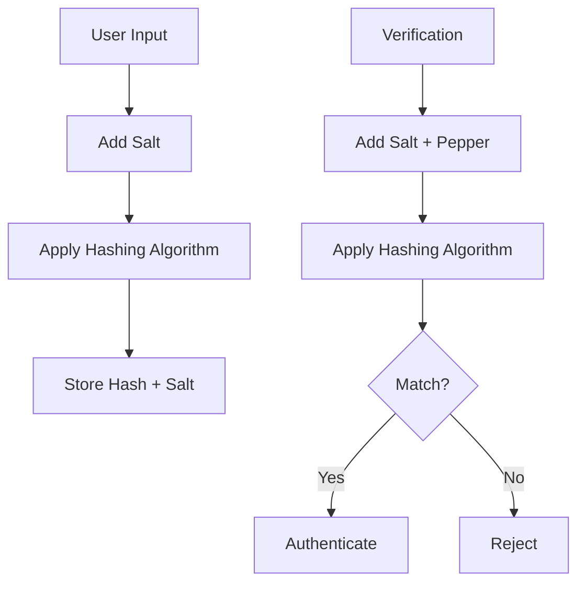

```markdown
---
title: "Mastering Secure Data Storage: The Hashing Setup Pattern for Backend Developers"
description: "Learn how to implement proper hashing for passwords and sensitive data to secure your applications. A beginner-friendly guide with practical examples, tradeoffs, and anti-patterns."
date: "2023-11-15"
author: "Alex Chen"
---

# Mastering Secure Data Storage: The Hashing Setup Pattern for Backend Developers

When building applications that handle user data—especially passwords—security isn’t just a checkbox, it’s the foundation of trust. A single misstep in how you store sensitive information can expose users to identity theft, fraud, or worse. Yet, many beginner backend developers struggle with the basics of hashing because it’s often oversimplified or buried in vague tutorials.

In this post, I’ll walk you through **the hashing setup pattern**, a practical, step-by-step approach to securing sensitive data like passwords, credit card numbers, and tokens. We’ll cover why you need it, how it works, and how to implement it correctly—including common mistakes to avoid.

By the end, you’ll have a clear, actionable plan to protect your application’s data, no matter what language or framework you’re using.

---

## The Problem: Why Secure Hashing Matters

Imagine this scenario: You launch a new SaaS application, and everything seems great—until a security researcher discovers that your user database is storing passwords as plain text. If those passwords were leaked, users could be exposed to account takeovers, phishing attacks, or worse (e.g., if the same password was reused on other sites).

This isn’t hypothetical. In 2023 alone, data breaches exposed millions of records due to poor password handling. The stakes are high, but the solution is straightforward: **never store plain text for sensitive data**. Instead, use cryptographic hashing to transform data into a fixed-length string that’s impossible to reverse-engineer.

However, hashing isn’t as simple as slapping `SHA-256` on every password. Here are the key challenges beginners face:
1. **Using weak algorithms**: Hashing functions like MD5 or SHA-1 are outdated and easily crackable.
2. **No salt**: Without randomness (salt), attackers can precompute hashes (rainbow tables) to guess passwords.
3. **Single hashing layer**: A single hash isn’t enough—you need to combine hashing with salts, iterations, and sometimes pepper.
4. **Inconsistent implementations**: Mixing different libraries or languages can lead to security gaps.
5. **Overcomplicating it**: Some developers try to reinvent the wheel, leading to bloated or insecure code.

Without proper hashing, even small applications become vulnerable. The good news? The hashing setup pattern solves all of this.

---

## The Solution: The Hashing Setup Pattern

The hashing setup pattern is a **modular, secure, and maintainable** approach to storing sensitive data. It consists of three core components:
1. **A robust hashing algorithm**: We’ll use **bcrypt** or **Argon2** (modern, slow-by-design algorithms).
2. **A salt generation strategy**: Ensures unique hashes for identical inputs.
3. **A consistent, reusable interface**: So you can hash data uniformly across your app.

Here’s how it works in a nutshell:


---

## Components of the Hashing Setup Pattern

### 1. **Choose the Right Hashing Algorithm**
Not all hashing algorithms are created equal. Here’s a quick guide:

| Algorithm   | Speed   | Security Level | Use Case                     |
|-------------|---------|----------------|------------------------------|
| **SHA-256** | Fast    | Weak (no salt) | Never use for passwords      |
| **bcrypt**  | Slow    | Strong         | Default for passwords        |
| **Argon2**  | Very Slow | Very Strong | High-security applications   |
| **PBKDF2**  | Medium  | Strong         | Legacy systems               |

**Why bcrypt/Argon2?**
- They are **slow-by-design**, making brute-force attacks impractical.
- They support **adaptive cost factors** (e.g., `bcrypt`’s work factor).
- They handle **salts natively** (no need to manually prepend).

### 2. **Add a Salt**
A salt is a random value added to the input before hashing. It prevents rainbow table attacks (precomputed hashes) and ensures identical passwords produce different hashes.

```plaintext
hash = hash(password + salt)
```

### 3. **Use a Consistent Interface**
Instead of writing ad-hoc hashing logic, create a **reusable service** (e.g., `HashService` in Python or `PasswordHasher` in Laravel). This ensures consistency across your application.

---

## Code Examples: Implementing the Pattern

### Example 1: Hashing Passwords with bcrypt (Node.js)

```javascript
// Install bcrypt: npm install bcrypt
const bcrypt = require('bcrypt');

class PasswordHasher {
  constructor(saltRounds = 12) {
    this.saltRounds = saltRounds; // Higher = more secure but slower
  }

  async hashPassword(password) {
    return bcrypt.hash(password, this.saltRounds);
  }

  async verifyPassword(storedHash, providedPassword) {
    return bcrypt.compare(providedPassword, storedHash);
  }
}

// Usage:
const hasher = new PasswordHasher();
const password = "mySecurePassword123";
const hashedPassword = await hasher.hashPassword(password);
console.log(`Hashed: ${hashedPassword}`);

const isValid = await hasher.verifyPassword(
  hashedPassword,
  "mySecurePassword123"
);
console.log(`Valid: ${isValid}`); // true
```

**Key Notes:**
- `saltRounds=12` is a good default (adjust based on performance needs).
- `bcrypt.compare()` handles the salt internally.

---

### Example 2: Hashing with Argon2 (Python)

```python
# Install argon2-cffi: pip install argon2-cffi
from argon2 import PasswordHasher

ph = PasswordHasher()

# Hashing
password = b"mySecurePassword123"
hashed = ph.hash(password)
print(f"Hashed: {hashed}")

# Verification
is_valid = ph.verify(hashed, password)
print(f"Valid: {is_valid}")  # True
```

**Why Argon2?**
- Resistant to GPU/ASIC attacks.
- Memory-hard, making it harder to crack.

---

### Example 3: Database Schema for Stored Hashes

Here’s how your user model might look in PostgreSQL:

```sql
CREATE TABLE users (
  id SERIAL PRIMARY KEY,
  username VARCHAR(100) UNIQUE NOT NULL,
  password_hash TEXT NOT NULL,
  salt VARCHAR(100) NOT NULL,
  created_at TIMESTAMP DEFAULT NOW()
);
```

**Wait—why store the salt explicitly?**
- Some libraries (like bcrypt) handle salts internally.
- If you’re using a custom implementation, store it alongside the hash.

---

## Implementation Guide: Step-by-Step

### Step 1: Choose Your Algorithm
- For most applications, **bcrypt** is a great default.
- For high-security apps (e.g., banking), use **Argon2**.

### Step 2: Create a Hashing Service
Encapsulate hashing logic in a service class to avoid duplication.

```python
# Python example (Argon2)
class AuthService:
    def __init__(self):
        self.hasher = PasswordHasher()

    def register(self, username, password):
        hashed = self.hasher.hash(password.encode())
        # Store hashed in DB along with username
        return {"success": True}

    def login(self, username, password):
        user = get_user_from_db(username)  # Assume this exists
        if self.hasher.verify(user.password_hash, password.encode()):
            return {"success": True}
        return {"success": False}
```

### Step 3: Handle Edge Cases
- **Empty passwords**: Reject them during registration.
- **Password changes**: Hash the new password immediately.
- **Password length**: Enforce minimum length (e.g., 8+ chars).

### Step 4: Logging (Without Leaking Data)
Never log plain text passwords or hashes. Log only success/failure of authentication.

```javascript
// Log a generic error, not the password
app.post("/login", async (req, res) => {
  try {
    const { password } = req.body;
    const isValid = await hasher.verifyPassword(storedHash, password);
    if (!isValid) {
      res.status(401).json({ error: "Invalid credentials" });
      return;
    }
    // Success logic...
  } catch (err) {
    console.error("Login failed (not exposing details)");
    res.status(500).json({ error: "Internal server error" });
  }
});
```

### Step 5: Testing Your Hashing
Write unit tests to ensure your hashing works as expected.

```javascript
// Example test for bcrypt in Jest
const bcrypt = require('bcrypt');
const { PasswordHasher } = require('./PasswordHasher');

describe('PasswordHasher', () => {
  let hasher;

  beforeEach(() => {
    hasher = new PasswordHasher(12);
  });

  test('hashes correctly', async () => {
    const password = 'test123';
    const hash = await hasher.hashPassword(password);
    expect(typeof hash).toBe('string');
    expect(hash).not.toBe(password);
  });

  test('verifies correct password', async () => {
    const password = 'test123';
    const hash = await hasher.hashPassword(password);
    const isValid = await hasher.verifyPassword(hash, password);
    expect(isValid).toBe(true);
  });

  test('rejects wrong password', async () => {
    const password = 'test123';
    const hash = await hasher.hashPassword(password);
    const isValid = await hasher.verifyPassword(hash, 'wrong');
    expect(isValid).toBe(false);
  });
});
```

---

## Common Mistakes to Avoid

1. **Using SHA-256 or MD5**
   - These are **fast hashes**, meaning they’re crackable with brute-force attacks.
   - Example of bad code:
     ```javascript
     const crypto = require('crypto');
     const hash = crypto.createHash('sha256').update('password').digest('hex');
     ```

2. **Not Using a Salt**
   - Without a salt, identical passwords produce identical hashes, making them vulnerable to rainbow tables.
   - Never do:
     ```python
     # UNSAFE: No salt!
     hashed = hashlib.sha256("password".encode()).hexdigest()
     ```

3. **Hardcoding the Salt**
   - A static salt defeats the purpose of randomness.
   - Example of bad practice:
     ```javascript
     const salt = "myStaticSalt"; // ❌ Avoid this!
     ```

4. **Skipping Salt Verification on Login**
   - When verifying, **always** use the same salt as during hashing.
   - Example of correct verification (bcrypt handles this internally):
     ```javascript
     const match = await bcrypt.compare(plainText, storedHash);
     ```
   - But if you’re doing it manually:
     ```python
     # Python example with manual salt
     salt = "random_salt_from_db"
     hashed = hashlib.pbkdf2_hmac('sha256', password.encode(), salt.encode(), 100000)
     ```

5. **Over-Reliance on "Secure" but Weak Algorithms**
   - Some developers use `crypto.getHash` without iterations, thinking it’s "secure enough."
   - Always prefer **bcrypt/Argon2** with proper cost factors.

6. **Not Updating Hashes During Password Changes**
   - If a user changes their password, ensure the **new hash uses the current cost factor** (e.g., `bcrypt`’s rounds).
   - Example:
     ```javascript
     // On password change, re-hash with latest cost factor
     const newHash = await bcrypt.hash(newPassword, currentSaltRounds);
     ```

7. **Storing Plain Text Hashes in Cache**
   - If you cache user sessions, never cache the plain text hash. Cache only the hashed value and regenerate the session ID.

---

## Key Takeaways

- **Always hash sensitive data** (passwords, tokens, credit card numbers) before storing it.
- **Use modern algorithms** like bcrypt or Argon2—never SHA-1, MD5, or plain SHA-256.
- **Add a salt** to every hash to prevent rainbow table attacks.
- **Encapsulate hashing logic** in a service class for consistency.
- **Never log or expose plain text passwords** (even in error messages).
- **Test your hashing** thoroughly with unit tests.
- **Avoid common pitfalls** like hardcoded salts, weak algorithms, and skipped verification steps.

---

## Conclusion

Securely storing sensitive data is one of the most critical responsibilities of a backend developer. The hashing setup pattern provides a **practical, maintainable, and secure** way to protect passwords and other confidential information.

By following this guide, you’ll:
- Avoid common security pitfalls.
- Implement hashing correctly from day one.
- Future-proof your application against breaches.

Remember: Security isn’t a one-time task—it’s an ongoing commitment. Regularly audit your hashing logic, stay updated on cryptographic advancements, and treat sensitive data with the respect it deserves.

Now go forth and build securely!
```

---
**Post Metadata:**
- **Difficulty**: Beginner
- **Topics**: Security, Database Design, Backend Patterns
- **Tech Stack**: Language-agnostic (examples in Node.js, Python, SQL)
- **Time to Implement**: 1-2 hours (including testing)