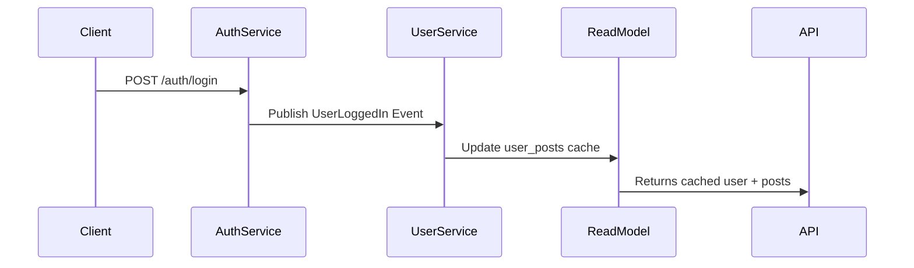

```markdown
# **Hybrid Anti-Patterns: When Your Database and API Can’t Make Up Their Minds**

*How to avoid the messy middle when your systems refuse to play nicely together.*

---

## **Introduction**

Building scalable, maintainable backend systems is tricky—but nowhere is that challenge more visible than when your **database schema** and **API design** start fighting each other. Sometimes, developers end up with **hybrid anti-patterns**: solutions that mix and match approaches from relational databases, document stores, and API design patterns in ways that feel inconsistent, inefficient, or downright confusing.

You might start with a clean relational design only to later realize your API needs nested JSON responses. Or perhaps your existing NoSQL setup starts requiring complex joins, forcing you to introduce a hybrid approach that nobody really owns. Before you know it, your system becomes a patchwork of ad-hoc solutions that make the code harder to read, slower to debug, and harder to scale.

This happens a lot. It’s not necessarily *wrong*—but it’s rarely optimal.

In this guide, we’ll explore **what hybrid anti-patterns look like**, how they creep into systems, and—most importantly—**how to avoid them** without sacrificing flexibility.

---

## **The Problem: When Databases and APIs Refuse to Cooperate**

Hybrid anti-patterns emerge when developers try to **force two distinct architectural principles to work together** without proper synchronization. Here are common scenarios where this happens:

### **1. The Relational API Output Problem**
You design your database tables with proper normalized relationships (like `users`, `posts`, and `comments`), but your API needs **flattened, nested JSON responses** (e.g., a `user` with an array of `posts`, each containing an array of `comments`).

**Result?**
- Extra database queries (N+1 problem).
- NoSQL-like denormalization forced into a relational system.
- Inconsistent data fetching logic.

### **2. The "We’ll Figure It Out Later" Schema**
You decide to use a **document-based database** (like MongoDB) because you think it’s flexible, but then later realize you need **complex filtering and aggregation**—only to end up writing **ugly nested queries** that look like they were written by someone who never slept.

**Result?**
- Performance degrades under complex queries.
- Schema evolution becomes a nightmare.
- No clear ownership of data structure.

### **3. The API Gateway / Microservices Mismatch**
You design your microservices with **domain-driven boundaries** (e.g., `auth-service`, `billing-service`), but your API gateway **just flattens everything into one flat JSON object** without proper composition.

**Result?**
- Over-fetching or under-fetching data.
- Tight coupling between services and API consumers.
- No clear way to optimize per-service performance.

### **4. The "Just Denormalize Everything" Trap**
To avoid joins, you decide to **copy data everywhere**—duplicating fields in multiple collections or tables. But then updates become a nightmare, and consistency is lost.

**Result?**
- **Eventual consistency** everywhere (because updates are hard to manage).
- Data drift becomes inevitable.
- Debugging becomes a guessing game.

---
## **The Solution: Hybrid Patterns That Actually Work**

Instead of forcing your database and API to play by two different rules, we need **intentional, well-defined hybrid approaches**. The key is to **align your data model with your query patterns** while keeping the API flexible.

Here’s how we can do it **right**:

### **1. Design for Query Patterns, Not Just Storage**
Your database should be optimized for **how you read data**, not just how you write it.

**Example: RESTful Graph Traversal with Eager Loading**
If your API needs `GET /users/{id}/posts`, but your database has `users`, `posts`, and `comments` in separate tables, you have two choices:
- **Bad:** Fetch `user`, then `posts`, then `comments` in separate queries (N+1 problem).
- **Good:** Use **eager loading** (joins, subqueries, or data loading libraries).

#### **Example in PostgreSQL (with JOINs)**
```sql
SELECT
  u.id, u.name,
  p.id AS post_id, p.title,
  c.id AS comment_id, c.text
FROM users u
LEFT JOIN posts p ON u.id = p.user_id
LEFT JOIN comments c ON p.id = c.post_id
WHERE u.id = 123;
```

#### **Example in Django (ORMLoading)**
```python
from django.db.models import Prefetch

user = User.objects.filter(id=123).prefetch_related(
    Prefetch('posts', queryset=Post.objects.select_related('author').prefetch_related('comments'))
).first()
```

### **2. Use a Hybrid API Model (GraphQL vs. REST)**
If your API needs **nested, flexible responses**, consider:
- **GraphQL** (for dynamic queries).
- **REST with HATEOAS** (for structured, discoverable endpoints).
- **Composite resources** (e.g., `GET /users/{id}` returns nested `posts` if requested).

#### **GraphQL Example (Apollo Server)**
```graphql
type User {
  id: ID!
  name: String!
  posts: [Post!]!
}

type Post {
  id: ID!
  title: String!
  comments: [Comment!]!
}

type Query {
  user(id: ID!): User
}

# Server-side resolver
const resolvers = {
  Query: {
    user: async (_, { id }) => {
      const [user, posts] = await Promise.all([
        db.query('SELECT * FROM users WHERE id = $1', [id]),
        db.query('SELECT * FROM posts WHERE user_id = $1', [id]),
      ]);
      return {
        ...user[0],
        posts: posts.map(p => ({ ...p, comments: [...] })) // More joins here...
      };
    }
  }
};
```

### **3. Denormalize Strategically (Not Everywhere)**
Instead of copying data **everywhere**, denormalize **only where queries actually need it**.

#### **Example: Materialized Views (PostgreSQL)**
```sql
CREATE MATERIALIZED VIEW user_posts AS
SELECT u.*, p.title, p.created_at
FROM users u
JOIN posts p ON u.id = p.user_id;

-- Refresh periodically (e.g., nightly)
REFRESH MATERIALIZED VIEW CONCURRENTLY user_posts;
```

#### **Example: Caching Layer (Redis)**
```python
# Python + Redis (using orjson for JSON serialization)
@cache.cache(timeout=600)  # 10-minute cache
def get_user_with_posts(user_id):
    return {
        "user": user_data,
        "posts": [post_data for post in posts if post["user_id"] == user_id]
    }
```

### **4. Use Domain-Driven Design (DDD) for Microservices**
If you’re using microservices, **each service should own its own data model**—but expose **composite views** via an API gateway.

#### **Example: Event Sourcing + CQRS**
- **Write model:** Apps write events (e.g., `UserCreated`, `PostAdded`).
- **Read model:** A separate service (or materialized view) pre-computes `user_posts` for the API.



---
## **Implementation Guide: Step-by-Step**

### **Step 1: Audit Your Query Patterns**
Before making changes, ask:
- What are the **most common queries**?
- Are they **read-heavy** or **write-heavy**?
- Do they need **consistent results** or **eventual consistency**?

**Tools to help:**
- **Database query logs** (to find slow/frequent queries).
- **API request logs** (to see which endpoints are called most).

### **Step 2: Choose Between These Hybrid Strategies**
| Strategy | Best For | Tradeoffs |
|----------|---------|-----------|
| **Eager Loading (JOINs)** | Relational DB + REST | Requires SQL expertise, can bloat queries |
| **GraphQL (Flexible Queries)** | Dynamic frontend needs | Steeper learning curve, over-fetching risk |
| **Materialized Views** | Pre-computed aggregations | Needs refreshed periodically |
| **Caching Layer (Redis)** | Frequently accessed data | Cache invalidation complexity |
| **Event Sourcing + CQRS** | Complex domain logic | Harder to implement, higher maintenance |

### **Step 3: Decouple Data from Presentation**
- **Backend:** Store data in the most efficient way (normalize, denormalize, or hybrid).
- **API:** Use **projection layers** to shape data for consumers.
  - Example: A `UserResource` class that formats `User` model objects for JSON.

```python
# Example: Django REST Framework serializer
class UserSerializer(serializers.ModelSerializer):
    posts = serializers.SerializerMethodField()

    class Meta:
        model = User
        fields = ['id', 'name', 'posts']

    def get_posts(self, user):
        return Post.objects.filter(user=user).prefetch_related('comments').values('id', 'title', 'comments__text')
```

### **Step 4: Automate Data Sync (If Denormalizing)**
If you **must** denormalize:
- Use **database triggers** (PostgreSQL, MySQL).
- Use **background workers** (Celery, Sidekiq) for async updates.
- Use **event-driven architectures** (Kafka, RabbitMQ).

```python
# Python + Celery for async denormalization
@celery.task
def update_user_posts_cache(user_id):
    user = User.objects.get(id=user_id)
    posts = list(Post.objects.filter(user=user).values('id', 'title'))
    cache.set(f"user_posts_{user_id}", posts, timeout=3600)
```

---

## **Common Mistakes to Avoid**

### **❌ Mistake 1: Over-Denormalizing Without a Plan**
- **Problem:** Copying data everywhere leads to **inconsistency**.
- **Fix:** Denormalize **only where queries benefit**, and **disable writes to the copy**.

### **❌ Mistake 2: Ignoring Query Performance**
- **Problem:** Optimizing for writes but queries are slow.
- **Fix:** Profile queries with **EXPLAIN ANALYZE** (PostgreSQL) and **slow query logs**.

```sql
EXPLAIN ANALYZE
SELECT * FROM users u
JOIN posts p ON u.id = p.user_id
WHERE u.id = 123;
```

### **❌ Mistake 3: Treating Hybrid as a One-Size-Fits-All**
- **Problem:** Assuming GraphQL solves all problems (it doesn’t).
- **Fix:** Use **REST for predictable APIs**, **GraphQL for dynamic needs**.

### **❌ Mistake 4: Not Testing Hybrid Logic in CI**
- **Problem:** Denormalized data breaks in production.
- **Fix:** Add **data consistency tests** (e.g., `user_posts` should match `posts` table).

```python
def test_user_posts_cached_correctly():
    user = User.objects.create(name="Test User")
    Post.objects.bulk_create([Post(user=user, title=f"Post {i}") for i in range(3)])

    cached = cache.get(f"user_posts_{user.id}")
    assert cached == [
        {"id": 1, "title": "Post 0"},
        {"id": 2, "title": "Post 1"},
        {"id": 3, "title": "Post 2"},
    ]
```

### **❌ Mistake 5: Forgetting About Schema Evolution**
- **Problem:** Document stores let you change schemas, but **relational DBs don’t**.
- **Fix:** Use **migrations carefully**, or consider a **polyglot persistence** approach (e.g., PostgreSQL + MongoDB).

---

## **Key Takeaways**

✅ **Align your database with your queries**—don’t force a square peg into a round hole.
✅ **Denormalize strategically**, not everywhere.
✅ **Use hybrid patterns intentionally** (eager loading, GraphQL, CQRS).
✅ **Decouple data from presentation**—let your API shape responses, not your DB.
✅ **Automate syncs** if you must denormalize (triggers, background jobs, events).
✅ **Test hybrid logic in CI** to catch consistency bugs early.
✅ **Monitor performance**—query logs and caching are your friends.
✅ **Avoid anti-patterns** like copying data everywhere or ignoring query patterns.

---

## **Conclusion: Hybrid Doesn’t Mean Messy**

Hybrid anti-patterns happen when we **ignore the natural tensions** between databases and APIs. But by **designing intentionally**, we can create systems that:
- **Read efficiently** (with joins, caching, or GraphQL).
- **Write cleanly** (without duplicate data).
- **Scale predictably** (without unexpected bottlenecks).

The key is **awareness**—knowing where your system’s bottlenecks are, and choosing the right hybrid approach to fix them.

**Next steps:**
1. Audit your most frequent queries.
2. Pick **one** hybrid strategy to optimize (eager loading, caching, GraphQL).
3. Test, iterate, and monitor.

Happy coding—and may your joins be fast, and your caches warm!

---
### **Further Reading**
- **[PostgreSQL JOINs Guide](https://www.postgresql.org/docs/current/sql-select.html)**
- **[GraphQL for Startups](https://graphql.org/code/)**
- **[Event Sourcing Patterns](https://martinfowler.com/eaaP/)**
- **[Django ORM Optimizations](https://docs.djangoproject.com/en/stable/topics/db/queries/#optimizing-query-performance)**
```