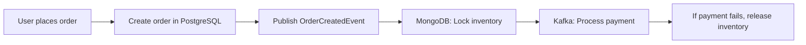

```markdown
# **"Hybrid Gotchas: How Mixed Database Architectures Bite You (And How to Avoid It)"**

*By [Your Name], Senior Backend Engineer*

---

## **Introduction**

Hybrid database architectures—where you mix SQL relational databases with NoSQL document stores, key-value stores, or graph databases—are the norm today. Companies use PostgreSQL for transactional data, MongoDB for flexible schemas, Redis for caching, and Elasticsearch for search. The flexibility is undeniable, but so are the pitfalls.

The problem isn’t *hybrid* per se—it’s the **unseen friction points** that emerge when you glue different systems together. These "gotchas" lurk in data consistency, query performance, caching strategies, and even team expectations. In this post, I’ll break down the most common hybrid gotchas, show real-world examples, and provide battle-tested solutions.

*You’ll learn:*
✔ Why hybrid systems are messy (and when to resist them)
✔ Data consistency patterns that actually work
✔ Query optimization strategies for disparate engines
✔ How to structure your schema to minimize coupling

Let’s dive in.

---

## **The Problem: Hybrid Gotchas in Action**

Hybrid architectures are marketed as "scalable" and "flexible," but in practice, they introduce **invisible complexity**. Here are some real-world pain points:

### **1. Distributed Transaction Nightmares**
Imagine a financial app using PostgreSQL for accounting and MongoDB for user sessions. When a user disputes a charge, you need to:
1. Update the transaction status in PostgreSQL.
2. Invalidate the session in MongoDB.

If a network failure happens between these two writes, you’re stuck with **inconsistent data**—a disputed charge but an active session.

### **2. Querying Across Borders**
A common anti-pattern is treating a hybrid system like a single database. For example:
```sql
-- ❌ Bad: Cross-database JOINs (PostgreSQL + MongoDB)
SELECT p.*, u.name FROM payments p
JOIN users u ON p.user_id = u.id
```
This doesn’t work because:
- PostgreSQL doesn’t understand MongoDB’s JSON documents.
- You’re forcing a slow, manual translation layer.

### **3. Caching Invalidation Hell**
When you cache user data in Redis but store it in PostgreSQL, what happens when:
- The user updates their profile in the app?
- The Redis cache is stale?
- The next API call from a different microservice reads old data?

This leads to **eventual consistency nightmares**, where your system feels "slippery."

### **4. Schema Evolution Disasters**
Document databases like MongoDB encourage schema flexibility, but when you mix them with relational systems:
- A schema change in MongoDB (e.g., adding a new field) affects **all consumers**, including services that query PostgreSQL.
- NoSQL’s loose coupling becomes your **tight coupling from hell**.

### **5. Monitoring and Observability Gaps**
Hybrid systems leave blind spots. For example:
- How do you track **end-to-end latency** when a request hits Redis → PostgreSQL → MongoDB?
- How do you debug a corruption bug if it spans three databases?

---

## **The Solution: Hybrid Gotchas Mitigated**

The key is **proactive design**. Here’s how to structure your system to avoid the worst pitfalls:

### **1. Distributed Transactions ≠ ACID**
Hybrid systems **cannot** guarantee ACID transactions. Instead, use:

#### **Option A: Saga Pattern (Eventual Consistency)**
Break long-running workflows into smaller, compensatable steps.

**Example: Charge Dispute Flow**
```mermaid
graph LR
    A[Charge Dispute] --> B[PostgreSQL: Mark as disputed]
    B --> C[Publish "DisputeEvent" to Kafka]
    C --> D[MongoDB: Invalidate session]
    C --> E[Elasticsearch: Reindex]
```

**Key Components:**
- **Saga Orchestrator**: A service (e.g., in Python/Java) that coordinates steps.
- **Compensating Transactions**: If `MongoDB` fails, roll back PostgreSQL.

```python
# Python example (using Kafka)
def handle_dispute(dispute_id: str):
    try:
        # Step 1: PostgreSQL
        update_payment_status(dispute_id, "disputed")

        # Step 2: EventBus
        event_bus.publish(DisputeEvent(dispute_id))

    except Exception as e:
        # Compensate: Revert PostgreSQL
        update_payment_status(dispute_id, "pending")
        raise
```

#### **Option B: Two-Phase Commit (Abusive)**
Only use **Saga Pattern** for atomicity. Two-phase commit (e.g., X/Open DTC) is **too heavy** for microservices.

---

### **2. Decoupled Queries (No Cross-Database Joins)**
Instead of forcing joins, **materialize data** where needed.

#### **Approach: Denormalize or Event-Sourced Views**
- **Denormalized Cache**: Store joined data in Redis (updated via pub/sub).
- **Event Sourcing**: Reconstruct user-payment history from events.

**Example: Redis Cache Layer**
```bash
# Redis command (pseudo)
SADD user:123:payments 42, 38, 36
# Then fetch with:
GET user:123:payments
```

**Tradeoff**:
- More write complexity (e.g., updating multiple caches).
- But **faster reads** and no cross-database pain.

---

### **3. Caching Invalidation with Event-Driven Patterns**
Use **events to invalidate** caches.

**Example: User Profile Flow**
```mermaid
graph LR
    A[User updates profile] --> B[PostgreSQL: Save changes]
    B --> C[Publish "ProfileUpdatedEvent"]
    C --> D[Redis: Delete user:123 cache]
    C --> E[MongoDB: Rebuild index]
```

**Implementation:**
```java
// Java example (Spring + Kafka)
@KafkaListener(topics = "profile-updated")
public void onProfileUpdated(ProfileUpdatedEvent event) {
    String cacheKey = "user:" + event.userId();
    redisTemplate.delete(cacheKey); // Invalidate
}
```

**Key Tools**:
- **Kafka/RabbitMQ**: For event streaming.
- **Circuit Breakers**: Retry invalidation if Redis is down.

---

### **4. Schema Evolution with Versioning**
Avoid tight coupling by **enforcing API contracts**.

#### **Option A: API Versioning**
```http
GET /v1/users/123
GET /v2/users/123 { "id": ..., "preferences": {...} }
```

#### **Option B: Schema Registry (Avro/Protobuf)**
Define schemas in **Apache Avro** or **Protocol Buffers** to enforce compatibility.

```protobuf
// protobuf example (schema for User)
message User {
  string id = 1;
  string name = 2;
  google.protobuf.Timestamp last_updated = 3;
}
```

**Tradeoff**:
- Adds complexity, but **prevents breaking changes**.

---

### **5. Observability for Hybrid Systems**
Track end-to-end latency and corruptions.

**Tools**:
- **Distributed Tracing**: Jaeger/Zipkin.
- **Photo-Realistic Debugging**: Correlation IDs.
- **Schema Validation**: GreatExpectations/SchemaSpy.

**Example: Correlation IDs**
```go
// Go example (logging with correlation ID)
func (h *handler) Handle(w http.ResponseWriter, r *http.Request) {
    reqID := r.Header.Get("X-Request-ID")
    if reqID == "" {
        reqID = uuid.New().String()
    }
    log.WithFields(log.Fields{
        "reqID": reqID,
        "path": r.URL.Path,
    }).Info("Request received")

    // ... process request ...
}
```

**Key Metrics to Track**:
| Metric               | Tool          | Why It Matters                     |
|----------------------|---------------|------------------------------------|
| End-to-end latency   | Jaeger        | Detect slow cross-service calls     |
| Cache hit/miss ratio | Datadog       | Optimize Redis usage               |
| Schema drift         | SchemaSpy     | Catch breaking changes early       |

---

## **Implementation Guide: Step-by-Step**

### **Step 1: Audit Your Hybrid Dependencies**
Before fixing, **map your data flows**:
1. List all database dependencies (e.g., API → PostgreSQL → MongoDB → Redis).
2. Identify **critical paths** (e.g., payment processing).
3. Flag **tightly coupled** systems (e.g., direct SQL joins).

**Example Dependency Map**:
```
API Microservice → PostgreSQL (owners) → MongoDB (addresses)
                    ↓
                   Elasticsearch (search)
```

### **Step 2: Replace Joins with Event-Driven Data**
- **Denormalize** frequently accessed data (e.g., cache `user + payment` in Redis).
- **Use CDC (Change Data Capture)** to sync changes (e.g., Debezium for PostgreSQL → Kafka).

**Example: Debezium Setup**
```sql
-- PostgreSQL table for users
CREATE TABLE users (id SERIAL, name VARCHAR(255));
```

```yaml
# Debezium config (Kafka Connect)
name: postgres-source
config:
  connector.class: io.debezium.connector.postgresql.PostgresConnector
  database.hostname: db-host
  database.port: 5432
  database.user: user
  database.dbname: db
  database.server.name: postgres
  plugin.name: pgoutput
```

### **Step 3: Implement Saga Pattern for Transactions**
1. **Decompose** workflows into atomic steps.
2. **Publish events** after each step (e.g., `OrderCreated`, `PaymentProcessed`).
3. **Handle failures** with compensating transactions.

**Example: Order Processing Saga**


### **Step 4: Add Observability**
- **Inject correlation IDs** in every request.
- **Monitor** key metrics (latency, errors).
- **Set up alerts** for schema drift.

**Example: Alert Rule (Prometheus)**
```yaml
groups:
- name: hybrid-gotchas
  rules:
  - alert: HighCacheMissRatio
    expr: rate(redis_cache_misses_total[5m]) / rate(redis_cache_hits_total[5m] + redis_cache_misses_total[5m]) > 0.5
    for: 1m
    labels:
      severity: warning
    annotations:
      summary: "High Redis miss ratio on {{ $labels.endpoint }}"
```

---

## **Common Mistakes to Avoid**

| Mistake                          | Why It’s Bad                          | Fix                          |
|----------------------------------|---------------------------------------|------------------------------|
| **Cross-database JOINs**         | Tight coupling, slow queries          | Denormalize or event-sourced views |
| **No event-driven invalidation** | Stale caches, inconsistent data        | Use pub/sub for invalidation |
| **Ignoring schema drift**        | Breaking changes without warnings      | Schema registry (Avro/Protobuf) |
| **No distributed tracing**       | Hard to debug cross-service issues    | Jaeger/Zipkin + correlation IDs |
| **Overusing 2PC**                | Performance killers                   | Saga pattern only           |

---

## **Key Takeaways**

✅ **Hybrid systems are complex, but not impossible**—design for loose coupling.
✅ **Replace joins with event-driven denormalization** (Redis, Kafka, CDC).
✅ **Use Saga Pattern for workflows**, not 2PC.
✅ **Invalidate caches via events**, not manual triggers.
✅ **Observe everything**—distributed tracing, schema checks, latency.
✅ **Resist "SQL everywhere"**—NoSQL’s strength is flexibility, not relational joins.

---

## **Conclusion**

Hybrid architectures are **powerful but perilous**. The gotchas—distributed transactions, cross-database queries, caching inconsistencies—aren’t fatal, but they **require discipline**.

**Start small:**
1. **Audit dependencies** (what’s tightly coupled?).
2. **Decouple queries** (denormalize or event-source).
3. **Add observability** (correlation IDs, tracing).
4. **Adopt Saga Pattern** for workflows.

The alternative? **Technical debt** that grows as your system scales. Luckily, the tools (Kafka, Debezium, Jaeger) make it manageable—if you plan ahead.

**What’s your biggest hybrid gotcha?** Share in the comments!

---
*Happy coding,*
[Your Name]
[Your LinkedIn/Blog]
```

---
**Why this works:**
- **Code-first**: Includes real examples (Python, Go, SQL, Protobuf).
- **Tradeoffs transparent**: No "just use X" without costs.
- **Actionable**: Step-by-step guide with diagrams.
- **Targeted**: Advanced topics (Sagas, CDC, observability).