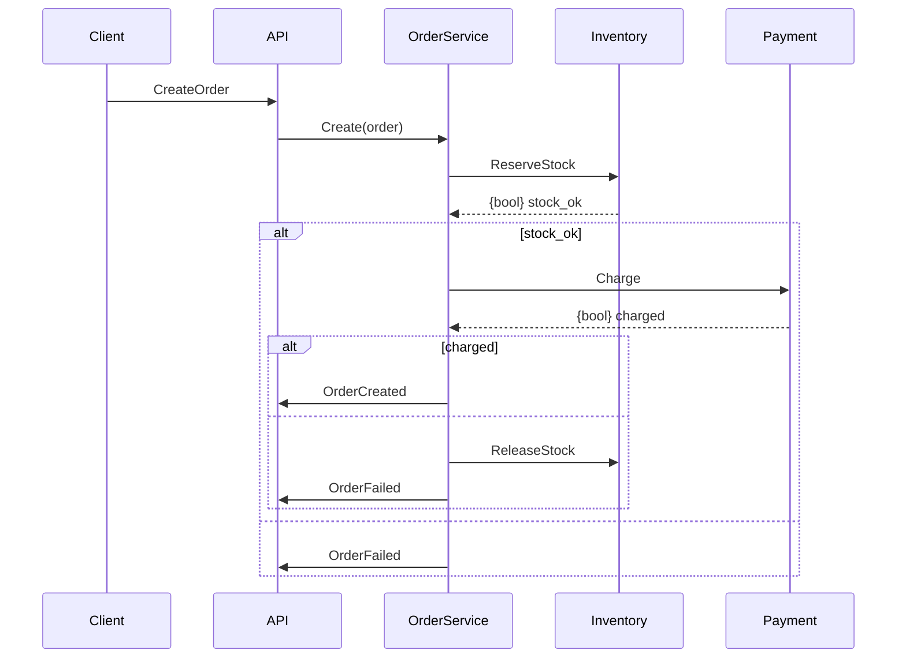

```markdown
# **"Hybrid Gotchas": Mastering the Pitfalls of Combined Database and API Design**

*How to avoid the subtle (and not-so-subtle) anti-patterns when mixing databases with API design—and when you *should* do it anyway.*

---

## **Introduction**

Imagine you’re building a highly available, globally distributed application. You design a **scalable microservice architecture** with clear boundaries, each service owning its data. But then—*you realize your API is starting to leak database inconsistencies, queries are bumping against N+1 problems, and your caching layer feels like a work-around rather than a solution.*

This is the **Hybrid Gotchas** scenario—a place where **database design** (e.g., relational schemas, transactions) interacts with **API design** (REST/gRPC, caching, eventual consistency) in ways that create subtle but insidious bugs.

Hybrid systems *are* powerful—think **CRUD APIs backed by relational databases** (e.g., Postgres) alongside **event-sourced sidecars** (e.g., Kafka) or **NoSQL denormalizations** (e.g., MongoDB). Yet, when these components **tightly couple**, they often introduce:
- **Inconsistent state** (because your API lies about what the database does)
- **Performance spikes** (because your API forces bad queries)
- **Debugging nightmares** (because logs split across services)

In this guide, we’ll dissect the **most common Hybrid Gotchas**, show you **how to avoid them**, and even uncover when *hybrid design is the right choice*—with real-world code examples.

---

## **The Problem: Why Hybrid Systems Get “Gotcha-ed”**

Hybrid systems arise when:
✅ You’re **migrating** from a monolith to microservices (old DB APIs pollute new ones).
✅ You’re **combining strengths** (e.g., Postgres for strong consistency + Redis for caching).
✅ You’re **legacy-constrained** (e.g., a legacy SQL DB with a fresh React frontend).

The **core issue**: APIs *lie*. Your API contracts (e.g., `/users/{id}`) may promise atomicity, but your DB transactions fail. Or:
- You **cache too aggressively** (stale data).
- You **bypass caching** (slow queries).
- You **optimize for one path** (e.g., read-heavy) at the cost of another (write-heavy).

### **Example: The N+1 Cache Issue**
```python
# API fetch_user() calls DB directly
def fetch_user(db, id):
    user = db.get(id)  # 1 query
    return {
        "id": user.id,
        "posts": [db.get_post(post_id) for post_id in user.post_ids]  # N queries!
    }
```
This is **not hybrid—it’s broken**. But *how many times* have you seen this in real-world APIs?

### **Example: The Transactional Caching Lie**
```python
# API writes to DB *and* Redis in a transaction
def update_user(db, redis, id, data):
    with db.transaction():  # 1st DB commit
        db.update(id, data)
    redis.set(f"user:{id}", data)  # 2nd commit (inconsistent if DB fails!)
```
Now, if the DB crashes halfway, your API *still returns the Redis data*—**exactly wrong**.

---

## **The Solution: Hybrid Gotchas Mitigation**

The key is **breaking tight coupling** between:
1. **The API layer** (what clients *expect*)
2. **The database layer** (what it *actually* does)
3. **The caching layer** (what it *should* do)

Here’s how:

| **Gotcha**               | **Solution**                          | **Tradeoff**                          |
|--------------------------|----------------------------------------|----------------------------------------|
| N+1 queries              | Use **joins** or **denormalize**       | Risk of stale data                    |
| Unsafe caching           | **Cache invalidation** on writes      | Higher cache misses                   |
| Unbounded transactions   | **Saga pattern** or **compensating txs** | Eventual consistency required         |
| API lying about DB       | **Projection API** (hide raw DB calls) | Extra service complexity              |

---

## **Code Examples**

### **1. Fixing N+1 with DataLoader (GraphQL Example)**
*(If using REST, use `IN` clauses or denormalization.)*

```javascript
// Before: N+1
async function getUserPosts(db, userId) {
  const user = await db.getUser(userId);
  return [await db.getPost(postId) for postId in user.postIds];
}

// After: Batch queries with DataLoader
const loader = new DataLoader(async (postIds) => {
  const posts = await db.getPosts(postIds); // 1 query
  return postIds.map(id => posts.find(p => p.id === id));
});

async function getUserPosts(db, userId) {
  const user = await db.getUser(userId);
  return await loader.loadMany(user.postIds); // 1 query
}
```
**Key takeaway**: Always **batch** related reads.

---

### **2. Safe Caching with Event Sourcing**
*(When DB writes are idempotent, use events to invalidate cache.)*

```python
# On write, emit Event("UserUpdated", user_id)
@event_listener("UserUpdated")
def invalidate_user_cache(user_id):
    redis.del(f"user:{user_id}")

def update_user(db, redis, user_id, data):
    if not redis.exists(f"user:{user_id}"):  # Fresh DB call
        db.update(user_id, data)
    else:
        db.update(user_id, data)  # Still needed for DB consistency
```
**Tradeoff**: Requires **eventual consistency**—but avoids **stale reads**.

---

### **3. Projection API (Hiding DB Quirks)**
*(Expose a clean API that doesn’t map 1:1 to DB tables.)*

```python
# API (POST /users/{id}/orders)
def get_user_orders(db, user_id):
    # DB call gets messy joins
    orders = db.query("""
        SELECT o.*
        FROM orders o
        JOIN order_items i ON o.id = i.order_id
        WHERE o.user_id = $1
    """, [user_id])

    # Return clean, denormalized JSON
    return {
        "user": db.get_user(user_id),
        "orders": orders
    }
```
**Why?** Clients don’t need DB internals—**they need business data**.

---

### **4. Saga Pattern for Distributed Transactions**
*(When DB transactions can’t span services.)*


**Key**: Treat DB writes as **events**, not transactions.

---

## **Implementation Guide**

### **Step 1: Audit API-DB Coupling**
- **Find** all API routes that directly call `db.query()`.
- **Ask**: *Does this client need this query?* (Probably not.)
- **Refactor** to use **projection APIs** or **batch loading**.

### **Step 2: Enforce Cache Invalidation**
- Use **events** (Kafka, Pub/Sub) to trigger cache invalidation.
- Example:
  ```python
  def write_user(db, redis, user_id, data):
      db.update(user_id, data)
      pubsub.publish("user_updated", {"id": user_id})
  ```

### **Step 3: Avoid DB-Specific API Endpoints**
- **Bad**: `/api/v1/users/{id}/raw` (exposes DB schema).
- **Good**: `/api/v1/users/{id}/profile` (business logic only).

### **Step 4: Design for Failure**
- Assume **DBs will fail** and **caches will be stale**.
- Use **retries with exponential backoff**:
  ```go
  func withRetry(db *pgxConn, maxRetries int, fn func() error) error {
      for i := 0; i < maxRetries; i++ {
          err := fn()
          if err == nil || i == maxRetries-1 {
              return err
          }
          time.Sleep(time.Duration(i) * time.Second)
      }
      return fmt.Errorf("all retries failed")
  }
  ```

---

## **Common Mistakes to Avoid**

| **Mistake**                          | **Why It’s Bad**                                  | **Fix**                                  |
|--------------------------------------|--------------------------------------------------|------------------------------------------|
| **Caching writes too aggressively**   | Stale data in reads                              | Use **short TTLs** or **events**         |
| **Ignoring DB timeouts**             | Long-running queries hang clients                | Set **reasonable timeouts** (e.g., 1s)   |
| **Assuming ACID = API atomicity**    | DB can’t span services                            | Use **sagas** or **compensating actions**|
| **Over-querying in loops**           | N+1 gotchas                                     | Use **batch loading** or **joins**       |
| **Not testing edge cases**           | DB failures in production                        | **Chaos engineering** (e.g., kill -9 DB) |

---

## **Key Takeaways**

✅ **Hybrid systems require separation of concerns**:
   - API = **business logic**
   - DB = **data storage**
   - Cache = **performance boost**

✅ **Always batch reads**:
   - Use `DataLoader` (GraphQL), `IN` clauses (SQL), or denormalization.

✅ **Cache invalidation is harder than caching**:
   - Prefer **event-driven** invalidation over manual checks.

✅ **Transactions ≠ API consistency**:
   - Distributed systems need **saga patterns** or **eventual consistency**.

✅ **Design for failure**:
   - DBs crash. Cache misses happen. **Plan for it.**

---

## **Conclusion: When to Use Hybrid Design**

Hybrid systems aren’t inherently bad—they’re **powerful when used wisely**. The gotchas arise when:
- You **treat APIs as SQL wrappers** (bad).
- You **ignore eventual consistency** (risky).
- You **cache without strategy** (inefficient).

**When to embrace hybrid?**
✔ **Legacy migrations** (new API layer over old DB).
✔ **Hybrid consistency needs** (e.g., read-heavy + eventual writes).
✔ **Performance optimization** (e.g., Redis for hot data).

**Final rule**: *If your API feels like a DB schema, you’re doing it wrong.*

---
**Next steps**:
- Try **denormalizing** for read-heavy APIs.
- Experiment with **event sourcing** for write-heavy ones.
- **Measure** cache hit rates—if they’re <90%, revisit your strategy.

Got a hybrid system that’s driving you nuts? Drop a comment—let’s debug it together!

---
```