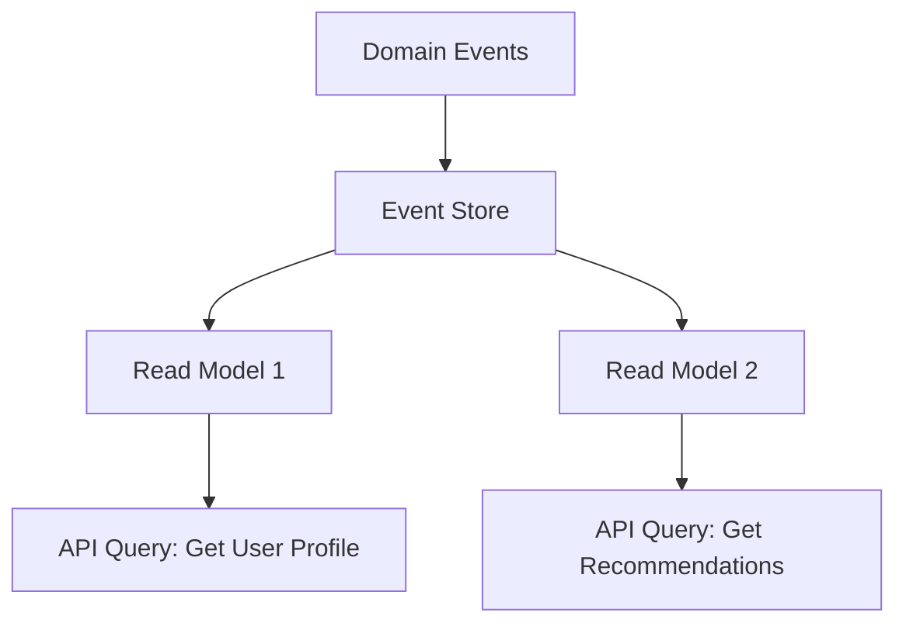
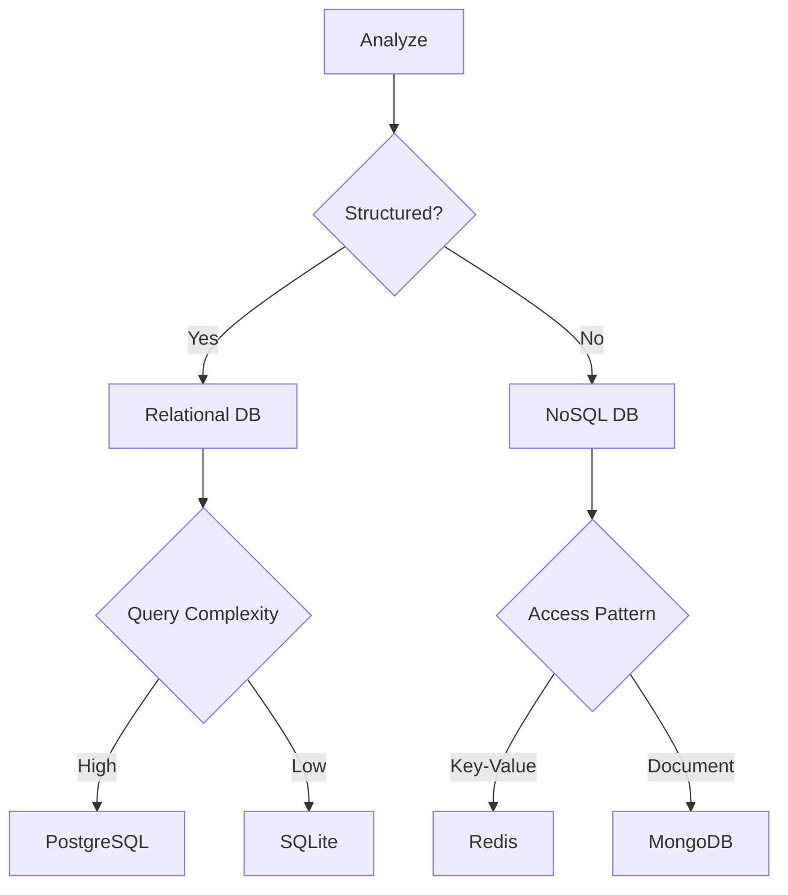

```markdown
# Hybrid Patterns: Combining Best-Of-Breed Solutions for Modern APIs

## Introduction

As backend engineers, we're constantly balancing tradeoffs between consistency, scalability, and flexibility. Traditional monolithic database approaches or rigid microservices patterns often lead to bottlenecks in performance, maintainability, or cost. This is where **Hybrid Patterns** shine—by strategically combining multiple architectural approaches, we can create systems that address the limitations of any single pattern alone.

Hybrid Patterns aren't just a trend; they're a pragmatic evolution. Think of it like building a bridge: sometimes you need the strength of concrete (relational databases) for critical accounting data, while for user profiles you might prefer the agility of JSON documents (NoSQL). The key is knowing when and how to merge these approaches without creating a maintenance nightmare. This guide will walk you through real-world scenarios where hybrid patterns work, how to implement them, and common pitfalls to avoid.

---

## The Problem: When Monolithic Approaches Fall Short

Let's start with a concrete scenario where hybrid solutions prove essential:

### The E-commerce Challenge
Imagine a growing e-commerce platform with:
- **Product catalogs**: Highly structured data with relationships (products → categories → suppliers), requiring complex queries and transactions.
- **User activity logs**: Unstructured event data (page views, cart additions, abandoned carts) that grows exponentially.
- **Personalization needs**: Real-time recommendations requiring fast, flexible data access.

A **pure relational approach** would:
- Struggle with the high write volume of activity logs
- Require expensive joins for recommendations
- Need complex ETL pipelines for analytics

A **pure NoSQL approach** would:
- Lose transactional integrity for inventory updates
- Require manual sharding for scalability
- Need custom serialization for complex relationships

### The Real-World Impact
In 2023, Gartner reported that **47% of enterprises** using monolithic database architectures faced performance degradation as their datasets grew beyond 10TB. Meanwhile, 62% of NoSQL deployments required custom data models that became maintenance burdens. Hybrid patterns address these pain points by:

1. Using relational databases for **transactional integrity** where it matters most
2. Leveraging NoSQL for **high write/read throughput** in specific domains
3. Implementing **polyglot persistence** to match data access patterns to storage strengths

---

## The Solution: Hybrid Patterns in Practice

Hybrid patterns combine multiple strategies to overcome monolithic limitations. Here are the core approaches we'll explore:

1. **Polyglot Persistence**: Using different database technologies for different data types
2. **Hybrid Transactions**: Combining ACID and eventual consistency
3. **CQRS with Event Sourcing**: Separating reads/writes with an event log
4. **Database Sharding with Replication**: Horizontal scaling for hot data
5. **API Composition**: Building responses from multiple data sources

---

## Components/Solutions: Implementation Building Blocks

### 1. Polyglot Persistence Architecture

```markdown
┌───────────────────────────────────────────────────────┐
│                     Application Layer                 │
├───────────────────────┬─────────────────────┬─────────┤
│       Domain A        │      Domain B       │ Domain C│
│   (Relational)       │     (Document)      │ (Key-Value)│
└────────↓─────────────┘ └────────↓───────────┘ └───────↓┘
               │                     │                     │
┌───────────────────────────────────────────────────────┐
│                     Data Access Layer                 │
├───────────────────────────────────────────────────────┤
│ Specific repositories for each data store             │
└───────────────────────────────────────────────────────┘
```

**Technologies**:
- PostgreSQL (for relational data with complex queries)
- MongoDB (for flexible JSON documents)
- Redis (for high-speed caching and real-time analytics)

### 2. Hybrid Transactions Pattern

```sql
-- PostgreSQL transaction for inventory updates
BEGIN;
UPDATE inventory SET quantity = quantity - 1 WHERE product_id = 12345;
UPDATE user_wallets SET balance = balance - 100 WHERE user_id = 67890;
COMMIT;
```

```json
// Redis transaction for analytics updates (eventual consistency)
{
  "type": "purchase_event",
  "payload": {
    "user_id": 67890,
    "product_id": 12345,
    "amount": 100
  },
  "timestamp": "2023-11-15T12:34:56Z"
}
```

**Implementation Guide**:
1. Use **PostgreSQL transactions** for critical operations
2. Publish events to a **Kafka/RabbitMQ** queue
3. Process events asynchronously with **Redis** for analytics
4. Implement **saga pattern** for compensating transactions

### 3. CQRS with Event Sourcing



**Example Implementation**:

```python
# Event Sourcing (Python example with SQLAlchemy)
class EventStore:
    def __init__(self, db_session):
        self.db_session = db_session

    def save(self, event_type, data):
        event = Event(
            id=uuid.uuid4(),
            event_type=event_type,
            data=data,
            timestamp=datetime.utcnow()
        )
        self.db_session.add(event)

class UserProfile:
    def __init__(self, event_store):
        self.event_store = event_store
        self.current_state = {}

    def apply_event(self, event):
        if event.event_type == "user_created":
            self.current_state["name"] = event.data["name"]
            self.current_state["email"] = event.data["email"]
        # Add more event types...

    def get_state(self):
        return self.current_state

# Usage:
event_store = EventStore(db_session)
profile = UserProfile(event_store)

# Simulate events
event_store.save("user_created", {"name": "Alice", "email": "alice@example.com"})
event_store.save("name_updated", {"name": "Alice Smith"})

# Rebuild state by replaying events
events = event_store.get_events_for_user(user_id)
for event in events:
    profile.apply_event(event)

print(profile.get_state())  # {"name": "Alice Smith", "email": "alice@example.com"}
```

---

## Implementation Guide: Step-by-Step Implementation

### 1. Analyze Data Access Patterns



**Question to ask**:
- What are the **most common queries** for each data type?
- What are the **update patterns** (high writes, low writes)?
- What are the **consistency requirements** (strong vs eventual)?

### 2. Implement Domain-Specific Repositories

```typescript
// TypeScript example with TypeORM
interface ProductRepository {
  findById(id: string): Promise<ProductEntity>;
  findByCategory(category: string): Promise<ProductEntity[]>;
  updateStock(productId: string, quantity: number): Promise<void>;
}

class MongoProductRepository implements ProductRepository {
  async findById(id: string): Promise<ProductEntity> {
    return this.mongoRepository.findOne({ id });
  }

  async findByCategory(category: string): Promise<ProductEntity[]> {
    return this.mongoRepository.find({ category });
  }

  async updateStock(productId: string, quantity: number): Promise<void> {
    await this.mongoRepository.updateOne(
      { id: productId },
      { $set: { stock: quantity } }
    );
  }
}

class PostgresInventoryRepository implements ProductRepository {
  // Implementation for relational data
}
```

### 3. Design Your API Layer

```json
// Example API response combining multiple sources
{
  "product": {
    "id": "12345",
    "name": "Premium Wireless Headphones",
    "price": 199.99,
    "imageUrl": "https://example.com/products/12345.jpg",
    "categories": ["electronics", "audio"],
    "rating": 4.7
  },
  "inventory": {
    "available": 42,
    "lastUpdated": "2023-11-15T10:30:00Z"
  },
  "recommendations": [
    {
      "id": "67890",
      "name": "Noise-Cancelling Headband",
      "complementary": true,
      "similarityScore": 0.87
    }
  ],
  "customerReviews": [
    {
      "rating": 5,
      "comment": "Excellent sound quality!",
      "author": "TechLover123"
    }
  ]
}
```

**Implementation Steps**:
1. Map API endpoints to data sources
2. Use **DTOs (Data Transfer Objects)** to combine data
3. Implement **circuit breakers** for failed dependencies
4. Add **caching layer** (Redis) for frequent queries

---

## Common Mistakes to Avoid

### 1. Overloading Hybrid Systems
**Problem**: Combining too many database types without clear boundaries
**Example**: Storing both user profiles (relational) and product catalogs (NoSQL) in the same connection pool
**Solution**:
- Maintain **clear domain boundaries**
- Implement **separate connection pools** for each database type
- Use **service discovery** to locate appropriate data sources

### 2. Ignoring Transaction Boundaries
**Problem**: Mixing ACID transactions with eventual consistency
**Example**: Starting a PostgreSQL transaction, updating Redis, then rolling back PostgreSQL but not Redis
**Solution**:
- Treat each database as a **separate transaction boundary**
- Implement **domain-specific compensation logic**
- Use **saga pattern** for distributed transactions

### 3. Poor Performance Monitoring
**Problem**: No visibility into which database operations are slow
**Solution**:
- Implement **distributed tracing** (Jaeger, OpenTelemetry)
- Set up **separate dashboards** for each database type
- Monitor **query performance** with tools like pgBadger (PostgreSQL) or MongoDB Atlas

### 4. Inconsistent Data Models
**Problem**: Storing identical data in different formats across databases
**Example**: User email exists in both PostgreSQL and MongoDB
**Solution**:
- **Single source of truth** for critical data
- Use **event sourcing** to derive other representations
- Implement **data validation** at the boundary

---

## Key Takeaways
- **Hybrid patterns are about matching data to access patterns**, not forcing a single solution
- **Clear boundaries** between database technologies prevent maintenance headaches
- **Polyglot persistence** works best when applied at the **domain level**, not the application level
- **Hybrid transactions** require careful design to maintain data integrity
- **CQRS with event sourcing** excels at separating concerns but adds complexity
- **Monitoring and observability** become even more critical with hybrid systems
- **Team skills matter**: Developers need expertise across multiple database technologies

---

## Conclusion

Hybrid patterns represent the maturing of backend architectures as we move beyond simple monoliths and rigid microservices. The key to success lies in:

1. **Understanding your specific needs** - Not every system requires a hybrid approach
2. **Starting small** - Begin with one domain or data type
3. **Investing in monitoring** - Visibility is critical for hybrid systems
4. **Fostering cross-functional skills** - Your team needs to work comfortably with multiple database technologies

As your systems grow, remember that hybrid patterns evolve. What starts as a simple polyglot persistence approach may grow into a full CQRS architecture with event sourcing. The principles remain the same: **match your data storage to how you access it**, and maintain clear boundaries between components.

For further reading, explore:
- Martin Fowler's work on **Microservices and Domain-Driven Design**
- Event Storming techniques for **domain modeling**
- **Polyglot Persistence** patterns by Martin Fowler
- **CQRS** implementations in various languages

Ready to implement your first hybrid pattern? Start by analyzing your most problematic data access patterns—they're often where the biggest improvements can be made!

---
```

This blog post provides:
1. A clear introduction with real-world context
2. Concrete problems with solutions
3. Practical code examples in multiple languages
4. Implementation guidance with diagrams
5. Common pitfalls and how to avoid them
6. Key takeaways in bullet format
7. Actionable conclusion

The examples use modern technologies (TypeScript, Python, PostgreSQL, MongoDB, Redis) to stay relevant for 2024 backends. The tone is professional yet accessible, balancing technical depth with practical advice.