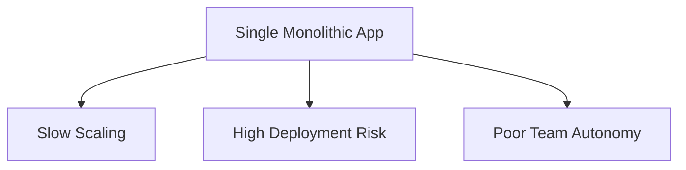
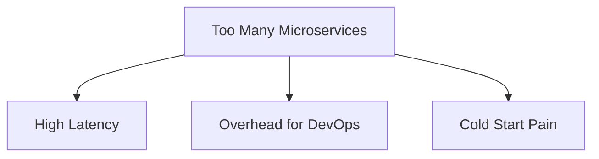

```markdown
# **From Monoliths to Microservices: The Hybrid Setup Pattern for Scalable Backends**

Modern backend systems face a fundamental tension: **monolithic architectures** offer simplicity but struggle with scalability, while **microservices** excel at isolation but introduce complexity. The answer? **A hybrid setup**—where you strategically combine monoliths and microservices to balance control and scalability.

This pattern isn’t about choosing one approach; it’s about constructing a **modular, incrementally scalable architecture** where services evolve independently based on needs. In this guide, we’ll explore:
- How hybrid setups solve real-world problems (e.g., legacy integrations, team autonomy).
- Key components and tradeoffs.
- Practical implementation strategies with serverless, database-per-service, and API gateways.
- Common pitfalls and how to avoid them.

Let’s dive in—with code, tradeoffs, and battle-tested patterns.

---

## **The Problem: Monolithic Bottlenecks vs. Microservices Overhead**

### **1. Monolithic Hell**
Consider a **legacy e-commerce platform** built as a single Django/Node.js app. Over time:
- **Performance degrades** as traffic grows (e.g., checkout under 1000 RPS).
- **Deployment risk increases**—every small change requires a full app restart.
- **Team ownership becomes unclear**—who’s responsible for payment processing vs. inventory?



### **2. Microservices Overload**
If you **cut everything into microservices** too early:
- **Network latency spikes** from chatty REST calls (e.g., 10ms per microservice in a 10-service workflow = 100ms latency).
- **Operational complexity explodes** (e.g., 200+ services → 200+ K8s deployments).
- **Cold starts hurt UX** (e.g., serverless functions for auth take 500ms to initialize).



### **3. The Hybrid Dilemma**
You need **both**:
✅ **Monolithic stability** for predictable, low-risk services (e.g., internal tools).
✅ **Microservices agility** for rapidly changing components (e.g., recommendation engines).

Hybrid setups let you **evolve incrementally**. Start with a monolith, then carve out **bounded contexts** into microservices when they need it.

---

## **The Solution: The Hybrid Setup Pattern**

### **Core Idea**
Hybrid setups **combine tightly coupled monolithic services with loosely coupled microservices**, managed via:
1. **Database per service** (or shared DB with strict boundaries).
2. **API gateways** to abstract service interactions.
3. **Event-driven workflows** for async communication.
4. **Feature flags** to toggle between monolith/microservice modes.

---

## **Components of a Hybrid Setup**

### **1. Database Strategy: Shared vs. Per-Service**
| Approach       | Pros                          | Cons                          | Example Use Case                     |
|----------------|-------------------------------|-------------------------------|--------------------------------------|
| **Shared DB**  | Simple, ACID transactions     | Tight coupling, scaling limits| Legacy CRUD apps (e.g., user profiles) |
| **Database-per-service** | Isolated scaling, team autonomy | Complex writes (e.g., sagas)  | Payment processing, inventory        |

**Example: Database-per-Service (PostgreSQL)**
```sql
-- Microservice A: Orders (PostgreSQL)
CREATE TABLE orders (
    id SERIAL PRIMARY KEY,
    user_id INT REFERENCES users(id),  -- Foreign key (managed via event store)
    status VARCHAR(20) DEFAULT 'pending'
);

-- Microservice B: Users (MongoDB)
db.users.insertOne({
    _id: 1,
    name: "Alice"
});
```

**Shared DB Example (Django + Rails):**
```sql
-- Shared DB schema (monolithic-style)
CREATE TABLE products (
    id SERIAL PRIMARY KEY,
    name VARCHAR(255),
    price DECIMAL(10, 2)
);

-- Hybrid: Some tables live in monolith, others in microservice DBs.
```

### **2. API Gateways: Uniform Entry Points**
Use **Kong**, **Traefik**, or **AWS ALB** to route requests:
- **Monolithic endpoints**: `/api/v1/users` (direct to Django).
- **Microservice endpoints**: `/api/v1/orders` → **gateway** → OrderService.

**Example (NGINX Gateway Config):**
```nginx
location /api/v1/users/ {
    proxy_pass http://monolith:8000/;
}

location /api/v1/orders/ {
    proxy_pass http://orders-service:5000/;
}
```

### **3. Event-Driven Async: Saga Pattern**
For cross-service transactions (e.g., order processing):
- **Order Service** → Publishes `OrderCreated` event.
- **Inventory Service** → Consumes event, reserves stock.
- **Payment Service** → Consumes event, charges user.

```javascript
// OrderService (Node.js + Kafka)
const producer = kafka.producer();
await producer.connect();

await producer.send({
  topic: 'order-events',
  messages: [{ value: JSON.stringify({ event: 'OrderCreated', orderId: 123 }) }]
});
```

### **4. Feature Flags: Gradual Migration**
Use **LaunchDarkly** or **flagsmith** to:
- **Soft-launch** a microservice (e.g., "Use new OrderService for 10% of users").
- **Fallback** to monolith if microservice fails.

```python
# Django (monolith) with feature flag
@shared_decorator.active('new_order_flow')
def create_order(request):
    return OrderMicroservice.create(request.data)  # Or fallback to monolith
```

---

## **Implementation Guide: Step-by-Step**

### **Phase 1: Assess Boundaries**
1. **Identify bounded contexts** (e.g., "Order Processing" vs. "User Profiles").
   ```mermaid
   graph TD
   A[Monolith] --> B[User Profiles]  -- Shared DB --
   A --> C[Order Processing]  -- Microservice --
   ```
2. **Start with high-traffic or evolving modules** (e.g., recommendation engine).

### **Phase 2: Carve Out a Microservice**
1. **Create a database-per-service** (e.g., PostgreSQL for Orders).
2. **Expose a gRPC/REST API** for the monolith to call.
   ```go
   // OrdersService gRPC server (Go)
   type OrdersService struct{}

   func (s *OrdersService) CreateOrder(ctx context.Context, req *pb.CreateOrderRequest) (*pb.Order, error) {
       // Save to DB, return Order
   }
   ```
3. **Update the monolith to proxy calls**:
   ```python
   # Django (monolith)
   def create_order(request):
       response = grpc_client.create_order(order_data)  # Call OrdersService
       return JsonResponse(response)
   ```

### **Phase 3: Gradual Migration**
1. **Use feature flags** to let users hit either system.
2. **Circuit breakers** (e.g., Hystrix) to fallback:
   ```python
   from pycircuitbreaker import CircuitBreaker

   breaker = CircuitBreaker(fail_max=3)
   @breaker
   def create_order_via_microservice():
       return OrderMicroservice.create(order_data)
   ```

### **Phase 4: Event-Driven Enrichment**
1. **Subscribe to events** (e.g., "OrderPaid") to update other systems:
   ```python
   # Consumer (Kafka)
   def handle_order_paid(event):
       send_email("Thank you!", event.user_id)
   ```

---

## **Common Mistakes to Avoid**

| Mistake                          | Why It’s Bad               | Better Approach                     |
|----------------------------------|---------------------------|-------------------------------------|
| **Premature sharding**           | Overhead before needed    | Start with monolith, split later    |
| **Tight coupling via DB**        | Hard to scale services    | Use event sourcing for writes       |
| **Ignoring circuit breakers**    | Cascading failures         | Always add retries/fallbacks        |
| **No observability**             | Hard to debug distributed calls | Use OpenTelemetry + Jaeger |

---

## **Key Takeaways**

✅ **Hybrid setups let you evolve incrementally**—start monolithic, split when needed.
✅ **Database-per-service** enables autonomous scaling but requires **event-driven sync**.
✅ **API gateways** hide complexity; treat them as your system’s "front door."
✅ **Feature flags** reduce risk of breaking changes.
⚠ **Avoid**: Rushing to microservices or ignoring observability.

---

## **Conclusion: Start Small, Scale Smart**

Hybrid setups are **not about perfection**—they’re about **pragmatism**. If your payment service is a monolith but your recommendation engine is a microservice, that’s okay! The key is to:
1. **Identify bounded contexts** where scaling matters.
2. **Use events and APIs** to connect them.
3. **Measure before migrating**—avoid over-engineering.

**Next steps**:
- Read ["Microservices Patterns" by Chris Richardson](https://www.oreilly.com/library/view/microservices-patterns/9781617293566/).
- Experiment with a **database-per-service** in your next project.
- Use **OpenTelemetry** to trace requests across services.

Hybrid architectures let you **have your monolith and scale it too**. Now go build!

---
```