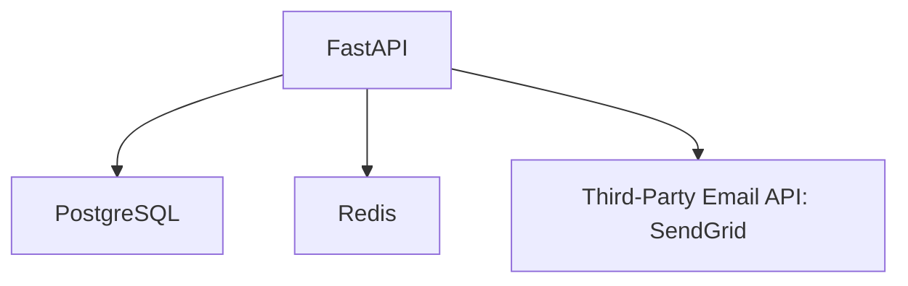

```markdown
# Hybrid Troubleshooting: Combining Structured Logging with Real-Time Observability for Smarter Debugging

## Introduction

Have you ever stared at a production error log, wondering how a seemingly simple API request could have spiraled into a multi-step failure? Or spent hours digging through console logs only to realize you needed database insights but couldn't easily correlate them?

In modern backend systems, where applications interact with databases, external APIs, and microservices, **hybrid troubleshooting** becomes essential. This pattern combines **structured logging** (for historical analysis) with **real-time observability** (for immediate detection), giving you a holistic view of system behavior.

By the end of this tutorial, you’ll understand how to:
- Implement structured logging with context-rich entries
- Set up real-time monitoring with tools like APM (Application Performance Monitoring)
- Create dashboards that correlate logs with performance metrics
- Build alerting systems that trigger automatically
- Practice hybrid debugging in real scenarios

We’ll focus on **practical implementations** using Python (FastAPI), PostgreSQL, and open-source tools like Prometheus and Grafana, so you can apply these concepts immediately—even in a simple backend project.

---

## The Problem: When Traditional Debugging Fails

Let’s imagine you’re running a **user authentication service** with these components:



When a user reports login failures, your team’s current approach might involve:
1. Checking **console logs** for error messages (but they lack context)
2. Running **manual SQL queries** to inspect database state (slow and ad-hoc)
3. Reviewing **API response codes** from SendGrid via HTTP tools (time-consuming)

### Common Pain Points:

| Scenario                     | Symptom                                                                 | Why Traditional Methods Fail                     |
|------------------------------|------------------------------------------------------------------------|--------------------------------------------------|
| **Slow database queries**    | Login hangs for 10+ seconds                                            | Console logs only show timestamps; no latency context |
| **Third-party API failures** | Random `429 Too Many Requests` errors from SendGrid                     | No correlation between API calls and retries    |
| **Race conditions**          | User sees "Invalid credentials" even after correct input               | Logs lack sequence numbers or transaction IDs     |
| **Environment differences**  | Works in development but fails in production                           | Missing contextual metadata (e.g., OS, Python version) |

### Real-World Example: The Wild Goose Chase

Imagine a user `alice@example.com` reports login failures. Your team:
1. Checks logs for `alice` → finds `Invalid credentials` error (but doesn’t know if it’s a DB issue or SendGrid quota)
2. Queries the database manually → sees `SELECT * FROM users WHERE email='alice@example.com'` took 5s (but no baseline for SLO)
3. Calls SendGrid support → learns they’re throttling `alice` (but logs don’t show request count)

Each team member blames others, while the real culprit (a misconfigured Retry-After header) goes unnoticed until **hybrid troubleshooting** bridges the gap.

---

## The Solution: Hybrid Troubleshooting

Hybrid troubleshooting combines **three pillars**:
1. **Structured, Contextual Logging** (What happened?)
2. **Real-Time Observability** (How fast is it? Where is it slow?)
3. **Alerting & Correlation** (What’s related to this issue?)

### Core Components

| Component               | Example Tools                          | Purpose                                                                 |
|-------------------------|----------------------------------------|--------------------------------------------------------------------------|
| **Structured Logging**  | `structlog`, `json-logger`, `loguru`    | Store logs with metadata (user, transaction ID, correlation ID)          |
| **Real-Time Metrics**   | Prometheus, Datadog, New Relic          | Track latency, error rates, throughput (e.g., request duration histogram) |
| **Tracing**             | OpenTelemetry, Jaeger, Zipkin          | Trace requests across services with timestamps and dependencies          |
| **Alerting**            | AlertManager, PagerDuty, Slack         | Notify teams when metrics/errors exceed thresholds                       |
| **Dashboards**          | Grafana, Datadash                      | Visualize logs, metrics, and traces in one place                          |

---

## Components/Solutions

### 1. Structured Logging: The Backbone of Context

**Problem:** Unstructured logs like `ERROR: User login failed` mean nothing without context.

**Solution:** Use **context-rich structured logging** to include:
- User IDs, transaction IDs, and request paths
- Correlation IDs to track requests across services
- Environment details (e.g., `dev`, `prod`)

#### Example: Structured Logging in FastAPI

**Before (Unstructured):**
```python
import logging
logger = logging.getLogger()

# Basic logging
logger.error("Failed to login for user@example.com")
```

**After (Structured):**
```python
import structlog
from fastapi import Request
from uuid import uuid4

# Configure structured logging
structlog.configure(
    processors=[
        structlog.stdlib.add_log_level,
        structlog.stdlib.add_logger_name,
        structlog.processors.JSONRenderer()
    ]
)
logger = structlog.get_logger()

async def login_user(request: Request, email: str):
    correlation_id = request.headers.get("x-correlation-id", str(uuid4()))
    try:
        logger.info(
            "user_login_attempt",
            user_email=email,
            correlation_id=correlation_id,
            request_path=request.url.path
        )
        # Rest of the login logic...
        return {"status": "success"}
    except Exception as e:
        logger.error(
            "user_login_failed",
            user_email=email,
            correlation_id=correlation_id,
            error=str(e),
            stack=traceback.format_exc()
        )
        raise
```

**Log Output (JSON):**
```json
{
  "level": "info",
  "timestamp": "2023-10-15T14:30:00Z",
  "logger": "fastapi.app",
  "event": "user_login_attempt",
  "user_email": "alice@example.com",
  "correlation_id": "550e8400-e29b-41d4-a716-446655440000",
  "request_path": "/auth/login"
}
```

> **Pro Tip:** Use a **correlation ID** to track a user’s request across services (e.g., API → DB → SendGrid).

---

### 2. Real-Time Observability: Metrics and Traces

**Problem:** Slow queries or API calls might fly under the radar without monitoring.

**Solution:** Instrument your code to:
- Track **latency** (e.g., query execution time)
- Monitor **error rates** (e.g., 429s from SendGrid)
- Use **traces** to follow a single request’s journey

#### Example: Prometheus Metrics in FastAPI

Install dependencies:
```bash
pip install prometheus-fastapi-instrumentator
```

**Instrumented API:**
```python
from prometheus_fastapi_instrumentator import Instrumentator
from fastapi import FastAPI

app = FastAPI()

# Add Prometheus instrumentation
Instrumentator().instrument(app).expose(app)

@app.get("/auth/login")
async def login_user(email: str):
    # Assume this is a slow query in production
    import time
    time.sleep(1)  # Simulate slow DB call
    return {"status": "success"}
```

Now, Prometheus will track:
- `http_request_duration_seconds` (latency)
- `fastapi_requests_total` (throughput)

**Visualize with Grafana:**
Create a dashboard with:
- A **histogram** of request durations (identify outliers)
- A **counter** for failed logins (alert if > 5%)

---

### 3. Distributed Tracing: The "Request Journey" Map

**Problem:** If login fails, was it due to a slow DB query, SendGrid timeouts, or both?

**Solution:** Use **OpenTelemetry** to trace requests across services.

#### Example: OpenTelemetry in FastAPI

Install OpenTelemetry:
```bash
pip install opentelemetry-api opentelemetry-sdk opentelemetry-exporter-otlp
```

**Add Tracing to Your App:**
```python
from opentelemetry import trace
from opentelemetry.sdk.trace import TracerProvider
from opentelemetry.sdk.trace.export import BatchSpanProcessor
from opentelemetry.exporter.otlp.proto.grpc.trace_exporter import OTLPSpanExporter

# Configure tracer provider
provider = TracerProvider()
processor = BatchSpanProcessor(OTLPSpanExporter(endpoint="http://localhost:4317"))
provider.add_span_processor(processor)
trace.set_tracer_provider(provider)

tracer = trace.get_tracer(__name__)

@app.get("/auth/login")
async def login_user(email: str):
    # Start a span for the entire request
    with tracer.start_as_current_span("user_login") as span:
        span.set_attribute("user.email", email)
        try:
            # Simulate DB call
            with tracer.start_as_current_span("db_query"):
                await slow_db_query(email)
            # Simulate SendGrid call
            with tracer.start_as_current_span("sendgrid_login_email"):
                await sendgrid_login_confirmation(email)
            return {"status": "success"}
        except Exception as e:
            span.record_exception(e)
            raise
```

**View Traces in Jaeger:**
- Start Jaeger: `docker run -d -p 16686:16686 jaegertracing/all-in-one:latest`
- Query traces in the Jaeger UI to see the request flow:

```
[API] /auth/login → [DB] slow_query → [SendGrid] email_sent
```

---

### 4. Alerting: Let the System Warn You

**Problem:** Slow queries or errors might go unnoticed.

**Solution:** Set up alerts using **Prometheus AlertManager** or **Datadog**.

#### Example: Prometheus Alert Rule

Add to `alert.rules.yml`:
```yaml
groups:
- name: auth-service-alerts
  rules:
  - alert: HighLoginLatency
    expr: histogram_quantile(0.95, sum(rate(http_request_duration_seconds_bucket[5m])) by (le)) > 2
    for: 5m
    labels:
      severity: warning
    annotations:
      summary: "Login requests slowing down (p95=2s)"
      description: "95th percentile request duration > 2s"

  - alert: LoginErrorRateIncreasing
    expr: rate(http_requests_total{status=~"5.."}[5m]) / rate(http_requests_total[5m]) > 0.05
    for: 1m
    labels:
      severity: critical
    annotations:
      summary: "High login error rate (>5%)"
      description: "Check logs for failed logins"
```

**Slack Alert Example:**
```json
{
  "blocks": [
    {
      "type": "section",
      "text": {
        "type": "mrkdwn",
        "text": "*High Login Latency Alert* 🚨\n<p>p95 request duration: 2.5s</p>"
      }
    },
    {
      "type": "actions",
      "elements": [
        {
          "type": "button",
          "text": {
            "type": "plain_text",
            "text": "View Grafana Dashboard"
          },
          "url": "https://grafana.example.com/d/abc123/login-performance"
        }
      ]
    }
  ]
}
```

---

## Implementation Guide: Step-by-Step

### Step 1: Set Up Structured Logging
1. Replace `print()` or `logging.error()` with `structlog`.
2. Include **correlation IDs** in all logs.
3. Log **request/response data** (e.g., `email`, `status_code`).

### Step 2: Add Metrics with Prometheus
1. Install `prometheus-fastapi-instrumentator`.
2. Expose the `/metrics` endpoint.
3. Query `http_request_duration_seconds` in Grafana.

### Step 3: Implement OpenTelemetry Tracing
1. Add `opentelemetry-sdk` to your project.
2. Wrap slow operations (DB calls, API calls) in spans.
3. Visualize traces in Jaeger.

### Step 4: Configure Alerts
1. Define Prometheus rules for:
   - High latency (>2s)
   - Error rates (>5%)
   - API throttling (SendGrid `429`)
2. Set up Slack/email alerts.

### Step 5: Correlate Logs, Metrics, and Traces
- Use the **correlation ID** to link:
  - A `500` error in logs →
  - A spike in `http_request_duration_seconds` →
  - A trace showing the slow DB query.

---

## Common Mistakes to Avoid

1. **Logging Too Much or Too Little**
   - ❌ Log every database query (noise overload).
   - ✅ Log only critical paths (e.g., auth failures, payment retries).

2. **Ignoring Correlation IDs**
   - ❌ Different services log independently (hard to debug).
   - ✅ Pass a correlation ID across services (e.g., via HTTP headers).

3. **Overcomplicating Traces**
   - ❌ Trace every trivial operation (slowdowns new features).
   - ✅ Focus on high-latency paths (e.g., DB, external APIs).

4. **Not Testing Alerts**
   - ❌ Assume alerts work in production (they won’t).
   - ✅ Test alerting in staging with mock failures.

5. **Silent Failures in Logs**
   - ❌ Log `ERROR: Failed` without stack traces.
   - ✅ Include `stack`, `error`, and `context` in logs.

---

## Key Takeaways

✅ **Hybrid troubleshooting** = Structured logs + Real-time metrics + Traces + Alerts
✅ **Structured logs** provide context (e.g., `user_email`, `correlation_id`).
✅ **Metrics** (Prometheus) show performance trends and SLO violations.
✅ **Traces** (OpenTelemetry) map the full request flow.
✅ **Alerts** proactively notify you of issues before users complain.
✅ **Correlation IDs** are the glue between logs, metrics, and traces.
✅ **Start simple**: Add logging and metrics first; tracing later.

---

## Conclusion

Hybrid troubleshooting isn’t about buying expensive tools—it’s about **combining the strengths of structured logs, real-time observability, and proactive alerting**. By implementing this pattern, you’ll:
- Spend **less time guessing** why a feature failed.
- Catch issues **before users do** (via alerts).
- Debug **faster** with correlated logs, metrics, and traces.

### Next Steps:
1. **Start small**: Add structured logging to your FastAPI app today.
2. **Instrument metrics**: Track key endpoints with Prometheus.
3. **Experiment with traces**: Use OpenTelemetry to trace a single user login.
4. **Automate alerts**: Set up a warning for >95th percentile latency.

Tools like **FastAPI**, **PostgreSQL**, **Prometheus**, and **OpenTelemetry** make this easier than ever. The key is **consistency**—apply the pattern across all services, and your debugging superpowers will shine.

Happy coding (and happy debugging)!
```

---
**TL;DR:**
Hybrid troubleshooting bridges gaps between logs and observability. Use **structured logs** for context, **metrics** for performance, **traces** for flow, and **alerts** to stay ahead. Start small, iterate, and your debugging will get smarter. 🚀