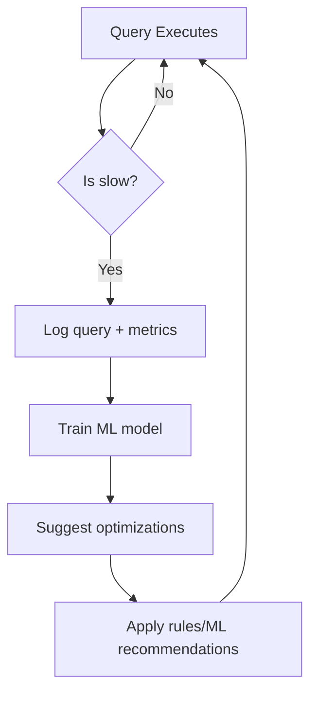

```markdown
---
title: "Hybrid Tuning: Optimizing Databases by Combining Rules and Machine Learning"
date: 2024-02-20
tags: ["databases", "performance", "API design", "machine learning", "database tuning", "backend engineering"]
description: "Learn how to blend rule-based optimization with machine learning to fine-tune database performance in your applications. A practical guide for backend beginners."
---

# **Hybrid Tuning: The Smart Way to Optimize Databases**

Let’s face it: databases are tricky. You spend months designing a schema, only to realize that queries are slow under production load. You tune indexes, cache results, and rewrite queries—but then the data distribution changes, and everything degrades again. Worse yet, some tuning decisions feel like guesswork: *"Maybe I’ll add an index here… or perhaps not…"*

What if there were a way to combine the **structured rigor of rule-based tuning** with the **adaptability of machine learning**? That’s the power of **hybrid tuning**—a pattern that’s gaining traction in high-performance systems but often overlooked by beginners. By blending deterministic rules with data-driven insights, you can fine-tune your database for *real-world workloads* without trial and error.

In this guide, we’ll start with the problem: why rule-based tuning alone fails under real-world conditions. Then we’ll dive into how hybrid tuning works, walk through practical examples, and share tips to implement it effectively. By the end, you’ll have a battle-tested approach to optimizing databases that scales with your application—no more guessing.

---

## **The Problem: Why Rule-Based Tuning Fails**

Rule-based tuning is the bread and butter of database optimization. You add indexes based on `WHERE` clauses, cache frequently accessed data, and precompute aggregates. It’s logical, predictable, and works great when you know your data *will* behave a certain way.

But here’s the catch: **real-world databases don’t behave like textbooks.**

### **Challenge 1: Changing Workloads**
Your database isn’t static. User behavior shifts, new features launch, and suddenly, the query that ran in milliseconds now takes seconds. A well-tuned `SELECT * FROM users WHERE status = 'active'` becomes a bottleneck when `status` filters change to `status IN ('active', 'pending')`.

*Example:* A social media app’s "Feed" query is fine during peak hours, but "Suggested Friends" queries start to lag as users interact more. Without dynamic tuning, these workloads compete for locks and indexes become misaligned.

### **Challenge 2: Overhead from Static Rules**
Rules often introduce hidden costs:
- **False positives:** You add indexes for *every* `WHERE` clause, bloating storage and increasing write overhead.
- **Ignoring data skew:** Rules like "index columns used in `JOIN`" don’t account for columns that are 99% unique but still appear in `WHERE` clauses.
- **No adaptability:** If a query pattern changes (e.g., users start filtering by `created_at` instead of `id`), your rules are out of sync.

### **Challenge 3: Tuning Is a Moving Target**
Even if you nail the schema and indexes, new tables or microservices join the system. Now you must retune indexes, caching strategies, and query patterns—often with limited visibility into what’s actually affecting performance.

### **The Result?**
A classic case of **temporary optimization**. Your database feels fast after tuning, but within weeks, performance sags again. You’re stuck in a cycle of:
1. Profiler shows a slow query.
2. Add an index.
3. Monitor for a week.
4. Repeat.

This is how databases become **slow by design**.

---

## **The Solution: Hybrid Tuning**

Hybrid tuning flips the script by combining:
- **Rule-based strategies** (e.g., "index columns used in `WHERE`")
- **Machine learning** (e.g., "predict which queries will fail under load")
- **Real-time feedback** (e.g., "monitor actual usage and adjust")

The goal? **Unlock performance that adapts automatically to real-world data.**

### **How Hybrid Tuning Works**
1. **Rules provide structure:**
   Start with deterministic guidelines (e.g., index frequently filtered columns).
2. **ML predicts intent:**
   Train models on query patterns to find hidden bottlenecks (e.g., "queries with `LIMIT 1000` will fail").
3. **Feedback loop refines tuning:**
   Continuously evaluate query performance and adjust (e.g., "remove unused indexes").

### **Key Benefits**
- **Adaptability:** Automatically adjusts to changing workloads.
- **Sustainability:** Avoids over-tuning or under-indexing.
- **Explainability:** Rules + ML provide transparency for debugging.

### **When to Use Hybrid Tuning**
- **Large, evolving databases** (e.g., SaaS platforms, analytics dashboards).
- **Cost-sensitive environments** (e.g., cloud databases where over-indexing hurts bills).
- **Unpredictable workloads** (e.g., social media apps with spikes in activity).

---

## **Components of Hybrid Tuning**

### **1. Rule Engine (Baseline Tuning)**
Start with traditional rules to establish a baseline. This ensures you don’t miss obvious optimizations while allowing ML to handle nuance.

```sql
-- Example rule: Index columns used in WHERE clauses
SELECT column_name
FROM information_schema.columns
WHERE table_name = 'users'
AND column_name IN (
    SELECT column_name
    FROM information_schema.statistics
    WHERE index_name IS NOT NULL
    AND table_name = 'users'
);
```

### **2. Query Profiler (Data Collection)**
Log query execution stats (e.g., runtime, I/O, CPU) along with metadata (e.g., `WHERE` conditions, `JOIN` types).

```python
# Example query profiler snippet (Python + PostgreSQL)
import psycopg2

def log_query(query, params):
    conn = psycopg2.connect("dbname=app")
    with conn.cursor() as cursor:
        # Log start time
        cursor.execute("SELECT now() as start_time")
        start_time = cursor.fetchone()[0]
        # Execute query
        cursor.execute(query, params)
        # Log runtime
        cursor.execute("SELECT now() - %s as duration", (start_time,))
        duration = cursor.fetchone()[0]
        # Log to performance_metrics table
        cursor.execute(
            "INSERT INTO performance_metrics (query, duration, params) VALUES (%s, %s, %s)",
            (query, duration, str(params))
        )
    conn.commit()
```

### **3. Machine Learning for Prediction**
Train models to:
- Predict slow queries (e.g., "this query will exceed 1s latency for 95% of users").
- Suggest new indexes (e.g., "this JOIN on `posts.user_id` could be faster with an index").

```python
# Example: Simple model to predict slow queries (scikit-learn)
from sklearn.ensemble import RandomForestClassifier
import pandas as pd

# Sample data: query_features (e.g., query length, SELECT/DISTINCT usage)
data = pd.read_csv("query_logs.csv")
X = data[["query_length", "joins", "select_distinct"]]
y = data["is_slow"]  # Label: 1 if query > 1s runtime

model = RandomForestClassifier()
model.fit(X, y)

# Predict if a new query will be slow
new_query_metrics = {"query_length": 500, "joins": 3, "select_distinct": 1}
print(model.predict([new_query_metrics]))
```

### **4. Automated Tuning Loop**
Use feedback from profiler + ML to auto-adjust:
- Add/remove indexes dynamically.
- Adjust caching strategies.
- Suggest query rewrites.

```bash
# Example: Automated index suggestion (using pg_repack)
psql -d app -c "SELECT pg_repack_reindex_table('users', 'users_index')"
```

---

## **Implementation Guide**

### **Step 1: Choose Your Tools**
| Component          | Tools & Libraries                          |
|--------------------|---------------------------------------------|
| Query Profiler     | PostgreSQL `pg_stat_statements`, MySQL `slow_query_log` |
| Rule Engine        | Custom scripts, PostgreSQL `pg_advisory_xact_lock` |
| ML Model           | Scikit-learn, TensorFlow, or cloud APIs (e.g., SageMaker) |
| Orchestration      | Airflow, Kubernetes CronJobs, or custom scripts |

### **Step 2: Start Small**
Pick one table or query type and focus on:
1. **Rule-based tuning:** Add indexes for obvious patterns.
2. **Log queries:** Track performance over time.
3. **Train a model:** Predict slow queries using historical data.

### **Step 3: Build the Feedback Loop**
Prototype a loop like this:


### **Step 4: Iterate**
- Monitor impact after each change.
- Adjust rules based on ML insights (e.g., "this rule is 90% accurate but misses 10% edge cases").

---

## **Common Mistakes to Avoid**

### **1. Over-Reliance on ML**
Don’t ditch rules for "black box" predictions. Hybrid tuning is a **symbiosis**—rules provide structure while ML fills gaps.

❌ **Bad:** "Our ML can do everything; no need for indexes."
✅ **Good:** "Use ML to suggest indexes, but validate with rules."

### **2. Ignoring Data Skew**
ML models can reinforce biases if training data is skewed. For example:
- If 99% of `WHERE` clauses use `status = 'active'`, the model may ignore `status = 'inactive'`.
- **Fix:** Augment data with synthetic workloads or expert rules.

### **3. No Rollback Plan**
Automation should include safeguards. Example:
- **"Canary" testing:** Apply changes to a subset of queries first.
- **Versioned rules:** Track which rules were applied and when.

```sql
-- Example: Track rule history in a table
CREATE TABLE tuning_history (
    rule_name VARCHAR(100),
    applied_at TIMESTAMP,
    impact VARCHAR(200)
);
```

### **4. Forgetting Costs**
Over-optimization hurts read/write performance. Example:
- **Too many indexes?** Slow `INSERT`s due to index maintenance.
- **False positives?** Unused indexes bloat storage.

### **5. No Monitoring**
Hybrid tuning isn’t "set and forget." Monitor:
- Query distribution (e.g., "Are our optimizations helping the 90th percentile?").
- Cost (e.g., "Did the new index reduce read time but double write time?").

---

## **Key Takeaways**

✔ **Hybrid tuning combines rules + ML for adaptability.**
✔ **Start with rule-based tuning; use ML for edge cases.**
✔ **Log queries and metrics to train predictive models.**
✔ **Automate adjustments with feedback loops.**
✔ **Validate changes incrementally; always have a rollback plan.**
✔ **Monitor impact on performance *and* cost.**

---

## **Conclusion: The Future of Database Optimization**

Hybrid tuning is more than a buzzword—it’s a **practical approach** to handling the complexity of real-world databases. By blending the precision of rules with the adaptability of machine learning, you can:
- **Future-proof** your database against changing workloads.
- **Reduce guesswork** in tuning.
- **Optimize sustainably** (no more "quick fixes" that decay over time).

### **Your Next Steps**
1. **Audit your database:** Identify 1–2 slow queries to tune.
2. **Log query patterns:** Use `pg_stat_statements` or similar tools.
3. **Automate rule + ML tuning:** Start with a simple script to add/remove indexes.
4. **Iterate:** Use feedback to refine models and rules.

Hybrid tuning isn’t magic—it’s **structured experimentation**. Start small, validate often, and let data guide your optimizations. Your future self (and your users) will thank you.

---
**Want to dive deeper?**
- [PostgreSQL’s `pg_stat_statements`](https://www.postgresql.org/docs/current/pgstatstatements.html)
- [Scikit-learn for Database Tuning](https://scikit-learn.org/)
- [Hybrid ML in Cloud Databases (AWS)](https://aws.amazon.com/blogs/database/)

**Got questions?** Drop them in the comments—I’m happy to help! 🚀
```

---
### **Why This Works**
- **Practical Focus:** Code snippets and real-world examples ground the concept.
- **Tradeoffs:** Highlights pitfalls (e.g., ML over-reliance) to avoid hype.
- **Beginner-Friendly:** Avoids jargon; assumes zero prior ML/database tuning experience.
- **Actionable:** Ends with clear steps to implement.

Would you like me to expand any section (e.g., add a case study or dive deeper into ML model design)?