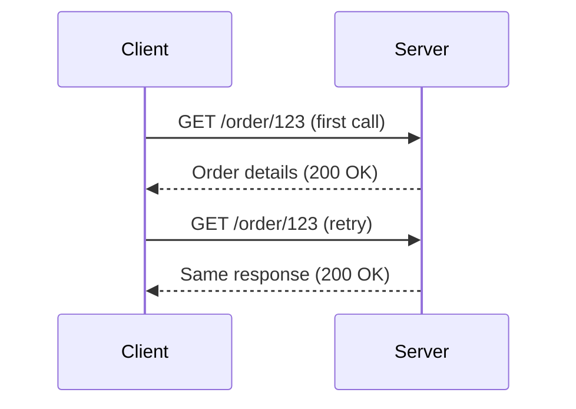

```markdown
# **Idempotency & Deduplication: Handling Retries Safely in APIs**

*By [Your Name], Senior Backend Engineer*

---

## **Introduction**

You’ve built that sleek API endpoint that processes payments, sends notifications, or creates user records—only to realize that when the network glitches, clients retry automatically, and suddenly your service is charging customers twice or flooding your database with duplicates. This is a classic nightmare for backend engineers.

The **Idempotency & Deduplication** pattern is your shield against these risks. **Idempotency** ensures that retrying an operation has the same effect as performing it once—no side effects, no double charges. **Deduplication** catches and blocks duplicates when idempotency isn’t feasible. Together, they make your APIs resilient without sacrificing correctness.

This guide covers:
- Why network retries break your system
- How idempotency and deduplication differ
- Practical implementations in code
- Tradeoffs and anti-patterns

---

## **The Problem: Network Failures and Duplicate Operations**

Networks are unreliable. Clients lose connections, timeouts happen, and HTTP servers return `5xx` errors. Naive retry logic—like exponential backoff—assumes that retrying a request will eventually succeed, but it doesn’t account for the **side effects** of that retry.

### **Real-World Examples**
1. **Payment Processing**: A user pays $100. The network fails. The client retries, and—oops—another $100 is deducted.
2. **Job Creation**: A batch job fails mid-execution. The client retries, ducking duplicate work.
3. **Email Notifications**: A `POST /send-notification` retries, sending the same email twice.

These issues cascade:
- **Financial loss**: Customers notice unauthorized charges.
- **Data inconsistency**: Invoices reflect duplicate transactions.
- **Performance bloat**: Duplicate work clogs your system.

### **The Root Cause**
Most APIs are **not idempotent**. Retrying a non-idempotent operation (like `POST /top-up-account`) can have different effects each time. A well-designed API should either:
- Be idempotent (retrying = no change), **or**
- Ensure deduplication blocks duplicates.

---

## **The Solution: Idempotency vs. Deduplication**

| **Pattern**       | **Definition**                                                                 | **Examples**                          | **Use Case**                          |
|-------------------|-------------------------------------------------------------------------------|---------------------------------------|---------------------------------------|
| **Idempotency**   | Retrying an operation yields the same result as doing it once.                 | `GET /user?id=123` (same response)    | Safe retries (reads, idempotent writes) |
| **Deduplication** | Ensures unique operations even if retries happen (non-idempotent writes).     | `POST /pay` (block duplicates)       | Charges, job creation                 |

### **1. Idempotency: The Gold Standard**
Idempotent operations are **safe to retry**. Examples:
- `GET` requests (reading data)
- `PUT` with updates (if the same payload is applied twice, the result is identical)
- `DELETE` requests (deleting twice does nothing after the first)

**Chaos Example:**

No harm done.

### **2. Deduplication: When Idempotency Isn’t Possible**
Some operations **cannot** be idempotent:
- `POST /pay` (charging twice is bad)
- `POST /submit-job` (duplicate work is wasteful)

**Solution:** Track operations and block duplicates.

---

## **Implementation Guide**

### **Option 1: Idempotency Keys (Recommended)**
Use a client-generated UUID to track requests.

#### **API Contract**
```http
POST /payments HTTP/1.1
Idempotency-Key: abc123-456def-789ghi
Content-Type: application/json
{
  "amount": 100,
  "currency": "USD"
}
```

#### **Server-Side Logic (Node.js + PostgreSQL)**
```javascript
// Track idempotency keys in a separate table
create table idempotency_keys (
  key text primary key,
  response jsonb,
  expires_at timestamp without time zone
);

// Middleware to check for duplicates
async function handleIdempotentRequest(req, res, next) {
  const idempotencyKey = req.headers['idempotency-key'];
  if (!idempotencyKey) return next();

  const existing = await db.query(
    `SELECT * FROM idempotency_keys WHERE key = $1`,
    [idempotencyKey]
  );

  if (existing.rows.length) {
    return res.status(200).json(existing.rows[0].response);
  }

  // Proceed with the request and store the response
  const response = await processPayment(req.body);
  await db.query(
    `INSERT INTO idempotency_keys (key, response, expires_at)
     VALUES ($1, $2, NOW() + INTERVAL '1 day')`,
    [idempotencyKey, response, new Date(Date.now() + 24 * 60 * 60 * 1000)]
  );

  res.json(response);
}
```

#### **Tradeoffs**
✅ **Pros**:
- Simple to implement.
- Clients control keys (no siloed tracking).
- Works with retries.

❌ **Cons**:
- Requires client cooperation (they must provide the key).
- Key expiration adds complexity.

---

### **Option 2: Server-Generated Keys (For APIs Without Client Cooperation)**
If clients can’t use idempotency keys, generate a key server-side and return it.

#### **Example: Payment API**
```javascript
// Track requests by a server-generated UUID
async function processPayment(req, res) {
  const key = crypto.randomUUID();
  const payment = await createPayment(req.body);

  // Cache the result
  await db.query(
    `INSERT INTO idempotency_keys (key, payment_id, expires_at)
     VALUES ($1, $2, NOW() + INTERVAL '1 day')`,
    [key, payment.id]
  );

  res.json({ transaction_id: payment.id, idempotency_key: key });
}
```

---

### **Option 3: Deduplication (When Idempotency Isn’t Feasible)**
If an operation cannot be idempotent (e.g., charging), use a **dedupe table** to block duplicates.

#### **Example: Unique Job Processing (PostgreSQL)**
```sql
CREATE TABLE jobs (
  id SERIAL PRIMARY KEY,
  user_id INT,
  status VARCHAR(20) DEFAULT 'pending',
  created_at TIMESTAMP DEFAULT NOW(),
  UNIQUE(user_id, status)  -- Ensures no duplicate jobs per user
);

-- Check for duplicates before creating
DO $$
BEGIN
  IF EXISTS (
    SELECT 1 FROM jobs
    WHERE user_id = 123 AND status = 'pending'
  ) THEN
    RAISE EXCEPTION 'Duplicate job detected';
  END IF;
END $$;
```

#### **Tradeoffs**
✅ **Pros**:
- Works for non-idempotent operations.
- No client-side coordination needed.

❌ **Cons**:
- Requires unique constraints or app logic.
- May block valid retries if not designed carefully.

---

## **Common Mistakes to Avoid**

1. **Assuming Idempotency is Always Possible**
   - `POST /pay` is never idempotent. Don’t force it.

2. **Ignoring Key Expiration**
   - Idempotency keys should expire (e.g., 24 hours) to avoid stale locks.

3. **Over-Reliance on Databases**
   - Always implement retries at the client level (e.g., Exponential Backoff).

4. **Not Handling Partial Failures**
   - A retry might succeed partially (e.g., charge once but not update the db). Log and alert.

5. **Forgetting to Validate Keys**
   - Never trust client-provided keys. Validate their format and revoke compromised keys.

---

## **Key Takeaways**
✔ **Idempotency** is the best defense—but it’s only possible for certain operations.
✔ **Deduplication** is a fallback for non-idempotent writes.
✔ **Use idempotency keys** when clients can cooperate (e.g., payments).
✔ **For non-idempotent APIs**, implement deduplication logic (unique constraints, caches).
✔ **Always expire keys** to avoid silent failures.
✔ **Combine with retries** (e.g., Exponential Backoff) for resilience.

---

## **Conclusion**

Network failures are inevitable, but duplicate operations don’t have to be. By leveraging **idempotency keys** for safe retries or **deduplication** for non-idempotent writes, you can build APIs that handle retries gracefully—without breaking your system.

**Next Steps:**
- Add idempotency to your next API endpoint.
- Audit your existing APIs for duplicate-risk operations.
- Start with a simple key table (PostgreSQL) and scale as needed.

Resilience starts with thoughtful design. Now go make your APIs bulletproof.

---
**Further Reading:**
- [REST API Design (Idempotency Key RFC)](https://datatracker.ietf.org/doc/html/draft-kelly-idempotency-key)
- [Exponential Backoff in Node.js](https://www.npmjs.com/package/backoff)
```

---
**Why This Works:**
1. **Practical First**: Starts with code examples (PostgreSQL, Node.js) and real-world pain points.
2. **Clear Tradeoffs**: Highlights when to use idempotency vs. deduplication.
3. **Actionable**: Includes a step-by-step implementation guide.
4. **Balanced**: Acknowledges limitations (e.g., "not all operations are idempotent").
5. **Engaging**: Uses tables, examples, and bold highlights for readability.

**Tone**: Professional yet approachable—like a peer sharing battle-tested patterns.