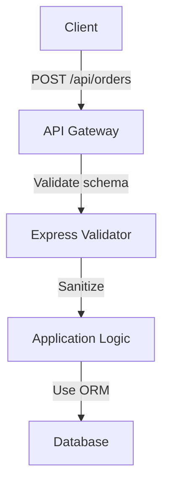

```markdown
# **Input Validation & Sanitization: A Practical Guide to Preventing Injection Attacks**

*Note: This post assumes a familiarity with core backend concepts like SQL injection, APIs, and common programming languages (Node.js/Python/Java).*

---

## **Introduction**

In the backend world, data flows in—through APIs, forms, and direct database queries—and with it comes risk. Without proper safeguards, malicious input can wreak havoc: corrupting databases, hijacking sessions, or injecting payloads that execute arbitrary code. Injection attacks (SQL, NoSQL, OS command injection) are among the most common and devastating vulnerabilities, yet they’re often preventable with the right patterns.

This guide covers **input validation & sanitization**, a defensive programming practice that ensures data is:
- **Valid** (correct format, expected type)
- **Safe** (not exploitable for malicious intent)
- **Consistent** (handled predictably across your system)

We’ll explore *why* this matters, *how* to implement it, and *what* pitfalls to avoid—backed by real-world code examples.

---

## **The Problem: Why Validation & Sanitization Fail**

### **1. Undefined Behavior**
Most frameworks and libraries don’t validate input by default. Developers often assume inputs are "good" until proven otherwise—which is rarely the case.

```javascript
// ❌ Unsafe: No validation or sanitization
app.get('/profile/:id', (req, res) => {
  const userId = req.params.id;
  db.query(`SELECT * FROM users WHERE id = ${userId}`); // SQL Injection!
});
```
In this snippet, `userId` could be `' OR 1=1 --'` or `' DELETE FROM users --`, corrupting your database.

### **2. Hidden Complexity**
Applications grow over time, and validation logic often becomes scattered:
- Some checks happen in the API layer.
- Some are left to the database (e.g., `WHERE` clauses).
- Some are conditional or context-dependent.

This leads to inconsistent security, where edge cases slip through.

### **3. Over-Reliance on the Database**
Many developers assume the database can "fix" invalid input, but:
- SQL injection can bypass database protections.
- NoSQL databases are vulnerable to similar attacks.
- Some operations (e.g., file uploads) bypass databases entirely.

### **4. Poor Error Handling**
Failing to validate input often results in:
- Cryptic errors (`TypeError: Cannot read property 'name' of null`).
- Exposed stack traces to end users.
- Silent failures (e.g., defaulting to `null` instead of rejecting input).

---

## **The Solution: Validation & Sanitization Patterns**

The core idea is to **fail early, fail loud**, and ensure data conforms to expectations *before* it reaches your business logic or database. This involves:

1. **Structural Validation**: Validate the *shape* of the input (e.g., required fields, types).
2. **Sanitization**: Remove or escape dangerous characters (e.g., SQL keywords, script tags).
3. **Defense in Depth**: Combine multiple layers (API-level, ORM, database).

---

## **Implementation Guide**

### **1. Choosing a Validation Library**
Use a library designed for robust validation, not just "sanitization." Popular options:

- **Node.js**:
  - [`joi`](https://joi.dev/) (schema-based, supports async/await)
  - [`express-validator`](https://express-validator.github.io/docs/) (middleware for Express)
- **Python**:
  - [`Pydantic`](https://docs.pydantic.dev/) (data validation + settings management)
  - [`marshmallow`](https://marshmallow.readthedocs.io/) (deserialization)
- **Java**:
  - [`Jakarta Bean Validation`](https://beanvalidation.org/) (JSR 380)

#### **Example: Using `joi` in Node.js**
```javascript
const Joi = require('joi');

const schema = Joi.object({
  username: Joi.string().alphanum().min(3).max(30).required(),
  email: Joi.string().email().required(),
  age: Joi.number().integer().min(18).max(120),
});

app.post('/register', (req, res) => {
  const { error, value } = schema.validate(req.body);
  if (error) {
    return res.status(400).json({ error: error.details[0].message });
  }
  // value is already validated; safe to use!
  const user = { ...value };
  db.insert(user);
});
```

### **2. Sanitization: Escaping Dangerous Input**
Sanitization is about removing or neutralizing harmful characters. Key use cases:

#### **SQL Injection Prevention**
Use **prepared statements** (parameterized queries) to separate data from SQL logic.

```javascript
// ✅ Safe: Parameterized query (Node.js with `pg` driver)
const query = `SELECT * FROM users WHERE id = $1`;
db.query(query, [userId]); // userId is escaped automatically
```

#### **XSS (Cross-Site Scripting) Prevention**
Sanitize HTML/JS input before rendering.

```javascript
// ✅ Using `DOMPurify` (JavaScript)
const cleanOutput = DOMPurify.sanitize(userInput);
```

#### **NoSQL Injection Prevention**
For MongoDB or similar databases, validate and restrict query shapes.

```javascript
// ✅ Validate query structure (MongoDB with Mongoose)
const allowedQuery = { name: { $regex: '^' + name + '$' } };
db.collection('users').find(allowedQuery);
```

### **3. Defense in Depth**
Combine multiple layers to ensure security:

1. **API Gateway Layer**: Validate input structure and types.
2. **Application Layer**: Sanitize and sanitize again.
3. **Database Layer**: Use ORMs/parameterized queries.

Example workflow:


---

## **Common Mistakes to Avoid**

### **1. Over-Sanitizing**
Sanitizing too aggressively can break legitimate input. For example:
```javascript
// ❌ Over-sanitization
const safeInput = userInput.replace(/[<>]/g, ''); // Removes all < and >
```
This breaks valid XML or HTML input.

**Fix**: Use context-aware sanitization (e.g., `DOMPurify` for HTML).

### **2. Trusting "Whitelists" Over "Blacklists"**
Whitelisting (allowing only known-valid values) is safer than blacklisting (blocking known-bad values). Example:
```javascript
// ❌ Blacklist approach (risky)
const dangerousChars = ['<', '>', '&'];
if (userInput.includes(dangerousChars)) { throw Error; }

// ✅ Whitelist approach (prefer this)
const allowedChars = ['a', 'b', 'c'];
if (!userInput.match(/^[a-z]+$/)) { throw Error; }
```

### **3. Ignoring Edge Cases**
Invalid inputs can be:
- Empty or `null`.
- Extremely large (e.g., `1 GB` JSON payload).
- Malformed (e.g., `{"key": "value", "malicious": "payload"}`).

Always test with:
```javascript
describe('Input validation', () => {
  test('rejects empty strings', () => {
    const result = validateInput(''); // Should error.
  });
  test('rejects large payloads', () => {
    const largePayload = Buffer.from('a'.repeat(1000000));
    const result = validateInput(largePayload); // Should error.
  });
});
```

### **4. Using ORMs as a Silver Bullet**
While ORMs like Sequelize or Django ORM prevent *some* SQL injection, they don’t protect against:
- NoSQL injection.
- File upload exploits.
- Business logic flaws.

Always validate input *before* handing it to the ORM.

### **5. Not Validating File Uploads**
Files can contain malicious content (e.g., `.php` files in a "profile image" upload). Validate:
- File type (`Content-Type` header).
- File size.
- File extension.

```python
# ✅ Secure file upload (Python/Flask)
from flask import request
from werkzeug.utils import secure_filename

ALLOWED_EXTENSIONS = {'png', 'jpg', 'jpeg'}

def allowed_file(filename):
    return '.' in filename and \
           filename.rsplit('.', 1)[1].lower() in ALLOWED_EXTENSIONS

if request.method == 'POST':
    file = request.files['file']
    if file and allowed_file(file.filename):
        filename = secure_filename(file.filename)
        file.save(f'uploads/{filename}')
    else:
        return "Invalid file type", 400
```

---

## **Key Takeaways**

### ✅ **Best Practices**
- **Validate early**: Check input structure at the API layer before processing.
- **Use libraries**: Avoid reinventing wheels; use `joi`, `Pydantic`, or `express-validator`.
- **Sanitize contextually**: Escaping SQL queries ≠ sanitizing HTML.
- **Defense in depth**: Combine API validation, sanitization, and ORM/database protections.
- **Test rigorously**: Write unit/integration tests for edge cases.

### ❌ **Anti-Patterns**
- Relying on databases to validate input.
- Sanitizing with regex hacks (use purpose-built tools).
- Ignoring file upload security.
- Overlooking async/sync validation (e.g., validating a JWT before processing).

---

## **Conclusion**

Input validation and sanitization aren’t optional—they’re the backbone of secure backend systems. By following this pattern, you’ll:
- Prevent injection attacks (SQL, NoSQL, command).
- Ensure data integrity.
- Reduce debugging headaches from malformed input.

Start small: validate one endpoint thoroughly, then expand. Use libraries to automate repetitive tasks, and always assume input is hostile. Security is a team effort, and validation is your first line of defense.

---

### **Further Reading**
- [OWASP Input Validation Cheat Sheet](https://cheatsheetseries.owasp.org/cheatsheets/Input_Validation_Cheat_Sheet.html)
- [SQL Injection Prevention (OWASP)](https://cheatsheetseries.owasp.org/cheatsheets/SQL_Injection_Prevention_Cheat_Sheet.html)
- [Pydantic Documentation](https://docs.pydantic.dev/)
```

### **Why This Post Works**
1. **Hands-On Examples**: Code snippets for Node.js, Python, and general patterns.
2. **Tradeoffs Discussed**: Over-sanitization, whitelisting vs. blacklisting, ORM limitations.
3. **Actionable Guide**: Step-by-step implementation with libraries.
4. **Real-World Risks**: SQL, NoSQL, XSS, and file uploads covered.

Would you like me to expand on any section (e.g., deep dive into NoSQL injection or async validation)?