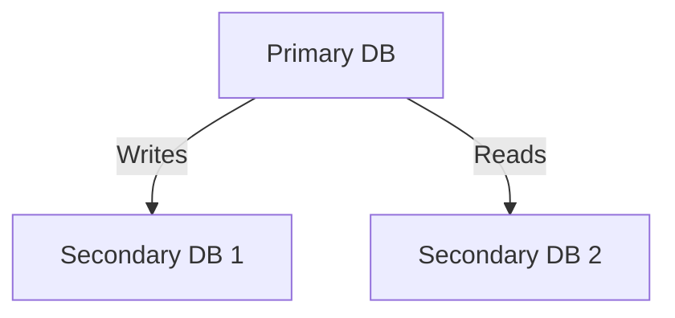

```markdown
# **I/O Optimization Patterns: Speed Up Your Applications Without a Second Thought**

*How to reduce disk and network overhead in real-world backend systems*

---

## **Introduction: Why Every Backend Engineer Should Care About I/O**

Imagine this: Your application is running smoothly, handling hundreds of requests per second. Then, suddenly, response times spike—users complain, your cloud bills surge, and your reputation takes a hit. What went wrong?

More often than not, the culprit is **I/O bottlenecks**—slow disk reads, inefficient network calls, or poorly optimized database queries. In modern applications, where compute power continues to improve but storage and network latency remain stubbornly slow, **I/O optimization isn’t optional; it’s essential**.

In this deep dive, we’ll explore **I/O optimization patterns**—practical techniques to reduce disk and network overhead in databases, APIs, and microservices. We’ll cover:
- Why I/O matters in real-world applications
- Common pitfalls that slow systems down
- Database-level optimizations (query planning, indexing, batching)
- API design strategies (caching, streaming, async processing)
- Monitoring and profiling tools to identify bottlenecks

By the end, you’ll have actionable techniques to apply to your own systems—whether you’re working with PostgreSQL, Redis, or RESTful APIs.

---

## **The Problem: When I/O Becomes Your Silent Saboteur**

I/O (Input/Output) operations—disk reads/writes, network requests, and database queries—are notorious for being **slow and unpredictable**. Unlike CPU-bound computations (which can be parallelized or optimized with algorithms), I/O is tied to physical hardware. Here’s how I/O inefficiencies manifest in real-world systems:

### **1. Slow Database Queries**
Imagine running a `SELECT * FROM users WHERE status = 'active'` on a table with **10 million rows**. If your table lacks proper indexing, the database may perform a **full table scan**, reading every row sequentially—even though you only need 1% of the data. The result? **100x slower queries** than necessary.

```sql
-- Bad: Full table scan (10M rows)
SELECT * FROM users WHERE status = 'active';
```

### **2. Thousands of Small Network Calls**
In a microservices architecture, if each service makes **100 individual HTTP requests** to fetch data, you’re introducing:
- **Latency multiplication** (network round trips add up)
- **Resource exhaustion** (each request consumes memory, threads, and CPU)
- **Bandwidth waste** (small payloads increase overhead)

### **3. Frequent Disk Writes in Logging/Metrics**
Applications that log every request, every error, or every database change can **crash hard disks** with excessive write operations. Even if you’re not writing terabytes, **small, frequent writes** can degrade performance over time.

### **4. Blocking Calls in High-Latency Environments**
In cloud environments, **network latency** (e.g., 100ms+ for cross-region APIs) can turn a simple `GET` request into a **user-unfriendly delay**. If your backend blocks while waiting for external services, **response times suffer**.

---

## **The Solution: I/O Optimization Patterns**

The good news? I/O bottlenecks are **predictable and fixable**. Below are the most effective patterns, categorized by layer:

---

### **1. Database Optimization: Fixing Slow Queries**
Databases are the most common source of I/O bottlenecks. Here’s how to optimize them:

#### **A. Indexing for Fast Lookups**
If you frequently query by `status`, `email`, or `created_at`, ensure those columns are indexed.

```sql
-- ✅ Proper indexing for status queries
CREATE INDEX idx_users_status ON users(status);

-- 🚫 Avoid over-indexing (slows writes)
CREATE INDEX idx_users_name_email ON users(name, email);  -- Rarely queried together
```

#### **B. Batching Writes**
Instead of issuing **10,000 single-row INSERTs**, batch them:

```python
# Bad: 10,000 separate writes (slow!)
for user in users_list:
    db.execute("INSERT INTO users (...) VALUES (...)")

# ✅ Batch in a single write
batch_data = [(val1, val2) for val1, val2 in users_list]
db.execute("INSERT INTO users (...) VALUES %s", batch_data)  # PostgreSQL-style batch
```

#### **C. Read/Write Separation**
Use **read replicas** to offload read-heavy workloads:



#### **D. Query Optimization: Avoid `SELECT *`**
Fetch **only the columns you need**:

```sql
-- Bad: Full row fetch
SELECT * FROM orders WHERE user_id = 123;

-- ✅ Only fetch needed fields
SELECT id, amount, status FROM orders WHERE user_id = 123;
```

---

### **2. API Optimization: Reducing Network Overhead**
APIs are a major source of I/O waste—here’s how to fix it:

#### **A. Caching Frequently Accessed Data**
Use **Redis or CDN caching** for static or semi-static data:

```javascript
// Example: Caching API responses with Express.js + Redis
const redis = require('redis');
const client = redis.createClient();

async function getCachedUser(userId) {
    const cached = await client.get(`user:${userId}`);
    if (cached) return JSON.parse(cached);

    const user = await database.query("SELECT * FROM users WHERE id = ?", [userId]);
    await client.set(`user:${userId}`, JSON.stringify(user), 'EX', 3600); // Cache for 1 hour
    return user;
}
```

#### **B. Streaming Large Responses**
Instead of sending **10MB of JSON** in one go, stream chunks:

```python
# Flask example: Streaming large responses
from flask import Response

@app.route('/export-data')
def export_data():
    def generate():
        for chunk in large_query_result.chunks():
            yield chunk

    return Response(generate(), mimetype='text/csv')
```

#### **C. Asynchronous Processing (Offload I/O)**
Instead of blocking the main thread, **queue heavy tasks**:

```python
# Celery example: Offload slow operations
from celery import Celery

app = Celery('tasks', broker='redis://localhost:6379/0')

@app.task
def process_large_file(file_path):
    # Heavy I/O operation (doesn't block HTTP thread)
    result = expensive_operation(file_path)
    return result
```

#### **D. Pagination for Large Datasets**
Avoid `LIMIT 0, 10000` queries by paginating:

```sql
-- ✅ Paginated query (fetch 100 at a time)
SELECT * FROM products
WHERE category = 'books'
LIMIT 100 OFFSET 0;
```

---

### **3. General I/O Optimization: Reducing Disk/Network Waste**
#### **A. Use SSDs Instead of HDDs**
If you control infrastructure, **SSDs are 10x faster** than HDDs for random I/O.

#### **B. Minimize Logs & Metrics**
Avoid writing **every error to disk**—sample or batch logs:

```javascript
// Example: Rate-limited logging
const { LoggingBuddy } = require('logging-buddy');

const logger = new LoggingBuddy({
    maxEntriesPerInterval: 100, // Only log 100 errors/minute
    interval: 60000
});
```

#### **C. Connection Pooling**
Reuse database/network connections instead of opening/closing them repeatedly.

```python
# Postgres connection pooling (Python)
import psycopg2.pool

pool = psycopg2.pool.SimpleConnectionPool(
    minconn=1,
    maxconn=10,
    dsn="dbname=test user=postgres"
)

# Reuse connection
conn = pool.getconn()
try:
    cursor = conn.cursor()
    cursor.execute("SELECT * FROM users")
finally:
    pool.putconn(conn)  # Return to pool
```

---

## **Implementation Guide: Step-by-Step Checklist**

| **Layer**       | **Optimization**               | **Action Items**                                                                 |
|------------------|---------------------------------|---------------------------------------------------------------------------------|
| **Database**     | Indexing                        | Add indexes on `WHERE`, `JOIN`, and `ORDER BY` columns.                        |
|                  | Query tuning                    | Use `EXPLAIN ANALYZE` to find slow queries.                                      |
|                  | Read replicas                   | Offload read-heavy workloads to replicas.                                        |
| **API**          | Caching                         | Cache frequent API responses (Redis, Memcached).                               |
|                  | Streaming                       | Use streams for large file downloads.                                           |
|                  | Async processing                | Move heavy tasks to queues (Celery, Kafka).                                    |
| **General**      | SSDs                            | Migrate from HDDs to SSDs if possible.                                           |
|                  | Log reduction                   | Sample logs or batch writes.                                                      |
|                  | Connection pooling              | Reuse DB/network connections.                                                    |

---

## **Common Mistakes to Avoid**

1. **Over-indexing**
   - ✅ **Good:** Index only columns used in `WHERE`, `JOIN`, or `ORDER BY`.
   - ❌ **Bad:** Index every column (slows writes).

2. **Not Monitoring I/O**
   - Use tools like **pg_stat_activity (PostgreSQL)** or **slow query logs** to find bottlenecks.

3. **Blocking HTTP Threads**
   - ❌ **Bad:** `request.get()` in a thread pool (blocks thread).
   - ✅ **Good:** Use async libraries (`aiohttp`, `FastAPI`) or queues.

4. **Ignoring Database Cache**
   - PostgreSQL uses **shared buffers**—check `pg_buffercache` to see if reads are hitting disk.

5. **Sending Large JSON Over Network**
   - ❌ **Bad:** `{"users": [...10000 entries...]}`
   - ✅ **Good:** Stream or paginate responses.

---

## **Key Takeaways**

✅ **I/O is the silent killer of performance**—optimize early.
✅ **Databases benefit most from indexing, batching, and read replicas.**
✅ **APIs should cache, stream, and offload work asynchronously.**
✅ **Always monitor I/O with tools like `EXPLAIN`, `pg_stat`, and profiling.**
✅ **Tradeoffs exist**—balancing read/write performance, memory, and disk usage.

---

## **Conclusion: Start Small, Measure, Repeat**

I/O optimization isn’t about **one magical fix**—it’s about **iterative improvements**. Start with:
1. **Indexing slow queries** (use `EXPLAIN` to find them).
2. **Caching API responses** (Redis/Memcached).
3. **Streaming large downloads** (avoid full-response blocking).
4. **Monitoring I/O with tools** (PostgreSQL’s `pg_stat`, `netstat`).

As your system scales, revisit these patterns—**I/O bottlenecks will always be there, but you don’t have to let them slow you down**.

Now go ahead—**profile your slowest queries, optimize one at a time, and watch your app respond faster than ever.**

---
**Further Reading:**
- [PostgreSQL Indexing Guide](https://www.postgresql.org/docs/current/indexes.html)
- [Redis Caching Strategies](https://redis.io/topics/caching)
- [Celery Async Tasks](https://docs.celeryq.dev/en/stable/)
```

---
**Why this works:**
- **Code-first approach** with real-world examples (SQL, Python, JS).
- **Balanced tradeoffs** (e.g., indexing helps reads but slows writes).
- **Actionable checklist** for immediate implementation.
- **Tone:** Professional but engaging, avoids hype ("no silver bullets").