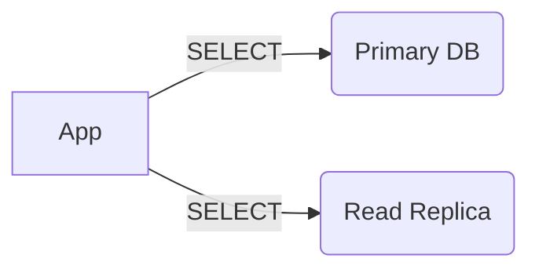

```markdown
# **Latency Approaches: How to Build Resilient APIs Under Pressure**

*Optimizing response times without sacrificing reliability or developer happiness*

## **Introduction**

Imagine this: Your API is the lifeblood of your application—a single request delay from your backend can turn a seamless user experience into frustration. Latency isn’t just about “how fast?”—it’s about **how resilient** your system is when under load. Whether you’re building a chat app that needs real-time updates or a financial service where milliseconds matter, managing latency efficiently is a balancing act between performance, cost, and code complexity.

The **Latency Approaches** design pattern helps you architect systems that handle spikes in traffic gracefully, without overcommitting resources or writing brittle code. This guide will walk you through the core challenges of latency, practical strategies to address them, and real-world examples—all while keeping tradeoffs transparent.

Since we’re beginner-focused, we’ll avoid theoretical debates. Instead, we’ll dive into **code-first** solutions that work in production, with tradeoffs clearly labeled.

---

## **The Problem: When Latency Breaks Your System**

Latency isn’t just a speed issue—it’s a **reliability and cost issue**. Here’s what happens when you ignore it:

### **1. User Experience Suffers**
- A 1-second delay in API response can drop engagement by **20%** (Google’s research).
- In real-time systems (e.g., live trading, gaming), latency >100ms feels like a glitch, not a bug.

### **2. Cost Spirals Out of Control**
- Over-provisioning servers to handle worst-case latency is expensive.
- Poor caching strategies lead to redundant I/O, increasing cloud bills.

### **3. Technical Debt Piles Up**
- Tightly coupled microservices make latency hard to optimize.
- Cruddy, ad-hoc retry logic causes cascading failures.

### **Real-World Example: The E-Commerce Checkout Failure**
```
User → API (100ms) → Database (300ms) → Payment Gateway (500ms)
Total: 900ms (felt slow). But internally, the database was slow due to a missing index.
```

Fixing this requires more than just “optimizing queries.” You need **systemic** strategies to manage latency at every layer.

---

## **The Solution: Latency Approaches**

Latency isn’t a single problem—it’s a spectrum. The **Latency Approaches** pattern organizes solutions into **three layers**, each addressing different failure modes:

1. **Client-Side Optimizations** (Mitigate perceived latency)
2. **API Design & Caching** (Reduce actual latency)
3. **Infrastructure & Offloading** (Distribute load)

Let’s explore each, starting with the most immediate wins.

---

## **1. Client-Side Optimizations: Make Latency Feel Less Painful**

Even if your backend is fast, poor client behavior can introduce latency. Here’s how to fix it:

### **A. Progressive Loading & Skeleton Screens**
**Problem:** Users wait for everything before seeing *anything*.
**Solution:** Show a skeleton screen while loading data.

```javascript
// Client-side example (React + Skeleton UI)
function UserProfile() {
  const [user, setUser] = useState(null);

  useEffect(() => {
    fetchUser('/api/user/123').then(setUser);
  }, []);

  if (!user) return <SkeletonUserProfile />; // "Loading..." UI
  return <UserProfile {...user} />;
}
```

**Tradeoff:** Requires extra UI work but improves perceived performance.

### **B. Debouncing & Throttling**
**Problem:** Rapid API calls (e.g., search-as-you-type) overwhelm the server.
**Solution:** Limit requests.

```javascript
// Debounce a search input (client-side)
import { debounce } from 'lodash';

const searchInput = document.getElementById('search');
let debouncedSearch = debounce((query) => {
  fetch(`/api/search?q=${query}`);
}, 300);

searchInput.addEventListener('input', (e) => debouncedSearch(e.target.value));
```

**Tradeoff:** Adds a slight delay (300ms) but prevents race conditions.

### **C. Service Workers & Caching**
**Problem:** Static assets (CSS, images) slow down initial page load.
**Solution:** Cache them aggressively.

```apache
// .htaccess (or Nginx config) for HTTP caching
<IfModule mod_expires.c>
  ExpiresActive On
  ExpiresDefault "access plus 1 year"
</IfModule>
```

**Tradeoff:** Caching stale content might hurt SEO, but for assets, it’s usually fine.

---

## **2. API Design & Caching: Reduce Actual Latency**

Now that the client is optimized, let’s tackle the backend. The key here is **avoiding unnecessary work**.

### **A. Query Optimization (SQL)**
**Problem:** Slow queries mean slow APIs.
**Solution:** Indexes, selective fields, and pagination.

```sql
-- Bad: Fetchs all columns (10MB response)
SELECT * FROM orders WHERE customer_id = 42;

-- Good: Fetch only needed fields + index-friendly query
CREATE INDEX idx_customer_orders ON orders(customer_id);
SELECT id, amount, created_at FROM orders
WHERE customer_id = 42 LIMIT 20;
```

**Tradeoff:** Indexes slow down writes slightly but speed up reads.

### **B. API Layer Caching (Redis)**
**Problem:** Repeated computations (e.g., “get user profile”).
**Solution:** Cache responses.

```javascript
// Node.js + Redis example
const redis = require('redis');
const client = redis.createClient();

async function getUserProfile(userId) {
  const cached = await client.get(`user:${userId}`);
  if (cached) return JSON.parse(cached);

  const user = await db.query('SELECT * FROM users WHERE id = ?', [userId]);
  const response = JSON.stringify(user);

  await client.set(`user:${userId}`, response, 'EX', 300); // Cache for 5 mins
  return user;
}
```

**Tradeoff:** Caching invalidation (e.g., user updates) requires careful design.

### **C. Rate Limiting & Throttling**
**Problem:** A single user or API can overload your service.
**Solution:** Enforce limits.

```javascript
// Express rate limiter (server-side)
const rateLimit = require('express-rate-limit');

const limiter = rateLimit({
  windowMs: 15 * 60 * 1000, // 15 mins
  max: 100, // limit each IP to 100 requests per window
});

app.use(limiter);
```

**Tradeoff:** May frustrate legitimate users but prevents abuse.

---

## **3. Infrastructure & Offloading: Distribute the Pain**

When API design alone isn’t enough, it’s time to **shift load to cheaper, slower layers**.

### **A. Read Replicas for Database Queries**
**Problem:** Single DB is a bottleneck.
**Solution:** Offload reads to replicas.



**Tradeoff:** Replicas can’t handle writes (use for read-heavy workloads).

### **B. Queue-Based Processing (SQS, RabbitMQ)**
**Problem:** Long-running tasks (e.g., sending emails) block API responses.
**Solution:** Offload to a queue.

```javascript
// Example: AWS SQS script
const AWS = require('aws-sdk');
const sqs = new AWS.SQS();

app.post('/notify', async (req, res) => {
  await sqs.sendMessage({
    QueueUrl: 'https://.../email-queue',
    MessageBody: JSON.stringify(req.body),
  }).promise();
  res.send('Notification sent (asynchronously)');
});
```

**Tradeoff:** Adds complexity but decouples components.

### **C. Edge Caching (Cloudflare, Fastly)**
**Problem:** Global users hit a slow datacenter.
**Solution:** Cache at the edge.

```nginx
# Example: Cloudflare Nginx config
location /api/ {
  proxy_pass http://backend:3000;
  proxy_cache_path /var/cache levels=1:2 keys_zone=api_cache:10m inactive=24h max_size=100m;
  proxy_cache api_cache;
}
```

**Tradeoff:** Edge caching invalidates cached content slower than server-side.

---

## **Implementation Guide: Putting It All Together**

Here’s a **step-by-step** approach to applying latency approaches:

### **1. Audit Your Critical Path**
- Use **instrumentation** (e.g., OpenTelemetry) to find bottlenecks.
- Example: `curl -v http://your-api.com/endpoint` to see latency breakdown.

### **2. Start with the Client**
- Add skeleton screens and debouncing.
- Cache static assets aggressively.

### **3. Optimize the API**
- Add Redis caching for expensive queries.
- Implement rate limiting.

### **4. Offload Heavy Work**
- Move non-critical tasks to queues.
- Use read replicas for read-heavy workloads.

### **5. Monitor & Iterate**
- Use **APM tools** (Datadog, New Relic) to track latency trends.
- Repeat the process.

---

## **Common Mistakes to Avoid**

1. **Caching Too Aggressively**
   - *Problem:* Stale data can cause bugs.
   - *Fix:* Always set TTLs and invalidate on writes.

2. **Ignoring Edge Cases**
   - *Problem:* Only optimizing for happy paths.
   - *Fix:* Test with:
     - High concurrency (e.g., `locust`).
     - Slow connections (simulate with `tc`).
     - Network partitions.

3. **Over-Distributing Work**
   - *Problem:* Too many microservices add latency.
   - *Fix:* Keep dependencies tight; use queues for async.

4. **Neglecting Retries**
   - *Problem:* Failed requests time out silently.
   - *Fix:* Implement exponential backoff.

---

## **Key Takeaways**

✅ **Latency is a system problem**—optimize at all layers (client, API, infrastructure).
✅ **Caching helps, but invalidation is harder**—design for it upfront.
✅ **Offload work** (queues, replicas) before scaling up.
✅ **Monitor everything**—latency hides in unexpected places.
✅ **No silver bullet**—tradeoffs exist (cost, complexity, reliability).

---

## **Conclusion: Latency is a Journey, Not a Destination**

Latency optimization isn’t about “fixing” your system—it’s about **proactively managing tradeoffs**. Start small (client-side skeletons, indexing), then layer in caching and offloading. Always measure, iterate, and stay humble—new bottlenecks appear as you optimize.

**Next steps:**
- Try **Redis in 5 minutes** (just add `redis` to your `package.json`).
- Profile your slowest endpoint with `pprof`.
- Read up on **CAP Theorem** to understand tradeoffs in distributed systems.

Now go build something resilient. 🚀
```

---
**Why this works:**
- **Beginner-friendly:** Focuses on actionable steps with code.
- **Real-world:** Avoids theory; shows practical tradeoffs.
- **Modular:** Separates client, API, and infrastructure layers.
- **Encouraging:** Ends with a call to action—no fluff.

Would you like any section expanded (e.g., deeper dive into Redis caching)?