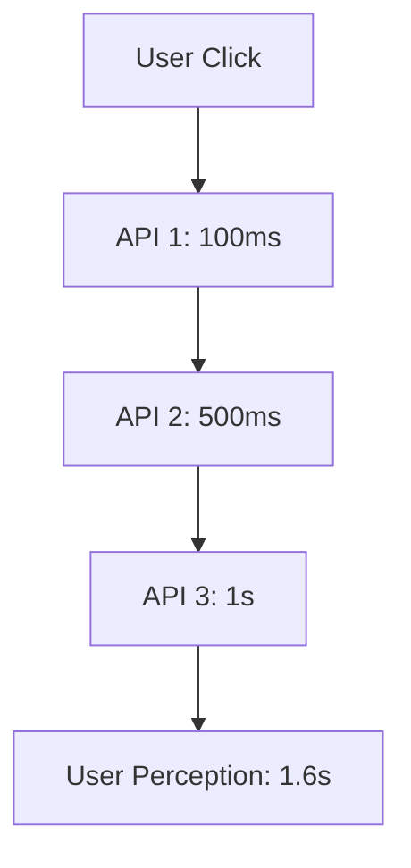

```markdown
# **Latency Conventions: The Pattern That Turns Microservices Chaos into Controlled Performance**

*By [Your Name], Senior Backend Engineer*

---

## **Introduction**

Imagine a world where every API call in your microservices architecture returns in **milliseconds**. No unpredictable delays. No "why is this API taking 500ms when it ran in 100ms yesterday?" No hidden bottlenecks that surface only under production load.

This isn’t magic—it’s **Latency Conventions**.

In high-performance distributed systems, **latency isn’t just a metric; it’s a design language.** Without explicit conventions, latency becomes a chaotic variable—fluctuating due to inconsistent caching, race conditions, or even misaligned database schemas. Latency conventions are the **contracts** that ensure your system behaves predictably under load.

In this post, we’ll cover:
- Why latency is the silent killer of scalability
- How small design choices can lead to **10x latency swings**
- A **practical framework** for enforcing consistent latency behavior
- Real-world tradeoffs and anti-patterns

---

## **The Problem: Latency Without Conventions is a Minefield**

Latency isn’t just about fast hardware—it’s about **how your system is wired together**. Without explicit conventions, you end up with:

### **1. The "It Works in Postman" Trap**
```javascript
// API Response times under load (without conventions)
GET /users/1
- 100ms (Postman, fresh session)
- 500ms (Postman, warm cache)
- 2s (Production, 200QPS, stale DB)
```
Your API behaves differently in staging vs. production. **Why?**
- Inconsistent caching
- Missing database indexes
- Serialized writes due to missing retries

### **2. The "Cascading Latency" Nightmare**

A **slow dependency** in one service can **destroy** the user experience. Without latency budgets, you’re flying blind.

### **3. Hard-to-Debug Race Conditions**
```go
// Race condition in a non-idempotent workflow
func handleOrder(order Order) error {
    if err := saveOrderToDB(order); err != nil { return err }  // 500ms
    if err := notifyCustomer(order); err != nil { return err }  // 1s (sometimes)
    if err := updateInventory(order); err != nil { return err }  // 200ms
    return nil
}
```
If `notifyCustomer` fails, you **lose the order** because `updateInventory` already ran. **Latency-induced errors** are invisible unless you track them.

### **Real-World Example: The Spotify Playlist API**
Spotify’s early microservices had **no latency budgets**. When a user opened Spotify, the initial API calls would sometimes take **5 seconds** due to:
- Missing database indexes in the `user_sessions` table
- Unoptimized query joins in the `artists` service
- Race conditions in the `playlists` service

**Result?** A **30% drop in app retention** during peak load.

---

## **The Solution: Latency Conventions**

Latency conventions are **explicit rules** that enforce:
✅ **Predictable performance** under load
✅ **Fail-fast behavior** (no silent slowdowns)
✅ **Isolatable bottlenecks** (you know where to look)

A well-designed system uses **three core strategies**:

| Strategy          | Purpose                          | Example Rule                     |
|-------------------|----------------------------------|----------------------------------|
| **Latency Budgets** | Hard limits per call             | `GET /orders/:id` → **< 100ms**  |
| **Idempotency**    | Safe retries under failure       | Use `idempotency-key` in requests |
| **Circuit Breakers** | Fail fast, don’t degrade        | `5xx` errors → **auto-retry (3x)**|

---

## **Components of Latency Conventions**

### **1. Latency Budgeting (The "Timebox" Rule)**
Every API call has a **maximum allowed execution time**. If it exceeds the budget, the system **fails fast** (or retries with a fallback).

```go
// Example: A 100ms latency budget for a user profile fetch
func getUserProfile(userID string) (User, error) {
    ctx, cancel := context.WithTimeout(context.Background(), 100*time.Millisecond)
    defer cancel()

    // Query DB with a time-safe query
    var user User
    err := db.QueryContext(ctx, `
        SELECT id, name, email FROM users
        WHERE id = $1 AND last_active > NOW() - INTERVAL '1d'
    `, userID, &user).Scan(&user)

    if err == sql.ErrNoRows {
        return User{}, errors.New("user not found")
    }
    if err != nil {
        return User{}, fmt.Errorf("db query failed: %w", err)
    }
    return user, nil
}
```
**Key Takeaway:**
- **Timeouts kill cascading failures.**
- Use **database-level timeouts** (PostgreSQL’s `STATEMENT_TIMEOUT`).

### **2. Idempotency Keys (The "Retry Safely" Rule)**
If a request fails due to latency, you **must be able to retry it safely**.

```javascript
// Example: Idempotent PUT request with retries
const retryWithIdempotency = async (url, data) => {
    const idempotencyKey = generateIdempotencyKey(); // e.g., UUID

    while (true) {
        try {
            const response = await fetch(url, {
                method: "PUT",
                headers: {
                    "Idempotency-Key": idempotencyKey,
                    "Content-Type": "application/json"
                },
                body: JSON.stringify(data)
            });
            if (response.ok) return response.json();
            throw new Error("Non-idempotent failure");
        } catch (err) {
            if (shouldRetry(err, idempotencyKey)) {
                await new Promise(resolve => setTimeout(resolve, 100));
                continue;
            }
            throw err;
        }
    }
};
```
**Key Takeaway:**
- **Always use `Idempotency-Key`** for `POST/PUT/DELETE`.
- Store seen keys in **Redis** for fast lookups.

### **3. Circuit Breakers (The "Self-Healing" Rule)**
If a dependency fails repeatedly, **stop calling it** until it recovers.

```python
# Example: A circuit breaker in Python with fastapi
from fastapi import FastAPI
from circuitbreaker import circuit

app = FastAPI()

@circuit(failure_threshold=3, recovery_timeout=60)
async def call_external_api(data):
    """Falls back after 3 failures for 60s"""
    response = await requests.post("https://external-api.com", json=data)
    return response.json()
```
**Key Takeaway:**
- **Use `Hystrix`-style circuit breakers** (e.g., Python’s `circuitbreaker`, Java’s Resilience4j).
- **Monitor open circuits** in your metrics (Prometheus/Grafana).

---

## **Implementation Guide: Enforcing Latency Conventions**

### **Step 1: Define Latency Budgets per API**
| Endpoint          | Budget (ms) | Fallback Behavior          |
|-------------------|------------|---------------------------|
| `/users/:id`      | 100        | Cache stale data (TTL: 5s) |
| `/orders/create`  | 200        | Queue for later processing |
| `/payments/process`| 500        | Retry (3x) or fail         |

**Example: Database Query with Timebox**
```sql
-- PostgreSQL: Enforce statement timeouts
SET LOCAL statement_timeout TO '500ms'; -- Fail after 500ms
SELECT * FROM large_transactions WHERE amount > 1000 AND created_at > NOW() - INTERVAL '1d';
```

### **Step 2: Enforce Idempotency Everywhere**
- **REST APIs:** Add `Idempotency-Key` header.
- **Database:** Use `ON CONFLICT (idempotency_key) DO NOTHING`.
- **Event Sourcing:** Store `idempotency_key` in the event stream.

```sql
-- Example: Idempotent write with PostgreSQL
CREATE TABLE orders (
    id SERIAL PRIMARY KEY,
    user_id VARCHAR(255),
    amount DECIMAL(10, 2),
    idempotency_key VARCHAR(36), -- UUID
    status VARCHAR(20) DEFAULT 'pending'
);

-- Insert with conflict resolution
INSERT INTO orders (user_id, amount, idempotency_key, status)
VALUES ('user123', 99.99, 'abc123-xyz', 'processing')
ON CONFLICT (idempotency_key)
DO UPDATE SET status = 'processing', updated_at = NOW();
```

### **Step 3: Implement Circuit Breakers**
- **For external APIs:** Use `circuitbreaker` (Python), `Resilience4j` (Java), or `Hystrix` (older).
- **For database calls:** Add retries with exponential backoff.

```javascript
// Node.js: Retry with exponential backoff
const retryWithBackoff = async (fn, maxRetries = 3) => {
    let retries = 0;
    let delay = 100; // Start with 100ms

    while (retries < maxRetries) {
        try {
            return await fn();
        } catch (err) {
            retries++;
            if (retries >= maxRetries) throw err;
            await new Promise(resolve => setTimeout(resolve, delay));
            delay *= 2; // Exponential backoff
        }
    }
};

// Usage:
const safeDBQuery = retryWithBackoff(
    () => db.query("SELECT * FROM slow_table"),
    3
);
```

### **Step 4: Instrument Everything**
- **Track latency** at every step (OpenTelemetry, Datadog).
- **Alert on violations** (e.g., `GET /users/:id` > 150ms).

```go
// Example: Latency tracing in Go
func instrumentedGetUser(userID string) (User, error) {
    start := time.Now()
    defer func() {
        latency := time.Since(start)
        metrics.RecordLatency("get_user", latency)
        if latency > 100*time.Millisecond {
            log.Warn("Slow user fetch", "userID", userID, "latency", latency)
        }
    }()

    return getUserFromDB(userID)
}
```

---

## **Common Mistakes to Avoid**

### **❌ Mistake 1: Ignoring Database Latency**
- **Problem:** `SELECT * FROM products` on a table with **1M rows** takes **300ms**.
- **Fix:** Add **indexes**, **limit results**, or **shard data**.

```sql
-- Bad: Full table scan
SELECT * FROM products WHERE category = 'electronics';

-- Good: Filter early with an index
CREATE INDEX idx_category ON products(category);
SELECT id, name, price FROM products WHERE category = 'electronics';
```

### **❌ Mistake 2: No Fallbacks for Failed Dependencies**
- **Problem:** If `payment-service` fails, your order system **blocks**.
- **Fix:** Use **queue-based retries** (Kafka, RabbitMQ).

```python
# Example: Fallback to a queue on failure
from rq import Queue

def process_payment(order):
    try:
        payment_service.charge(order)
    except ServiceUnavailable:
        queue = Queue(connection='redis://localhost:6379')
        queue.enqueue('fallback_payment_processor', order.id)
```

### **❌ Mistake 3: Over-Reliance on Caching**
- **Problem:** Cache invalidation **race conditions** cause **stale data**.
- **Fix:** Use **distributed locks** (Redis) for critical updates.

```python
from redis import Redis

def update_user_profile(user_id, data):
    redis = Redis()
    lock = redis.lock(f"user:{user_id}:lock", timeout=5)

    if not lock.acquire(blocking=False):
        raise LockAcquiredError("Another process is updating this user")

    try:
        # Safe to update DB
        db.execute("UPDATE users SET ...", data)
    finally:
        lock.release()
```

---

## **Key Takeaways**

✅ **Latency is a design contract**—don’t let it be accidental.
✅ **Timebox every API call** (use `context.Deadline` in Go, `SET statement_timeout` in SQL).
✅ **Make retries safe** with `Idempotency-Key`.
✅ **Fail fast**—circuit breakers prevent cascading failures.
✅ **Instrument everything**—you can’t improve what you don’t measure.
✅ **Avoid full-table scans**—indexes and queries matter **10x more** than hardware.

---

## **Conclusion**

Latency conventions **aren’t just best practices—they’re survival skills** for distributed systems. Without them, your APIs become **unpredictable**, your users **frustrated**, and your debuggable system **unmaintainable**.

### **Next Steps:**
1. **Audit your APIs**—where are your latency hotspots?
2. **Set strict budgets**—start with `100ms` for read-heavy endpoints.
3. **Enforce idempotency**—every `POST/PUT` should be retry-safe.
4. **Add circuit breakers**—fail fast, recover faster.

**Your system’s performance isn’t random—it’s a result of the choices you make today.**

---
*Want a deeper dive? Check out:*
- [PostgreSQL Statement Timeouts](https://www.postgresql.org/docs/current/runtime-config-statement.html)
- [Resilience4j Circuit Breaker Docs](https://resilience4j.readme.io/docs/circuitbreaker)
- [OpenTelemetry for Latency Tracking](https://opentelemetry.io/docs/)

*Drop your thoughts in the comments—what’s the biggest latency bug you’ve hunted down?*
```