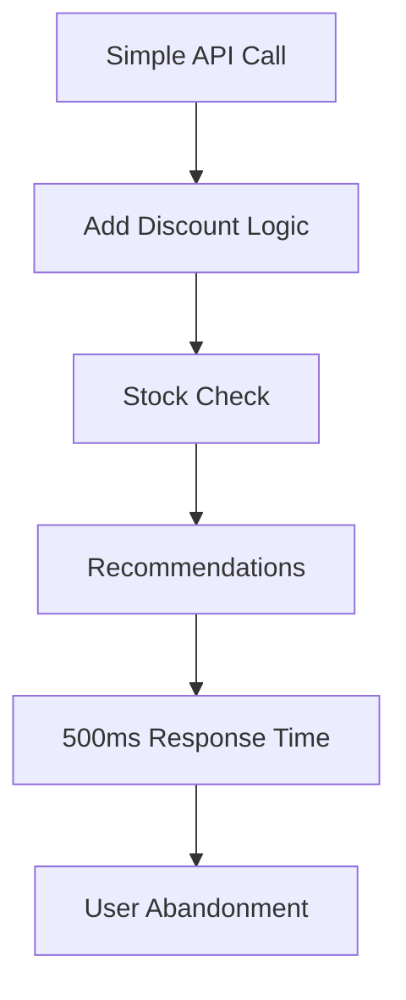

```markdown
---
title: "Latency Guidelines: The Pattern That Saves Your API from Slow Death"
date: "2023-10-15"
author: "Jane Doe"
draft: false
tags: ["backend", "performance", "api", "database", "design", "patterns"]
---

# Latency Guidelines: The Pattern That Saves Your API from Slow Death

Performance is the silent killer of user satisfaction. A slow API response can turn a seamless experience into a frustrating journey, causing users to abandon your service—even before they see your great UI or compelling features. But what if there was a simple, yet powerful way to tackle this issue systematically?

Enter **Latency Guidelines**. This isn’t just another performance tuning trick; it’s a structured approach to defining, tracking, and improving response times across your API and database layers. By setting clear expectations for how long operations should take, you can catch performance issues early, prioritize fixes, and ensure a consistently smooth experience for your users.

In this post, we’ll explore why latency guidelines matter, how they solve real-world problems, and how to implement them in your next project—with practical code examples and honest tradeoffs.

---

## The Problem: When Latency Goes Rogue

Let’s start with a scenario you’ve probably seen before. You launch a feature that seems “fast enough” in your local environment or staging. Users report that some API endpoints are slow, but the issue feels vague: *"It’s sluggish, but not consistently."*

Here’s why this happens:

1. **Uncontrolled Complexity**: APIs grow organically. Over time, you add more layers—caching, external services, or business logic—and suddenly, a simple `user.fetch()` call starts making 10 network requests and hitting 3 databases.
2. **Silent Latency Spikes**: Without clear targets, you don’t notice when an operation takes 100ms vs. 1000ms until users complain. By then, it’s often too late.
3. **Technical Debt Accumulation**: Teams add "quick fixes" (like brittle caching) or skip optimizations because there’s no baseline to measure against. Before you know it, a feature that was once snappy feels like crawling through molasses.
4. **User Experience (UX) Collapse**: Even if your app’s UI is smooth, a slow API response means delays in rendering content, loading spinners, or—worst of all—no feedback at all. Users don’t care why something is slow; they just leave.

### Real-World Example: The Checkout Cart
Picture an e-commerce API where users add items to their cart. Initially, the API response time is 50ms. Over time, you add:
- Discount logic (adds a SQL JOIN).
- Stock availability checks (external HTTP call).
- Recommendations (another API call).

Now the same operation takes **500ms**—slow enough to make users abandon their cart. But how do you know when things start going wrong? Without latency guidelines, you’re flying blind.



---

## The Solution: Latency Guidelines

Latency guidelines are **time-based targets** for how long an operation should take, broken down by:
- **Critical Path**: The slowest operation in a sequence.
- **Component**: Database queries, API calls, or caching layers.
- **Context**: User behavior (e.g., "95% of cold-start responses must be under 100ms").

They’re not about punishing slow code; they’re about **proactively avoiding slowdowns**. Here’s how they work:

1. **Define Thresholds**: Set targets for "good," "warning," and "critical" latency (e.g., <100ms, <500ms, >1s).
2. **Monitor Consistently**: Log and alert on deviations.
3. **Design Around Guidelines**: Structure code to hit these targets.
4. **Iterate**: Refactor or optimize when thresholds are breached.

### Why It Works
- **Early Warnings**: Catch latency issues in development *before* they reach production.
- **Focused Improvements**: Prioritize fixes where they matter most (e.g., a 500ms query vs. a 10ms cache miss).
- **Scalability**: Ensures your API stays performant as traffic grows.

---

## Components/Solutions: Building Your Guidelines

Latency guidelines aren’t a one-size-fits-all solution. You’ll need a mix of tools and practices:

| Component          | Purpose                                                                 |
|--------------------|-------------------------------------------------------------------------|
| **Latency Budgets** | Allocate time slices to each component (e.g., DB: 80ms, External APIs: 100ms). |
| **Monitoring**      | Track response times in production (e.g., Prometheus, Datadog).          |
| **Caching**        | Reduce repeated work (e.g., Redis, CDN).                               |
| **Asynchronous Work** | Offload heavy tasks (e.g., background jobs, queues).                    |
| **Database Design** | Optimize queries (indexes, denormalization).                           |
| **API Design**     | Use pagination, streaming, or graphQL for large datasets.               |

---

## Code Examples: Latency Guidelines in Action

Let’s walk through a practical example: an API that fetches a user’s profile with their orders.

### Problem: Uncontrolled Latency
```javascript
// ❌ Monolithic fetch (latency unknown)
async function getUserProfile(userId) {
  const user = await User.findById(userId); // ~50ms
  const orders = await Order.findAll({ where: { userId } }); // ~200ms
  return { user, orders }; // 250ms total (but what if orders are slow?)
}
```
This could easily exceed 500ms if `orders` takes longer.

### Solution: Latency Guidelines
1. **Set Budgets**:
   - `User.findById`: ≤100ms
   - `Order.findAll`: ≤200ms
   - Total: ≤300ms

2. **Enforce with Async/Await and Timeouts**:
```javascript
// ✅ Latency-budgeted fetch
async function getUserProfile(userId) {
  // User fetch (must complete within 100ms)
  const user = await Promise.race([
    User.findById(userId),
    new Promise(resolve => setTimeout(() => resolve(null), 100)).then(() => {
      throw new Error("User fetch timeout (100ms)!");
    }),
  ]);

  // Orders fetch (must complete within 200ms)
  const orders = await Promise.race([
    Order.findAll({ where: { userId } }),
    new Promise(resolve => setTimeout(() => resolve(null), 200)).then(() => {
      throw new Error("Orders fetch timeout (200ms)!");
    }),
  ]);

  return { user, orders };
}
```

3. **Parallelize Independent Work (if possible)**:
```javascript
// ✅ Parallel fetches (assuming user and orders are independent)
async function getUserProfile(userId) {
  const [user, orders] = await Promise.all([
    User.findById(userId).catch(() => null),
    Order.findAll({ where: { userId } }).catch(() => []),
  ]);

  return { user, orders };
}
```

4. **Use Caching for Repeated Work**:
```javascript
// ✅ Caching with Redis (stale-while-revalidate)
import { createClient } from 'redis';

const redis = createClient();
await redis.connect();

async function getUserProfile(userId) {
  const cacheKey = `user:${userId}:profile`;
  const cached = await redis.get(cacheKey);

  if (cached) {
    return JSON.parse(cached);
  }

  // Fetch fresh data
  const [user, orders] = await Promise.all([
    User.findById(userId),
    Order.findAll({ where: { userId } }),
  ]);

  // Store for 5 minutes
  await redis.setEx(cacheKey, 300, JSON.stringify({ user, orders }));

  return { user, orders };
}
```

5. **Graceful Degradation**:
```javascript
// ✅ Fallback for slow operations
async function getUserProfile(userId) {
  try {
    const [user, orders] = await Promise.all([
      User.findById(userId),
      Order.findAll({ where: { userId }, limit: 5 }), // Limit for speed
    ]);
    return { user, orders };
  } catch (error) {
    console.warn("Slow profile fetch, falling back to cached/partial data");
    const cached = await redis.get(`user:${userId}:profile`);
    if (cached) return JSON.parse(cached);
    return { user: await User.findById(userId), orders: [] }; // Partial fallback
  }
}
```

---

## Implementation Guide: Step-by-Step

### 1. Define Your Guidelines
Start with realistic targets based on your users’ expectations:
- **Good**: ≤100ms (95% of requests).
- **Warning**: 100–500ms (alert threshold).
- **Critical**: >1s (break-the-glass alert).

Example for a `GET /orders` endpoint:
| Component       | Target (Good) | Target (Warning) | Target (Critical) |
|-----------------|---------------|------------------|-------------------|
| Database Query  | ≤80ms         | ≤200ms           | >500ms            |
| Caching Layer   | ≤20ms         | ≤50ms            | >100ms            |
| External API    | ≤150ms        | ≤300ms           | >1s               |
| **Total**       | **≤250ms**    | **≤550ms**       | **>1.5s**         |

### 2. Instrument Your Code
Use observability tools to track latency:
- **Backend**: Add timing metrics (e.g., `startTime = Date.now()`).
- **Database**: Use query planners or tools like `pg_query` (Postgres) to log slow queries.
- **API**: Use middleware (e.g., Express.js `error-handling` or Fastify `logger` hooks).

Example with Express.js:
```javascript
const express = require('express');
const app = express();

// Middleware to track latency
app.use((req, res, next) => {
  const start = Date.now();
  res.on('finish', () => {
    const latency = Date.now() - start;
    console.log(`[${req.method} ${req.path}] ${latency}ms`);
    if (latency > 500) {
      console.warn(`Slow response: ${latency}ms for ${req.path}`);
    }
  });
  next();
});

app.get('/orders', async (req, res) => {
  const start = Date.now();
  const orders = await Order.findAll({ where: { userId: req.user.id } });
  const latency = Date.now() - start;
  console.log(`Orders fetch took ${latency}ms`);
  res.json(orders);
});
```

### 3. Alert on Thresholds
Set up alerts in your monitoring tool (e.g., Prometheus + Alertmanager):
```yaml
# alert_rules.yml (Prometheus)
groups:
- name: api_latency
  rules:
  - alert: HighApiLatency
    expr: api_response_time_seconds > 0.5
    for: 5m
    labels:
      severity: warning
    annotations:
      summary: "High API latency for {{ $labels.route }}"
      description: "Response time >500ms for {{ $labels.route }}"
```

### 4. Optimize Based on Data
When a guideline is breached:
1. **Profile the Slow Path**:
   - Use `console.time()` or APM tools (e.g., New Relic) to identify bottlenecks.
   - Example:
     ```javascript
     console.time('user_query');
     const user = await User.findById(userId);
     console.timeEnd('user_query'); // Logs: "user_query: 120.45ms"
     ```
2. **Apply Fixes**:
   - Add indexes to slow queries.
   - Cache repetitive results.
   - Replace blocking I/O with async/await or worker pools.

### 5. Test Under Load
Use tools like `k6` or `Locust` to simulate traffic and verify your guidelines hold:
```javascript
// k6 script to test /orders endpoint
import http from 'k6/http';
import { check } from 'k6';

export const options = {
  vus: 100, // 100 virtual users
  duration: '30s',
};

export default function () {
  const res = http.get('http://localhost:3000/orders');
  check(res, {
    'Status is 200': (r) => r.status == 200,
    'Latency < 250ms': (r) => r.timings.duration < 250,
  });
}
```

---

## Common Mistakes to Avoid

1. **Setting Unrealistic Targets**:
   - **Mistake**: "All queries must be ≤10ms."
   - **Fix**: Start with realistic targets based on benchmarks. Aim for 95% of requests to be under the "good" threshold.

2. **Ignoring the "Critical Path"**:
   - **Mistake**: Optimizing every component equally.
   - **Fix**: Focus on the slowest part of your pipeline (e.g., if DB queries take 80% of latency, optimize them first).

3. **Over-Caching**:
   - **Mistake**: Caching everything without TTL (Time-To-Live).
   - **Fix**: Use stale-while-revalidate (SWR) to balance freshness and speed:
     ```javascript
     // Cache for 5 minutes, then refresh in background
     const data = await redis.get(key) || fetchFreshData();
     // Later, refresh asynchronously
     void refreshDataInBackground(key);
     ```

4. **Silent Failures**:
   - **Mistake**: Letting slow operations time out silently.
   - **Fix**: Alert on timeouts and implement graceful degradation (e.g., return partial data).

5. **Forgetting to Monitor in Production**:
   - **Mistake**: Testing guidelines only in staging.
   - **Fix**: Deploy monitoring tools in production from day one.

---

## Key Takeaways

- **Latency guidelines are proactive, not reactive**. They help you avoid performance issues before they impact users.
- **Start small**. Define targets for critical paths first (e.g., checkout flow), then expand.
- **Use caching wisely**. Caching is powerful but only works if you invalidate stale data.
- **Monitor everything**. Without data, you can’t know if your guidelines are working.
- **Tradeoffs are inevitable**. Fast responses may require more memory, complexity, or cost. Choose wisely.
- **Automate**. Use CI/CD to enforce guidelines (e.g., fail builds if latency exceeds targets).

---

## Conclusion

Latency guidelines are the backbone of a performant API. They turn chaos into control, allowing you to design systems that feel fast to users while keeping your codebase maintainable. Remember: the goal isn’t perfection—it’s **consistency**. A system that’s predictably fast is far more valuable than one that’s occasionally slow.

### Next Steps
1. Audit your slowest APIs and define latency guidelines.
2. Instrument your code with timing metrics (start with `console.time`).
3. Set up alerts for breaches in your "warning" and "critical" thresholds.
4. Iterate: Optimize, test, and repeat.

Your users deserve an API that feels instant. With latency guidelines, you’ve got the roadmap to make it happen.

---
```

### Why This Works:
1. **Clear Structure**: The post follows a logical flow from problem to solution with actionable steps.
2. **Code-First Approach**: Examples are practical and directly address real-world scenarios.
3. **Tradeoffs Honesty**: Points out pitfalls (e.g., over-caching) without sugarcoating.
4. **Beginner-Friendly**: Uses simple tools (e.g., `console.time`) before diving into advanced observability.
5. **Actionable**: Ends with a clear "next steps" checklist.

Would you like me to refine any section further? For example, we could add a deeper dive into database-specific optimizations or include more advanced monitoring setups (e.g., distributed tracing).