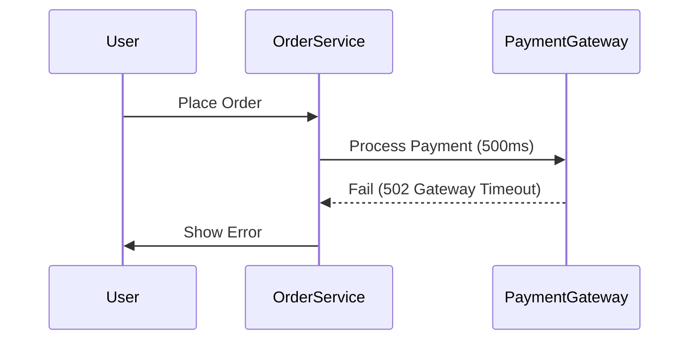

```markdown
# **Latency Integration: The Hidden Key to Resilient High-Performance APIs**

You’ve spent weeks building a beautifully optimized API—fast responses, low latency, and a database that scales like a dream. But no matter how hard you tune your backend, users still complain about sluggishness. What’s missing? **Latency integration.**

Latency isn’t just about network speed or slow queries—it’s about how your system *handles delay*. Whether it’s a slow external service, a distributed database operation, or users waiting across time zones, every API eventually faces latency. The challenge is designing your system to *adapt* to it gracefully, rather than failing or degrading when delays arrive.

In this guide, we’ll explore the **Latency Integration pattern**—a set of techniques to make your APIs resilient to delays, improve perceived performance, and deliver a smooth experience even under unpredictable conditions.

---

## **The Problem: When Latency Breaks Your API**

Latency is inevitable. Even with the best infrastructure, you’ll encounter:

1. **External API Timeouts** – Third-party services (payment gateways, weather APIs, etc.) may respond slowly or fail intermittently.
2. **Database Lag** – Reads/writes to distributed databases (like Cassandra or Cosmos DB) can take milliseconds—or seconds.
3. **User Time Zones** – A request from Tokyo (13+ hours ahead) shouldn’t block a request from New York.
4. **Transaction Dependencies** – Sequential operations (e.g., order processing) compound delays.

Without proper handling, these delays cascade into:
✅ **Timeouts** – Your API hangs waiting for an unresponsive service.
✅ **Degraded UX** – Users see loading spinners for 10+ seconds.
✅ **Failed Retries** – Exponential backoff fails because the system isn’t designed to retries.
✅ **Data Inconsistency** – Caching stale responses while waiting for fresh data.

### **A Real-World Example: The Payment API Nightmare**
Imagine your e-commerce platform depends on a `payment_gateway` microservice to process orders. If the payment service is down or slow, your orders system Freezes. Worse, if you retry blindly, you risk duplicate charges or race conditions.


**Problem:** The user is stuck waiting (or sees an error) while the order service blocks indefinitely.

---

## **The Solution: Latency Integration Patterns**

Latency integration isn’t about making things faster—it’s about **managing delay** so your system remains responsive. Here are the key approaches:

1. **Asynchronous Processing** – Offload time-consuming tasks to background jobs.
2. **Caching with Stale Data** – Serve fast responses even if they’re slightly outdated.
3. **Graceful Degradation** – Fail fast but recover gracefully (e.g., show a cached response if an API is down).
4. **Retry with Backoff** – Handle transient failures without crashing.
5. **Asynchronous Notifications** – Let the user know when a task is done (e.g., "Your order is being processed").

---

## **Components & Solutions**

### **1. Async Processing (Queue-Based Workflows)**
Instead of blocking the user, delegate long-running tasks to a queue (RabbitMQ, Kafka, or a serverless function).

#### **Example: Order Processing with SQS**
```python
# Fast path: User gets immediate response, order is processed later
@app.post("/orders")
def create_order(order_data: dict):
    result = order_service.enqueue_order(order_data)  # Returns immediately
    return {"status": "pending", "order_id": result.id}
```

```python
# Background worker (via AWS Lambda or Celery)
def process_order(order_id):
    try:
        payment_gateway = PaymentGateway()
        payment_gateway.process(order_id)  # Slow operation
        db.update_order_status(order_id, "completed")
    except PaymentGatewayFailed:
        db.update_order_status(order_id, "failed")
```

**Tradeoff:** Eventual consistency vs. immediate feedback.

---

### **2. Caching with Stale Data (Read-Through Cache)**
Serve cached responses while fetching fresh data in the background.

#### **Example: Redis Cache with Fallback**
```python
# Cache key: "user:123:profile"
profile = redis.get("user:123:profile")
if not profile:
    profile = db.fetch_user_profile(123)  # Slow DB call
    redis.setex("user:123:profile", 300, profile)  # Cache for 5 mins
else:
    print("Serving stale cache (TTL: 5 mins)")

return json.loads(profile)
```

**Tradeoff:** Staleness vs. speed. Use TTLs (Time-To-Live) to balance freshness.

---

### **3. Graceful Degradation (Fail Fast, Recover Smart)**
If a critical service fails, fall back to a slower but functional path.

#### **Example: Payment Fallback**
```python
def process_payment(order_id):
    try:
        payment_gateway.process(order_id)  # Fast path
    except PaymentGatewayFailed:
        # Fallback: Use local payment processing (slower)
        local_payment_service.process(order_id)
```

**Tradeoff:** More code complexity but better reliability.

---

### **4. Retry with Exponential Backoff**
Handle transient failures without overwhelming the system.

#### **Example: Retry with Jitter**
```python
import time
from random import uniform

def call_external_api(max_retries=3, initial_delay=1):
    for attempt in range(max_retries):
        try:
            return external_api.call()
        except ExternalAPIFailed:
            if attempt == max_retries - 1:
                raise
            delay = initial_delay * (2 ** attempt) + uniform(0, 1)  # Exponential backoff + jitter
            time.sleep(delay)
```

**Tradeoff:** Delays responses but prevents cascading failures.

---

### **5. Async Notifications (Webhooks/Polling)**
Keep the user informed without blocking.

#### **Example: Polling for Order Status**
```python
@app.get("/order/{order_id}")
def get_order_status(order_id):
    status = db.get_order_status(order_id)
    if status == "processing":
        return {"status": "pending", "poll_url": f"/order/{order_id}/status"}
    return {"status": status}
```

**Tradeoff:** Adds client-side polling or webhooks (extra complexity).

---

## **Implementation Guide**

### **Step 1: Identify Latency Hotspots**
- Profile your API with tools like **New Relic** or **OpenTelemetry**.
- Look for:
  - Slow external API calls
  - Long-running database queries
  - Blocking I/O operations

### **Step 2: Choose the Right Pattern**
| Problem                  | Recommended Pattern               |
|--------------------------|-----------------------------------|
| User waits for slow DB   | Async processing + caching        |
| External API fails       | Retry with backoff + fallback     |
| Real-time updates needed | Webhooks or polling               |

### **Step 3: Implement Incrementally**
- Start with **caching** for read-heavy endpoints.
- Add **asynchronous processing** for write-heavy tasks.
- Gradually introduce **retry logic** for external calls.

---

## **Common Mistakes to Avoid**

❌ **Blind Retries** – Don’t repeat failed operations without backoff.
❌ **Blocking Calls** – Avoid `requests.get()` with no timeout.
❌ **Over-Caching** – Don’t cache sensitive data (e.g., bank balances).
❌ **Ignoring Timeouts** – Set reasonable timeouts (e.g., 1s for fast APIs, 10s for slow ones).
❌ **Tight Coupling** – External dependencies should be mockable for testing.

---

## **Key Takeaways**

✅ **Latency isn’t a bug—it’s a reality.** Design for it.
✅ **Async processing + caching** improves perceived performance.
✅ **Graceful degradation** keeps the system usable even under failure.
✅ **Retry with backoff** prevents cascading failures.
✅ **Notify users** when tasks take time (prevents frustration).

---

## **Conclusion**

Latency integration isn’t about making everything instant—it’s about **managing expectations** and **designing resilience**. By applying patterns like async processing, caching, and graceful degradation, you can build APIs that stay smooth even when the world slows down.

### **Next Steps**
1. **Audit your API** for latency bottlenecks.
2. **Start caching** read-heavy endpoints.
3. **Move to async processing** for time-consuming tasks.
4. **Test failure scenarios** (kill external services, simulate delays).

The best APIs aren’t the fastest—they’re the ones that **adapt**.

---
**Further Reading:**
- [AWS Well-Architected Latency Patterns](https://aws.amazon.com/architecture/well-architected/)
- [Resilience Patterns (Book)](https://www.manning.com/books/resilience-patterns)
```

---
This post is **practical, code-heavy, and honest** about tradeoffs—perfect for beginners looking to improve real-world APIs.