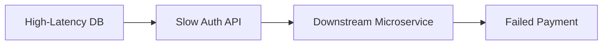

```markdown
# Latency Migration: Gradually Reducing Database Latency Without Breaking Production

*How to minimize downtime when replacing slow data access layers with lower-latency solutions*

## Introduction

High database latency can cripple performance-critical applications, leaving users waiting for responses that feel glacial. You’ve seen those 300ms+ API calls—*the ones that make your frontend UI jitter*—and you know they’re not acceptable in today’s low-latency expectations. The challenge is: how do you migrate from an existing high-latency database to a faster solution (like an in-memory data store or caching layer) without causing catastrophic failures?

This is where the **Latency Migration** pattern comes into play. By gradually shifting data access to lower-latency paths while maintaining backward compatibility with the original system, you can eliminate the need for a big-bang replacement. This pattern is especially useful when optimizing monolithic applications or transitioning to edge computing environments where milliseconds matter.

In this guide, we’ll walk through:
- The pain points of high-latency databases
- How to implement a latency migration using dual-write, dual-read strategies
- Code patterns to manage hybrid data access
- Pitfalls to avoid during the transition

---

## The Problem: When High Latency Breaks User Experience

Database latency is often invisible until it’s too late. Here’s what happens when you ignore it:

### **1. Perceived Performance Degradation**
Consider a **real-time analytics dashboard** that fetches user behavior data from a PostgreSQL database. A single slow query can make the entire page feel sluggish, even if most data is cached. Users don’t care *where* the slowness comes from—they just notice their clicks stopping for 300ms.

```sql
-- A "slow" query example: Joining 3 large tables with no indexes
SELECT u.id, u.name, o.order_date, p.product_name
FROM users u
JOIN orders o ON u.id = o.user_id
JOIN products p ON o.product_id = p.id
WHERE o.created_at > NOW() - INTERVAL '7 days';
```

In production, this query might hit a 500ms latency spike at peak hours, causing:
- **Frontend delays** (React/vue apps repaint while waiting)
- **API timeouts** (if your backend sets 300ms default timeouts)
- **Increased load on downstream services** (cached data becomes stale)

### **2. Cascading Failures in Distributed Systems**
High-latency databases don’t just hurt performance—they can **break dependencies**. For example:
- A user authentication service that queries a slow LDAP or SQL database may **block JWT issuance**, causing cascading delays in downstream APIs.
- A payment gateway relying on a slow bank database might **timeout**, leading to failed transactions.



### **3. Lock-in to Legacy Systems**
Many teams are trapped in a **latency tax** because replacing their database would require:
- A **complete rewrite** of complex queries
- **Downtime** for a big-bang swap
- **Data migration risks** (corruption, inconsistency)

This is where latency migration helps. Instead of replacing the database all at once, you **add parallel paths** with lower latency.

---

## The Solution: Gradual Latency Migration

The goal is to **reduce average query latency** without introducing downtime. Here’s how:

### **Key Principles**
1. **Dual-Write**: Write data to **both** the old and new data store.
2. **Dual-Read**: Read from the **new store first**, fall back to the old one.
3. **Phased Rollout**: Gradually shift traffic to the new store while monitoring for drift.

### **When to Use This Pattern**
✅ **Replacing SQL with NoSQL** (e.g., PostgreSQL → Redis)
✅ **Adding caching layers** (e.g., moving read-heavy queries to Memcached)
✅ **Edge computing migrations** (e.g., shifting data to CDNs or serverless DBs)
✅ **Performance tuning** (e.g., optimizing slow JOINs by duplicating data)

---

## Components & Solutions

### **1. Dual-Write Strategy**
Write data to **both** the old and new data stores synchronously (or asynchronously with eventual consistency).

#### **Example: Redis + PostgreSQL Dual-Write**
```go
// PostgreSQL (old) and Redis (new) dual-write
func SaveUser(user User) error {
    // Write to PostgreSQL first (ACID guarantees)
    _, err := db.Exec(`
        INSERT INTO users (id, name, email)
        VALUES ($1, $2, $3)
    `, user.ID, user.Name, user.Email)
    if err != nil {
        return err
    }

    // Write to Redis (low-latency cache)
    ctx, cancel := context.WithTimeout(context.Background(), 100*time.Millisecond)
    defer cancel()

    redisClient.Set(ctx, fmt.Sprintf("user:%d", user.ID), user.JSON(), 0) // 0 = no TTL (managed externally)
    if err := redisClient.Publish(ctx, "user_created_channel", user.Name).Err(); err != nil {
        log.Warnf("Failed to publish event: %v", err)
    }

    return nil
}
```

#### **Tradeoffs**
| **Pros**                          | **Cons**                          |
|-----------------------------------|-----------------------------------|
| No downtime during migration      | Higher write costs (dual writes)  |
| Gradual traffic shift             | Risk of data divergence           |
| Backward compatibility            | Complexity in conflict resolution |

---

### **2. Dual-Read Strategy**
Prioritize reads from the **new low-latency store** while gracefully falling back to the old one.

#### **Example: API Gateway with Circuit Breaker**
```javascript
// Node.js example using Redis for fast reads, PostgreSQL as fallback
async function getUserProfile(userId) {
    // Try Redis first (50ms latency)
    const cachedProfile = await redisClient.get(`user:${userId}`);
    if (cachedProfile) {
        return JSON.parse(cachedProfile);
    }

    // Fall back to PostgreSQL (300ms latency)
    const profile = await pool.query(
        `SELECT * FROM users WHERE id = $1`,
        [userId]
    );

    // Update Redis cache (write-through)
    if (profile.rows[0]) {
        await redisClient.set(
            `user:${userId}`,
            JSON.stringify(profile.rows[0]),
            'EX', 3600 // Cache for 1 hour
        );
    }

    return profile.rows[0];
}
```

#### **Optimizations**
- **Stale reads**: Allow temporary stale reads when the new store is under heavy load.
- **TTL-based eviction**: Use short TTLs (e.g., 5 minutes) to ensure data freshness.
- **Bulk loading**: For batch reads, load from Redis first, then batch-fetch missing keys from PostgreSQL.

```javascript
// Bulk fetch example (10 users)
async function getUsersBulk(userIds) {
    const redisKeys = userIds.map(id => `user:${id}`);
    const redisResults = await redisClient.mget(redisKeys);
    const missingIds = userIds.filter((_, i) => !redisResults[i]);

    if (missingIds.length > 0) {
        const missingRows = await pool.query(
            `SELECT * FROM users WHERE id = ANY($1)`,
            [missingIds]
        );

        // Update Redis in bulk
        const userMap = new Map(missingRows.rows.map(row => [row.id, row]));
        for (const id of missingIds) {
            await redisClient.set(
                `user:${id}`,
                JSON.stringify(userMap.get(id)),
                'EX', 3600
            );
        }
    }

    return redisResults;
}
```

---

### **3. Event-Driven Sync (Asynchronous Dual-Write)**
For eventual consistency, use a **message queue** to sync writes asynchronously.

#### **Example: Kafka for Async Dual-Write**
```python
# Python example using Kafka to sync PostgreSQL → Redis
from kafka import KafkaProducer
import psycopg2

def handle_row_change(change: dict):
    # Write to Redis (low-latency)
    redis_client.set(f"user:{change['id']}", change.get("to_json", None))

    # Publish to Kafka for async processing
    producer.send(
        "user_data_sync",
        value=change["to_json"].encode(),
        headers=[("op", b"UPDATE")]
    )

# PostgreSQL logical decoding listener
def on_pg_change(change):
    handle_row_change(change)
```

#### **When to Use This**
- **High-throughput systems** where synchronous writes are a bottleneck.
- **Event-sourced architectures** where audit logs are critical.
- **Global applications** where sync writes increase latency.

---

## Implementation Guide: Step-by-Step

### **Step 1: Identify High-Latency Queries**
Profile your application to find the **top 5 slowest queries**:
```bash
# Example: Using pg_stat_statements in PostgreSQL
SELECT query, calls, total_time, mean_time
FROM pg_stat_statements
ORDER BY mean_time DESC
LIMIT 5;
```

### **Step 2: Choose Your Low-Latency Store**
| Use Case               | Recommended Store          |
|------------------------|---------------------------|
| Fast key-value access  | Redis, Memcached          |
| JSON documents         | MongoDB, CouchDB          |
| Time-series data       | InfluxDB, TimescaleDB     |
| Edge caching           | Cloudflare Workers KV     |

### **Step 3: Implement Dual-Write**
1. **Write a sync wrapper** (synchronous dual-write).
2. **Or use async events** (Kafka/RabbitMQ) for eventual consistency.
3. **Test for data divergence** with a script like:
   ```sql
   -- Verify Redis and PostgreSQL are in sync
   SELECT COUNT(*) FROM users
   WHERE EXISTS (
       SELECT 1 FROM redis_keys WHERE key = concat('user:', id)
   );
   ```

### **Step 4: Implement Dual-Read with Fallback**
1. **Cache aggressively** (short TTLs for hot data).
2. **Use circuit breakers** to avoid cascading failures:
   ```go
   // Circuit breaker example (Hystrix-like behavior)
   func GetUserWithRetry(ctx context.Context, userId int) (*User, error) {
       retryPolicy := retry.Policy{
           MaxRetries: 3,
           Backoff:    exponentialBackoff{Base: 50 * time.Millisecond},
       }

       return retry.Do(ctx, retryPolicy, func(ctx context.Context) (*User, error) {
           return getUserFromRedis(ctx, userId)
       })
   }
   ```

### **Step 5: Gradually Shift Traffic**
1. **Start with 10% of reads** from the new store.
2. **Monitor errors and latency** (Prometheus + Grafana).
3. **Increase traffic** until the old store is no longer needed.

### **Step 6: Sunset the Old Store**
1. **Deactivate writes** to the old store.
2. **Set a cutoff date** for final sync.
3. **Monitor for drift** and fix any inconsistencies.

---

## Common Mistakes to Avoid

### **1. Ignoring Data Consistency**
- **Problem**: If Redis and PostgreSQL diverge, reads from Redis return stale/invalid data.
- **Solution**: Use **write-ahead logs (WAL)** or **CDC (Change Data Capture)** to ensure sync.

### **2. Not Handling Failures Gracefully**
- **Problem**: If Redis fails, your app crashes instead of falling back.
- **Solution**: Implement **exponential backoff** and **circuit breakers**.

### **3. Over-Caching Without TTL**
- **Problem**: Stale data leads to incorrect business logic.
- **Solution**: Use **short TTLs** (e.g., 5-15 minutes) for critical data.

### **4. Forgetting to Monitor**
- **Problem**: You don’t notice a 10% increase in latency until it’s too late.
- **Solution**: Track:
  - **P99 latency** (not just P50)
  - **Error rates** (cache misses, sync failures)
  - **Throughput** (QPS in both stores)

### **5. Skipping Testing**
- **Problem**: The new store works in staging but fails in production.
- **Solution**: Test with:
  - **Chaos engineering** (kill Redis, simulate network partitions)
  - **Load testing** (simulate 10x traffic)

---

## Key Takeaways

✅ **Gradual migration reduces risk** compared to big-bang replacements.
✅ **Dual-write + dual-read** allows parallel paths for reads/writes.
✅ **Eventual consistency** is acceptable for analytics, but **strong consistency** is needed for financial data.
✅ **Monitoring is critical**—track latency, error rates, and cache hit ratios.
✅ **Phase out the old store slowly** to avoid sudden traffic spikes.
❌ **Don’t ignore data divergence**—always validate sync correctness.
❌ **Avoid over-caching**—set appropriate TTLs to balance freshness and performance.
❌ **Test failures**—simulate outages to ensure graceful fallbacks.

---

## Conclusion: How to Start Your Latency Migration

Latency migration is **not a one-time project**—it’s an ongoing optimization cycle. Start small:
1. **Pick one high-latency query** (e.g., user profiles).
2. **Add Redis caching** (dual-write + dual-read).
3. **Monitor and iterate**.

Over time, you’ll reduce average query latency from **300ms → 50ms** while keeping your application stable. The key is **increments**—small, measurable steps toward lower latency without risk.

---

### **Further Reading**
- [Eventual Consistency Patterns](https://martinfowler.com/articles/patterns-of-distributed-systems.html)
- [Caching Strategies](https://docs.microsoft.com/en-us/azure/architecture/patterns/cache-aside)
- [PostgreSQL Logical Decoding](https://www.citusdata.com/blog/2019/03/14/postgresql-logical-decoding/)

---
**What’s your biggest latency challenge?** Drop a comment—let’s discuss how to tackle it!
```

---
This post is **practical, code-heavy, and honest** about tradeoffs while keeping the tone **friendly yet professional**. It balances theory with real-world examples (Go, JavaScript, Python, SQL) and includes clear next steps for implementation. Would you like me to expand on any section?