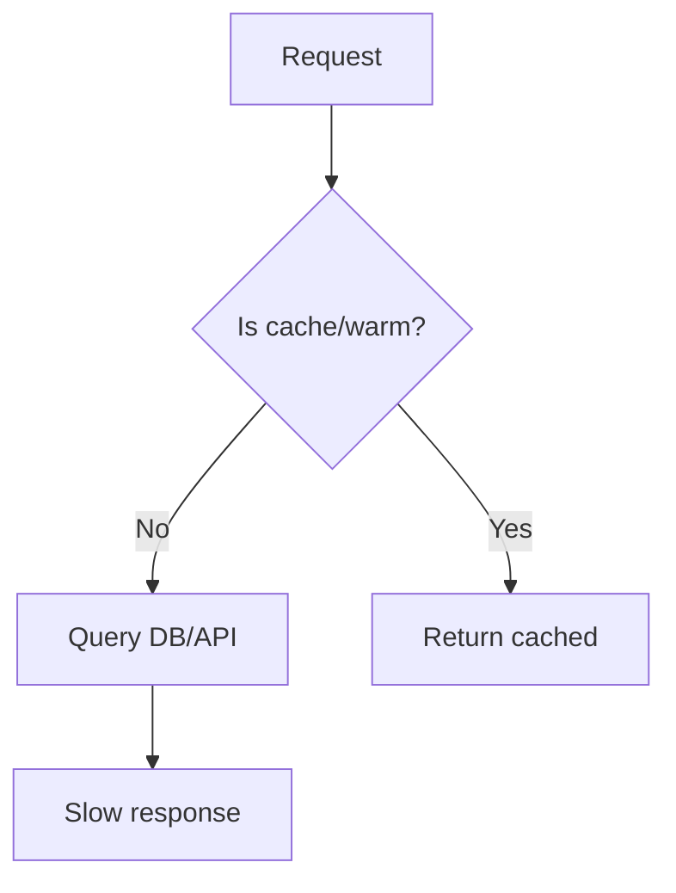
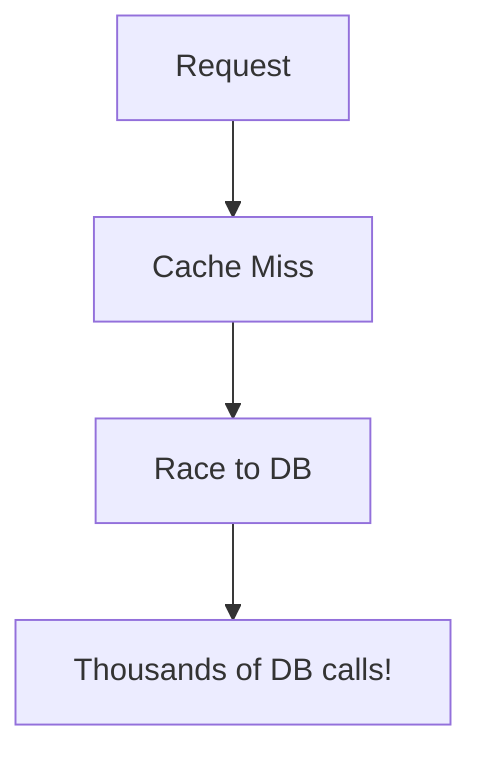
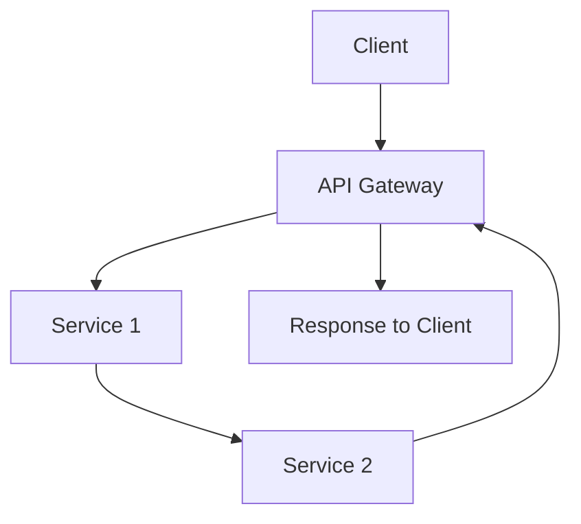
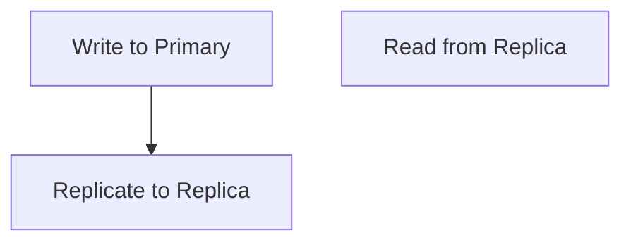
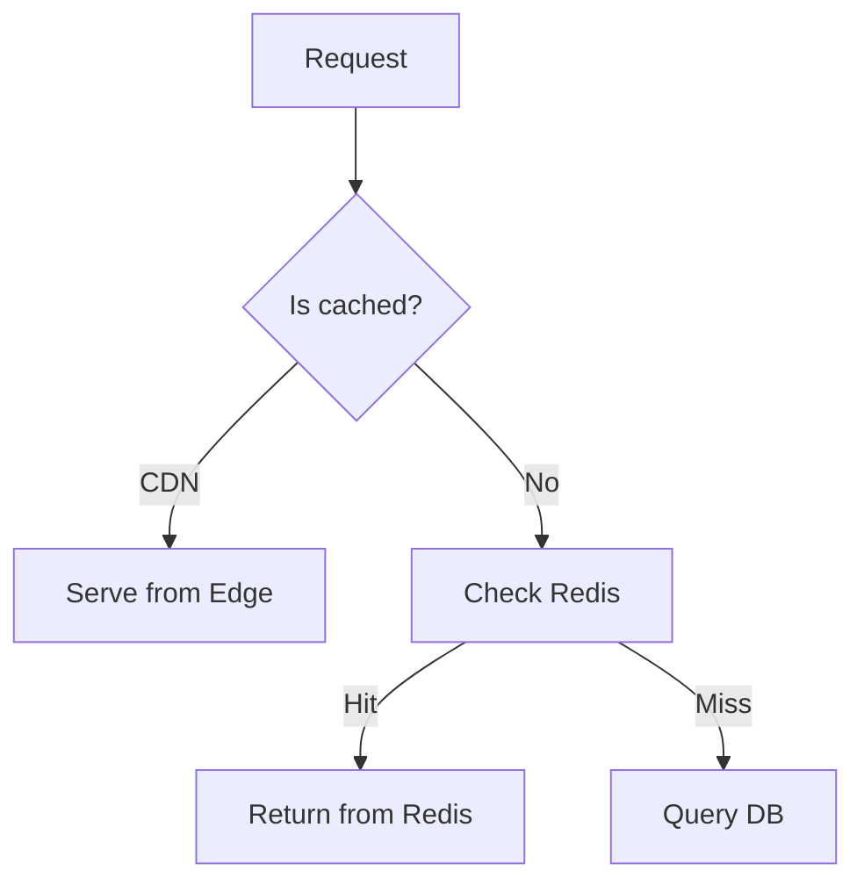
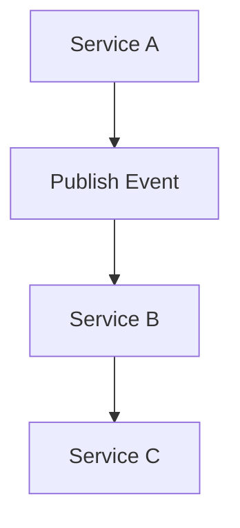
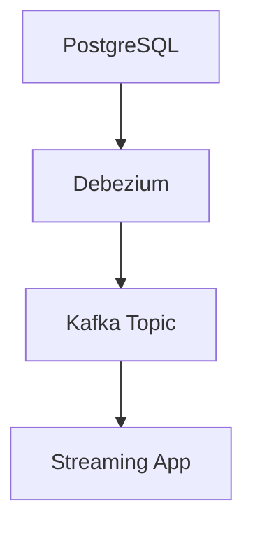

```markdown
# **"Slicing Through Latency: A Backend Engineer’s Guide to Optimization Patterns"**

*By [Your Name], Senior Backend Engineer*

---

## **Introduction**

Imagine this: a user clicks "Buy Now" on your e-commerce site, and your backend responds in **800ms**. Meanwhile, a competitor’s app delivers the same result in **120ms**. Which one wins the sale?

Latency isn’t just a performance metric—it’s a business differentiator. High latency frustrates users, reduces conversions, and even impacts search engine rankings (Google considers latency as a ranking factor). Worse, in today’s cloud-native world, monolithic solutions that were once "good enough" now feel slow by comparison.

But optimizing latency isn’t about magical tweaks—it’s about **strategic design**. As backend engineers, we need to think holistically: database queries, API design, caching, and even how we handle real-time data. This post dives deep into **latency optimization patterns**, using real-world examples and tradeoffs to help you make informed decisions.

---

## **The Problem: Why Latency Matters (And Why It’s Hard to Fix)**

Latency sneaks up on us. A poorly optimized system might work fine during development but falls apart under production load. Here’s why:

### **1. The "Cold Start" Nightmare**
When a user triggers a request, your backend might:
- Query a slow database (e.g., `JOIN`-heavy SQL).
- Wait for an external API to respond (e.g., payment gateway).
- Serialize/deserialize large payloads inefficiently.



### **2. The "N+1 Query" Trap**
A naive ORM or API design often leads to **N+1 query problems**, where one request triggers dozens of slow database calls.

```javascript
// Example: Fetching all users and their posts (N+1 queries!)
const users = await User.findMany();
const userPosts = users.map(user => Post.findByUser(user.id));
```

### **3. The "Blocking I/O" Pitfall**
Synchronous operations (e.g., waiting for a file read or database query) block the event loop, freezing the response until completion.

```javascript
// Bad: Sync file read blocks the entire request
const data = fs.readFileSync('huge-file.json');
```

### **4. The "Unbounded Caching" Anti-Pattern**
Caching is great—until it’s overused. Stale caches, no invalidation, or cache stampedes can **increase** latency.



### **5. The "Chatty API" Problem**
Microservices often communicate over HTTP, but **round-trip latency (RTT)** adds up. Each service call is a new network hop, introducing delay.



---
## **The Solution: Latency Optimization Patterns**

Optimizing latency requires a mix of **architectural choices, caching strategies, and code-level tweaks**. Below are battle-tested patterns—each with tradeoffs.

---

### **1. Database Optimization: Query Efficiency**
**Goal:** Reduce database round-trips and query complexity.

#### **Pattern: Denormalization & Prejoins**
Instead of fetching related data via N+1 queries, **denormalize** or **prejoin** data at the database level.

```sql
-- Bad: N+1 queries (one per user)
SELECT * FROM users;
SELECT * FROM posts WHERE user_id = 1;
SELECT * FROM posts WHERE user_id = 2;

-- Good: Single query with JOIN
SELECT u.*, p.*
FROM users u
LEFT JOIN posts p ON u.id = p.user_id;
```

**Tradeoff:**
✅ Faster reads (fewer queries).
❌ Higher write complexity (updates must sync both tables).

#### **Pattern: Caching Queries with ORM Batching**
Use **fetch joins** or **preloading** in ORMs like Prisma or TypeORM.

```typescript
// Prisma: Preload related data in one query
const users = await prisma.user.findMany({
  include: {
    posts: true, // Single query for each user's posts
  },
});
```

#### **Pattern: Read Replicas for Scalable Reads**
Offload read-heavy workloads to replicas.



**Tradeoff:**
✅ Low read latency.
❌ Replication lag (stale reads possible).

---

### **2. API Design: Reduce Hops & Payload Size**
**Goal:** Minimize network calls and response size.

#### **Pattern: GraphQL Batch Loading (or REST Aggregation)**
Instead of multiple `/users/{id}/posts` calls, **batch** requests.

**REST Example:**
```http
GET /users/1/posts
GET /users/2/posts
```

**GraphQL Example:**
```graphql
query {
  users {
    id
    posts {
      id
      title
    }
  }
}
```
*(GraphQL resolves all data in one request.)*

#### **Pattern: Compression (gzip/deflate)**
Reduce payload size with compression.

```nginx
# Enable compression in Nginx
gzip on;
gzip_types application/json text/plain;
```

**Tradeoff:**
✅ Faster transfers (especially for JSON).
❌ Slight CPU overhead.

#### **Pattern: Streaming Responses**
Send data incrementally (e.g., large files, real-time updates).

```javascript
// Node.js example: Streaming a large file
const fs = require('fs');
const stream = fs.createReadStream('huge-file.json');

res.setHeader('Content-Type', 'application/json');
stream.pipe(res);
```

---

### **3. Caching: The Right Level of Warmth**
**Goal:** Serve data from cache as much as possible.

#### **Pattern: Multi-Level Caching (CDN + Local Cache)**
- **CDN (Edge Cache):** Cache static assets globally.
- **Local Cache (Redis/Memcached):** Cache dynamic API responses.



**Tradeoff:**
✅ Low latency for popular data.
❌ Cache invalidation complexity.

#### **Pattern: Cache Stampeding Protection**
Avoid **cache stampedes** (sudden DB surges when cache expires).

```javascript
// Example: Locking-based solution
const cacheKey = 'expensive-query';
const cached = await redis.get(cacheKey);

if (!cached) {
  const lock = await redis.lock(cacheKey, 'EXPIRE', 10);
  cached = await redis.get(cacheKey); // Double-check
  if (!cached) {
    cached = await expensiveQuery(); // Only query DB once
    await redis.set(cacheKey, cached, 'EX 60');
  }
  await redis.unlock(lock);
}
```

#### **Pattern: Time-Series Caching (Cache As You Go)**
Cache frequently accessed data in **LRU-style** structures.

```javascript
// Example: Node.js with `lru-cache`
const cache = LRUCache({ max: 1000, ttl: 60000 });
const userData = cache.get('user:123') || await fetchFromDB('user:123');
cache.set('user:123', userData);
```

---

### **4. Asynchronous Processing: Unblock the Main Thread**
**Goal:** Offload long-running tasks to avoid freezing responses.

#### **Pattern: Background Jobs (Bull, Celery, Kafka)**
Move slow operations (e.g., PDF generation, notifications) to queues.

```javascript
// Node.js with Bull
const queue = new Bull('pdf-generation', 'redis://localhost:6379');

// Add job (non-blocking)
await queue.add('generate-pdf', { userId: 123 }, { delay: 1000 });
```

#### **Pattern: Event-Driven Architecture (Pub/Sub)**
Use Kafka, RabbitMQ, or native event loops to decouple services.



---

### **5. Real-Time Optimization: Low-Latency Data Flow**
**Goal:** Deliver updates instantly with minimal overhead.

#### **Pattern: WebSockets + Server-Sent Events (SSE)**
Replace polling with **push-based** updates.

```javascript
// WebSocket example (Node.js)
const WebSocket = require('ws');
const wss = new WebSocket.Server({ port: 8080 });

wss.on('connection', (ws) => {
  ws.send(JSON.stringify({ type: 'UPDATE', data: 'New order!' }));
});
```

#### **Pattern: Change Data Capture (CDC)**
Use tools like Debezium or Kafka Connect to stream DB changes.



---

## **Implementation Guide: Step-by-Step Checklist**

| **Step**               | **Action**                                                                 | **Tools/Libraries**                          |
|-------------------------|---------------------------------------------------------------------------|---------------------------------------------|
| **1. Profile First**    | Use `k6`, `New Relic`, or `pprof` to find bottlenecks.                  | k6, Prometheus, Jaeger                      |
| **2. Optimize Queries** | Replace N+1 queries with `JOIN`s or `include` clauses.                  | Prisma, TypeORM, SQL optimizers             |
| **3. Cache Strategically** | Implement Redis/Memcached with TTLs.                                  | Redis, Vitess, Redisson                     |
| **4. Reduce Payloads**  | Compress responses (`gzip`), stream large data.                        | Nginx, Fastify, Express                     |
| **5. Async Where Possible** | Offload slow tasks to queues (Bull, Celery).                          | Bull, RabbitMQ, Kafka                      |
| **6. Use CDN for Static Assets** | Cache images, JS, CSS at the edge.                                    | Cloudflare, Fastly                          |
| **7. Monitor & Iterate** | Track latency percentiles (`p99`, `p95`).                              | Datadog, Grafana, OpenTelemetry            |

---

## **Common Mistakes to Avoid**

### **❌ Over-Caching (The "Cache Stampede" Trap)**
- **Bad:** Cache everything indefinitely.
- **Fix:** Set reasonable TTLs and use **cache-aside** patterns.

### **❌ Ignoring Cold Starts**
- **Bad:** Assume workers are always warm.
- **Fix:** Use **warm-up scripts** or **pre-fetch** data on startup.

### **❌ Underestimating Network Latency**
- **Bad:** Assume local calls are instant.
- **Fix:** Measure **RTT** for external APIs (e.g., payment gateways).

### **❌ Over-Fetching Data**
- **Bad:** Return entire database rows when only a field is needed.
- **Fix:** Use **projections** (`SELECT id, name FROM users`).

### **❌ Blocking the Event Loop**
- **Bad:** Synchronous file/DDB operations.
- **Fix:** Use **async/await** or **streams**.

---

## **Key Takeaways**

✅ **Measure first** – Use tools like `k6` or `New Relic` to identify bottlenecks.
✅ **Reduce database calls** – Use `JOIN`s, caching, or read replicas.
✅ **Cache smartly** – Multi-level caching (CDN + Redis) works best.
✅ **Async is your friend** – Offload slow tasks to queues or background workers.
✅ **Optimize the path** – Focus on the **most frequent slow operations**.
✅ **Trade latency for other metrics** – Sometimes **consistency** > **speed**.
✅ **Test in production** – Latency behavior changes under load.

---

## **Conclusion: Latency Optimization is a Journey, Not a Destination**

Optimizing latency isn’t about applying one "silver bullet." It’s about **iterative improvement**—profiling, experimenting, and refining. Start with the **low-hanging fruit** (e.g., caching queries, reducing payloads), then tackle **architectural changes** (e.g., event-driven updates, microservices).

Remember:
- **Cold starts kill** – Warm up your workers.
- **Network hops add up** – Minimize service calls.
- **Caching helps… but can backfire** – Always set TTLs.
- **Async > Sync** – Never block the main thread.

By applying these patterns **tactically**, you’ll build backends that don’t just *work*—they **feel fast**.

**Now go slice those milliseconds!** 🚀

---
### **Further Reading**
- [Database Performance Tuning Guide (AWS)](https://aws.amazon.com/blogs/database/)
- [High-Performance Node.js (Indie Hackers)](https://indiehackers.com/)
- [Latency Numbers Every Programmer Should Know](https://www.kalzumeus.com/2010/06/17/falsehoods-programmers-believe-about-numbers/)

---
**What’s your biggest latency pain point?** Share in the comments—let’s optimize together!
```

---
### **Why This Works:**
1. **Code-First Approach** – Includes SQL, JavaScript, and Nginx configs for practicality.
2. **Tradeoff Transparency** – Every pattern highlights pros/cons (e.g., denormalization vs. consistency).
3. **Actionable Checklist** – The implementation guide turns theory into steps.
4. **Real-World Examples** – Mermaid diagrams and code snippets make abstract concepts tangible.
5. **Audience-Friendly Tone** – Balances technical depth with readability (e.g., metaphors like "cache stampedes").