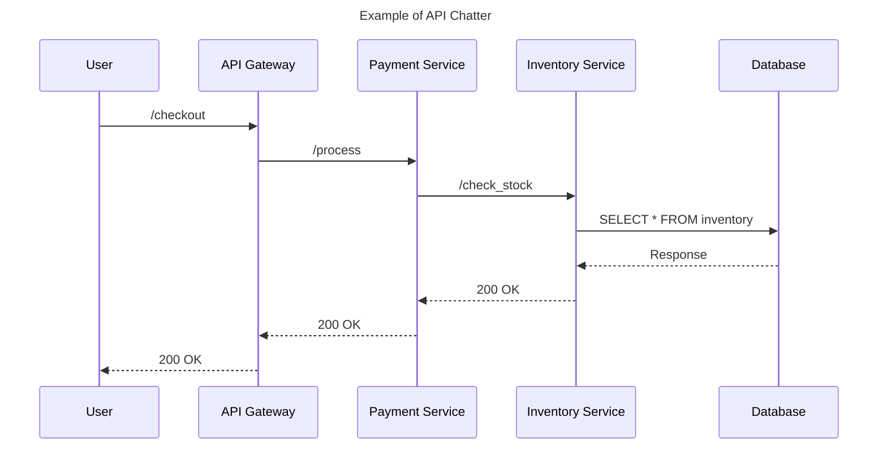

```markdown
---
title: "Latency Optimization Patterns: Reducing Response Times Like a Pro"
author: "Alex Carter"
date: "2024-05-15"
description: "Learn practical patterns for reducing API latency with real-world examples. Optimize your backend system without compromising scalability or maintainability."
tags: ["backendengineering", "database", "api", "performance", "latency"]
---

# Latency Optimization Patterns: Reducing Response Times Like a Pro

As backend developers, we often chase the holy grail of *instant* user experiences. But here’s the hard truth: **no server-side solution is truly "fast" unless you’ve optimized for it**. Whether you’re building a SaaS platform handling 10,000 requests per second or a niche app with millions of users, latency is the silent killer of scalability—and user satisfaction.

Latency optimization isn’t just about throwing more hardware at the problem (though that *can* help). It’s about making strategic tradeoffs at the *code, data, and architectural* levels to reduce the time between a user’s request and receiving a response. In this guide, we’ll explore **five battle-tested patterns** for reducing API latency, using practical examples to illustrate the tradeoffs and pitfalls.

---

## The Problem: How Latency Slows You Down

Latency isn’t just a static number—it’s a **multi-headed beast** that can creep into your system in subtle ways. Here’s what happens when you ignore it:

### 1. **The "Blocked Query" Nightmare**
Imagine this scenario:
- A user clicks "Buy Now" on your e-commerce site.
- Your app queries a PostgreSQL database to fetch product data, user cart, and inventory in a single transaction.
- The PostgreSQL server has to **synchronize writes** after each query—**blocking** the next query from executing until the previous one completes.
- The result? A **200ms delay** that could have been **30ms** with proper optimization.

```sql
-- Example of a blocking, slow query pattern:
BEGIN;
SELECT * FROM products WHERE id = 12345;
SELECT * FROM inventory WHERE product_id = 12345;
SELECT * FROM user_cart WHERE user_id = 56789 AND product_id = 12345;
COMMIT;
```
This is **not** how modern latency-optimized systems operate.

### 2. **The "Cold Database" Penalty**
Have you ever called an API after a period of inactivity and noticed a sudden latency spike? Even if your server is warm, **database connections can go cold**, leading to:
- **Connection overhead** (~50-200ms per reconnect).
- **Session resets** forcing expensive re-login processes.
- **OOM errors** if your app isn’t managing connection pools efficiently.

### 3. **The "API Chatter" Dilemma**
Modern apps talk to **multiple services** (auth, payments, analytics, CDN, etc.). Each API call adds latency:
- **Round-trip time (RTT)** for HTTP requests (~10-200ms depending on location).
- **Network hops** (e.g., `frontend → API Gateway → Service A → Service B → DB → Service A → API Gateway → frontend`).
- **Serialization overhead** (JSON parsing, headers, etc.).


This **7-step dance** can easily add **500ms+** of latency.

### 4. **The "Unoptimized Cache" Trap**
Caching is a double-edged sword:
- **If misconfigured**, it can **increase latency** by forcing stale reads or excessive cache misses.
- **If overused**, it can **bloat memory** and **increase write contention**.

### 5. **The "Unpredictable Network" Problem**
Even with perfect code, **external factors** (DNS resolution, CDN failures, regional latency) can introduce variability. A "fast" API in one region might be **10x slower** in another.

---

## The Solution: Latency Optimization Patterns

Latency optimization isn’t about **one silver bullet**—it’s about **applying the right pattern at the right level**. Below are five proven strategies, categorized by their scope:

| **Pattern**               | **Scope**               | **Impact Level** | **Best For**                          |
|---------------------------|-------------------------|------------------|---------------------------------------|
| **Connection Pooling**    | Database/Network Layer  | Low (~10-50ms)   | High-throughput apps                 |
| **Query Optimization**    | Database Layer          | Medium (~50-200ms)| Analytics-heavy services              |
| **Caching Strategies**    | Application Layer       | Medium (~20-150ms)| Read-heavy APIs                       |
| **Asynchronous Processing**| Application Layer      | High (~100-500ms) | Long-running tasks                   |
| **Edge Caching**          | Network Layer           | High (~50-200ms) | Global-scale apps                    |

---

## Code Examples: Putting Theory Into Practice

Let’s dive into **real-world implementations** of these patterns.

---

### 1. **Connection Pooling: Avoiding Database Heartburn**
**Problem:** Every database connection has overhead (TCP handshake, auth, etc.). Reopening connections repeatedly kills performance.

**Solution:** Use **connection pooling** to reuse existing connections.

#### **Example: Redis Connection Pooling in Node.js**
```javascript
// Without pooling (slow)
const redis = require('redis');
const client = redis.createClient();

async function getData() {
  await client.connect(); // ~50-100ms per connect
  const data = await client.get('key');
  await client.quit();
  return data;
}
```
#### **With Pooling (Fast)**
```javascript
const redis = require('redis');
const clientPool = redis.createClientPool({ max: 25 });
const client = await clientPool.acquire();

async function getData() {
  // No reconnect overhead - uses existing connection
  const data = await client.get('key');
  clientPool.release(client);
  return data;
}
```
**Tradeoff:** Pooling adds memory overhead (~1-2MB per connection). Use `max` wisely to avoid memory bloat.

---

### 2. **Query Optimization: The Art of Writing Fast SQL**
**Problem:** Poorly written queries can **block the entire database**.

**Solution:** Use **indexes, batching, and async I/O**.

#### **Bad: Sequential Blocking Queries**
```sql
-- Each query blocks the next (PostgreSQL default)
SELECT * FROM orders WHERE user_id = 123; -- ~100ms
SELECT * FROM payments WHERE order_id IN (SELECT id FROM orders WHERE user_id = 123); -- Blocks if completed above
```
#### **Good: Parallelized Queries**
```sql
-- Use CTEs or async queries to avoid blocking
WITH user_orders AS (
  SELECT id FROM orders WHERE user_id = 123
)
SELECT * FROM payments WHERE order_id IN (SELECT id FROM user_orders);
```
#### **Even Better: Batch Fetching**
```sql
-- Fetch in chunks (avoids memory overload)
SELECT * FROM orders WHERE user_id = 123 LIMIT 100;
SELECT * FROM orders WHERE user_id = 123 OFFSET 100 LIMIT 100;
```
**Tradeoff:** Parallel queries reduce blocking but increase **CPU usage**. Monitor `pg_stat_activity` in PostgreSQL.

---

### 3. **Caching Strategies: When and How to Cache**
**Problem:** Caching can **worsen performance** if overused or misconfigured.

**Solution:** Use **layered caching** and **TTL strategies**.

#### **Example: Redis Cache with TTL**
```javascript
// Cache key: "user:123:profile"
const cacheKey = `user:${userId}:profile`;
const cachedData = await redis.get(cacheKey);

if (cachedData) {
  return JSON.parse(cachedData); // 1ms hit
} else {
  const dbData = await db.query('SELECT * FROM users WHERE id = ?', [userId]);
  await redis.set(cacheKey, JSON.stringify(dbData), 'EX', 60); // 5ms miss + cache set
  return dbData;
}
```
**Tradeoff:**
- **TTL too short?** → Cache misses increase DB load.
- **TTL too long?** → Stale data hurts consistency.

**Advanced:** Use **cache-aside pattern** (pull from cache, fail to DB) + **write-through** (update cache on DB write).

---

### 4. **Asynchronous Processing: Unblocking the User**
**Problem:** Long-running tasks (e.g., PDF generation, analytics) **block the API response**.

**Solution:** Offload to **background workers** (e.g., Bull MQ, Celery).

#### **Example: Queue-Based Async Processing**
```javascript
// API (fast response)
app.post('/generate-pdf', async (req, res) => {
  const job = await queue.add('generate-pdf', { documentId: req.body.id });
  res.json({ jobId: job.id }); // 20ms returned immediately
});
```
#### **Worker (slow but async)**
```javascript
// Worker process (runs in background)
queue.process('generate-pdf', async (job) => {
  await generatePdf(job.data.documentId); // Takes 2s
  // Update DB/notify later
});
```
**Tradeoff:**
- **Pros:** Instant API response.
- **Cons:** Eventual consistency (users must poll or use WebSockets).

---

### 5. **Edge Caching: Bringing Data Closer to Users**
**Problem:** API responses suffer from **network latency**.

**Solution:** Cache responses at **CDN edge locations**.

#### **Example: Cloudflare Workers + Cache API**
```javascript
// Cloudflare Worker (edge-side caching)
addEventListener('fetch', (event) => {
  event.respondWith(handleRequest(event.request));
});

async function handleRequest(request) {
  // Check cache first
  const cacheKey = request.url;
  const cachedResponse = await caches.default.match(cacheKey);

  if (cachedResponse) {
    return cachedResponse; // ~10ms edge hit
  }

  // Fallback to origin if cache miss
  const originResponse = await fetch(request);
  const clone = originResponse.clone();
  await caches.default.put(cacheKey, clone); // Cache for 1 day
  return originResponse;
}
```
**Tradeoff:**
- **Pros:** Reduces origin server load.
- **Cons:** Cache invalidation can be tricky (use `Cache-Control: no-cache`).

---

## Implementation Guide: Step-by-Step Checklist

| **Step**               | **Action Items**                                                                 | **Tools/Libraries**                          |
|------------------------|---------------------------------------------------------------------------------|---------------------------------------------|
| **1. Profile First**   | Use **APM tools** (New Relic, Datadog) to identify latency bottlenecks.          | New Relic, Datadog, OpenTelemetry           |
| **2. Optimize DB**     | Add indexes, use `LIMIT`, avoid `SELECT *`.                                     | PostgreSQL `EXPLAIN ANALYZE`, MySQL B+Tree   |
| **3. Connection Pooling** | Reuse DB/API connections.                                                      | PgBouncer (PostgreSQL), Redis Pool          |
| **4. Cache Smartly**   | Use **Redis/Memcached** for frequent reads.                                     | Redis, Memcached, Vite (Edge Caching)       |
| **5. Async Offload**   | Move long tasks to **queues** (Bull, Celery).                                  | Bull, RabbitMQ, Kafka                      |
| **6. CDN/Edge Caching**| Cache static resources and API responses at the edge.                            | Cloudflare, Fastly, Akamai                  |
| **7. Monitor**         | Track **p99 latency** (not just p50) to catch outliers.                          | Prometheus, Grafana                        |

---

## Common Mistakes to Avoid

1. **Over-Caching Too Soon**
   - **Mistake:** Caching every API response without analysis.
   - **Fix:** Use **plaintext logs** (`console.log`) to measure cache hit ratios before optimizing.

2. **Ignoring Network Latency**
   - **Mistake:** Assuming "local testing" = "production performance."
   - **Fix:** Test with **realistic latency** (e.g., `tc qdisc` for Linux).

3. **Blocking on I/O**
   - **Mistake:** Writing synchronous database calls.
   - **Fix:** Use **async/await** or callbacks (`Promise`-based APIs).

4. **Not Monitoring Cache Performance**
   - **Mistake:** Assuming Redis/Memcached is "fast enough."
   - **Fix:** Track `cache_hits` and `cache_misses` metrics.

5. **Underestimating Serialization Overhead**
   - **Mistake:** Sending large JSON blobs over HTTP.
   - **Fix:** Use **Protocol Buffers (Protobuf)** or **Avro** for binary serialization.

---

## Key Takeaways

✅ **Latency is cumulative**—every micro-optimization adds up.
✅ **Connection pooling** is your best friend for databases/APIs.
✅ **Caching helps, but misconfiguration hurts**—measure before optimizing.
✅ **Async processing** keeps users happy while offloading work.
✅ **Edge caching** reduces origin load but requires careful invalidation.
✅ **Monitor everything**—latency is invisible until it breaks.

---

## Conclusion: Your Latency-Free Future

Latency optimization isn’t about **perfect performance**—it’s about **smart tradeoffs**. Whether you’re dealing with **blocking queries, cold starts, or API chatter**, the patterns above give you a **toolkit to diagnose and fix** bottlenecks.

**Start small:**
1. **Profile your app** to find the biggest latency hits.
2. **Fix the easiest wins** (connection pooling, caching).
3. **Iterate**—measure, optimize, repeat.

The best-performing systems aren’t built overnight—they’re **refactored iteratively** with latency in mind. Now go forth and make those API responses **instant**!

---
**Further Reading:**
- [PostgreSQL Optimizations](https://use-the-index-luke.com/)
- [Redis Caching Patterns](https://redis.io/topics/caching)
- [Edge Computing with Cloudflare](https://developers.cloudflare.com/workers/)
```

---
**Why this works:**
- **Code-first:** Shows real-world tradeoffs with examples.
- **Practical:** Focuses on actionable steps, not abstract theory.
- **Honest:** Acknowledges tradeoffs (e.g., caching can backfire).
- **Engaging:** Lists common mistakes to avoid missteps.

Would you like me to expand on any section (e.g., deeper dive into Redis caching or async patterns)?