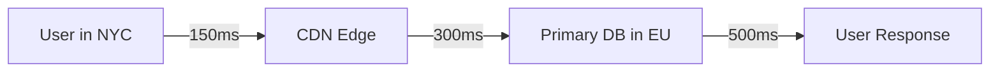

```markdown
# **Mastering Latency Patterns: Optimizing Performance in Distributed Systems**

As distributed systems scale, latency becomes a first-class citizen in system design. Users expect sub-second responses, but with microservices, global databases, and external dependencies, achieving low latency often requires tactical patterns—not just brute-force scaling. **Latency patterns** are architectural techniques to mitigate delays, improve responsiveness, and deliver a seamless user experience.

In this guide, we’ll explore real-world latency challenges, dissect proven patterns (with code examples), and provide actionable advice to implement them in your systems. Whether you’re dealing with slow database queries, cold starts, or external API calls, this guide will help you design systems that respond predictably—even under load.

---

## **The Problem: When Low Latency Doesn’t Just Happen**

Latency isn’t just about CPU or network speed; it’s about *coordination*. Modern systems face these common latency pitfalls:

### **1. Blocking I/O Operations**
Many applications treat slow operations (e.g., database queries, HTTP calls) as synchronous bottlenecks. For example:
```python
# ❌ Blocking call to an external API
response = requests.get("https://slow-api.example.com/data")
```
This causes threads/processes to idle while waiting, degrading concurrency.

### **2. Cold Starts & Resource Contention**
Serverless functions experience "cold starts" where latency spikes due to initialization overhead:
```bash
# Serverless API latency: 300ms (first call) → 50ms (subsequent calls)
```
This unpredictability breaks SLAs for latency-sensitive apps.

### **3. N+1 Query Problem**
ORMs generate inefficient queries, like:
```sql
# ❌ N+1 query example (fetching users + their orders)
SELECT * FROM users WHERE id IN (1, 2, 3);
SELECT * FROM orders WHERE user_id = 1;
SELECT * FROM orders WHERE user_id = 2;
```
Each SQL query adds milliseconds of overhead.

### **4. External Dependency Chains**
Monolithic APIs (e.g., `GET /users/{id}` → `GET /orders/{id}` → `GET /payments/{id}`) create cascading delays:
```
User Request → DB1 (100ms) → External API (200ms) → DB2 (150ms) → Response
Total: 450ms
```

### **5. Network Partitioning**
Global applications suffer from cross-continent latency (e.g., US → EU routing via London):

Latency balloons due to suboptimal routing.

---
## **The Solution: Latency Patterns for Distributed Systems**

Latency patterns address these challenges by **asynchronizing work**, **localizing data**, and **optimizing resource usage**. Below are key patterns with practical implementations.

---

## **Pattern 1: Non-Blocking I/O + Event-Driven Processing**

### **The Idea**
Replace synchronous calls with asynchronous workflows using queues (e.g., Kafka, RabbitMQ) or event loops (e.g., Python’s `asyncio`). This avoids blocking threads while processing dependencies in the background.

### **Example: Async HTTP + Celery**
```python
# ✅ Async HTTP request with Celery (Python)
from celery import Celery
import requests

app = Celery('tasks', broker='redis://localhost:6379/0')

@app.task
def fetch_external_data(url):
    response = requests.get(url)  # Non-blocking if Celery is stood up properly
    return response.json()

# User request: Fire-and-forget
result = fetch_external_data.delay("https://api.example.com/data")
```

**Key Tradeoffs**:
- **Pros**: Non-blocking, scalable, decoupled.
- **Cons**: Requires queue infrastructure; eventual consistency for results.

---

## **Pattern 2: Caching Strategies (Local + Distributed)**

### **The Idea**
Reduces latency for repeated requests by storing responses in memory or global caches (Redis, CDNs).

### **Example: Redis Cache with Cache-Aside**
```python
# ✅ Cache-aside pattern (Python + Redis)
import redis
import json

cache = redis.Redis(host='localhost', port=6379)

def get_data_from_db(user_id):
    data = cache.get(f"user:{user_id}")
    if data:
        return json.loads(data)
    # Fetch from DB
    data = db.query("SELECT * FROM users WHERE id = %s", user_id)
    cache.set(f"user:{user_id}", json.dumps(data), ex=300)  # Cache for 5 mins
    return data
```

**Cache Invalidation**:
```bash
# ✅ Cache invalidation via Redis pub/sub
redis pubsub subscriptions:
  > SUBSCRIBE user_updated
  > PUBLISH user_updated user:123  # Invalidate cache
```

**Tradeoffs**:
- **Pros**: Millisecond responses for cached data.
- **Cons**: Cache staleness, memory overhead, sync challenges.

---

## **Pattern 3: Database Optimization (Read Replicas, Indexes, Sharding)**

### **The Idea**
Reduce query latency with:
- **Read replicas** for scaling reads.
- **Indexing** for faster lookups.
- **Sharding** to distribute load.

### **Example: Read Replica Setup (PostgreSQL)**
```sql
-- ✅ Read replica setup
SELECT pg_create_physical_replication_slot('replica_slot');
SELECT pg_start_backup('backup_label', true, false, true, 'base backup');
```

**Sharding Example (MongoDB)**:
```javascript
// ✅ Shard users by region
db.users.createIndex({ region: 1 });
sh.shardCollection("users", { region: 1 });
```

**Tradeoffs**:
- **Pros**: Scales reads, reduces hotspots.
- **Cons**: Complex setup, eventual consistency.

---

## **Pattern 4: Asynchronous API Chaining (Fan-Out/Fan-In)**

### **The Idea**
Process multiple dependencies in parallel via a queue or worker pool (e.g., AWS Step Functions, Kubernetes Jobs).

### **Example: Fan-Out with AWS Lambda**
```json
// ✅ Fan-out example (AWS Step Functions)
{
  "Comment": "Fan-out to multiple Lambda tasks",
  "StartAt": "FanOut",
  "States": {
    "FanOut": {
      "Type": "Map",
      "ItemsPath": "$.orders",
      "Iterator": {
        "StartAt": "ProcessOrder",
        "States": {
          "ProcessOrder": {
            "Type": "Task",
            "Resource": "arn:aws:lambda:us-east-1:123456789012:function:process-order",
            "End": true
          }
        }
      },
      "End": true
    }
  }
}
```

**Tradeoffs**:
- **Pros**: Parallel processing, better throughput.
- **Cons**: Higher complexity, event ordering issues.

---

## **Pattern 5: Geographically Distributed Data (Multi-Region Replication)**

### **The Idea**
Deploy databases/CDNs closer to users to minimize network hops.

### **Example: Multi-Region PostgreSQL with Debezium**
```sql
-- ✅ Set up PostgreSQL logical replication
SELECT pg_create_logical_replication_slot('debezium_slot');
SELECT pg_start_backup('backup_label', true, false);
```

**Tradeoffs**:
- **Pros**: Lower latency, higher availability.
- **Cons**: Data consistency challenges, higher cost.

---

## **Pattern 6: Edge Computing (CDNs, Service Workers)**

### **The Idea**
Process data closer to the user (e.g., Cloudflare Workers, Vercel Edge).

### **Example: Cloudflare Worker (Vercel Edge)**
```javascript
// ✅ Edge API example (Cloudflare Worker)
export default {
  async fetch(request, env) {
    const url = new URL(request.url);
    const userId = url.searchParams.get('id');
    // Fetch from CDN cache first
    const cached = await env.CACHE.fetch(`user:${userId}`);
    if (cached) return cached;
    // Fallback to global DB
    const data = await fetch(`https://global-api.example.com/users/${userId}`);
    const response = new Response(JSON.stringify(data), {
      headers: { 'Content-Type': 'application/json' }
    });
    env.CACHE.put(`user:${userId}`, response, { expirationTtl: 300 });
    return response;
  }
};
```

**Tradeoffs**:
- **Pros**: Sub-100ms responses for cached data.
- **Cons**: Limited compute, cold starts.

---

## **Implementation Guide: Choosing the Right Pattern**

| **Scenario**               | **Recommended Pattern**               | **Tools/Libraries**                     |
|----------------------------|---------------------------------------|-----------------------------------------|
| Slow database queries      | Read replicas, indexing               | PostgreSQL, MongoDB                     |
| External API calls         | Async processing (Celery, SQS)        | RabbitMQ, AWS Step Functions            |
| N+1 query problem          | Caching (Redis, Memcached)            | Django Cache, Redis-py                  |
| Cold starts                | Warm-up (pre-fetch)                   | AWS Lambda Provisioned Concurrency      |
| Global latency             | Multi-region DB + CDN                 | PlanetScale, Cloudflare R2              |
| Parallel API chains        | Fan-out/fan-in                        | Kubernetes, AWS Step Functions          |

---

## **Common Mistakes to Avoid**

1. **Over-Caching Stale Data**
   - *Example*: Using Redis TTLs without accounting for eventual consistency.
   - *Fix*: Implement versioned caches or cache invalidation triggers.

2. **Ignoring Queue Scaling Limits**
   - *Example*: Celery workers failing due to unhandled queue spikes.
   - *Fix*: Use auto-scaling groups or Kubernetes HPA.

3. **Monolithic Async Code**
   - *Example*: Mixing synchronous I/O with async (e.g., `requests` in `asyncio`).
   - *Fix*: Use dedicated libraries (e.g., `httpx` for async HTTP).

4. **Assuming Global Consistency in Distributed DBs**
   - *Example*: Using strong consistency across regions without conflict resolution.
   - *Fix*: Adopt eventual consistency (CRDTs, operational transforms).

5. **Neglecting Edge Cases**
   - *Example*: No fallback for CDN failures.
   - *Fix*: Implement circuit breakers (e.g., Hystrix).

---

## **Key Takeaways**

✅ **Latency is about coordination, not just speed**.
- Patterns like async I/O and caching are tools, not silver bullets.

✅ **Tradeoffs require context**.
- Caching trades memory for speed; async trades consistency for parallelism.

✅ **Optimize the critical path**.
- Focus on the slowest 20% of operations that impact 80% of latency.

✅ **Monitor and iterate**.
- Use tools like New Relic, Datadog, or Prometheus to track latency bottlenecks.

✅ **Start simple, then scale**.
- Begin with synchronous code, then refactor to async as needed.

---

## **Conclusion: Latency-Aware Design**

Latency isn’t a bug—it’s a feature of distributed systems. By applying these patterns strategically, you can build applications that respond predictably, even as complexity grows.

**Next Steps**:
1. Audit your system for blocking I/O (e.g., slow DB queries).
2. Implement caching for repeated requests.
3. Experiment with async processing for external calls.
4. Measure latency at every layer (application → network → DB).

Latency isn’t just about "making things faster"—it’s about **designing systems that move quickly by design**. Start small, iterate fast, and watch your users thank you for it.

---
**Further Reading**:
- [Event-Driven Architecture Patterns (Martin Fowler)](https://martinfowler.com/eaaCatalog/)
- [Redis Caching Patterns](https://redis.io/topics/caching)
- [Kubernetes HPA for Auto-Scaling](https://kubernetes.io/docs/tasks/run-application/horizontal-pod-autoscaling/)
```