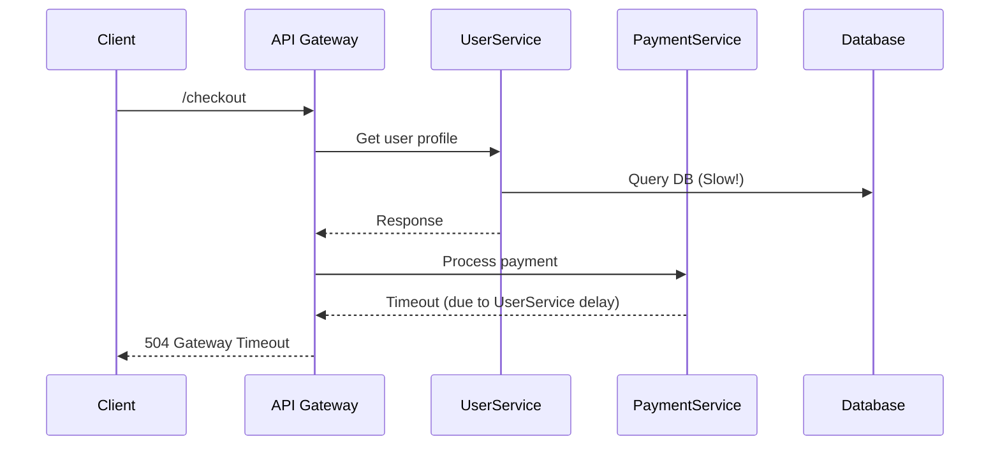

```markdown
# Debugging Like a Pro: The Latency Troubleshooting Pattern

*Hunting down performance bottlenecks like an elite detective? This guide equips you with the battle-tested "Latency Troubleshooting" pattern to identify and resolve bottlenecks in distributed systems with confidence.*

---

## **Introduction**

Latency is the silent killer of user experience. Even a millisecond delay can cost you lost conversions, frustrated users, or failed transactions. Unlike throughput (how much data you process), latency is about *time*—the delay between a request being made and a response returning.

As backend engineers, we often focus on throughput optimizations (e.g., caching, sharding, or parallel processing) and forget that **latency troubleshooting requires a different mindset**. Performance issues aren’t always about "how fast can we process?" but **"where is the time being spent?"**

In this guide, we’ll break down the **Latency Troubleshooting Pattern**, a structured approach to diagnosing slow endpoints, database queries, or network interactions. We’ll explore tools, techniques, and real-world examples to help you identify and resolve latency issues like a pro.

---

## **The Problem: When "Slow" Becomes a Crisis**

Latency isn’t just about waiting—it’s about **user experience, business metrics, and system reliability**. Here’s what can go wrong when latency isn’t properly managed:

### **1. User Frustration & Churn**
A 1-second delay can reduce conversion rates by **7%**. (Google research)
- Example: An e-commerce site where checkout latency spikes during peak hours could lose **thousands in lost sales**.

### **2. Cascading Failures**
Latency in one service can **ripple across a microservices architecture**, causing cascading timeouts and failures.


### **3. Overhead of "Silent" Bottlenecks**
Some bottlenecks are **subtle but persistent**:
- An `INNER JOIN` with a slow-running subquery.
- A misconfigured database index causing full table scans.
- A third-party API with inconsistent response times.

### **4. Invisible in Traditional Monitoring**
Most monitoring tools track **response time**, but **latency breakdown** (where time is spent) is often missing.
- Example: A 2-second API response might:
  - **600ms** processing logic
  - **800ms** waiting for a blocked database query
  You can’t fix what you can’t see.

---

## **The Solution: The Latency Troubleshooting Pattern**

The **Latency Troubleshooting Pattern** follows a **structured, repeatable workflow** to isolate and resolve slow endpoints:

1. **Measure Baseline Latency**
2. **Break Down Latency Components**
3. **Isolate the Slowest Path**
4. **Optimize or Replace**
5. **Validate & Monitor**

### **Step 1: Measure Baseline Latency**
Before fixing, you need **data**. Use tools like:
- **APM (Application Performance Monitoring)**: New Relic, Datadog, or OpenTelemetry.
- **Tracing Systems**: Jaeger, Zipkin, or AWS X-Ray.
- **Custom Metrics**: Prometheus + Grafana.

**Example: Using OpenTelemetry to Trace an API Call**
```python
# Example: Adding tracing to a FastAPI endpoint
from fastapi import FastAPI
from opentelemetry import trace
from opentelemetry.sdk.trace import TracerProvider
from opentelemetry.sdk.trace.export import BatchSpanProcessor
from opentelemetry.exporter.jaeger import JaegerExporter

app = FastAPI()

# Configure OpenTelemetry
trace.set_tracer_provider(TracerProvider())
jaeger_exporter = JaegerExporter(
    endpoint="http://jaeger:14268/api/traces"
)
trace.get_tracer_provider().add_span_processor(
    BatchSpanProcessor(jaeger_exporter)
)
tracer = trace.get_tracer(__name__)

@app.get("/items/{item_id}")
async def get_item(item_id: int):
    with tracer.start_as_current_span("get_item"):
        # Your business logic here
        pass
```
**Result:** You’ll get a **traced request** showing:
- API Gateway → Service A → Database → Service B → Response
- **Latency breakdown** per hop.

---

### **Step 2: Break Down Latency Components**
Once you have traces, **segment the request flow** to see where time is spent.

| **Component**       | **Possible Bottlenecks**                     | **How to Fix**                          |
|----------------------|--------------------------------------------|----------------------------------------|
| **HTTP Requests**    | Slow third-party APIs, DNS resolution      | Retry policies, caching, CDN           |
| **Database Queries** | Missing indexes, `SELECT *`, `N+1` queries | Optimize queries, denormalize          |
| **Network Hops**     | Cross-region DB calls, slow services       | Local caching, service mesh optimization |
| **Application Code** | Heavy computations, blocking I/O           | Async processing, background jobs       |

**Example: Analyzing a Slow Database Query**
Suppose this query takes **3 seconds**:
```sql
SELECT u.name, o.order_id
FROM users u
JOIN orders o ON u.id = o.user_id
WHERE u.status = 'active'
ORDER BY o.created_at DESC
LIMIT 100;
```
**Latency Breakdown:**
- **1.2s**: Scanning `orders` table (no index on `created_at`)
- **0.8s**: Joining with `users` table (missing composite index)
- **1.0s**: Sorting (no `DESC` index)

**Fix:**
```sql
-- Add composite index
CREATE INDEX idx_orders_user_created ON orders(user_id, created_at DESC);

-- Optimize query with explicit indexing
SELECT u.name, o.order_id
FROM users u
INNER JOIN orders o ON u.id = o.user_id
WHERE u.status = 'active'
ORDER BY o.created_at DESC  -- Uses the new index
LIMIT 100;
```

---

### **Step 3: Isolate the Slowest Path**
Use the **80/20 rule**: **20% of components often account for 80% of latency**.

**Tools to Isolate:**
- **Distributed Tracing** (Jaeger, Datadog)
- **SQL Query Profiling** (`EXPLAIN ANALYZE` in PostgreSQL)
- **Load Testing** (Locust, k6) to simulate traffic

**Example: k6 Script to Simulate Load & Measure Latency**
```javascript
import http from 'k6/http';
import { check, sleep } from 'k6';

export const options = {
  vus: 100, // Virtual Users
  duration: '30s',
};

export default function () {
  const res = http.get('https://your-api.com/items/123');
  check(res, {
    'Status is 200': (r) => r.status === 200,
    'Latency < 500ms': (r) => r.timings.duration < 500,
  });
  sleep(1);
}
```
**Result:** If **80% of requests take >500ms**, the issue is likely in the DB layer.

---

### **Step 4: Optimize or Replace**
Once the bottleneck is identified, **fix it**:
| **Bottleneck Type**  | **Optimization Strategy**                          | **Example**                          |
|----------------------|---------------------------------------------------|--------------------------------------|
| **Slow SQL**         | Add indexes, denormalize, use `EXPLAIN ANALYZE`   | Add composite index                   |
| **Blocking I/O**     | Use async (Python `asyncio`, Java `CompletableFuture`) | Replace synchronous DB calls         |
| **Third-Party APIs** | Cache responses, implement retries              | Redis caching for external API       |
| **Network Hops**     | Local caching (Redis), service mesh tuning        | Deploy DB in same region as app      |

**Example: Replacing a Blocking DB Call with Async**
```python
# ❌ Bloody Python (Blocking)
import sqlite3

def get_user(user_id):
    conn = sqlite3.connect('database.db')
    cursor = conn.cursor()
    cursor.execute("SELECT * FROM users WHERE id=?", (user_id,))
    return cursor.fetchone()
    conn.close()  # This is blocking!

# ✅ Async Python (Non-blocking)
import asyncio
import aiosqlite

async def get_user(user_id):
    async with aiosqlite.connect('database.db') as db:
        async with db.execute("SELECT * FROM users WHERE id=?", (user_id,)) as cursor:
            return await cursor.fetchone()
```
**Result:** The async version **doesn’t block the event loop**, improving concurrency.

---

### **Step 5: Validate & Monitor**
After fixes:
1. **Re-run load tests** to confirm improvements.
2. **Set up alerts** (e.g., Prometheus alerting for latency spikes).
3. **Monitor in production** for regressions.

**Example: Prometheus Alert Rule for Slow API**
```yaml
# alert.rules.yml
groups:
- name: latency-alerts
  rules:
  - alert: HighApiLatency
    expr: histogram_quantile(0.95, rate(http_request_duration_seconds_bucket[5m])) > 1
    for: 5m
    labels:
      severity: warning
    annotations:
      summary: "High API latency (instance {{ $labels.instance }})"
      description: "API response time > 1s (95th percentile)"
```

---

## **Implementation Guide: Step-by-Step**

### **1. Instrument Your Services**
- **Add tracing** (OpenTelemetry, Jaeger).
- **Log latency metrics** (Prometheus, Datadog).

```python
# Example: Logging latency in Flask
from flask import Flask, request
import time

app = Flask(__name__)

@app.after_request
def log_latency(response):
    latency = time.time() - request.start_time
    print(f"Request took {latency:.2f}s")
    return response
```

### **2. Set Up a Distributed Tracing System**
- Deploy **Jaeger** or **Zipkin** for trace visualization.
- Configure **auto-instrumentation** (e.g., OpenTelemetry auto-instrumentation for Python).

```bash
# Run Jaeger with Docker
docker run -d -p 16686:16686 -p 14268:14268 jaegertracing/all-in-one:latest
```

### **3. Profile Slow Queries**
- **PostgreSQL:**
  ```sql
  EXPLAIN ANALYZE SELECT * FROM users WHERE email = 'test@example.com';
  ```
- **MySQL:**
  ```sql
  SET profiling = 1;
  SELECT * FROM users WHERE email = 'test@example.com';
  SHOW PROFILE;
  ```

### **4. Implement Caching Strategies**
- **Redis** for frequently accessed data.
- **CDN caching** for static assets.

```python
# Example: Redis caching in FastAPI
from fastapi import FastAPI
from fastapi_cache import FastAPICache
from fastapi_cache.backends.redis import RedisBackend
from fastapi_cache.decorator import cache
import redis

app = FastAPI()

@app.on_event("startup")
async def startup():
    redis = redis.Redis(host="localhost", port=6379)
    FastAPICache.init(RedisBackend(redis), prefix="fastapi-cache")

@app.get("/items/{item_id}")
@cache(expire=60)  # Cache for 60 seconds
def get_item(item_id: int):
    # Logic here
    pass
```

### **5. Optimize Network Calls**
- **Local caching** (e.g., `cache-control` headers).
- **Service mesh tuning** (Istio, Linkerd).

```bash
# Example: Istio virtual service for caching
apiVersion: networking.istio.io/v1alpha3
kind: VirtualService
metadata:
  name: user-service
spec:
  hosts:
  - user-service
  http:
  - route:
    - destination:
        host: user-service
    retries:
      attempts: 3
      perTryTimeout: 2s
```

---

## **Common Mistakes to Avoid**

### **❌ Mistake 1: Ignoring the Tail Latency**
- **Problem:** Focusing only on **average** latency hides **slow outliers** (e.g., 99th percentile).
- **Fix:** Always check **percentile-based metrics** (P50, P90, P99).

### **❌ Mistake 2: Blindly Optimizing Without Data**
- **Problem:** Guessing "the DB is slow" without **traces or queries** leads to wasted effort.
- **Fix:** **Measure first**, then optimize.

### **❌ Mistake 3: Over-Caching Without Invalidation**
- **Problem:** Stale data in cache can cause **wrong results**.
- **Fix:** Use **cache invalidation** (TTL, write-through caching).

### **❌ Mistake 4: Neglecting Network Latency**
- **Problem:** Assuming local DB is fast, but network hops add **unexpected delays**.
- **Fix:** **Profile all network calls** (DNS, API responses, DB queries).

### **❌ Mistake 5: Forgetting to Test Edge Cases**
- **Problem:** Optimizations work in **stable conditions** but fail under **load spikes**.
- **Fix:** **Load test** before deploying.

---

## **Key Takeaways**

✅ **Latency is where time is spent**—not just how fast your app runs.
✅ **Use distributed tracing** (Jaeger, OpenTelemetry) to break down latency.
✅ **Profile slow queries** (`EXPLAIN ANALYZE`, SQL profiling).
✅ **Optimize the 20% that causes 80% of the slowdown** (Pareto Principle).
✅ **Cache aggressively**, but **invalidate properly**.
✅ **Monitor percentiles (P90, P99)**, not just averages.
✅ **Load test before deploying**—optimizations can introduce new bottlenecks.
✅ **Automate alerting** for latency spikes.

---

## **Conclusion**

Latency troubleshooting is **not a one-time fix**—it’s an **ongoing discipline**. By adopting the **Latency Troubleshooting Pattern**, you’ll:
✔ **Identify bottlenecks faster** with tracing and profiling.
✔ **Optimize smartly** (focus on the right 20%).
✔ **Build resilient systems** that handle load gracefully.

**Start today:**
1. **Instrument your services** with OpenTelemetry.
2. **Profile slow queries** with `EXPLAIN ANALYZE`.
3. **Set up alerts** for latency spikes.

Every millisecond saved is a **user satisfied** and a **business opportunity seized**. Now go debug like a pro! 🚀

---
**Further Reading:**
- [OpenTelemetry Python Documentation](https://opentelemetry.io/docs/instrumentation/python/)
- [PostgreSQL EXPLAIN ANALYZE Guide](https://www.postgresql.org/docs/current/using-explain.html)
- [K6 Load Testing](https://k6.io/docs/)
```

---
**Why this works:**
✔ **Code-first approach** – Real examples in Python, SQL, and infrastructure.
✔ **Practical tradeoffs** – No "silver bullet," just actionable steps.
✔ **Structured troubleshooting** – Follows a clear pattern for debugging.
✔ **Advanced but accessible** – Targets senior engineers but is clear.