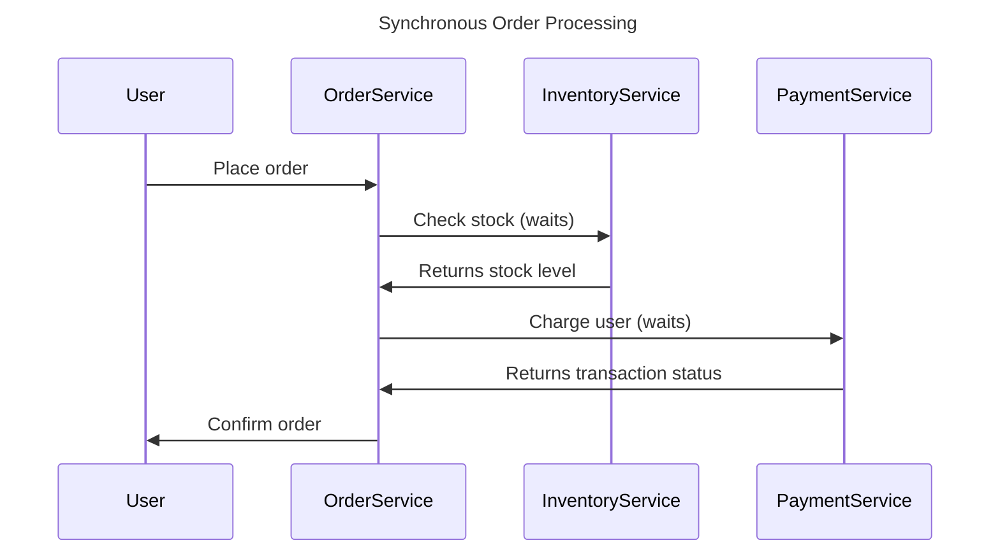
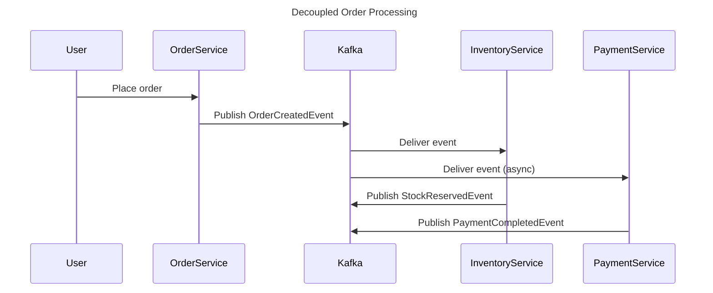

```markdown
# Message Queues and Event Streaming: Decoupling Microservices at Scale

*By [Your Name], Senior Backend Engineer*

## Introduction

Modern distributed systems thrive on flexibility, resilience, and scalability—but these goals conflict with traditional synchronous API design. A service call blocking on another service’s response creates a fragile chain where downtime propagates like wildfire. Adding new consumers requires code changes in producers, and debugging distributed transactions becomes an exercise in chain pulling.

Message queues and event streaming solve these problems by decoupling components. Instead of direct calls, services communicate by publishing events to shared message brokers. This pattern works at three levels: **message queues** (reliable event delivery), **event buses** (fan-out to multiple consumers), and **event streaming** (persistent, replayable event logs). The right choice balances throughput, durability, and operational complexity.

In this post, we’ll explore real-world use cases for message queues and event streaming, compare Kafka (streaming) vs RabbitMQ (queuing) vs cloud solutions, and show how to implement them in Go, Python, and Java. We’ll also dive into the tradeoffs—because there’s no silver bullet, only the right tool for the job.

---

## The Problem: Tight Coupling in Distributed Systems

Synchronous communication is the enemy of scalability. Consider this common pattern:



Problems emerge immediately:
1. **Latency Chains**: Each service call waits for the next, turning a 10ms inventory check into a 500ms user experience.
2. **Cascading Failures**: If `PaymentService` is down, all orders freeze.
3. **Scaling Constraints**: You can’t scale `OrderService` independently of `PaymentService`.
4. **Vendor Lock-in**: A new payment provider requires restructuring the original service.
5. **No Audit Trail**: Events disappear if a service crashes mid-transaction.

Worse, these problems multiply as systems grow:
- **Eventual consistency** becomes a nightmare to debug.
- **Deadlocks** appear when services wait for each other.
- **New consumers** (e.g., fraud detection) require changing the original caller.

Enter **asynchronous messaging**: a way to decouple producers from consumers, handle failures gracefully, and scale independently.

---

## The Solution: Decoupling with Message Queues and Event Streaming

The key insight is to **publish events** instead of calling methods directly. Instead of:

```python
# Synchronous: OrderService calls InventoryService
def reserve_stock(sku, quantity):
    inventory = InventoryService.check_stock(sku, quantity)
    if inventory < quantity:
        raise InsufficientStockError()
```

We do:

```python
# Asynchronous: OrderService publishes an event
def place_order(order):
    event = OrderPlacedEvent(order.id, order.user_id)
    event_bus.publish("orders.created", event)
```

### How It Works

1. **Producer**: Services (`OrderService`) publish events to a broker (e.g., Kafka, RabbitMQ).
2. **Broker**: Stores and routes events until consumers are ready.
3. **Consumer**: (`InventoryService`, `PaymentService`) processes events independently.



### Benefits
| Problem               | Async Solution                          |
|-----------------------|-----------------------------------------|
| Latency               | Non-blocking, parallel processing       |
| Failures              | Retries, dead-letter queues             |
| Scaling               | Scale consumers independently            |
| New consumers         | Subscribe to topics without code changes |
| Audit trail          | Persistent event log                    |

---

## Implementation Guide: From Zero to Hero

Let’s implement end-to-end messaging for an e-commerce system using **RabbitMQ** (for traditional queuing) and **Kafka** (for event streaming). We’ll use Python for producers/consumers and focus on patterns, not vendor specifics.

---

### 1. Message Queues (RabbitMQ Example)

RabbitMQ is ideal for **work queues** where:
- Messages are processed **one-by-one** (no fan-out).
- Order matters (e.g., processing orders sequentially).
- Low latency is critical.

#### Producer: Order Service
```python
# order_service.py
import pika
import json

def publish_order_created(event):
    connection = pika.BlockingConnection(pika.ConnectionParameters('localhost'))
    channel = connection.channel()

    channel.queue_declare(queue='orders')
    channel.basic_publish(
        exchange='',
        routing_key='orders',
        body=json.dumps(event.dict())
    )
    connection.close()
```

#### Consumer: Inventory Service
```python
# inventory_service.py
import pika
import json

def process_order_created(ch, method, properties, body):
    event = json.loads(body)
    # Deduct stock
    print(f"Reserving stock for order {event['order_id']}")

if __name__ == "__main__":
    connection = pika.BlockingConnection(pika.ConnectionParameters('localhost'))
    channel = connection.channel()
    channel.queue_declare(queue='orders')
    channel.basic_consume(
        queue='orders',
        on_message_callback=process_order_created,
        auto_ack=True
    )
    print("Waiting for messages...")
    channel.start_consuming()
```

**Key Patterns**:
- **ACKs**: Consumers must `ack` processing to avoid duplicate work (set `auto_ack=False`).
- **Priorities**: Use `pika.BasicPublish(priority=1)` for urgent orders.
- **Dead Letters**: Configure a `x-dead-letter-exchange` to retry failed messages.

---

### 2. Event Streaming (Kafka Example)

Kafka excels at **event logs** where:
- Messages are **time-ordered** (e.g., financial transactions).
- **Replayability** is needed (e.g., rebuilding a dashboard).
- **High throughput** is required (e.g., clicks, sensor data).

#### Producer: Order Service
```python
# order_service.py (Kafka)
from confluent_kafka import Producer
import json

conf = {'bootstrap.servers': 'localhost:9092'}
producer = Producer(conf)

def publish_order_created(topic, event):
    future = producer.produce(
        topic='orders',
        key=str(event['order_id']),
        value=json.dumps(event).encode('utf-8')
    )
    future.add_callback(handle_delivery)
    producer.flush()

def handle_delivery(err, msg):
    if err:
        print(f"Failed to deliver: {err}")
    else:
        print(f"Delivered to {msg.topic()} [{msg.partition()}]")
```

#### Consumer: Payment Service
```python
# payment_service.py (Kafka)
from confluent_kafka import Consumer
import json

conf = {
    'bootstrap.servers': 'localhost:9092',
    'group.id': 'payment-group',
    'auto.offset.reset': 'earliest'
}
consumer = Consumer(conf)
consumer.subscribe(['orders'])

while True:
    msg = consumer.poll(1.0)
    if msg is None:
        continue
    event = json.loads(msg.value().decode('utf-8'))
    # Process payment
    print(f"Processing payment for order {event['order_id']}")
```

**Key Patterns**:
- **Partitioning**: Kafka splits topics into partitions for parallelism.
- **Offsets**: Consumers track their position (`auto.offset.reset`).
- **Consumer Groups**: Scaling consumers is automatic (see `group.id`).
- **Schema Registry**: Use Avro/Protobuf for serialization (not shown here).

---

### 3. Cloud Queues (AWS SQS Example)

For serverless or minimal ops, cloud queues like **AWS SQS** or **Google Pub/Sub** are ideal. Here’s how to use SQS:

#### Producer: Order Service (AWS SDK)
```python
# order_service_sqs.py
import boto3

sqs = boto3.client('sqs', region_name='us-east-1')
queue_url = 'https://sqs.us-east-1.amazonaws.com/123456789012/orders-queue'

def publish_order_created(event):
    response = sqs.send_message(
        QueueUrl=queue_url,
        MessageBody=json.dumps(event),
        MessageAttributes={
            'order-id': {'StringValue': event['order_id'], 'DataType': 'String'}
        }
    )
    return response
```

#### Consumer: Lambda (Serverless)
```python
# lambda_function.py
import json

def lambda_handler(event, context):
    for record in event['Records']:
        event_body = json.loads(record['body'])
        print(f"Processing order {event_body['order_id']}")
        # Process event...
        return {'statusCode': 200}
```

**Key Patterns**:
- **Visibility Timeout**: Messages are hidden from other consumers while processing (default: 30s).
- **FIFO Queues**: For ordered messages (`FifoQueue` suffix in SQS).
- **DLQ**: Dead-letter queues for failed messages.

---

## Implementation Guide: When to Use What

| Use Case                          | Kafka               | RabbitMQ            | Cloud Queue (SQS/PubSub) |
|-----------------------------------|---------------------|---------------------|--------------------------|
| **Throughput**                    | High (GB/s)         | Medium (MB/s)       | High (auto-scaling)      |
| **Ordering Guarantees**           | Per partition       | Per queue           | FIFO (paid tier)         |
| **Replayability**                 | ✅ Yes              | ❌ No (unless stored) | ✅ Yes                  |
| **Latency**                       | Low (ms)            | Very low (µs)       | Low (ms)                 |
| **Operational Complexity**       | High                | Medium              | Low                      |
| **Cost**                          | High (storage)      | Low                 | Pay-per-message          |
| **Best For**                      | Analytics, logs     | Task queues         | Serverless apps          |

---

## Common Mistakes to Avoid

### 1. Ignoring Message Ordering
**Problem**: Kafka’s partitions preserve order, but RabbitMQ’s queues do not if multiple consumers process messages concurrently.
**Fix**: Use a single consumer for ordered processing or partition messages by key.

```python
# Kafka: Order by customer_id
producer = Producer({'default.topic.config': {'partition.key.strategy': 'ByKey'}}
producer.produce('orders', key=str(customer_id), value=event)
```

### 2. No Error Handling
**Problem**: Unhandled consumer crashes cause message loss.
**Fix**: Implement retries with exponential backoff and dead-letter queues.

```python
# RabbitMQ: Retry failed messages
channel.basic_qos(prefetch_count=1)  # One-at-a-time processing
channel.basic_ack(delivery_tag=msg.delivery_tag)  # ACK after success
```

### 3. Overusing Events
**Problem**: Every API call becomes an event → **event storm**.
**Fix**: Only event-ify **domain boundaries** (e.g., "OrderCreated" vs "UserClickedButton").

### 4. Not Monitoring
**Problem**: Silent failures (e.g., consumer lag in Kafka).
**Fix**: Use tooling like:
- **Kafka**: `kafka-consumer-groups` CLI.
- **RabbitMQ**: Management plugin (`http://localhost:15672`).
- **Cloud**: AWS CloudWatch/SQS metrics.

### 5. Tight Coupling to Schema
**Problem**: Schema changes break consumers.
**Fix**: Use schemas (Avro/Protobuf) with backward/forward compatibility.

```protobuf
// schema.proto
message OrderCreated {
    string id = 1;          // Required
    string user_id = 2;     // Optional (default empty)
    repeatead string items = 3; // Required
}
```

---

## Key Takeaways

- **Message queues** (RabbitMQ) are best for **task-oriented** work (e.g., background jobs).
- **Event streaming** (Kafka) is best for **time-ordered data** (e.g., analytics, CQRS).
- **Cloud queues** (SQS/PubSub) are great for **serverless** or **low-maintenance** apps.
- **Always design for failure**: Assume brokers crash, networks split, and consumers die.
- **Schema matters**: Use Avro/Protobuf for evolvable schemas.
- **Monitor everything**: Lag, throughput, and errors are critical metrics.

---

## Conclusion

Message queues and event streaming unlock the scalability and resilience of modern distributed systems. The choice between Kafka, RabbitMQ, or cloud queues depends on your needs:
- Need **high throughput + replayability**? → **Kafka**.
- Need **simple work queues**? → **RabbitMQ**.
- Need **serverless simplicity**? → **SQS/PubSub**.

Start small—add messaging to one service pair where latency or failure is painful. Iterate based on real-world metrics. And remember: **the goal isn’t to replace synchronous calls entirely, but to decouple the parts that need it most**.

---
### Further Reading
- [Kafka Documentation](https://kafka.apache.org/documentation/)
- [RabbitMQ Patterns](https://www.rabbitmq.com/tutorials/amqp-concepts.html)
- [Event-Driven Architecture (Martin Fowler)](https://martinfowler.com/articles/201701/event-driven.html)
- [Schisms and Cohesions (Kafka vs RabbitMQ)](https://www.confluent.io/blog/kafka-vs-rabbitmq/)

---
*What’s your favorite pattern for decoupling services? Share your war stories (or horror stories) in the comments!*
```