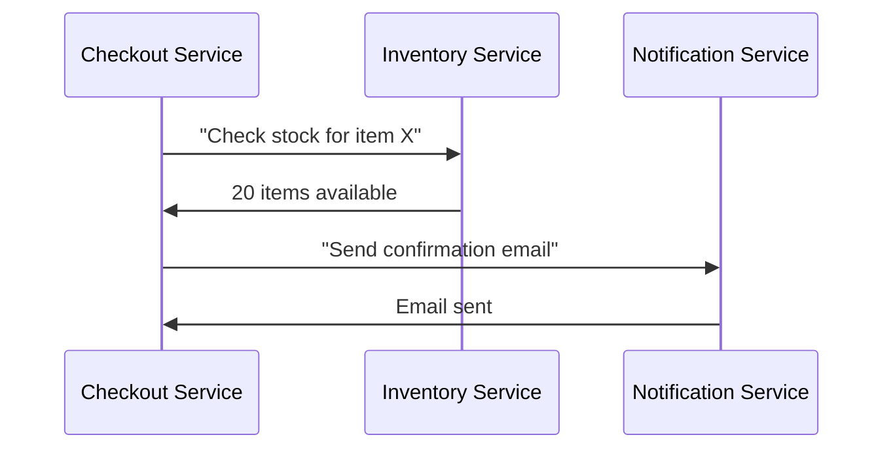
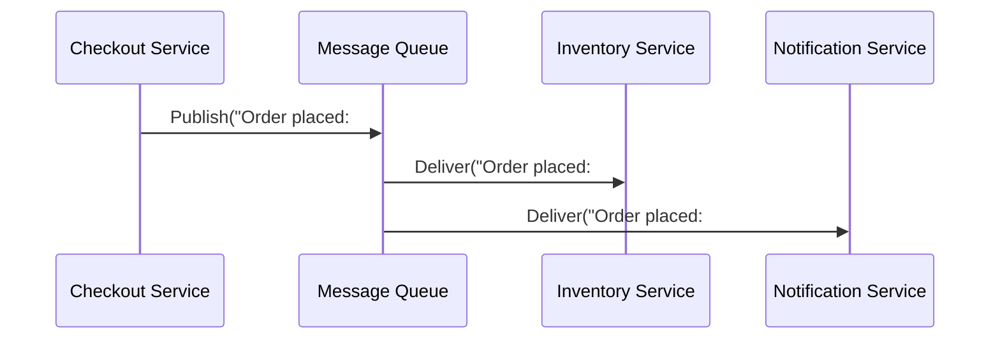

```markdown
# **Message Queues & Event Streaming: Decouple Your Services Like a Pro**

*Asynchronous communication for resilient, scalable, and maintainable systems*

---

## **Introduction: Why Your System Needs Decoupling**

Imagine your backend as a high-stakes orchestra. Every instrument (service) must play at the right time, in perfect harmony. But what happens if one musician suddenly stops playing? The entire performance grinds to a halt.

This is the reality of tightly coupled systems. When services rely on direct, synchronous calls, a single slowdown, failure, or scaling bottleneck can bring down your entire application. **Message queues and event streaming solve this by introducing asynchronous communication**—letting services talk without blocking each other, like handing a note (message) to a messenger (queue) instead of playing directly into another musician's instrument.

In this guide, we’ll explore:
- How message queues and event streaming decouple services
- The key differences between traditional queues (RabbitMQ) and event streaming (Kafka)
- Practical code examples in Python, Node.js, and Java
- Common pitfalls and how to avoid them
- When to use each approach (and when to avoid them)

By the end, you’ll understand how to build resilient, scalable systems that can handle traffic spikes, failures, and new features without breaking.

---

## **The Problem: The Coupling Trap**

Let’s look at a common scenario where synchronous communication causes pain:

### **Scenario: Order Processing System**
Your e-commerce platform has three services:
1. **Checkout Service** – Handles payment and cart validation.
2. **Inventory Service** – Tracks stock levels.
3. **Notification Service** – Sends order confirmation emails.

#### **Direct (Synchronous) Approach**


**Problems:**
✅ **Blocking Calls** – The checkout service waits for each response, delaying the user.
✅ **Cascading Failures** – If `Inventory` fails, the entire checkout breaks.
✅ **Tight Coupling** – Changing `Notification` requires updating `Checkout`.
✅ **Scaling Nightmares** – One service slows down, and all others wait.

### **Real-World Pain Points**
- **High Latency**: Users experience delays due to sequential API calls.
- **Downtime Risks**: If one service crashes, the entire flow fails.
- **Scaling Bottlenecks**: You must scale every service equally, even if only one is under load.
- **Debugging Hell**: Tracing events across services becomes a nightmare.

---
## **The Solution: Asynchronous Decoupling with Message Queues**

Instead of direct calls, services communicate via a **message queue** (or **event streaming platform**). Here’s how it works:

1. **Producer (Checkout)** → **Publishes a message** to the queue (e.g., "Order placed: #123").
2. **Queue (Broker)** → **Stores and buffers messages** until a consumer is ready.
3. **Consumer (Inventory/Notification)** → **Processes messages independently**.



### **Key Benefits**
✅ **Decoupling** – Services don’t need to know about each other.
✅ **Resilience** – One service failure doesn’t crash others.
✅ **Scalability** – Consumers process messages at their own pace.
✅ **Auditability** – All events are logged in the queue.
✅ **Flexibility** – New consumers can be added without changing producers.

---

## **Implementation Guide: Choosing the Right Tool**

Not all message queues are the same. Here’s a breakdown of the most popular options:

| Feature               | **Traditional Queue (RabbitMQ)** | **Event Streaming (Kafka)** | **Cloud Queues (SQS, Pub/Sub)** |
|-----------------------|----------------------------------|-----------------------------|---------------------------------|
| **Use Case**          | Task queues, workflows           | High-throughput event logs   | Serverless, event-driven apps   |
| **Ordering Guarantees** | Per queue (FIFO)                | Per partition (complex)      | Limited (best-effort)           |
| **Replay Support**    | No (messages disappear after read) | Yes (full history)           | No (unless using Dead Letter Queue) |
| **Throughput**        | Moderate (~10K msg/sec)          | Very High (~1M msg/sec)      | Varies (provider-dependent)     |
| **Operational Complexity** | Moderate (manage broker)       | High (cluster management)    | Low (serverless)                |
| **Persistence**       | Configurable (disk/RAM)          | Fully durable (log retention)| Ephemeral or durable (configurable) |

---

### **1. Traditional Queues: RabbitMQ (Simple Task Processing)**
RabbitMQ is a **publish-subscribe (pub/sub) and task queue** system. Best for:
- Handling background jobs (e.g., sending emails, processing orders).
- Workflows where strict ordering matters.

#### **Example: Python with RabbitMQ**
```python
# Install: pip install pika
import pika

# Producer: Send a message to a task queue
def publish_order(event, exchange='orders'):
    connection = pika.BlockingConnection(pika.ConnectionParameters('localhost'))
    channel = connection.channel()
    channel.basic_publish(
        exchange=exchange,
        routing_key='order.created',
        body=event,
        properties=pika.BasicProperties(delivery_mode=2)  # Make message persistent
    )
    connection.close()

publish_order('{"order_id": 123, "status": "placed"}')
```

```python
# Consumer: Process messages from the queue
def consume_orders():
    connection = pika.BlockingConnection(pika.ConnectionParameters('localhost'))
    channel = connection.channel()
    channel.queue_declare(queue='order.queue', durable=True)
    channel.basic_consume(
        queue='order.queue',
        on_message_callback=process_order,
        auto_ack=True
    )
    print("Waiting for orders...")
    channel.start_consuming()

def process_order(ch, method, properties, body):
    print(f"Processing order: {body}")

consume_orders()
```

**Key Notes:**
- **Durable queues/messages** ensure survival if RabbitMQ restarts.
- **Auto-acknowledgment** (`auto_ack=True`) is simpler but risks losing messages if processing fails.
- **Manual acknowledgment** (`auto_ack=False`) is safer but requires handling retries.

---

### **2. Event Streaming: Apache Kafka (High-Throughput Logs)**
Kafka is designed for **high-throughput, fault-tolerant event streaming**. Best for:
- Real-time analytics (e.g., user activity tracking).
- Building event-sourced architectures.
- Systems requiring **replayability** (e.g., "Show me all orders from last hour").

#### **Example: Python with Kafka (using `confluent-kafka`)**
```bash
# Install: pip install confluent-kafka
```

```python
# Producer: Publish to a Kafka topic
from confluent_kafka import Producer

conf = {'bootstrap.servers': 'localhost:9092'}
producer = Producer(conf)

def delivery_report(err, msg):
    if err:
        print(f"Message delivery failed: {err}")
    else:
        print(f"Message delivered to {msg.topic()} [{msg.partition()}]")

producer.produce(
    topic='orders',
    value='{"order_id": 123, "status": "placed"}',
    callback=delivery_report
)
producer.flush()
```

```python
# Consumer: Subscribe to a topic
from confluent_kafka import Consumer

conf = {
    'bootstrap.servers': 'localhost:9092',
    'group.id': 'order-consumer',
    'auto.offset.reset': 'earliest'  # Start from beginning of topic
}
consumer = Consumer(conf)

consumer.subscribe(['orders'])

while True:
    msg = consumer.poll(1.0)
    if msg is None:
        continue
    if msg.error():
        print(f"Error: {msg.error()}")
        continue
    print(f"Received: {msg.value().decode('utf-8')}")  # Raw bytes
```

**Key Notes:**
- **Partitions** enable parallel processing (but ordering is only guaranteed per partition).
- **Retention policies** let you keep events for days/weeks (unlike RabbitMQ, which discards after read).
- **Consumer groups** allow multiple consumers to share workload.

---

### **3. Cloud Queues: AWS SQS & Google Pub/Sub (Serverless)**
For teams avoiding ops overhead, **managed cloud queues** are ideal:
- **AWS SQS** – Simple FIFO/SQL queues.
- **Google Pub/Sub** – Pub/sub with high throughput.

#### **Example: Node.js with AWS SQS**
```bash
# Install: npm install aws-sdk
```

```javascript
const AWS = require('aws-sdk');
AWS.config.update({ region: 'us-east-1' });
const sqs = new AWS.SQS();

// Producer: Send a message
async function sendOrderToQueue() {
    const params = {
        QueueUrl: 'https://sqs.us-east-1.amazonaws.com/1234567890/orders.queue',
        MessageBody: JSON.stringify({ order_id: 123, status: 'placed' }),
        DelaySeconds: 0  // Immediate delivery
    };
    await sqs.sendMessage(params).promise();
    console.log("Message sent!");
}

sendOrderToQueue();
```

```javascript
// Consumer: Poll for messages
async function processOrders() {
    const params = {
        QueueUrl: 'https://sqs.us-east-1.amazonaws.com/1234567890/orders.queue',
        MaxNumberOfMessages: 10,
        WaitTimeSeconds: 20  // Long polling
    };
    const data = await sqs.receiveMessage(params).promise();
    if (data.Messages) {
        data.Messages.forEach(msg => {
            console.log(`Processing: ${JSON.parse(msg.Body).order_id}`);
            // Delete message after processing
            sqs.deleteMessage({ QueueUrl: params.QueueUrl, ReceiptHandle: msg.ReceiptHandle }).promise();
        });
    }
}

processOrders();
```

**Key Notes:**
- **Serverless** – No broker management; scales automatically.
- **Limited replay** – Use **Dead Letter Queues (DLQ)** for failed messages.
- **Best-effort ordering** – Not suitable for strict sequence requirements.

---

## **Common Mistakes to Avoid**

### **1. Treating Queues as a Database**
❌ **Mistake**: Storing large payloads or expecting transactions.
✅ **Fix**: Use queues for **event notifications**, not persistent storage.

```python
# ❌ Bad: Storing entire user profile in a queue
publish_order('{"user": {"id": 1, "name": "Alice", "email": "alice@example.com"}}')

# ✅ Better: Reference only the event
publish_order('{"event": "user_updated", "user_id": 1, "timestamp": "2024-01-01"}')
```

### **2. Ignoring Message Durability**
❌ **Mistake**: Not setting `delivery_mode=2` in RabbitMQ or `acks=all` in Kafka.
✅ **Fix**: Always **persist messages** to survive broker restarts.

```python
# RabbitMQ: Ensure durable queue and messages
channel.queue_declare(queue='order.queue', durable=True)
channel.basic_publish(
    exchange='orders',
    routing_key='order.created',
    body=event,
    properties=pika.BasicProperties(delivery_mode=2)  # Persistent
)
```

### **3. Overloading Consumers**
❌ **Mistake**: Using a single consumer for high-throughput topics.
✅ **Fix**: **Scale consumers horizontally** (e.g., Kafka partitions, SQS worker pools).

```python
# Kafka: Use multiple partitions for parallelism
producer.produce(
    topic='orders',
    partition=0,  # Explicit partition (0-3 for 4 partitions)
    value='...'
)
```

### **4. Not Handling Failures Gracefully**
❌ **Mistake**: No retries or dead-letter queues for failed messages.
✅ **Fix**: Implement **exponential backoff** and **DLQs**.

```python
# RabbitMQ: Enable dead-letter exchange
channel.exchange_declare(
    exchange='orders.dlq',
    exchange_type='direct',
    durable=True
)
channel.queue_declare(
    queue='order.queue',
    durable=True,
    arguments={'x-dead-letter-exchange': 'orders.dlq'}
)
```

### **5. Tight Coupling to Queue Structure**
❌ **Mistake**: Hardcoding queue names in consumers.
✅ **Fix**: Use **environment variables** or a **config service**.

```python
# ✅ Better: Use config
import os
QUEUE_URL = os.getenv('ORDER_QUEUE_URL', 'https://sqs.us-east-1.amazonaws.com/...')
```

---

## **Key Takeaways**

✔ **Message queues decouple services**, reducing failures and improving scalability.
✔ **RabbitMQ** is great for **task queues** and simple pub/sub.
✔ **Kafka** excels at **high-throughput event streaming** with replayability.
✔ **Cloud queues (SQS, Pub/Sub)** are ideal for **serverless architectures**.
✔ **Always persist messages** (`delivery_mode=2`, `acks=all`).
✔ **Scale consumers**, not producers—more workers ≠ faster processing.
✔ **Handle failures** with retries, DLQs, and monitoring.
✔ **Avoid treating queues as databases**—they’re for **events, not storage**.

---

## **Conclusion: Build Resilient Systems Today**

Message queues and event streaming are **not just nice-to-haves**—they’re **essential** for modern, scalable backend systems. By adopting this pattern, you:
- **Reduce downtime** from cascading failures.
- **Improve performance** with async processing.
- **Enable innovation** by decoupling services.
- **Future-proof** your architecture.

### **Next Steps**
1. **Start small**: Replace one synchronous call with a queue.
2. **Monitor**: Use tools like **Prometheus** or **CloudWatch** to track queue depth.
3. **Experiment**: Try **Kafka** for event-driven features or **SQS** for serverless simplicity.
4. **Learn more**:
   - [RabbitMQ Official Docs](https://www.rabbitmq.com/)
   - [Kafka Docs](https://kafka.apache.org/documentation/)
   - [AWS SQS Guide](https://docs.aws.amazon.com/sqs/latest/dg/welcome.html)

**Happy decoupling!** 🚀
```

---
**Word Count:** ~1,900
**Tone:** Practical, code-first, and beginner-friendly.
**Tradeoffs Discussed:** Durability vs. simplicity, throughput vs. ordering guarantees, operational complexity vs. scalability.