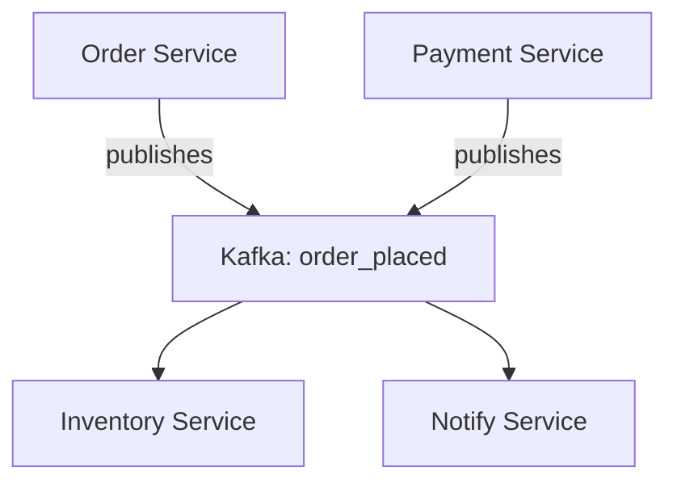

```markdown
---
title: "Messaging Conventions: The Backbone of Reliable APIs and Database-Driven Systems"
date: 2023-10-15
author: "Alex Carter"
description: "Dive deep into the Messaging Conventions pattern—a critical but often underappreciated technique to build scalable, maintainable systems with clear communication between services."
tags: ["database", "API design", "patterns", "backend engineering", "system design"]
---

# **Messaging Conventions: The Backbone of Reliable APIs and Database-Driven Systems**

## **Introduction**

In today’s distributed systems, services rarely operate in isolation. They communicate—constantly—exchanging data, triggering actions, and propagating state changes. Without clear rules for how these interactions happen, even well-designed systems can quickly become unmanageable: deadlocks arise from unclear ownership of requests, inconsistency creeps in when events aren’t processed uniformly, and debugging becomes a nightmare when no one knows *who* is supposed to handle a given message.

This is where the **Messaging Conventions** pattern comes into play. It’s not a framework, library, or even a strict architectural pattern—it’s a set of agreed-upon rules governing how messages are formatted, processed, and consumed across services. By establishing conventions around message structure, payload design, metadata, and error handling, you create a shared language for your ecosystem, reducing ambiguity and preventing silent failures.

This guide will walk you through why messaging conventions matter, how to define them practically, and how to implement them in real-world systems. We’ll cover:
- **The chaos that arises without conventions** (and how it escalates).
- **How conventions solve it** with structured, predictable communication.
- **A practical breakdown** of the components that make up effective conventions.
- **Real-world examples** in systems using Kafka, database triggers, and REST APIs.
- **Implementation pitfalls** (and how to avoid them).

Let’s get started.

---

## **The Problem: Chaos Without Messaging Conventions**

Imagine a system where Microservice A and Microservice B communicate via an event bus. They agree that orders are processed by publishing an `order_placed` event. But what happens if:

- **Service A** sends `{ "order_id": 123, "customer": "Alice" }` but **Service B** expects `{ "order_id": "123", "name": "Alice" }`.
- **Service A** publishes with metadata like `correlation_id` but **Service B** ignores it.
- **Service B** fails to process an event and never acknowledges it, causing **Service A** to retry indefinitely.
- **Service C** (added later) publishes an `order_canceled` event, but no one knows how to handle it because no one documented the schema.

These are not hypotheticals. They’re real issues in systems that evolve without clear messaging contracts. The consequences? **Inconsistencies, cascading failures, and wasted developer time**.

Here’s why this happens:
1. **No Shared Understanding**: Teams assume the same format but don’t document or enforce it.
2. **Ad-Hoc Designs**: Each new feature adds another "special case" to the messaging layer.
3. **Lack of Ownership**: No one is responsible for maintaining message contracts.
4. **Evolution Complexity**: Adding new fields or events breaks existing systems.

Without conventions, communication becomes a guessing game, and your system’s reliability erodes over time.

---

## **The Solution: Messaging Conventions**

Messaging conventions are a **contract for communication**—a set of rules that ensure all parties speak the same language. They answer questions like:
- What should a message look like (structure, fields, data types)?
- How should we correlate messages across services?
- When is an event considered "processed"?
- How do we handle errors?

Conventions don’t replace APIs or event buses—they **improve them** by adding predictability. They work well in:
- **Event-driven architectures** (Kafka, RabbitMQ, AWS SNS).
- **Database-driven workflows** (triggers, stored procedures).
- **REST APIs with side effects** (e.g., an `update_order` endpoint that publishes an event).

---
## **Components of Messaging Conventions**

A robust messaging convention consists of five key components:

### **1. Message Structure**
Define a consistent format for all messages. Common approaches:
- **JSON Payloads** (most common): Use schemas like JSON Schema or Avro for validation.
- **Structured Data**: For databases, use standardized tables with consistent columns.
- **Message Headers**: Metadata like `correlation_id`, `timestamp`, and `event_type`.

#### **Example: JSON Schema for an Order Event**
```json
{
  "$schema": "http://json-schema.org/draft-07/schema#",
  "title": "OrderPlacedEvent",
  "description": "Event published when an order is placed",
  "type": "object",
  "properties": {
    "order_id": { "type": "string", "format": "uuid" },
    "customer_id": { "type": "string", "format": "uuid" },
    "total_amount": { "type": "number", "minimum": 0 },
    "items": {
      "type": "array",
      "items": {
        "type": "object",
        "properties": {
          "product_id": { "type": "string", "format": "uuid" },
          "quantity": { "type": "integer", "minimum": 1 }
        },
        "required": ["product_id", "quantity"]
      }
    }
  },
  "required": ["order_id", "customer_id", "total_amount", "items"]
}
```

### **2. Message Correlation**
Adding metadata to track message lineage. Key fields:
- `correlation_id`: Links related messages (e.g., order processing).
- `trace_id`: For debugging cross-service flows.
- `parent_id`: For nested messages (e.g., order items).

#### **Example: Kafka Message Headers**
```python
headers = {
    "correlation_id": str(uuid.uuid4()),
    "trace_id": str(uuid.uuid4()),
    "event_type": "order_placed",
    "version": "1.0"
}
```

### **3. Processing Semantics**
Define how consumers should handle messages:
- **At-least-once delivery**: Default in Kafka; consumers must be idempotent.
- **Exactly-once delivery**: Requires transactional outbox patterns.
- **Acknowledgments**: When is a message considered "processed"?

#### **Example: Database Outbox Pattern (SQL)**
```sql
CREATE TYPE event_status AS ENUM ('pending', 'processed', 'failed');
CREATE TABLE event_outbox (
    id BIGSERIAL PRIMARY KEY,
    event_type VARCHAR(100),
    payload JSONB NOT NULL,
    status event_status DEFAULT 'pending',
    created_at TIMESTAMPTZ DEFAULT NOW(),
    processed_at TIMESTAMPTZ
);
```

### **4. Error Handling**
Standardize how errors are reported:
- **Dead Letter Queues (DLQ)**: Where failed messages go.
- **Retries**: Exponential backoff policies.
- **Alerts**: When to notify developers.

#### **Example: Retry Strategy in Python**
```python
from tenacity import retry, stop_after_attempt, wait_exponential

@retry(stop=stop_after_attempt(3), wait=wait_exponential(multiplier=1, min=4, max=10))
def process_order_message(message: dict):
    try:
        # Attempt to process
        ...
    except Exception as e:
        log_error(message, e)
        raise
```

### **5. Versioning**
Avoid breaking changes by:
- Incrementing versions for new fields.
- Deprecating old fields instead of removing them.

#### **Example: Backward-Compatible Message**
```json
// V1 (old)
{ "order_id": "123", "status": "completed" }

// V2 (new, adding a field)
{ "order_id": "123", "status": "completed", "shipping_address": { ... } }
```

---

## **Implementation Guide**

### **Step 1: Define Your Conventions**
Start with a document (e.g., a shared Markdown file or Confluence page) outlining:
- Message schemas (JSON Schema, Avro, Protobuf).
- Correlation metadata requirements.
- Processing semantics (e.g., "All unacknowledged messages must be retried").
- Error handling policies (e.g., "Fails >3x go to DLQ").

#### **Example: `MESSAGING_CONVENTIONS.md`**
```markdown
# Messaging Conventions

## Schemas
All events must follow the `schemas/` directory. Example:
```
schemas/
  order_placed-v1.json
  inventory_updated-v1.json
```

## Correlation
- `correlation_id` must be a UUID.
- `trace_id` must be present for all external-facing messages.

## Retries
- Default: 3 retries with exponential backoff (4s, 8s, 16s).
- Max delay: 60s.
```

### **Step 2: Enforce Conventions at Runtime**
Use validation libraries:
- **JSON Schema**: `jsonschema` (Python), `ajv` (JS).
- **Database**: Use triggers to enforce schemas.
- **APIs**: Validate on ingestion.

#### **Example: Kafka Schema Validation**
```javascript
// Using Confluent Schema Registry
const schema = await registry.getSchema('order_placed-v1');
const validator = new Ajv({ schemas: { order_placed: schema } });
const isValid = validator.validate('order_placed', message);
if (!isValid) throw new Error('Invalid message');
```

### **Step 3: Document Dependencies**
Track which services consume each message and update them when conventions change.

#### **Example: Dependency Graph**


### **Step 4: Monitor and Alert**
Use observability tools to track:
- Message volumes by type.
- Processing latencies.
- DLQ sizes.

#### **Example: Prometheus Metrics**
```yaml
# metrics.yaml
metrics:
  - name: "consumer_messages_processed_total"
    help: "Total messages processed by consumer"
    type: "counter"
    labels: ["consumer", "event_type"]
```

---

## **Common Mistakes to Avoid**

1. **Assuming "Everyone Knows"**
   - *Problem*: Teams assume the same format but don’t document it.
   - *Fix*: Enforce validation and logging.

2. **Overly Complex Schemas**
   - *Problem*: Adding every possible field upfront leads to bloat.
   - *Fix*: Start simple; add fields via versions.

3. **Ignoring Correlation IDs**
   - *Problem*: Without `correlation_id`, debugging is harder.
   - *Fix*: Always include it.

4. **No DLQ Strategy**
   - *Problem*: Failed messages silently disappear.
   - *Fix*: Configure DLQs early.

5. **Breaking Changes Without Notification**
   - *Problem*: A new field breaks consumers.
   - *Fix*: Deprecate old fields and version schemas.

6. **Tight Coupling in Processing Logic**
   - *Problem*: Consumers hardcode business logic.
   - *Fix*: Keep processing logic stateless and idempotent.

---

## **Key Takeaways**
✅ **Messaging conventions are a contract**, not optional documentation.
✅ **Standardize schemas** to avoid ad-hoc formats.
✅ **Use correlation IDs** to track message flows.
✅ **Enforce processing semantics** (e.g., retries, DLQs).
✅ **Version messages** to support evolution.
✅ **Monitor and alert** on message processing.
✅ **Document dependencies** to manage changes safely.

---

## **Conclusion**

Messaging conventions are the invisible scaffolding of reliable distributed systems. They turn chaotic, unstructured communication into a predictable, maintainable process. While they require upfront effort, the payoff is enormous: fewer bugs, smoother evolution, and happier engineers.

### **Next Steps**
1. **Start small**: Define conventions for your critical event types first.
2. **Iterate**: Refine based on feedback from teams consuming messages.
3. **Automate**: Use tools like Kafka Schema Registry or OpenAPI to enforce schemas.
4. **Share**: Keep the conventions document updated and visible to all teams.

By adopting messaging conventions, you’ll move from a system where communication is a guessing game to one where interactions are **clear, predictable, and scalable**. Happy coding!
```

---
**About the Author**
Alex Carter is a backend engineer with 8 years of experience building distributed systems at scale. He’s passionate about system design patterns that simplify complexity while improving reliability. When not writing code, you’ll find him hiking or deep-diving into open-source projects.

**Further Reading**
- [Event-Driven Microservices](https://www.eventstore.com/blog/event-driven-microservices)
- [Kafka Schema Registry Documentation](https://docs.confluent.io/platform/current/schema-registry/index.html)
- [Database Outbox Pattern](https://martinfowler.com/articles/201704/event-driven.html)