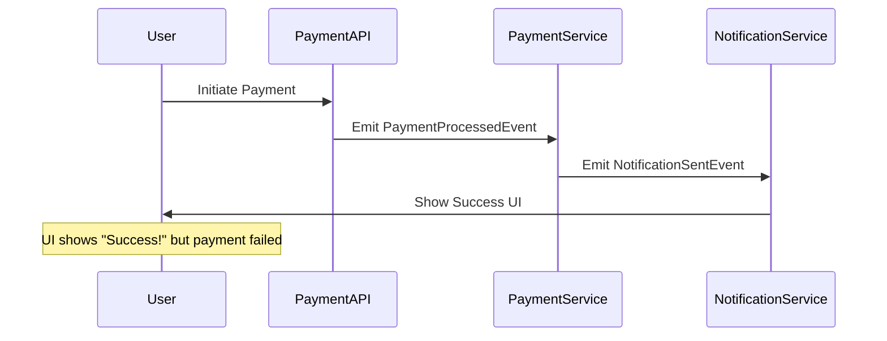

```markdown
---
title: "Messaging Debugging: A Practical Guide for Backend Developers"
date: 2023-10-15
tags: ["backend", "devops", "messaging", "debugging", "asynchronous"]
description: "Learn how to debug messaging systems effectively in distributed applications. From logging to tracing, we cover the tools, patterns, and pitfalls to help you build resilient systems."
author: John Doe
---

# **Messaging Debugging: A Practical Guide for Backend Developers**

When building modern distributed systems, messaging is everywhere—whether it’s request-response APIs, event-driven workflows, or decoupled microservices. But when things go wrong, debugging asynchronous messages can feel like solving a puzzle with missing pieces.

Imagine this: A payment service fails silently, but the UI keeps showing "Success!" because the transaction confirmation message never reached the frontend. Or worse, your team spends hours chasing a phantom error where messages *seem* processed but never actually reach their destination. Without proper debugging strategies, these issues become a nightmare.

In this guide, we’ll cover:
- Why messaging debugging is harder than synchronous errors.
- Tools and patterns to catch issues early.
- Practical examples with logging, tracing, and retry mechanisms.
- Common mistakes that lead to undiagnosable mess (pun intended).

By the end, you’ll have a toolkit to debug messy systems reliably.

---

## **The Problem: Why Messaging Is Hard to Debug**

Unlike synchronous calls, asynchronous messages introduce three key challenges:

1. **Visibility Gaps**: Messages may get lost in transit, get stuck in queues, or silently fail without immediate feedback.
2. **State Explosion**: Tracking message state across services requires careful coordination—missing a log here or a trace there, and you’re left guessing.
3. **Cascading Effects**: A bug in one service can cascade into retries, deadlocks, or infinite loops, making it hard to isolate root causes.

### **Real-World Example: The Silent Failure**

In this flow, if `PaymentService` logs an error but `NotificationService` never receives the failure event, the user sees success while the payment is stuck. Debugging this requires tracing the entire path, not just the symptoms.

---

## **The Solution: Debugging Tools & Patterns**

To handle these challenges, we need a mix of **observability tools**, **design patterns**, and **best practices**. Here’s how:

| **Component**       | **Purpose**                                                                 | **Tools/Examples**                          |
|---------------------|-----------------------------------------------------------------------------|--------------------------------------------|
| **Logging**         | Capture message state at key points.                                        | Structured logging (JSON), correlation IDs |
| **Tracing**         | Track messages across services with timestamps and dependencies.            | OpenTelemetry, Jaeger, Zipkin               |
| **Retries & Dead-Letter Queues** | Handle transient failures without data loss.                              | Kafka DLQs, RabbitMQ retries                |
| **Idempotency**     | Prevent duplicate processing of messages.                                   | Message deduplication via IDs              |
| **Monitoring**      | Alert on queue backlogs, failed deliveries, or latency spikes.               | Prometheus, Datadog                        |

---

## **Code Examples: Debugging in Action**

### **1. Structured Logging with Correlation IDs**
To trace a message across services, attach a **correlation ID** to each request/message.

#### **Backend Example (Node.js/Express)**
```javascript
const uuid = require('uuid');

// Middleware to inject correlation ID
app.use((req, res, next) => {
  const correlationId = req.headers['x-correlation-id'] || uuid.v4();
  req.correlationId = correlationId;
  next();
});

// Payment Service logging
app.post('/pay', (req, res) => {
  const { amount } = req.body;
  const correlationId = req.correlationId;

  logger.info(
    { correlationId, amount, context: 'payment_initiated' },
    'Initiating payment'
  );

  // Simulate async processing
  setTimeout(() => {
    logger.error(
      { correlationId, context: 'payment_failed' },
      'Payment declined: insufficient funds'
    );
  }, 1000);

  res.send('Processing...');
});
```
**Key Insight**:
- The same `correlationId` propagates through services, making logs queryable.
- Tools like **ELK Stack** or **Datadog** can aggregate logs by this ID.

---

### **2. Distributed Tracing with OpenTelemetry**
For deeper insights, use **OpenTelemetry** to trace messages across services.

#### **Python Example (FastAPI + OpenTelemetry)**
```python
from fastapi import FastAPI, Request
from opentelemetry import trace
from opentelemetry.sdk.trace import TracerProvider
from opentelemetry.sdk.trace.export import BatchSpanProcessor
from opentelemetry.exporter.jaeger.thrift import JaegerExporter

app = FastAPI()

# Configure OpenTelemetry
provider = TracerProvider()
processor = BatchSpanProcessor(JaegerExporter(
    endpoint="http://localhost:14250/api/traces",
    agent_host_name="localhost"
))
provider.add_span_processor(processor)
trace.set_tracer_provider(provider)

tracer = trace.get_tracer(__name__)

@app.post("/pay")
async def pay(request: Request):
    with tracer.start_as_current_span("process_payment"):
        data = await request.json()
        print(f"Processing payment: {data}")

        # Simulate async event (e.g., Kafka/RabbitMQ)
        with tracer.start_as_current_span("emit_event"):
            print("Emitting payment event...")
```

**Jaeger Dashboard Example**:

*(A screenshot of Jaeger showing a trace with spans for `process_payment` and `emit_event`.)*

**Key Insight**:
- **Spans** represent operations (e.g., processing a message).
- **Traces** group spans into a single request flow.

---

### **3. Retries & Dead-Letter Queues (DLQ)**
For transient failures, configure retries with a fallback queue.

#### **Kafka Example (Python)**
```python
from confluent_kafka import Producer, Consumer
import json

# Producer with retries
conf = {
    'bootstrap.servers': 'localhost:9092',
    'default.topic.config': {
        'retries': 3,
        'delivery.timeout.ms': 120000,
    }
}
producer = Producer(conf)

def send_payment_event(payment_id, status):
    try:
        producer.produce(
            topic='payments',
            value=json.dumps({'payment_id': payment_id, 'status': status}),
            callback=lambda err, msg: print(f"Delivery status: {err}")
        )
        producer.flush()
    except Exception as e:
        print(f"Failed to send event: {e}")

# Consumer with DLQ
consumer = Consumer({
    'bootstrap.servers': 'localhost:9092',
    'group.id': 'payment-processor',
    'enable.auto.commit': False
})
consumer.subscribe(['payments'])

while True:
    msg = consumer.poll(1.0)
    if msg.error():
        if msg.error().code() == -1:  # No error
            continue
        else:
            # Move to DLQ if unrecoverable
            dlq_producer = Producer({
                'bootstrap.servers': 'localhost:9092',
                'default.topic.config': {'retries': 0}
            })
            dlq_producer.produce('payments.dlq', msg.value())
            dlq_producer.flush()
    else:
        print(f"Processed: {msg.value()}")
```

**Key Insight**:
- **Retries** handle temporary failures (e.g., network blips).
- **Dead-Letter Queues (DLQ)** catch messages that fail *after* retries (e.g., invalid data).

---

## **Implementation Guide: Step-by-Step Debugging**

### **Step 1: Instrument Logging**
- Add correlation IDs to all messages.
- Log key fields (e.g., `message_id`, `status`, `timestamp`).

### **Step 2: Enable Tracing**
- Use OpenTelemetry to trace message flows.
- Correlate logs and traces (e.g., with `traceparent` header).

### **Step 3: Set Up Monitoring**
- Alert on:
  - Queue backlogs (`lag`).
  - Failed message counts.
  - High latency (`end-to-end` time).

**Example Alert (Prometheus)**:
```yaml
- alert: HighPaymentFailures
  expr: rate(payment_failures_total[5m]) > 10
  for: 5m
  labels:
    severity: critical
  annotations:
    summary: "High payment failures (instance {{ $labels.instance }})"
```

### **Step 4: Test Failures**
Simulate failures to validate your debugging setup:
```bash
# Kafka: Force a failure
kafka-console-producer --topic payments --bootstrap-server localhost:9092
# Then send invalid JSON (e.g., `{"invalid": "data"}`).
```
Check:
- Are logs captured?
- Does the DLQ fill up?
- Does the trace show the error?

---

## **Common Mistakes to Avoid**

1. **Ignoring Correlation IDs**:
   Without them, logs are scattered and hard to correlate.
   *Fix*: Always pass the ID in headers/messages.

2. **Over-Relying on Idempotency**:
   If a message can’t be reprocessed safely, you’ll lose data.
   *Fix*: Use DLQs + manual review for critical messages.

3. **No Retry Boundaries**:
   Infinite retries cause cascading failures.
   *Fix*: Set **max retries** and **backoff** (e.g., exponential delays).

4. **Silent Failure Handling**:
   If a message fails, log it *and* notify the caller (if possible).
   *Fix*: Return `408 Request Timeout` for requests, emit `EventFailed` for async.

5. **Neglecting Tracing**:
   Without traces, you’re debugging in the dark.
   *Fix*: Instrument *all* key operations (even simple ones).

---

## **Key Takeaways**

✅ **Log everything with context** (correlation IDs, timestamps, message IDs).
✅ **Trace messages end-to-end** using OpenTelemetry or similar tools.
✅ **Implement retries + DLQs** to handle failures gracefully.
✅ **Monitor queues and alert early** on issues.
✅ **Test failure scenarios** to validate your debugging setup.
❌ **Don’t ignore silent failures**—they’ll bite you later.

---

## **Conclusion**

Debugging messaging systems is tedious, but with the right tools and patterns, you can turn chaos into clarity. Start small:
1. Add correlation IDs to your logs.
2. Enable tracing for critical paths.
3. Set up alerts for queue health.

Over time, these practices will save you *hours* of debugging and prevent outages. As you scale, invest in observability tools like **Jaeger**, **Prometheus**, and **ELK**—they’re worth their weight in gold.

Now go forth and debug like a pro!

---
**Further Reading**:
- [OpenTelemetry Python Guide](https://opentelemetry.io/docs/instrumentation/python/)
- [Kafka Dead-Letter Queue](https://kafka.apache.org/documentation/#dlq)
- [Jaeger Tracing](https://www.jaegertracing.io/docs/latest/)
```