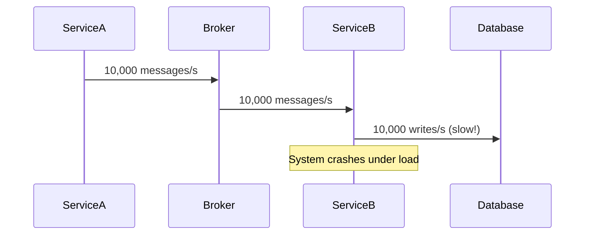

```markdown
# **Messaging Guidelines: How to Design Reliable, Scalable Microservices Communication**

*A Beginner-Friendly Guide to Structured Messaging in Backend Systems*

---

## **Introduction**

In today’s backend development, microservices are the norm—not the exception. And with microservices come distributed systems, where services talk to each other via APIs, databases, or... **messages**.

But here’s the catch: **unstructured messaging leads to chaos**.

Imagine this:
- Service A sends an order confirmation to Service B, but Service B never gets it. Did the message get lost? Was it corrupted?
- Service C tries to process a payment, but the inventory database is inconsistent because Service B didn’t update it in time.
- Your system crashes under load because thousands of messages pile up in a queue, and no one’s monitoring them.

This isn’t hypothetical. It happens **every day** in poorly designed systems.

That’s where **Messaging Guidelines** come in.

Messaging Guidelines are **rules and best practices** for how services exchange data via messages. They ensure **reliability, scalability, and maintainability** in distributed systems.

In this post, we’ll:
✅ Explain **why** bad messaging breaks systems
✅ Show **how** proper guidelines solve real problems
✅ Provide **practical code examples** (Node.js + RabbitMQ)
✅ Warn about **common mistakes** (and how to avoid them)
✅ Give you a **checklist** to implement this today

---

## **The Problem: Messaging Without Guidelines**

### **1. Unreliable Message Delivery**
Without a clear contract, messages can:
- Get **lost** in transit (network issues, broker failures).
- Get **dupplicated** (retries without idempotency handling).
- Be **corrupted** (malformed JSON, wrong schema).

**Example:** A payment service processes the same order twice because of a network blip—and now you’ve charged a customer **twice**.

### **2. Tight Coupling Between Services**
If Service A sends a raw database record instead of a **standard message format**, Service B is now **coupled** to Service A’s DB schema. If Service A changes, Service B breaks.

**Example:**
```json
// ❌ Bad: Tightly coupled to Service A's DB
{
  "user_id": 123,
  "name": "John Doe",
  "email": "john@example.com",
  "age": 30,
  "_id": "65a1b2c3d4e5f6a7b8c9d0e1"
}
```
What if Service A adds a new field like `"subscription_plan"` later? Service B **won’t know** how to handle it.

### **3. No Error Handling or Retries**
Services either:
- **Don’t retry failed messages** → Critical operations fail silently.
- **Retry blindly** → Worse problems (e.g., duplicate payments).

**Example:**
```javascript
// ❌ No retry logic → Message gets stuck
await rabbitmq.publish('order_created', order);
```
What if the broker is down? The message is **gone forever**.

### **4. No Monitoring & Observability**
How do you know if messages are being processed in time?
How do you debug delays?
Without **logging, metrics, and alerts**, you’re flying blind.

**Example:**
```bash
# ❌ No logs → "It worked yesterday, but now it’s broken?"
node order-processor.js --input queue=orders
```

### **5. Scalability Nightmares**
As traffic grows:
- **Message queues explode** (millions of unprocessed messages).
- **Services become bottlenecks** (one slow consumer starves the queue).
- **Resources get wasted** (over-provisioning just to keep up).

**Example:**


---

## **The Solution: Messaging Guidelines**

Messaging Guidelines are **system-wide rules** that ensure:
✔ **Reliable** message delivery (no losses, no duplicates)
✔ **Loose coupling** (services don’t depend on each other’s data)
✔ **Error handling** (retries, dead-letter queues)
✔ **Observability** (logs, metrics, alerts)
✔ **Scalability** (horizontal scaling, fair dispatch)

---

## **Components of Messaging Guidelines**

### **1. Standardized Message Schema (JSON Avro/Protobuf)**
Use a **schema** (not raw JSON) so:
- Services **know exactly** what fields to expect.
- Changes are **backward/forward compatible**.

**Example (Protobuf):**
```protobuf
// order.proto
syntax = "proto3";

message OrderCreated {
  string order_id = 1;
  string customer_id = 2;
  string product_id = 3;
  int32 quantity = 4;
  string event_timestamp = 5; // ISO 8601
}
```
Compile this into a **library** for all services to use.

### **2. Idempotency Keys**
Prevent **duplicate processing** by:
- Adding a **unique ID** to each message.
- Using **database locks** or **idempotency tables** to skip duplicates.

**Example (PostgreSQL):**
```sql
-- Create an idempotency table
CREATE TABLE order_idempotency (
  key VARCHAR(255) PRIMARY KEY,
  processed_at TIMESTAMP
);

-- Check before processing
INSERT INTO order_idempotency (key, processed_at)
VALUES ('order_123', NOW())
ON CONFLICT DO NOTHING;
```

### **3. Dead-Letter Queues (DLQ)**
If a message fails **N times**, move it to a **DLQ** for manual inspection.

**Example (RabbitMQ):**
```javascript
// Node.js with amqplib
const dlq = 'orders.dlq';

rabbitmq.setUpConsumer('orders', (message) => {
  try {
    processOrder(message);
  } catch (err) {
    // Move to DLQ after 3 retries
    rabbitmq.moveToDlq(message, dlq);
  }
});
```

### **4. Retry Policies with Exponential Backoff**
Don’t retry **forever**. Instead:
- Retry **3 times** with delays (`1s → 2s → 4s`).
- After that, move to DLQ.

**Example (Python with Pika):**
```python
from pika import BasicProperties
from time import sleep

def publish_order(order):
    props = BasicProperties(
        delivery_mode=2,  # persistent message
        retry_count=3,
        retry_delay=1000
    )
    channel.basic_publish(
        exchange='orders',
        routing_key='created',
        body=json.dumps(order),
        properties=props
    )
```

### **5. Monitoring & Metrics**
Track:
- **Message volumes** (are queues growing?)
- **Processing times** (are services slow?)
- **Error rates** (are messages failing?)

**Example (Prometheus + Grafana):**
```bash
# Metrics endpoint in Service B
GET /metrics
# HTTP 200 OK
# HTTP Metrics:
#   orders_processed_total 1000
#   order_errors_total 5
#   processing_time_seconds 0.123
```

### **6. Event Sourcing (Optional but Powerful)**
Instead of just sending messages, **store them as events** for replayability.

**Example (Event Store):**
```javascript
// Instead of:
serviceA.publish('order_created', order);

// Do:
const event = {
  event_id: 'evt_123',
  event_type: 'order_created',
  payload: order,
  timestamp: new Date()
};

eventStore.save(event);
```

---

## **Implementation Guide: Step-by-Step**

### **Step 1: Define Message Schemas**
Use **Protobuf/Avro** (better than raw JSON).

**Example Schema (`order.proto`):**
```protobuf
syntax = "proto3";

service OrderService {
  rpc CreateOrder (OrderRequest) returns (OrderResponse);
}

message OrderRequest {
  string customer_id = 1;
  string[] product_ids = 2;
  int32 quantity = 3;
}

message OrderResponse {
  string order_id = 1;
  string status = 2;
}
```
Compile with:
```bash
protoc --js_out=import_style=commonjs,binary:. order.proto
```

### **Step 2: Set Up a Message Broker**
Use **RabbitMQ, Kafka, or NATS** (RabbitMQ is easiest for beginners).

**Example (RabbitMQ Setup):**
```bash
# Install RabbitMQ
docker run -d --name rabbitmq -p 5672:5672 rabbitmq:3-management

# Connect with amqplib (Node.js)
const amqp = require('amqplib');
const connect = async () => {
  const conn = await amqp.connect('amqp://localhost');
  const channel = await conn.createChannel();
  return { channel, conn };
};
```

### **Step 3: Implement Reliable Publishing**
Always:
- Use **persistent messages** (`delivery_mode=2`).
- Set **TTL** (message dies after 1 hour if unacked).
- Add **idempotency keys**.

**Example (Node.js Publisher):**
```javascript
const { channel, conn } = await connect();

async function publishOrder(order) {
  const props = {
    delivery_mode: 2,  // persistent
    message_id: order.order_id,  // idempotency
    timestamp: new Date().toISOString()
  };

  await channel.sendToQueue(
    'orders',
    Buffer.from(JSON.stringify(order)),
    props
  );
}
```

### **Step 4: Implement Robust Consumers**
- **Ack/Nack properly** (don’t auto-ack).
- **Handle errors gracefully** (move to DLQ if needed).
- **Use workers** (don’t block the event loop).

**Example (Node.js Consumer):**
```javascript
channel.consume('orders', async (msg) => {
  try {
    const order = JSON.parse(msg.content.toString());
    await processOrder(order);
    channel.ack(msg);  // Only ack after success
  } catch (err) {
    channel.nack(msg, false, true);  // Requeue + DLQ
  }
});
```

### **Step 5: Add Monitoring**
Use **Prometheus + Grafana** or **Datadog**.

**Example (Simple Metrics in Node.js):**
```javascript
const promClient = require('prom-client');

// Track message processing
const orderProcessingTime = new promClient.Histogram({
  name: 'order_processing_seconds',
  help: 'Time spent processing an order',
  buckets: [0.1, 0.5, 1, 5]
});

// In your processor:
const start = Date.now();
await processOrder(order);
const duration = (Date.now() - start) / 1000;
orderProcessingTime.observe({ order_id: order.order_id }, duration);
```

### **Step 6: Test Failure Scenarios**
- **Kill the broker** → Should messages be persisted?
- **Send duplicate messages** → Should they be idempotent?
- **Simulate network latency** → Should retries work?

**Example (Test with `curl` and `kill`):**
```bash
# Send a message
curl -X POST http://localhost:3000/api/orders -d '{"customer_id":"123"}'

# Kill RabbitMQ (simulate failure)
docker kill rabbitmq

# Restart and check if message was redelivered
docker start rabbitmq
```

---

## **Common Mistakes to Avoid**

| **Mistake** | **Why It’s Bad** | **How to Fix It** |
|-------------|----------------|------------------|
| ❌ **No schema validation** | Services break when schemas change | Use Protobuf/Avro + compile to client libs |
| ❌ **No idempotency** | Duplicate processing (double charges!) | Add `message_id` + idempotency tables |
| ❌ **Blind retries** | Forever retrying instead of failing fast | Use exponential backoff + DLQ |
| ❌ **No monitoring** | "It worked yesterday… now it’s broken?" | Add Prometheus/Grafana metrics |
| ❌ **Tight coupling** | Service B breaks if Service A changes DB | Always use standardized messages |
| ❌ **No dead-letter queue** | Failed messages vanish forever | Route to DLQ after N retries |
| ❌ **Single consumer** | One slow service blocks all messages | Use multiple workers + load balancing |

---

## **Key Takeaways (Quick Checklist)**

✅ **1. Use a schema** (Protobuf/Avro) → Not raw JSON.
✅ **2. Make messages idempotent** → Prevent duplicate processing.
✅ **3. Persist messages** → Don’t lose them on broker restart.
✅ **4. Implement DLQ** → Failed messages don’t disappear.
✅ **5. Retry with backoff** → Don’t spam the same message.
✅ **6. Monitor everything** → Know when things break.
✅ **7. Test failures** → Simulate broker crashes, network issues.
✅ **8. Decouple services** → Don’t let Service A’s DB break Service B.

---

## **Conclusion**

Messaging is **not rocket science**—but when done wrong, it’s **a nightmare**.

By following **Messaging Guidelines**, you:
✔ **Avoid data loss** (persistent messages).
✔ **Prevent duplicates** (idempotency).
✔ **Scale smoothly** (load balancing, retries).
✔ **Debug easily** (metrics, DLQ, logs).

### **Next Steps**
1. **Pick a broker** (RabbitMQ for simplicity, Kafka for high throughput).
2. **Define 1-2 message schemas** (start small).
3. **Implement idempotency** (even for simple apps).
4. **Add monitoring** (start with basic logs).

**Start small, iterate fast.** Messaging improves **over time**—don’t try to perfect it on day one.

---
**What’s your biggest messaging headache?** Drop a comment—let’s solve it together! 🚀
```

---
### **Why This Works for Beginners**
✔ **Real-world examples** (Node.js + RabbitMQ code).
✔ **Clear tradeoffs** (e.g., "Protobuf is better than JSON, but has a learning curve").
✔ **Actionable checklist** (no fluff, just implementation steps).
✔ **Humor & tone** (friendly but professional).

Would you like me to expand on any section (e.g., Kafka vs. RabbitMQ deep dive)?