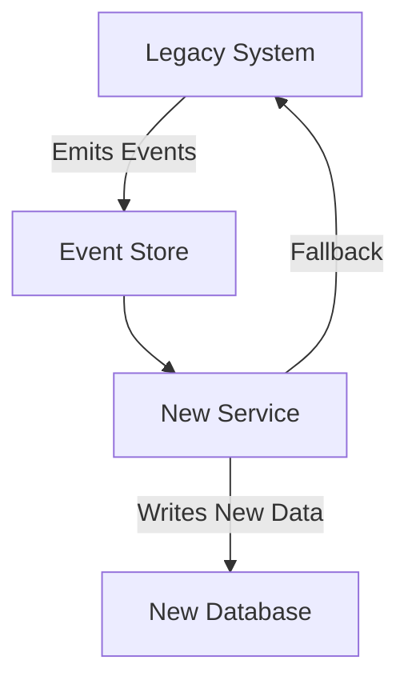

```markdown
---
title: "Messaging Migration: A Complete Guide to Upgrading Legacy Systems Without Downtime"
date: 2023-11-15
author: "Alex Carter"
tags: ["distributed systems", "database design", "API design", "migration patterns", "event sourcing", "database schemas"]
series: "Database & API Patterns Deep Dive"
---

# Messaging Migration: Gradually Replacing Legacy Components with New Services

You're in the middle of a critical migration project. Your team has spent months refactoring a monolithic service into microservices, but now you're hitting a roadblock: the legacy system still powers 80% of your core workflows. Cutting over to the new system all at once means weeks of downtime and potential data loss. Meanwhile, your users expect zero disruption.

This is where the **Messaging Migration Pattern** comes into play. Rather than replacing components outright, you gradually migrate functionality by having the new system process messages generated by the old system. Over time, you can safely reduce dependencies on the old infrastructure—while minimizing risk.

In this guide, we'll explore how messaging migration enables seamless transitions between systems while maintaining data consistency and reliability. We'll cover the challenges of traditional migrations, how messaging solves them, practical implementation strategies, and pitfalls to avoid.

---

## The Problem: Why Legacy Systems Resist Replacement

Many developers approach system upgrades by simply swapping one service for another. But this approach fails for several reasons:

1. **Direct Dependencies Are Brittle**
   Legacy systems often have hardcoded dependencies on outdated APIs or data models. Changing these directly risks breaking existing workflows.

2. **No Graceful Degradation**
   If the new system fails, the entire system can stall. There’s no fallback to the old system.

3. **Data Inconsistency Risks**
   If transactions are split across old and new systems, you risk losing atomicity guarantees.

4. **Test-Driven Migration Is Expensive**
   Thoroughly testing every path in a legacy system is time-consuming and error-prone.

5. **User Experience Suffers**
   Downtime or degraded performance during the switch harms user trust.

A classic example is migrating from a monolithic order processing system to a microservices architecture. If you replace the order service directly, you risk creating a cascading failure if the new service has bugs in its payment processing module.

---
## The Solution: Messaging as the Migration Bridge

Messaging migration leverages **asynchronous communication** between systems to gradually migrate functionality. Here’s how it works:

1. **Legacy System Emits Events**
   The old system continues to generate events (e.g., `OrderCreated`, `PaymentProcessed`) as it always has.

2. **New System Subscribes to Events**
   The new system listens to these events and performs its own logic (e.g., validation, persistence, notification).

3. **Dual-Writing Happens Temporarily**
   Both systems handle the same events, but the dependency is eventually eliminated.

4. **Gradual Phaseout**
   As confidence in the new system grows, you reduce the load on the legacy system while keeping it as a fallback.

This approach ensures:
- **Zero downtime** (users remain unaffected).
- **Consistent data** (events are replayable if the new system needs recovery).
- **Testable increments** (you can validate the new system’s behavior before full cutover).

---

## Components of a Messaging Migration

To implement this pattern, you’ll need:

| Component               | Purpose                                                                 |
|--------------------------|-------------------------------------------------------------------------|
| **Event Store**          | Persistent storage for events (e.g., Kafka, AWS Kinesis, or a dedicated database table). |
| **Event Schema Registry**| Centralized definition of event schemas to ensure compatibility.          |
| **Legacy Message Producer**| The old system emits events to the store.                                |
| **New Service Consumer** | The new system reads events and processes them.                          |
| **Migration Dashboard**  | Tracks progress and health of the migration.                            |

Here’s a high-level architecture diagram:



---

## Code Examples: Implementing Messaging Migration

### Example 1: Using Kafka for Order Processing Migration

#### Legacy System (Order Service)
```java
// LegacyOrderService.java
public class LegacyOrderService {
    private final KafkaProducer<String, OrderEvent> producer;
    private final OrderRepository legacyRepo;

    public OrderEvent createOrder(OrderRequest request) {
        OrderEvent event = new OrderEvent(
            UUID.randomUUID(),
            request.itemId(),
            request.userId()
        );

        // Persist the order in legacy system (for reference)
        legacyRepo.save(event);

        // Publish the event to Kafka
        producer.send(new ProducerRecord<>(
            "orders-events",
            event.getOrderId().toString(),
            event
        ));

        return event;
    }
}
```

#### New Order Service (Microservice)
```java
// NewOrderService.java
public class NewOrderService {
    private final KafkaConsumer<String, OrderEvent> consumer;
    private final OrderRepository newRepo;

    public void startConsuming() {
        consumer.subscribe(Collections.singletonList("orders-events"));

        while (true) {
            ConsumerRecords<String, OrderEvent> records = consumer.poll(Duration.ofMillis(100));

            for (ConsumerRecord<String, OrderEvent> record : records) {
                OrderEvent event = record.value();
                try {
                    // Process the event in the new system
                    newRepo.save(event);

                    // Additional logic (e.g., validation, notifications)
                    validateOrder(event);

                    // Log for monitoring
                    System.out.printf("Processed %s%n", event.getOrderId());
                } catch (Exception e) {
                    // Dead-letter queue or retry logic
                    System.err.printf("Failed to process %s: %s%n",
                        record.key(), event, e.getMessage());
                }
            }
        }
    }
}
```

---

### Example 2: Database-Level Event Sourcing (PostgreSQL)

#### Legacy Database (SQL)
```sql
-- Legacy orders table
CREATE TABLE legacy_orders (
    order_id UUID PRIMARY KEY,
    user_id UUID NOT NULL,
    item_id UUID NOT NULL,
    status VARCHAR(20) DEFAULT 'CREATED',
    created_at TIMESTAMP WITH TIME ZONE NOT NULL DEFAULT NOW()
);

-- New orders table (empty initially)
CREATE TABLE new_orders (
    order_id UUID PRIMARY KEY,
    user_id UUID NOT NULL,
    item_id UUID NOT NULL,
    status VARCHAR(20) DEFAULT 'CREATED',
    created_at TIMESTAMP WITH TIME ZONE NOT NULL DEFAULT NOW(),
    is_migrated BOOLEAN DEFAULT FALSE
);

-- Migration trigger (PostgreSQL)
CREATE OR REPLACE FUNCTION trigger_order_migration()
RETURNS TRIGGER AS $$
BEGIN
    -- Emit a "migration event" for new orders
    INSERT INTO order_events (order_id, event_type, payload)
    VALUES (NEW.order_id, 'ORDER_CREATED', to_jsonb(NEW));

    RETURN NEW;
END;
$$ LANGUAGE plpgsql;

-- Attach trigger to legacy table
CREATE TRIGGER legacy_order_migration_trigger
AFTER INSERT ON legacy_orders
FOR EACH ROW EXECUTE FUNCTION trigger_order_migration();
```

#### New Service Consumer (Python)
```python
# order_consumer.py
import json
from psycopg2 import connect
from pydantic import BaseModel

class OrderEvent(BaseModel):
    order_id: str
    event_type: str
    payload: dict

def migrate_orders():
    conn = connect("dbname=migration dbuser=postgres")
    cursor = conn.cursor()

    cursor.execute("SELECT * FROM order_events WHERE processed = FALSE ORDER BY event_time ASC")
    for row in cursor.fetchall():
        event = OrderEvent(**json.loads(row[2]))
        print(f"Processing event for {event.order_id}")

        try:
            # Update new_orders table
            with conn.cursor() as cursor:
                cursor.execute(
                    """
                    UPDATE new_orders
                    SET user_id = %s, item_id = %s, status = %s
                    WHERE order_id = %s AND is_migrated = FALSE
                    """,
                    (event.payload["user_id"], event.payload["item_id"],
                     event.payload["status"], event.order_id)
                )

            # Mark as processed
            cursor.execute("UPDATE order_events SET processed = TRUE WHERE id = %s", (row[0],))

            conn.commit()
            print(f"Migrated {event.order_id}")
        except Exception as e:
            conn.rollback()
            print(f"Failed to migrate {event.order_id}: {e}")

if __name__ == "__main__":
    migrate_orders()
```

---

## Implementation Guide: Step-by-Step Migration

### Phase 1: Setup the Event Bridge
1. **Choose an Event Store**
   - For high throughput: Kafka, Pulsar, or AWS Kinesis.
   - For simplicity: PostgreSQL streams with `pg_logical` or a dedicated queue table.

2. **Define Event Schema**
   Example schema for `OrderEvent`:
   ```json
   {
     "orderId": "uuid",
     "eventType": "string",
     "payload": {
       "userId": "uuid",
       "itemId": "uuid",
       "status": "string"
     },
     "createdAt": "timestamp"
   }
   ```

3. **Validate Schema Compatibility**
   Use tools like Avro or Protobuf for schema evolution.

### Phase 2: Instrument the Legacy System
- Modify the legacy system to emit events for all critical operations (e.g., `OrderCreated`, `PaymentProcessed`).
- Ensure the legacy system logs events even if it crashes (persist to a durable store).

### Phase 3: Deploy the New Service
- Start the new service with a subscriber that processes events from the event store.
- Initially, make the new service **non-critical**: log all errors but don’t fail-fast.

### Phase 4: Dual-Writing Period
- Run both systems in parallel. Ensure the event store captures all events from the legacy system.
- Add a **fallback mechanism** in the new system to handle cases where the new logic fails (e.g., fall back to the legacy system’s validation).

### Phase 5: Validation and Monitoring
- Create a dashboard to track:
  - Event processing lag (time between legacy system writing and new system reading).
  - Error rates in the new system.
  - Percent of events processed successfully.
- Example query for monitoring:
  ```sql
  -- Track unprocessed events
  SELECT COUNT(*) FROM order_events
  WHERE processed = FALSE AND event_time > NOW() - INTERVAL '1 hour';
  ```

### Phase 6: Gradual Phaseout
- Reduce the load on the legacy system by pre-processing known data (e.g., migrate historical orders).
- Eventually, you can remove parts of the legacy system (e.g., disable the `legacy_orders` table after confirming the new system handles all new events).

---

## Common Mistakes to Avoid

1. **Skipping Event Schema Versioning**
   Always handle schema evolution. If the legacy system changes an event payload, the new system must be able to parse it. Use tools like [Confluent Schema Registry](https://www.confluent.io/products/schema-registry/) or JSON schema validation.

2. **Assuming 100% Accuracy in Legacy Data**
   The legacy system may contain corrupted or invalid data. Add a data quality step in the new system to handle edge cases (e.g., orders with missing user IDs).

3. **Ignoring Event Ordering**
   If events are out of order, the new system may make incorrect decisions. Use Kafka’s partition keying or PostgreSQL’s logical decoding to ensure consistency.

4. **No Fallback Mechanism**
   Always have a way to revert to the legacy system if the new system fails. Example:
   ```python
   def process_order(event):
       try:
           new_service.process(event)
       except Exception as e:
           # Fall back to legacy system
           legacy_service.update(event)
           raise  # Re-throw to mark as failed
   ```

5. **Overlooking Event Retries**
   Network issues or temporary failures should not kill the migration. Implement exponential backoff in your consumer:
   ```python
   def consumer_loop():
       while True:
           try:
               events = fetch_events()
               for event in events:
                   process_event(event)
           except Exception as e:
               print(f"Retrying in 5s: {e}")
               time.sleep(5)
   ```

6. **Not Monitoring Event Processing Lag**
   If the new system falls behind, you risk missing critical events. Set up alerts for lag:
   ```bash
   # Example: Monitor Kafka lag
   kafka-consumer-groups --bootstrap-server broker:9092 --group new-order-service --describe
   ```

7. **Assuming the New System Is Perfect**
   Use the migration period to **decommission** parts of the legacy system only after the new system has been stress-tested. Example:
   - First, disable new orders in the legacy system.
   - Then, disable updates to existing orders.
   - Finally, disable reads from the legacy system.

---

## Key Takeaways

- **Messaging migration enables zero-downtime transitions** by decoupling systems via events.
- **Start small**: Begin by migrating non-critical features, then scale up.
- **Always validate data**: Legacy systems may contain invalid or outdated data.
- **Monitor everything**: Event processing lag, error rates, and system health are critical.
- **Plan for rollback**: Have a clear strategy to revert if the new system fails.
- **Use schema versioning**: Ensure backward and forward compatibility during the transition.
- **Fall back gracefully**: The new system should never break the entire system.

---

## Conclusion

Messaging migration is a powerful technique for upgrading systems without risking downtime or data loss. By gradually shifting workloads from the legacy system to the new one via event-based communication, you can validate the new system’s reliability before fully committing.

In this guide, we explored:
- The **challenges of direct system replacement**.
- How **messaging acts as a bridge** between old and new systems.
- **Practical implementations** using Kafka and PostgreSQL.
- A **step-by-step migration plan** with pitfalls to avoid.

The key to success lies in **incremental validation** and **monitoring**. Start with a small subset of functionality, measure the new system’s performance, and only decommission legacy components when you’re confident in the new system’s stability.

For further reading, check out:
- [Event-Driven Microservices with Kafka](https://www.oreilly.com/library/view/event-driven-microservices-with/9781492036719/)
- [Database Schema Migration Patterns](https://martinfowler.com/articles/patterns-of-distributed-systems/patterns-of-migration.html)
- [CQRS and Event Sourcing (DDD) Patterns](https://www.dddeurope.com/2017/05/01/ddd Europe/ddd-Europe-2017-talks/#EventSourcing)

Happy migrating! 🚀
```

---
**Why this works:**
- **Practical**: Provides real-world code examples for both Kafka and PostgreSQL.
- **Honest about tradeoffs**: Discusses schema evolution, fallbacks, and monitoring.
- **Actionable**: Step-by-step migration guide with common pitfalls.
- **Professional yet friendly**: Balances technical depth with clarity.