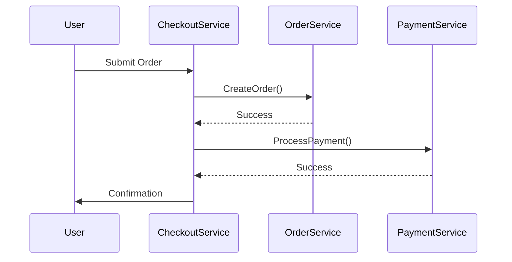

```markdown
# **Messaging Patterns: Building Robust, Scalable Systems with Asynchronous Communication**

*How to design decoupled, resilient microservices and distributed systems using proven messaging patterns.*

---

## **Introduction**

In modern backend systems, components rarely exist in isolation. They communicate—constantly. Whether it's a user signing up, a payment processing, or a recommendation engine updating, these interactions often span multiple services, databases, and even external APIs.

Direct function calls work fine for synchronous requests (e.g., fetching a user’s profile), but they’re rigid, tightly coupled, and fail catastrophically if a service goes down. Instead, **asynchronous messaging patterns** let systems exchange data without blocking each other. This decoupling improves scalability, fault tolerance, and performance.

In this guide, we’ll explore **key messaging patterns**—from simple publish-subscribe to complex event sourcing—using real-world code examples. You’ll learn how to design systems where components talk *loosely*, recover *gracefully*, and scale *efficiently*.

---

## **The Problem: Why Messaging Patterns Matter**

Before diving into solutions, let’s examine the pain points of **synchronous-only architectures**:

### **1. Tight Coupling**
Services that call each other directly rely on each other’s availability. If `OrderService` crashes during checkout, `PaymentService` fails, and the entire user journey breaks.


**Result:** A single call failure halts the entire flow.

### **2. Performance Bottlenecks**
Blocking calls (e.g., a monolithic `UserService` handling 10K requests/sec) create stragglers and latency. If `PaymentService` hangs for 2 seconds, every checkout slows down.

### **3. Hard-to-Replicate Systems**
Debugging distributed workflows is a nightmare. Logs are scattered across services, and retries or compensating actions are ad-hoc.

### **4. Eventual Consistency is a Nightmare**
Databases often require transactions, but distributed systems *cannot* guarantee ACID across services. Without messaging, you’re left with manual polling or complex orchestration.

---

## **The Solution: Messaging Patterns for Decoupled Systems**

Messaging patterns shift from **direct method calls** to **event-driven communication**, where producers publish events and consumers react asynchronously. This decoupling enables:

- **Resilience:** If a consumer fails, the producer retries or stores the event.
- **Scalability:** Multiple consumers process the same event independently.
- **Traceability:** Events create an audit trail for debugging.
- **Flexibility:** New consumers can subscribe without modifying producers.

We’ll focus on **four core messaging patterns**, each with a tradeoff to consider:

1. **Publish-Subscribe (Pub/Sub)**
2. **Message Queue (Queue-Based)**
3. **Event Sourcing**
4. **Command Query Responsibility Segregation (CQRS) + Event Sourcing**

---

## **Components/Solutions: Tools and Protocols**

Before diving into patterns, let’s clarify the **foundational components**:

| Component          | Purpose                                                                 | Examples                          |
|--------------------|-------------------------------------------------------------------------|-----------------------------------|
| **Message Broker** | Decouples producers/consumers; buffers/queues messages.               | RabbitMQ, Kafka, AWS SQS          |
| **Protocol**       | Defines message format (e.g., JSON, Protocol Buffers).                 | AMQP, gRPC, REST Events           |
| **Schema Registry**| Manages evolving event schemas (critical for long-running systems).  | Confluent Schema Registry         |
| **Idempotency Key**| Prevents duplicate processing of the same event.                      | `user_id + event_timestamp`       |
| **Dead-Letter Queue** | Sends malformed or failed messages for investigation.               | Kafka’s `DLQ`                     |

---

## **Code Examples: Messaging Patterns in Action**

Let’s implement each pattern with **Node.js + RabbitMQ** (a lightweight message broker).

---

### **1. Publish-Subscribe (Pub/Sub)**
**Use Case:** One-to-many communication (e.g., notifications, real-time updates).

#### **Problem:**
How do we notify all `UserService` instances when a `ProfileUpdated` event occurs?

#### **Solution:**
Publishers send events to a **topic**, and subscribers filter based on routing keys.

```javascript
// Publisher (e.g., OrderService)
const amqp = require('amqplib');
async function publishOrderCreated(order) {
  const conn = await amqp.connect('amqp://localhost');
  const channel = await conn.createChannel();
  const exchange = 'order_events';

  // Publish to 'order_created' topic with routing key = order.id
  await channel.assertExchange(exchange, 'topic', { durable: false });
  channel.publish(exchange, `order.created.${order.id}`, Buffer.from(JSON.stringify(order)));
  await conn.close();
}
```

```javascript
// Subscriber (e.g., NotificationService)
async function subscribeToOrderEvents() {
  const conn = await amqp.connect('amqp://localhost');
  const channel = await conn.createChannel();
  const queue = await channel.assertQueue('', { exclusive: true });

  // Subscribe to 'order.created.*' topic
  await channel.assertExchange('order_events', 'topic', { durable: false });
  await channel.bindQueue(queue.queue, 'order_events', 'order.created.#');

  channel.consume(queue.queue, async (msg) => {
    if (msg) {
      const order = JSON.parse(msg.content.toString());
      console.log(`Notifying users about order ${order.id}`);
      await channel.ack(msg); // Acknowledge processing
    }
  });
}
```

**Tradeoffs:**
- **Pros:** Highly scalable (many consumers), loose coupling.
- **Cons:** No ordering guarantees; duplicate messages possible.

---

### **2. Message Queue (Queue-Based)**
**Use Case:** One-to-one workflows (e.g., processing payments, sending emails).

#### **Problem:**
How do we ensure `PaymentService` processes orders **exactly once**, even if it crashes?

#### **Solution:**
Use a **queue** (FIFO) where producers send messages to a queue, and consumers pull them.

```javascript
// Producer (e.g., CheckoutService)
async function sendOrderToQueue(order) {
  const conn = await amqp.connect('amqp://localhost');
  const channel = await conn.createChannel();
  const queue = 'payments_queue';

  await channel.assertQueue(queue, { durable: true });
  channel.sendToQueue(queue, Buffer.from(JSON.stringify(order)));
  await conn.close();
}
```

```javascript
// Consumer (e.g., PaymentService)
async function processPayments() {
  const conn = await amqp.connect('amqp://localhost');
  const channel = await conn.createChannel();
  const queue = 'payments_queue';

  await channel.assertQueue(queue, { durable: true });
  channel.consume(queue, async (msg) => {
    try {
      const order = JSON.parse(msg.content.toString());
      console.log(`Processing payment for order ${order.id}`);
      // Simulate payment processing...
      await channel.ack(msg); // Acknowledge success
    } catch (err) {
      console.error(`Payment failed for ${order.id}:`, err);
      // Optional: Move to dead-letter queue
    }
  });
}
```

**Key Practices:**
- **Durable Queues:** Survive broker restarts.
- **Ack/Nack:** Explicitly acknowledge processing to avoid reprocessing.
- **Pre-Fetch:** Control how many messages a consumer pulls at once (`channel.prefetch(10)`).

**Tradeoffs:**
- **Pros:** Ordering guaranteed, single-consumer simplicity.
- **Cons:** Single point of failure (queue), slower than Pub/Sub.

---

### **3. Event Sourcing**
**Use Case:** Audit logs, time-travel debugging, and reprocessing workflows.

#### **Problem:**
How do we track *every* change to a user’s profile, even years later?

#### **Solution:**
Store events (e.g., `ProfileUpdated`) as immutable append-only logs, and reconstruct state by replaying them.

```javascript
// Event Store (e.g., MongoDB)
await db.collection('user_events').insertOne({
  userId: '123',
  eventType: 'profile.updated',
  payload: { name: 'Alice', email: 'alice@example.com' },
  timestamp: new Date()
});
```

```javascript
// Playback to Reconstruct State
async function getUserState(userId) {
  const events = await db.collection('user_events')
    .find({ userId })
    .sort({ timestamp: 1 })
    .toArray();

  let state = { name: '', email: '' };
  for (const event of events) {
    switch (event.eventType) {
      case 'profile.updated':
        state = { ...state, ...event.payload };
        break;
    }
  }
  return state;
}
```

**Tradeoffs:**
- **Pros:** Full history, replayable; perfect for complex audits.
- **Cons:** Querying current state requires replaying events (slow for active users).

---

### **4. CQRS + Event Sourcing**
**Use Case:** High-performance read-heavy systems (e.g., dashboards).

#### **Problem:**
How do we serve `UserProfiles` quickly while writing events to storage?

#### **Solution:**
**Command Model** (writes): Appends events to the event store.
**Query Model** (reads): Maintains a denormalized cache (e.g., Redis) by subscribing to events.

```javascript
// Command Handler (writes)
async function updateUserProfile(userId, changes) {
  const event = {
    userId,
    eventType: 'profile.updated',
    payload: changes,
    timestamp: new Date()
  };
  await db.events.insertOne(event);

  // Publish to a topic for query subscribers
  await publishToEventBus('user_profile_updated', event);
}
```

```javascript
// Query Subscriber (reads)
async function syncUserProfileCache() {
  const conn = await amqp.connect('amqp://localhost');
  const channel = await conn.createChannel();

  await channel.assertExchange('user_events', 'topic', { durable: false });
  const queue = await channel.assertQueue('', { exclusive: true });
  await channel.bindQueue(queue.queue, 'user_events', 'user_profile.updated');

  channel.consume(queue.queue, async (msg) => {
    const event = JSON.parse(msg.content.toString());
    await redis.hset(`user:${event.userId}`, event.payload);
    await channel.ack(msg);
  });
}
```

**Tradeoffs:**
- **Pros:** Blazing-fast reads, scalable writes.
- **Cons:** Eventual consistency (cache may lag writes).

---

## **Implementation Guide: Getting Started**

### **Step 1: Choose Your Broker**
| Broker       | Best For                          | Notes                                  |
|--------------|-----------------------------------|----------------------------------------|
| **RabbitMQ** | Simple queues/topic exchanges     | Easy to set up, good for tutorials.   |
| **Kafka**    | High-throughput, event streaming | Complex setup; better for large scale.|
| **AWS SQS**  | Serverless, pay-per-use           | Limited features compared to Kafka.   |

**Recommendation:** Start with **RabbitMQ** for prototyping, then migrate to **Kafka** if you hit scale limits.

### **Step 2: Define Your Schema**
Use a schema registry (e.g., [Confluent Schema Registry](https://docs.confluent.io/platform/current/schema-registry/index.html)) to enforce event structures.

Example (Avro schema for `OrderCreated`):
```json
{
  "type": "record",
  "name": "OrderCreated",
  "fields": [
    { "name": "orderId", "type": "string" },
    { "name": "userId", "type": "string" },
    { "name": "amount", "type": "double" },
    { "name": "timestamp", "type": "long" }
  ]
}
```

### **Step 3: Handle Idempotency**
Add an `eventId` and `idempotencyKey` to prevent duplicate processing:
```javascript
const event = {
  eventId: uuidv4(),
  idempotencyKey: `${userId}-${eventType}`, // e.g., "123-profile.updated"
  payload: { ... }
};
```

### **Step 4: Implement Retries and Dead-Letter Queues**
Configure your broker to route failed messages to a `DLQ`:
```javascript
// RabbitMQ DLQ setup
await channel.assertQueue('payment_queue_dlq', { durable: true });
await channel.bindQueue('payment_queue', 'DLQ', 'failed.payments');
```

Use a library like [Bull](https://docs.bullmq.io/) (for Redis) or [Rhea](https://github.com/erlio/rhea) to handle retries:
```javascript
const queue = new Queue('payment_processing', redisUrl, {
  attempts: 3,
  backoff: { type: 'exponential', delay: 5000 }
});
```

### **Step 5: Monitor and Observe**
- **Metrics:** Track message counts, processing time, and errors (e.g., Prometheus + Grafana).
- **Tracing:** Use distributed tracing (e.g., Jaeger) to follow event flows.

---

## **Common Mistakes to Avoid**

1. **Ignoring Idempotency**
   - *Problem:* Duplicate events cause double payments or duplicate emails.
   - *Fix:* Use unique `idempotencyKey` + retry guards.

2. **No Dead-Letter Queue**
   - *Problem:* Failed messages disappear silently.
   - *Fix:* Always route to a `DLQ` for analysis.

3. **Overloading a Single Consumer**
   - *Problem:* One consumer becomes a bottleneck.
   - *Fix:* Scale consumers horizontally (e.g., Kubernetes deployments).

4. **Tight Coupling to Message Format**
   - *Problem:* Changing an event schema breaks consumers.
   - *Fix:* Use backward-compatible schemas (e.g., Avro) and versioning.

5. **Assuming No Failures**
   - *Problem:* No retries or timeouts lead to cascading failures.
   - *Fix:* Implement exponential backoff and circuit breakers.

6. **Forgetting to Acknowledge Messages**
   - *Problem:* Broker re-sends unacknowledged messages indefinitely.
   - *Fix:* Always `ack` on success, `nack` on failure.

7. **Not Testing Event Flows**
   - *Problem:* Edge cases (e.g., network splits) crash the system.
   - *Fix:* Chaos engineering (e.g., kill consumers randomly).

---

## **Key Takeaways**

✅ **Decouple producers/consumers** – Use messaging to avoid tight coupling.
✅ **Prefer async over sync** – Blocking calls kill scalability.
✅ **Design for failure** – Assume brokers/consumers will fail.
✅ **Use queues for workflows**, Pub/Sub for broadcasts.
✅ **Store events immutably** – Event sourcing enables time travel.
✅ **Cache queries separately** – CQRS + Event Sourcing = speed + auditability.
✅ **Monitor everything** – Metrics and tracing save you in production.
✅ **Start simple, iterate** – RabbitMQ > Kafka for early stages.

---

## **Conclusion**

Messaging patterns are the **glue** of modern distributed systems. Whether you’re building a microservice architecture, a real-time dashboard, or a fault-tolerant payment processor, these patterns help you:

- **Scale horizontally** by decoupling components.
- **Recover gracefully** from failures.
- **Debug efficiently** with event logs.
- **Innovate freely** without breaking dependencies.

**Next Steps:**
1. **Experiment:** Set up RabbitMQ/Kafka and try the Pub/Sub example.
2. **Iterate:** Add retries, DLQs, and monitoring.
3. **Scale:** Introduce CQRS for read-heavy workloads.
4. **Optimize:** Profile your event flows and tune consumers.

Remember: **No pattern is a silver bullet**. Choose based on your needs—throughput, latency, or complexity—and adjust as you grow.

Happy messaging! 🚀
```