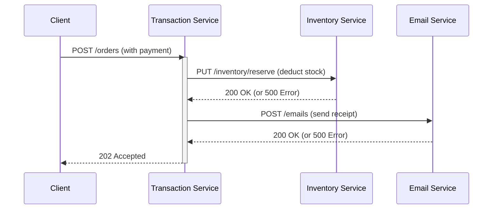

```markdown
---
title: "Messaging Setup Pattern: Building Robust, Scalable Communication in Distributed Systems"
date: 2023-11-15
author: Dr. Alex Carter
tags: ["backend", "distributed systems", "api design", "database patterns", "microservices"]
description: "Learn how to implement the Messaging Setup pattern to create resilient, scalable communication layers between services. Includes tradeoffs, code examples, and best practices."
---

# Messaging Setup Pattern: Building Robust, Scalable Communication in Distributed Systems

Distributed systems are the backbone of modern scalable applications—whether you're building cloud-native services, real-time platforms, or microservices architectures. But one of their biggest challenges? **How to communicate reliably between services**.

Direct HTTP requests work for simple cases, but they introduce tight coupling, latency, and scalability bottlenecks. That's where the **Messaging Setup Pattern** comes in—a structured approach to decoupling services using message brokers, queues, and event streams.

In this guide, we'll cover how to implement this pattern effectively—including tradeoffs, real-world examples, and anti-patterns to avoid.

---

## The Problem

Let’s start with a common scenario: a financial transaction service needs to update inventory, trigger email notifications, and log events after a purchase. If you rely on **synchronous HTTP calls**, you face:

1. **Tight Coupling**: Your transaction service directly depends on inventory, email, and logging services. Changing one service forces changes across the board.
2. **Latency Spikes**: If the email service is slow, transactions hang up the entire system.
3. **Data Consistency Risks**: If the email service fails mid-call, your transaction might still go through, causing lost notifications.
4. **Scalability Limits**: Every transaction now requires coordinating with multiple dependent services, capping throughput.

### Real-World Example: The "Order Processing" Nightmare
Here’s what happens without proper messaging:

If **any** of those calls fail, your client gets inconsistent results. Worse, the email service might go down during peak hours, grinding your entire system to a halt.

---

## The Solution: Messaging Setup Pattern

The **Messaging Setup Pattern** replaces direct inter-service calls with an indirect, asynchronous model:

> **Key Idea**: Services communicate via a **message broker** (e.g., RabbitMQ, Kafka, AWS SQS) that buffers and routes messages. Each service **listens** for relevant messages rather than calling others directly.

### Benefits:
✅ **Decoupling**: Services don’t need to know about each other.
✅ **Resilience**: Messages persist in queues until processed (no lost work).
✅ **Scalability**: Workers can scale independently (e.g., more email processors during holidays).
✅ **Flexibility**: New services can subscribe to messages without changing old ones.

### Tradeoffs:
⚠ **Complexity**: Requires additional infrastructure (broker, retry logic, monitoring).
⚠ **Latency**: Async processing adds slight delay compared to HTTP.
⚠ **Eventual Consistency**: Services may see stale data until processing completes.

---

## Components of a Robust Messaging Setup

### 1. **Message Broker**
   - **Purpose**: Acts as a central hub for message storage and routing.
   - **Examples**: RabbitMQ (simple), Kafka (high-throughput), AWS SQS/SNS.
   - **Why It Matters**: Ensures messages aren’t lost if consumers crash.

### 2. **Producers**
   - **Purpose**: Services that **publish** messages (e.g., transaction service).
   - **Example**: A transaction completes → sends a `OrderCreated` event to the broker.

### 3. **Consumers**
   - **Purpose**: Services that **listen** for messages (e.g., inventory service, email service).
   - **Example**: Inventory service subscribes to `OrderCreated` to update stock.

### 4. **Message Schema**
   - **Purpose**: Define a structured format (e.g., JSON) for messages to avoid parsing errors.
   - **Example**:
     ```json
     {
       "event": "OrderCreated",
       "orderId": "12345",
       "userId": "67890",
       "timestamp": "2023-11-15T12:00:00Z"
     }
     ```

### 5. **Error Handling & Retries**
   - **Purpose**: Handle failed processing (e.g., retry policies, dead-letter queues).
   - **Example**: If email service fails, retry 3 times before moving to a DLQ.

---

## Implementation Guide: Step-by-Step

### Step 1: Choose a Broker
Let’s use **RabbitMQ** for simplicity (good for most async use cases). Install it locally or use a cloud provider (e.g., AWS MQ).

```bash
# Example: Install RabbitMQ (Mac)
brew install rabbitmq
```

### Step 2: Define Your Message Schema
Create a shared schema (e.g., `src/schemas/events.ts`):
```typescript
// src/schemas/events.ts
export interface OrderCreatedEvent {
  event: 'OrderCreated';
  orderId: string;
  userId: string;
  timestamp: string;
  items: { productId: string; quantity: number }[];
}
```

### Step 3: Producer (Transaction Service)
When an order is placed, publish the event:
```typescript
// src/services/transaction/transaction.service.ts
import { rabbitmq } from '../infrastructure/rabbitmq';

async function createOrder(orderData) {
  const orderId = generateOrderId();
  await db.transaction.start();
  await db.order.create({ id: orderId, ...orderData });
  await db.transaction.commit();

  // Publish message
  const event: OrderCreatedEvent = {
    event: 'OrderCreated',
    orderId,
    userId: orderData.userId,
    timestamp: new Date().toISOString(),
    items: orderData.items,
  };
  await rabbitmq.publish('orders', event);
}
```

### Step 4: Consumer (Inventory Service)
Listen for `OrderCreated` events to update stock:
```typescript
// src/services/inventory/inventory.consumer.ts
import { rabbitmq } from '../infrastructure/rabbitmq';

rabbitmq.subscribe('orders', 'OrderCreated', async (event: OrderCreatedEvent) => {
  for (const item of event.items) {
    await db.stock.update(
      { quantity: db.stock.quantity - item.quantity },
      { where: { productId: item.productId } }
    );
  }
});
```

### Step 5: Consumer (Email Service)
Send receipts after orders are processed:
```typescript
// src/services/email/email.consumer.ts
import { rabbitmq } from '../infrastructure/rabbitmq';

rabbitmq.subscribe('orders', 'OrderCreated', async (event: OrderCreatedEvent) => {
  await sendEmail({
    to: event.userId,
    subject: 'Receipt',
    body: `Order ${event.orderId} has been processed.`,
  });
});
```

### Step 6: Integration with RabbitMQ
Here’s a minimal RabbitMQ client library (simplified for brevity):
```typescript
// src/infrastructure/rabbitmq.ts
import amqp from 'amqplib';

const connection = await amqp.connect('amqp://localhost');
const channel = await connection.createChannel();

export const rabbitmq = {
  async publish(queue: string, message: any) {
    await channel.assertQueue(queue, { durable: true });
    channel.sendToQueue(
      queue,
      Buffer.from(JSON.stringify(message)),
      { persistent: true }
    );
  },

  async subscribe(queue: string, eventType: string, handler: (msg: any) => Promise<void>) {
    const q = await channel.assertQueue(queue, { durable: true });
    channel.consume(q.queue, async (msg) => {
      if (!msg) return;
      try {
        const event = JSON.parse(msg.content.toString());
        if (event.event === eventType) {
          await handler(event);
        }
        channel.ack(msg);
      } catch (err) {
        console.error('Error processing message:', err);
        channel.nack(msg); // Reject to retry
      }
    });
  },
};
```

---

## Common Mistakes to Avoid

### 1. Ignoring Message Persistence
❌ **Bad**: Use a non-persistent broker or non-durable queues.
✅ **Fix**: Always set `durable: true` for queues and messages, and use a broker with persistence (e.g., RabbitMQ, Kafka).

### 2. No Error Handling
❌ **Bad**: Assume a message will always succeed:
```typescript
// ❌ Don't do this
rabbitmq.publish('orders', event); // No retry or DLQ
```
✅ **Fix**: Implement retries with exponential backoff:
```typescript
async function publishWithRetry(queue: string, message: any, maxRetries = 3) {
  let count = 0;
  while (count < maxRetries) {
    try {
      await rabbitmq.publish(queue, message);
      return;
    } catch (err) {
      count++;
      await new Promise(resolve => setTimeout(resolve, 100 * Math.pow(2, count)));
    }
  }
  // Fallback to DLQ (dead-letter queue)
  await rabbitmq.publish('dlq', { ...message, error: 'Max retries reached' });
}
```

### 3. Overlooking Schema Evolution
❌ **Bad**: Hardcode message fields without versioning:
```typescript
// ❌ Fragile schema
const { productName } = event;
```
✅ **Fix**: Use backward-compatible schemas:
```typescript
// ✅ Versioned schema
const { items = [], productName } = event;
```

### 4. Tight Coupling to Message Order
❌ **Bad**: Assume messages arrive in order (e.g., Kafka partitions must be single-consumer).
✅ **Fix**: Design for eventual consistency and use sagas or compensating transactions if order matters.

### 5. No Monitoring
❌ **Bad**: Don’t track message processing time or failures.
✅ **Fix**: Set up metrics (e.g., Prometheus) and alerts for stuck messages:
```typescript
// Example metrics middleware
rabbitmq.monitor = {
  messagesPublished: 0,
  messagesProcessed: 0,
  processingLatency: [],
};

rabbitmq.publish = async (queue, message) => {
  rabbitmq.monitor.messagesPublished++;
  await channel.sendToQueue(...);
};
```

---

## Key Takeaways

- **Decouple services with a message broker** to avoid tight coupling and improve resilience.
- **Use durable queues and messages** to ensure no data loss.
- **Design for failure**: Implement retries, dead-letter queues, and monitoring.
- **Version schemas**: Avoid breaking changes in message formats.
- **Avoid assuming order** unless explicitly needed (use sagas if consistency is critical).
- **Monitor everything**: Track message flow, latency, and errors.

---

## Conclusion

The **Messaging Setup Pattern** is a game-changer for distributed systems. By replacing synchronous calls with async messaging, you gain scalability, resilience, and flexibility—but only if you handle the tradeoffs thoughtfully.

### Next Steps:
1. Start small: Replace one tight-coupled dependency with RabbitMQ/Kafka.
2. Test failure scenarios (broker down, consumer crashes).
3. Gradually expand to more services.

For further reading:
- [RabbitMQ Official Guide](https://www.rabbitmq.com/tutorials/)
- [Event-Driven Architecture Patterns](https://docs.microsoft.com/en-us/azure/architecture/guide/architecture-styles/event-driven)
- [Kafka vs. RabbitMQ: Comparison](https://www.confluent.io/blog/kafka-vs-rabbitmq)

Happy coding! 🚀
```

---
**About the Author**: Dr. Alex Carter is a Senior Backend Engineer with 10+ years of experience in distributed systems and API design. They’ve architected messaging systems for fintech and e-commerce platforms. Follow their work on [LinkedIn](https://linkedin.com/in/dralexcarter) or [GitHub](https://github.com/dralexcarter).