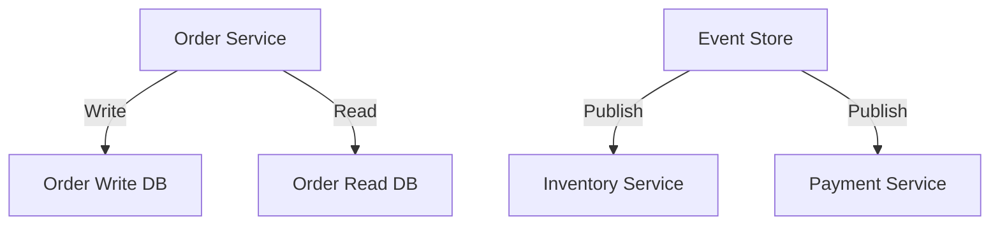

```markdown
---
title: "Mastering Messaging Strategies: Designing Robust Communication in Distributed Systems"
date: 2023-05-20
tags: ["backend", "distributed-systems", "database", "api-design", "messaging"]
author: "Alex Carter"
---

# Mastering Messaging Strategies: Designing Robust Communication in Distributed Systems

As backend engineers, we often grapple with systems that stretch across services, containers, and even cloud regions. The challenge isn't just writing code—it's designing how these disparate parts *talk* to each other. This is where **messaging strategies** come into play. They're the architectural glue that transforms chaotic communication into structured, reliable interactions, enabling scalable systems that can handle spikes, failures, and growth.

In this guide, we'll explore messaging strategies from the trenches. We'll dissect real-world problems that emerge from poorly designed communication layers, then dive into concrete patterns—with code examples—that solve them. By the end, you'll understand the tradeoffs of each approach and how to choose the right one for your use case.

---

## The Problem: When Communication Goes Wrong

Let's start with a common scenario that many of us have faced:

> **Case Study: The Order Processing Nightmare**
>
> You're building an e-commerce platform where users place orders. Orders flow through **Order Processing Service**, **Inventory Service**, and **Payment Service**. Everything works fine until:
> - A payment fails, but the inventory isn't returned to stock immediately.
> - The system crashes during peak hours, and orders get duplicated.
> - Sales teams complain that inventory is sometimes sold out but the payment still succeeded.
>
> The root cause? Poor messaging between services. Without proper strategies, your system is vulnerable to inconsistencies, data loss, and downtime.

### The Challenges:
1. **Synchronous Bottlenecks**: Blocking calls between services create cascading failures.
2. **Transaction Boundaries**: Databases can't span services, leading to eventual inconsistency.
3. **Unreliable Delivery**: Simple HTTP requests don't guarantee message delivery.
4. **Scaling Limits**: High traffic crashes systems that rely on direct service calls.
5. **Debugging Nightmares**: Decoupled systems make tracing messages difficult.

---

## The Solution: Messaging Strategies to the Rescue

Messaging strategies help decouple services, ensuring they communicate asynchronously (or at least non-blockingly). The key strategies are:

1. **Synchronous Messaging** (Direct Communication)
2. **Event-Driven Messaging** (Pub-Sub)
3. **Request-Response with Retries**
4. **Saga Pattern** (Distributed Transactions)
5. **Command Query Responsibility Segregation (CQRS)**

Each approach has tradeoffs, and the best choice depends on your requirements. Let's explore them with code.

---

## Components/Solutions: Code Examples

### 1. Synchronous Messaging (Direct HTTP Calls)
This is the simplest but least resilient approach. Services call each other directly.

```python
# OrderProcessingService.py
import requests

def process_order(order):
    # Call Inventory Service
    inventory_response = requests.post(
        "http://inventory-service/api/reserve",
        json={"product_id": order["product_id"], "quantity": order["quantity"]}
    )
    if inventory_response.status_code != 200:
        raise Exception("Inventory check failed")

    # Call Payment Service
    payment_response = requests.post(
        "http://payment-service/api/charge",
        json={"order_id": order["id"], "amount": order["total"]}
    )
    if payment_response.status_code != 200:
        # Rollback inventory? (This is tricky without a transaction)
        raise Exception("Payment failed")
```

#### Tradeoffs:
- **Pros**: Simple, low latency.
- **Cons**: Tight coupling, no retries, no guaranteed delivery.

---

### 2. Event-Driven Messaging (Pub-Sub)
Services publish events to a message broker (e.g., Kafka, RabbitMQ) and other services subscribe to consume them.

#### Kafka Example (Order Processed Event)
```python
# OrderProcessingService.py
from kafka import KafkaProducer
import json

producer = KafkaProducer(bootstrap_servers='kafka:9092')

def process_order(order):
    try:
        # Reserve inventory
        inventory_response = requests.post(
            "http://inventory-service/api/reserve",
            json={"product_id": order["product_id"], "quantity": order["quantity"]}
        )

        # Publish event if successful
        if inventory_response.status_code == 200:
            producer.send(
                "orders-topic",
                json.dumps({"order_id": order["id"], "status": "processed"}).encode()
            )
    except Exception as e:
        print(f"Order processing failed: {e}")
```

#### Consumer (Payment Service)
```python
# PaymentService.py
from kafka import KafkaConsumer

consumer = KafkaConsumer(
    "orders-topic",
    bootstrap_servers='kafka:9092',
    value_deserializer=lambda m: json.loads(m.decode())
)

def payment_handler(event):
    print(f"Processing payment for order {event['order_id']}")

for message in consumer:
    payment_handler(message.value)
```

#### Tradeoffs:
- **Pros**: Decoupled services, scalability, retries, persistence.
- **Cons**: Higher latency, complexity in ordering, eventual consistency.

---

### 3. Request-Response with Retries
Use a message broker to handle retries and timeouts.

#### Using RabbitMQ in Python
```python
# OrderProcessingService.py
import pika
import json

def process_order(order):
    connection = pika.BlockingConnection(pika.ConnectionParameters('rabbitmq'))
    channel = connection.channel()

    # Declare a queue with retry settings
    channel.queue_declare(
        queue='order_queue',
        durable=True,
        arguments={'x-dead-letter-exchange': '', 'x-max-priority': 3}
    )

    # Publish order with priority
    channel.basic_publish(
        exchange='order_exchange',
        routing_key='order.process',
        body=json.dumps(order),
        properties=pika.BasicProperties(
            delivery_mode=2,  # make message persistent
            priority=1
        )
    )
    connection.close()
```

#### Consumer (Retry Logic)
```python
# OrderConsumer.py
import pika

def on_message(ch, method, properties, body):
    order = json.loads(body)
    print(f"Processing order {order['id']} with priority {properties.priority}")

    try:
        # Simulate work
        inventory_response = requests.post(
            "http://inventory-service/api/reserve",
            json={"product_id": order["product_id"], "quantity": order["quantity"]}
        )
        if inventory_response.status_code == 200:
            ch.basic_ack(delivery_tag=method.delivery_tag)
    except Exception as e:
        print(f"Failed to process order {order['id']}: {e}")
        # Message will be redelivered due to rabbitmq settings

def start_consumer():
    connection = pika.BlockingConnection(pika.ConnectionParameters('rabbitmq'))
    channel = connection.channel()
    channel.queue_declare(queue='order_queue', durable=True)
    channel.basic_qos(prefetch_count=1)
    channel.basic_consume(queue='order_queue', on_message_callback=on_message)
    channel.start_consuming()

start_consumer()
```

#### Tradeoffs:
- **Pros**: Retries, prioritization, persistence.
- **Cons**: Still synchronous in nature; deadlocks possible.

---

### 4. Saga Pattern (Distributed Transactions)
For long-running workflows, use the Saga pattern to maintain consistency across services.

#### Example: Order Saga
```mermaid
sequenceDixture {
    participant OrderService as OrderService
    participant InventoryService as InventoryService
    participant PaymentService as PaymentService

    OrderService ->> InventoryService: Reserve Inventory
    alt Success
        OrderService ->> PaymentService: Charge
        alt Success
            OrderService ->> InventoryService: Commit
        else Failure
            OrderService ->> InventoryService: Cancel Reservation
    else Failure
        OrderService ->> InventoryService: Cancel Reservation
    end
}
```

#### Implementation (Using Kafka)
```python
# OrderService.py
from kafka import KafkaProducer
import json

producer = KafkaProducer(bootstrap_servers='kafka:9092')

def begin_order_saga(order):
    # Reserve inventory (optional: use a transactional outbox)
    inventory_response = requests.post(
        "http://inventory-service/api/reserve",
        json={"product_id": order["product_id"], "quantity": order["quantity"]}
    )

    if inventory_response.status_code != 200:
        return {"status": "failed", "reason": "inventory"}

    # Publish "reserved" event
    producer.send(
        "order-saga-topic",
        json.dumps({"order_id": order["id"], "action": "reserve"}).encode()
    )

    # Publish "charge" event
    producer.send(
        "order-saga-topic",
        json.dumps({"order_id": order["id"], "action": "charge", "amount": order["total"]}).encode()
    )

def handle_saga_event(event):
    action = event["action"]
    order_id = event["order_id"]

    if action == "charge":
        # Charge payment
        payment_response = requests.post(
            "http://payment-service/api/charge",
            json={"order_id": order_id, "amount": event.get("amount", 0)}
        )
        if payment_response.status_code == 200:
            # Publish "commit" event
            producer.send(
                "order-saga-topic",
                json.dumps({"order_id": order_id, "action": "commit"}).encode()
            )
        else:
            # Publish "cancel" event
            producer.send(
                "order-saga-topic",
                json.dumps({"order_id": order_id, "action": "cancel"}).encode()
            )
    elif action == "cancel":
        # Cancel inventory reservation
        requests.post(
            "http://inventory-service/api/cancel-reservation",
            json={"order_id": order_id}
        )
    elif action == "commit":
        # Confirm inventory
        requests.post(
            "http://inventory-service/api/confirm",
            json={"order_id": order_id}
        )
```

#### Tradeoffs:
- **Pros**: Handles long-running transactions, compensating actions.
- **Cons**: Complex to implement, requires idempotency.

---

### 5. Command Query Responsibility Segregation (CQRS)
Separate read and write operations for scalability.

#### Example Architecture


#### Implementation
```python
# CQRS Service
from kafka import KafkaProducer
import json
from fastapi import FastAPI

app = FastAPI()
producer = KafkaProducer(bootstrap_servers='kafka:9092')

# Write (Command) API
@app.post("/orders")
def create_order(order: dict):
    # Save to write DB
    write_db.save(order)

    # Publish event to event store
    producer.send(
        "order-events",
        json.dumps({"order_id": order["id"], "event": "created"}).encode()
    )

    return {"status": "created"}

# Read (Query) API
@app.get("/orders/{order_id}")
def get_order(order_id: str):
    return read_db.get(order_id)
```

#### Tradeoffs:
- **Pros**: Scalable reads, decoupled write/read paths.
- **Cons**: Complex to maintain, eventual consistency.

---

## Implementation Guide

### Choosing the Right Strategy
| Strategy               | Use Case                                  | Difficulty | Scalability | Consistency |
|------------------------|-------------------------------------------|------------|-------------|-------------|
| Synchronous HTTP       | Simple CRUD, low latency                   | Low        | Low         | Strong      |
| Event-Driven (Pub-Sub) | Decoupled services, event sourcing         | Medium     | High        | Eventual    |
| Request-Response       | Retryable operations, prioritization      | Medium     | Medium      | Strong      |
| Saga                   | Long-running transactions, compensating actions | High  | Medium      | Strong      |
| CQRS                   | High read volume, complex queries         | High       | High        | Eventual    |

### Step-by-Step Implementation Plan
1. **Audit Current System**: Map all service interactions. Identify bottlenecks.
2. **Pilot Project**: Start with one service-to-service communication pattern (e.g., replace HTTP with Kafka for orders).
3. **Incremental Adoption**: Gradually introduce messaging where most needed (e.g., async inventory updates).
4. **Monitor**: Track latency, errors, and throughput. Adjust strategies as needed.
5. **Document**: Clearly document event schemas and service contracts.

---

## Common Mistakes to Avoid

1. **Not Handling Failures Gracefully**:
   - Example: Ignoring message broker errors leads to data loss.
   - Fix: Always implement retries, dead-letter queues, and monitoring.

2. **Lack of Idempotency**:
   - Example: Duplicate orders due to redelivery without idempotency keys.
   - Fix: Use unique message IDs and ensure consumers handle duplicates.

3. **Overcomplicating with Too Many Strategies**:
   - Example: Using Kafka for all communication when HTTP would suffice.
   - Fix: Start simple, then optimize based on metrics.

4. **Ignoring Monitoring**:
   - Example: No visibility into message backlog or processing delays.
   - Fix: Instrument brokers and consumers with metrics (e.g., Prometheus).

5. **Tight Coupling to Brokers**:
   - Example: Hardcoding Kafka endpoints in code.
   - Fix: Use environment variables and feature flags for broker switching.

6. **Poor Event Design**:
   - Example: Events are too broad (e.g., "OrderChanged" instead of "OrderCreated").
   - Fix: Design events as immutable records with minimal payloads.

7. **No Schema Evolution Plan**:
   - Example: Breaking changes to event schemas without backward compatibility.
   - Fix: Use schema registry (e.g., Confluent Schema Registry).

---

## Key Takeaways

- **Decouple Services**: Use messaging to separate producers and consumers.
- **Start Simple**: Begin with synchronous calls if the system is small.
- **Optimize for Failure**: Assume services will fail; design for retries and compensations.
- **Monitor Everything**: Track message throughput, latency, and errors.
- **Tradeoffs are Real**: Strong consistency vs. scalability is a common tension.
- **Document Contracts**: Events and APIs must be clearly documented.
- **Test Thoroughly**: Simulate broker failures, network issues, and high load.

---

## Conclusion

Messaging strategies are the backbone of modern distributed systems. They allow your services to communicate robustly, scale horizontally, and recover from failures. The key is to start with the right strategy for your needs—whether that's simple HTTP calls, event-driven pub-sub, or complex sagas—and iterate based on real-world data.

Remember, there's no one-size-fits-all solution. The best messaging strategy is the one that aligns with your system's requirements, scales with your growth, and minimizes surprises during peak loads. As your system evolves, so too will your messaging needs—stay flexible, stay observant, and keep iterating.

Start small, experiment, and let your metrics guide you. Happy designing! 🚀
```

---

### Notes for the Author:
1. **Mermaid Diagrams**: The `mermaid` blocks are for sequence diagrams. Ensure the environment supports rendering Mermaid (e.g., GitHub Markdown, VS Code Live Preview).
2. **Code Examples**: The code snippets assume Python for simplicity but can be adapted to other languages (e.g., Java, Go). Adjust dependencies (e.g., `fastapi`, `kafka-python`) as needed.
3. **Further Reading**: Link to resources like the [Saga Pattern Paper](https://microservices.io/patterns/data/saga.html) or [CQRS Documentation](https://martinfowler.com/bliki/CQRS.html) for deeper dives.
4. **Real-World Tools**: Mention tools like:
   - **Message Brokers**: Kafka, RabbitMQ, AWS SQS/SNS.
   - **Observability**: Prometheus, Grafana, ELK Stack.
   - **Schema Management**: Confluent Schema Registry, Avro.