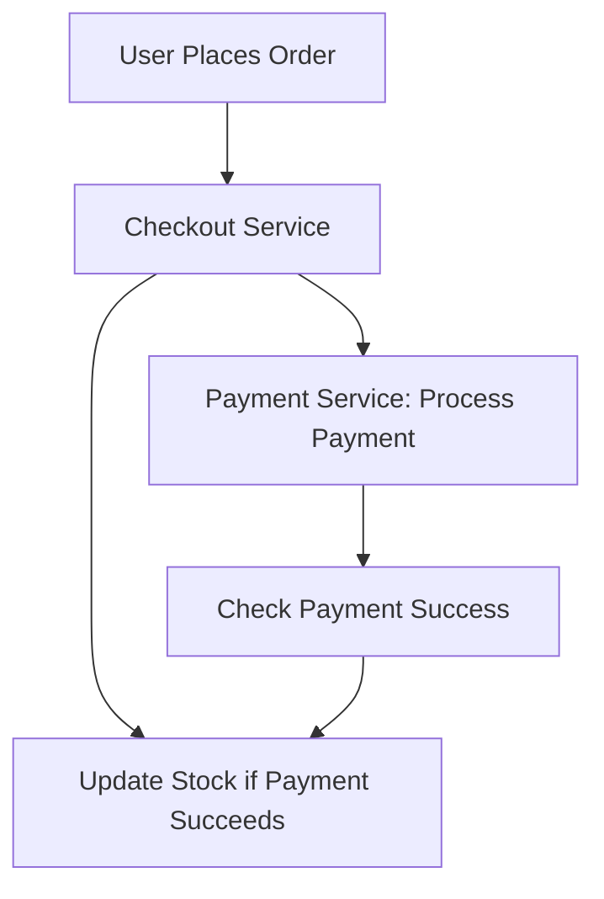

# **Messaging Techniques: Building Robust Event-Driven Systems from Day One**

As a backend developer, you’ve probably dealt with systems where components need to communicate—whether it’s a user submitting a form, an order being placed, or a payment being processed. But what happens when these interactions require more than just a direct request-response cycle? What if you need to decouple services, handle background tasks, or build scalable pipelines?

This is where **messaging techniques** come into play. Messaging allows components to communicate asynchronously, improving performance, reliability, and scalability. Whether you're working with a simple event queue or a complex event-driven architecture, understanding messaging techniques is essential for writing maintainable, efficient, and resilient systems.

In this guide, we’ll explore:
- The challenges you face without proper messaging techniques.
- How asynchronous messaging solves these problems.
- Practical examples using synchronous and asynchronous patterns.
- Common pitfalls to avoid when implementing messaging.

By the end, you’ll have a clear roadmap for when and how to use messaging in your applications.

---

## **The Problem: Why Messaging Matters**

Let’s start with a real-world scenario. Imagine a **web application for an e-commerce platform** with three key services:

1. **Checkout Service**: Handles order creation and payment processing.
2. **Inventory Service**: Tracks stock levels and updates them in real time.
3. **Notification Service**: Sends email/SMS alerts to customers.

### **The Challenge: Tight Coupling**
Without messaging, these services might look like this:



This creates **tight coupling**—if the `Checkout Service` fails at any point, the entire process halts. Worse, if the `Inventory Service` or `Notification Service` is slow or unavailable, the user experience degrades.

### **Other Problems:**
- **Blocking Calls**: Synchronous requests can slow down your application if downstream services are slow.
- **Scalability Issues**: If multiple users place orders simultaneously, a monolithic approach can lead to bottlenecks.
- **Difficulty in Maintenance**: Changes in one service force changes in others, increasing complexity.

### **The Need for Decoupling**
Messaging techniques solve these problems by introducing **asynchronous communication**, where services exchange messages (events) rather than making direct calls. This allows them to:
- Process tasks independently.
- Handle failures gracefully.
- Scale horizontally without blocking each other.

---

## **The Solution: Messaging Techniques**

Messaging techniques enable **loose coupling** by decoupling the sender and receiver of a message. There are two primary approaches:

1. **Synchronous Messaging**: Direct request-response communication (e.g., REST APIs).
2. **Asynchronous Messaging**: Message queuing or event-driven systems (e.g., Kafka, RabbitMQ).

### **When to Use Which?**
| Approach          | Best For                          | Example Use Case                          |
|-------------------|-----------------------------------|-------------------------------------------|
| **Synchronous**   | Simple request-response flows      | API calls between microservices            |
| **Asynchronous**  | Background tasks, event processing | Order processing, notifications           |

We’ll focus on **asynchronous messaging** here, as it’s the most powerful tool for building scalable systems.

---

## **Components of Asynchronous Messaging**

To implement messaging, you’ll need:

1. **Producers**: Services that send messages (e.g., `Checkout Service`).
2. **Consumers**: Services that receive and process messages (e.g., `Inventory Service`).
3. **Broker**: A middleware that manages message storage and delivery (e.g., RabbitMQ, Kafka).
4. **Queue/Topic**: Where messages are stored before being consumed.

### **Example Architecture**
Here’s how the e-commerce example could work with messaging:

```mermaid
graph TD
    A[User Places Order] --> B[Checkout Service: Sends "OrderCreated" Event]
    B --> C[RabbitMQ/Queue]
    C --> D[Inventory Service: Consumes "OrderCreated"]
    C --> E[Notification Service: Consumes "OrderCreated"]
    D --> F[Inventory Service: Sends "StockUpdated" Event]
    F --> C
    E --> G[Notification Service: Sends Email]
```

---

## **Code Examples: Implementing Messaging**

We’ll use **RabbitMQ** (a lightweight message broker) and **Python** for examples, but the concepts apply to any language or broker.

---

### **1. Setting Up RabbitMQ (Local Development)**
First, install RabbitMQ locally (Docker recommended):

```bash
docker run -d --name rabbitmq -p 5672:5672 -p 15672:15672 rabbitmq:management
```
Access the management UI at `http://localhost:15672` (default credentials: `guest`/`guest`).

---

### **2. Producer: Sending an Event**
The `Checkout Service` sends an `OrderCreated` event.

#### **Install Dependencies**
```bash
pip install pika
```

#### **Producer Code (`producer.py`)**
```python
import pika

# Connect to RabbitMQ
connection = pika.BlockingConnection(pika.ConnectionParameters('localhost'))
channel = connection.channel()

# Declare a queue (exists if it doesn’t)
channel.queue_declare(queue='orders', durable=True)

def send_order_created(order_id, user_id):
    message = {
        'event': 'order_created',
        'data': {
            'order_id': order_id,
            'user_id': user_id,
            'status': 'pending'
        }
    }
    channel.basic_publish(
        exchange='',
        routing_key='orders',
        body=str(message),
        properties=pika.BasicProperties(
            delivery_mode=2,  # Make message persistent
        )
    )
    print(f"[x] Sent OrderCreated: {message}")

# Example usage
send_order_created('order_123', 'user_456')
connection.close()
```

#### **Key Points:**
- `queue_declare` ensures the queue exists.
- `delivery_mode=2` makes messages persistent (survive broker restarts).
- The message is sent as JSON (you could also use a library like `json.dumps`).

---

### **3. Consumer: Processing an Event**
The `Inventory Service` consumes `OrderCreated` events.

#### **Consumer Code (`inventory_consumer.py`)**
```python
import pika
import json

def process_order(message):
    data = json.loads(message)
    order_id = data['data']['order_id']
    print(f"[x] Received Order {order_id}. Updating inventory...")

    # Simulate inventory update
    # (In a real app, you’d call your DB here)
    update_inventory(order_id)

def update_inventory(order_id):
    print(f"[x] Inventory updated for order {order_id}")

def main():
    connection = pika.BlockingConnection(pika.ConnectionParameters('localhost'))
    channel = connection.channel()

    # Declare the same queue
    channel.queue_declare(queue='orders', durable=True)

    # Set up a consumer
    channel.basic_consume(
        queue='orders',
        on_message_callback=process_order,
        auto_ack=True  # Auto-acknowledge message after processing
    )

    print(' [*] Waiting for messages. To exit press CTRL+C')
    channel.start_consuming()

if __name__ == '__main__':
    main()
```

#### **Key Points:**
- `auto_ack=True` automatically removes the message from the queue after processing.
- If you set `auto_ack=False`, you must manually acknowledge messages (important for error handling).

---

### **4. Running the Example**
1. Start the RabbitMQ container (if not already running).
2. Run the producer:
   ```bash
   python producer.py
   ```
3. Run the consumer in another terminal:
   ```bash
   python inventory_consumer.py
   ```
4. You should see:
   ```
   [x] Sent OrderCreated: {'event': 'order_created', 'data': {'order_id': 'order_123', 'user_id': 'user_456', 'status': 'pending'}}
   [x] Received Order order_123. Updating inventory...
   [x] Inventory updated for order order_123
   ```

---

## **Implementation Guide: Best Practices**

### **1. Choose the Right Broker**
| Broker       | Best For                          | Pros                          | Cons                          |
|--------------|-----------------------------------|-------------------------------|-------------------------------|
| **RabbitMQ** | Simple queues, RPC                | Easy to set up, reliable       | Not ideal for high-throughput  |
| **Kafka**    | Event streaming, high throughput  | Scalable, durable              | Complex setup, overkill for simple use cases |
| **AWS SQS**  | Serverless, scalable queues       | Fully managed, pay-as-you-go    | Vendor lock-in                 |

For beginners, **RabbitMQ** is the easiest to start with.

---

### **2. Design Your Message Schema**
Messages should be **self-descriptive** and **versioned**. Example:

```json
{
  "event": "order_created",
  "version": "1.0",
  "data": {
    "order_id": "123",
    "user_id": "456",
    "items": [
      {"product_id": "789", "quantity": 2}
    ]
  }
}
```

**Tip:** Use schemas (e.g., JSON Schema) to validate messages.

---

### **3. Handle Failures Gracefully**
- **Dead Letter Queues (DLQ)**: Route failed messages to a separate queue.
- **Retry Logic**: Exponential backoff for transient failures.
- **Idempotency**: Ensure consumers can reprocess the same message safely.

#### **Example: Dead Letter Queue**
Modify the consumer to use a DLQ:

```python
channel.basic_consume(
    queue='orders',
    on_message_callback=process_order,
    auto_ack=False  # Manual acknowledgment
)

def process_order(ch, method, properties, body):
    try:
        data = json.loads(body)
        process_order_logic(data)
        ch.basic_ack(delivery_tag=method.delivery_tag)  # Acknowledge success
    except Exception as e:
        print(f"[x] Error processing message: {e}")
        # Move to DLQ (simplified example)
        ch.basic_publish(
            exchange='',
            routing_key='dlq',
            body=body
        )
        ch.basic_nack(delivery_tag=method.delivery_tag, requeue=False)  # Reject permanently
```

---

### **4. Monitor and Scale**
- **Metrics**: Track message rates, processing times, and failures.
- **Auto-scaling**: Use horizontal scaling for consumers (e.g., Kubernetes pods).

---

## **Common Mistakes to Avoid**

1. **Not Making Messages Durable**
   - Always set `delivery_mode=2` in RabbitMQ to survive broker restarts.

2. **Ignoring Error Handling**
   - Never assume messages will always succeed. Implement retries and DLQs.

3. **Overloading Consumers**
   - If consumers are slow, messages pile up. Monitor queue lengths and scale consumers.

4. **Tight Coupling to Message Format**
   - Use schemas (e.g., Avro, Protobuf) for backward compatibility.

5. **Forgetting Idempotency**
   - If a consumer crashes after processing, reprocessing the same message should be safe.

6. **Using Messaging for Synchronous Work**
   - If you need a direct response (e.g., API call), use synchronous messaging (HTTP/gRPC).

---

## **Key Takeaways**

✅ **Decouple Services**: Messaging enables independent scaling and failure isolation.
✅ **Asynchronous = Resilience**: Services don’t block each other.
✅ **Start Simple**: RabbitMQ is great for beginners; scale to Kafka later if needed.
✅ **Design for Failure**: Always plan for retries, DLQs, and idempotency.
✅ **Monitor Everything**: Queue lengths, processing times, and error rates are critical.

---

## **Conclusion**

Messaging techniques are a **game-changer** for building scalable, resilient backend systems. By decoupling services and enabling asynchronous communication, you can handle workload spikes, recover from failures, and maintain independence between components.

### **Next Steps:**
1. **Experiment**: Run the RabbitMQ example and extend it (e.g., add a `Notification Service`).
2. **Learn More**:
   - [RabbitMQ Tutorials](https://www.rabbitmq.com/getstarted.html)
   - [Event-Driven Architecture Patterns](https://www.eventstore.com/blog/patterns-for-event-driven-architecture/)
3. **Consider Advanced Topics**:
   - Event sourcing
   - CQRS (Command Query Responsibility Segregation)
   - Serverless messaging (AWS SQS/SNS)

Messaging isn’t magic—it requires careful design—but the payoff in maintainability and scalability is worth it. Happy coding! 🚀