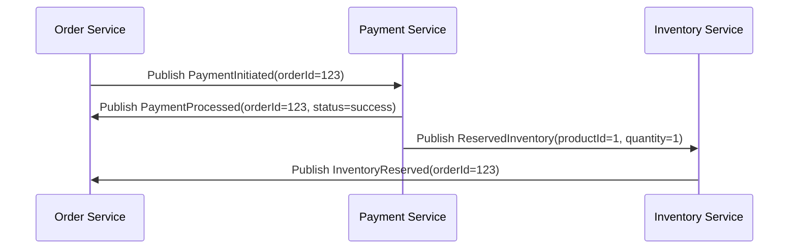

```markdown
---
title: "Testing Asynchronous Messaging: The Complete Guide"
date: 2023-09-15
tags: ["testing", "asynchronous", "messaging", "backend", "patterns"]
---

# **Testing Asynchronous Messaging: The Complete Guide**

Messaging systems are the invisible backbone of modern distributed architectures. Whether you're using Kafka, RabbitMQ, AWS SNS/SQS, or a simple Redis pub/sub system, asynchronous messaging enables resilience, scalability, and loose coupling—but only if you test it properly.

However, testing asynchronous systems is *hard*. Messages can get lost, disappear without a trace, or arrive out of order. Different components may have different expectations for message formats or processing logic. And unlike synchronous APIs, you can’t rely on simple HTTP request/response cycles to catch regressions.

This guide covers **testing asynchronous messaging**—from the challenges you’ll face to practical solutions you can implement today. We'll explore patterns, code examples, and anti-patterns to help you ship reliable messaging systems.

---

## **The Problem: Why Messaging Testing Is Hard**

Messaging systems introduce complexity because they’re *event-driven*, *decentralized*, and *eventually consistent*. Here are the key challenges:

### **1. Messages Can Disappear**
Unlike synchronous calls, messages might not reach their destination due to:
- Network failures
- Broker restarts
- Consumer crashes
- Permission issues

**Example:** An order service publishes a `PaymentFailed` event, but the notification service never receives it. The customer gets charged, but never notified—leading to a support ticket.

### **2. Ordering Isn’t Guaranteed**
Most brokers (like Kafka) don’t enforce strict ordering for all topics. You might expect:
```json
// Expected order: OrderCreated → PaymentInitiated → PaymentCompleted
PaymentCompleted
OrderCreated
PaymentInitiated
```
But instead, you get:
```json
// Reality: Race conditions and eventual consistency
PaymentInitiated
PaymentCompleted
OrderCreated
```
This can lead to **race conditions**, where services make decisions based on incomplete or out-of-order data.

### **3. Debugging Is Painful**
When something goes wrong, messages might:
- Be stuck in a queue (but you didn’t set up monitoring)
- Be processed by the wrong consumer
- Get transformed incorrectly by a middleware service

Without proper testing, you might spend hours tracing a bug that could have been caught in development.

### **4. Testing State Changes Is Hard**
A typical async flow looks like this:
1. **Event A** is published (e.g., `UserCreated`)
2. **Service B** consumes it and updates a database
3. **Service C** depends on that state and fails

But if **Service B** fails, **Service C** might still try to read the stale state, causing inconsistencies.

---

## **The Solution: Messaging Testing Patterns**

To test async messaging reliably, you need a **multi-layered approach**:
1. **Isolate message production** (publishers)
2. **Mock or control consumers** (subscribers)
3. **Verify eventual consistency** (state changes)
4. **Test edge cases** (retries, failures, timeouts)

We’ll cover **three main patterns** to achieve this:

### **1. The Test Double Pattern (Mocking Producers & Consumers)**
Replace real producers/consumers with **test doubles** (mocks, stubs, fakes).

#### **Example: Testing a Message Publisher**
Instead of sending a real message to Kafka, verify that the event was *intended* to be sent.

```javascript
// test/orderService.test.js
const { expect } = require('chai');
const sinon = require('sinon');
const orderService = require('./orderService');
const kafkaProducer = require('../lib/kafkaProducer');

describe('OrderService', () => {
  it('should publish OrderCreated event', async () => {
    // Mock the Kafka producer
    const publishSpy = sinon.spy(kafkaProducer, 'publish');

    // Call the service (e.g., place an order)
    await orderService.placeOrder(123, 'user123');

    // Assert the message was published correctly
    expect(publishSpy.calledOnce).to.be.true;
    expect(publishSpy.firstCall.args[0].topic).to.equal('orders');
    expect(publishSpy.firstCall.args[0].value).to.deep.equal({
      event: 'OrderCreated',
      orderId: 123,
      userId: 'user123',
    });

    // Restore the original function
    publishSpy.restore();
  });
});
```

#### **Example: Testing a Message Consumer**
Instead of running a real consumer, simulate message receipt and verify behavior.

```python
# test/user_notification_service_test.py
import pytest
from unittest.mock import patch, MagicMock
from user_notification_service import handle_order_created

def test_handle_order_created():
    # Mock the message from the broker
    mock_message = MagicMock()
    mock_message.value = {
        "event": "OrderCreated",
        "orderId": 101,
        "userId": "user456",
    }

    # Verify the consumer processes the message correctly
    with patch('user_notification_service.send_email') as mock_send_email:
        handle_order_created(mock_message)

        # Ensure the consumer sent the right email
        mock_send_email.assert_called_once_with(
            "user456",
            "Your order #101 is confirmed!",
        )
```

### **2. The Event Sourcing Pattern (Replaying Messages)**
Instead of testing async flows **live**, **replay recorded messages** in a controlled environment.

#### **How It Works**
1. **Record** real messages during development/staging.
2. **Replay** them in tests to simulate async behavior.
3. **Verify** that downstream services react correctly.

#### **Example: Replaying Kafka Messages in Tests**
Using [`kafka-node`](https://github.com/bluebirdjs/kafka-node) and `jest` in Node.js:

```javascript
// test/replay_order_flow.test.js
const { Kafka } = require('kafkajs');
const { replayMessages } = require('./testUtils');

describe('Order Flow', () => {
  it('should process OrderCreated → PaymentInitiated → PaymentCompleted', async () => {
    // 1. Replay pre-recorded messages
    const messages = await replayMessages('orders', [
      { value: { event: 'OrderCreated', orderId: 123 } },
      { value: { event: 'PaymentInitiated', orderId: 123 } },
      { value: { event: 'PaymentCompleted', orderId: 123 } },
    ]);

    // 2. Verify downstream services reacted
    expect(database.containsOrder(123)).to.be.true;
    expect(emailService.didSendConfirmation(123)).to.be.true;
  });
});
```

#### **Tools for Event Sourcing Replay**
| Tool | Language | Use Case |
|------|----------|----------|
| [`kafkacheck`](https://github.com/dolthub/kafkacheck) | Python | Schema validation + replay |
| [`testcontainers-kafka`](https://testcontainers.com/modules/databases/kafka/) | Java/JS | Spin up Kafka for tests |
| [`kafka-console-consumer`](https://kafka.apache.org/21/documentation/#consoleconsumer) | CLI | Manual replay debugging |

### **3. The Saga Testing Pattern (End-to-End Async Flows)**
Test **multiple services** interacting through messages to ensure **state consistency**.

#### **Example: Testing a Payment + Inventory Saga**


#### **Implementation in Go (with `testify`)**
```go
// test/payment_saga_test.go
package test

import (
	"testing"
	"github.com/stretchr/testify/assert"
	"github.com/stretchr/testify/mock"
	. "your-module/payment"
	. "your-module/inventory"
)

func TestPaymentSaga(t *testing.T) {
	// Mock dependencies
	mockPaymentClient := new(MockPaymentClient)
	mockInventoryClient := new(MockInventoryClient)

	// Simulate successful payment
	mockPaymentClient.On("process", mock.Anything).Return(PaymentResult{Status: "success"}, nil)
	mockInventoryClient.On("reserve", mock.Anything).Return(true, nil)

	// Execute saga
	result, err := ProcessOrderSaga(123, mockPaymentClient, mockInventoryClient)
	assert.NoError(t, err)
	assert.Equal(t, "success", result.Status)

	// Verify messages were sent
	mockPaymentClient.AssertExpectations(t)
	mockInventoryClient.AssertExpectations(t)
}
```

---

## **Implementation Guide: How to Test Async Messaging in Your Project**

### **Step 1: Choose Your Testing Level**
| Level | Scope | When to Use |
|-------|-------|-------------|
| **Unit Tests** | Single service, mock producers/consumers | Testing logic inside a service |
| **Integration Tests** | Multiple services, real broker | Testing event flow between services |
| **End-to-End Tests** | Full system, replay recorded events | Testing real async workflows |

### **Step 2: Set Up a Test Broker**
Instead of using production Kafka/RabbitMQ, **spin up a local instance** for testing.

#### **Example: Docker-Compose for Test Broker**
```yaml
# docker-compose.test.yml
version: '3'
services:
  test-kafka:
    image: confluentinc/cp-kafka:7.0.0
    ports:
      - "9092:9092"
    environment:
      KAFKA_ADVERTISED_LISTENERS: PLAINTEXT://test-kafka:9092
      KAFKA_OFFSETS_TOPIC_REPLICATION_FACTOR: 1
      KAFKA_TRANSACTION_STATE_LOG_REPLICATION_FACTOR: 1
      KAFKA_TRANSACTION_STATE_LOG_MIN_ISR: 1
      KAFKA_ZOOKEEPER_CONNECT: test-zookeeper:2181
    depends_on:
      - test-zookeeper

  test-zookeeper:
    image: zookeeper:3.8.0
    ports:
      - "2181:2181"
```

Run with:
```bash
docker-compose -f docker-compose.test.yml up -d
```

### **Step 3: Test Message Formats**
Use **schema validation** to catch inconsistencies early.

#### **Example: Avro Schema in Kafka**
```json
// schema.avsc
{
  "type": "record",
  "name": "OrderCreated",
  "fields": [
    { "name": "orderId", "type": "string" },
    { "name": "userId", "type": "string" },
    { "name": "timestamp", "type": ["int", "null"] }
  ]
}
```

Test with:
```javascript
const { Schema } = require('avsc');
const schema = new Schema(require('./schema.avsc'));

const isValid = schema.validate({
  orderId: '123',
  userId: 'user456',
});
console.assert(isValid, "Message format is invalid!");
```

### **Step 4: Test Consumer Behavior**
Simulate **message delays, retries, and failures**.

#### **Example: Testing Retries with `sinon`**
```javascript
// test/consumer_retry.test.js
const { expect } = require('chai');
const sinon = require('sinon');
const consumer = require('./consumer');

describe('Consumer Retry Logic', () => {
  it('should retry failed messages up to 3 times', async () => {
    const mockProcess = sinon.stub().throws("Database error");
    const mockConsumer = { consume: sinon.stub().returns({ value: { event: 'OrderCreated' } }) };

    // Force the consumer to fail
    sinon.stub(consumer, 'process').callsFake(mockProcess);

    // Test retry behavior
    const result = await consumer.run(mockConsumer, { maxRetries: 3 });

    expect(mockProcess.callCount).to.equal(3); // Should retry 2 more times
    expect(result.success).to.be.false;
  });
});
```

### **Step 5: Test Eventual Consistency**
Ensure that **all services agree** on the state after processing.

#### **Example: Database + Message Consistency Check**
```python
# test/consistency_test.py
import pytest
from your_app.database import db
from your_app.services import message_consumer

def test_order_state_consistency():
    # 1. Publish a test event
    message_consumer.handle_order_created({"orderId": 123, "userId": "user1"})

    # 2. Wait for downstream services to process (or use async assert)
    db.wait_for_consistency()

    # 3. Verify state
    order = db.get_order(123)
    assert order["status"] == "confirmed"
    assert db.get_user(123)["notifications"].pop() == "Your order is confirmed!"
```

---

## **Common Mistakes to Avoid**

### **❌ Mistake 1: Testing Only Happy Paths**
- **Problem:** You only test successful scenarios but fail to catch race conditions, timeouts, or broker failures.
- **Fix:** Use **Chaos Engineering** techniques (e.g., `chaos-mesh`, `grepper`) to inject failures.

```python
# Example: Test what happens if the broker is down
def test_broker_failure():
    with patch('your_app.broker.publish', side_effect=ConnectionError()):
        with pytest.raises(RetryError):
            order_service.place_order(123)
```

### **❌ Mistake 2: Not Testing Message Ordering**
- **Problem:** Your app assumes messages arrive in order, but Kafka doesn’t guarantee it.
- **Fix:** Use **transactional outbox pattern** or **exactly-once processing**.

```java
// Example: Kafka exactly-once processing
Properties props = new Properties();
props.put("transactional.id", "order-service");
props.put("enable.idempotence", "true");

Producer<String, String> producer = new KafkaProducer<>(props);
producer.initTransactions();
try {
    producer.beginTransaction();
    producer.send(new ProducerRecord<>("orders", msg)).get();
    producer.commitTransaction();
} catch (Exception e) {
    producer.abortTransaction();
}
```

### **❌ Mistake 3: Over-Relying on Mocks**
- **Problem:** Mocking everything leads to **flaky tests** that don’t catch real integration issues.
- **Fix:** Use **hybrid testing** (mocks for units, real broker for integration).

### **❌ Mistake 4: Ignoring Broker-Specific Quirks**
- **Problem:** RabbitMQ handles retries differently than Kafka.
- **Fix:** Test **broker-specific behaviors** (e.g., Kafka’s `max.poll.interval.ms`).

```python
# Example: Test Kafka consumer timeouts
def test_consumer_timeout():
    consumer = KafkaConsumer(
        bootstrap_servers="localhost:9092",
        group_id="test-group",
        auto_offset_reset="earliest",
        max_poll_interval_ms=5000,  # Too low! (Default is 5 min)
    )
    assert consumer.consumer_timeout_ms == 5000  # This will fail! Use 300000 instead.
```

### **❌ Mistake 5: Not Cleaning Up Messages**
- **Problem:** Test consumers leave messages unprocessed, clogging the broker.
- **Fix:** **Acknowledge messages** in tests (or use a test-specific topic).

```javascript
// Example: Acknowledge messages in Kafka tests
const consumer = new Consumer({
  groupId: 'test-group',
  offset: 'earliest',
  autoCommit: false,  // Manually commit to avoid reprocessing
});

consumer.on('message', async (msg) => {
  try {
    await processMessage(msg);
    await consumer.commit(msg); // Only commit if success
  } catch (err) {
    await consumer.commit(msg, 'error'); // Requeue on error
  }
});
```

---

## **Key Takeaways**

✅ **Test message production** (verify events are published correctly).
✅ **Mock consumers when testing units**, but **use real brokers for integration**.
✅ **Replay recorded events** to test async flows without dependencies.
✅ **Test eventual consistency** (database + message state alignment).
✅ **Simulate failures** (timeouts, retries, broker crashes).
✅ **Validate schemas** to catch format mismatches early.
✅ **Clean up test data** (acknowledge messages, reset offsets).
✅ **Use transactional outbox** for atomicity in distributed systems.
✅ **Test broker-specific behaviors** (Kafka ≠ RabbitMQ ≠ SNS).

---

## **Conclusion: Ship Reliable Async Systems**

Testing asynchronous messaging isn’t about writing more tests—it’s about **testing differently**. You need to:
1. **Mock where it matters** (units)
2. **Replay where it’s slow** (integration)
3. **Fail where it hurts** (Chaos Testing)

By applying these patterns, you’ll catch bugs **before they reach production**, avoid **race conditions**, and ensure **eventual consistency**—all while keeping your tests fast and maintainable.

**Next Steps:**
- Start with **mocking producers/consumers** in unit tests.
- Set up a **test broker** (Docker + Kafka/RabbitMQ).
- Record and **replay real events** for integration tests.
- Introduce **Chaos Testing** (e.g., `grepper`) to catch resiliency issues.

Happy testing! 🚀
```

---
**Further Reading:**
- [Kafka Testing Best Practices](https://kafka.apache.org/documentation/#testing)
- [Event Storming for Async Systems](https://eventstorming.com/)
- [Testing Distributed Systems](https://martinfowler.com/articles/patterns-of-distributed-systems.html)