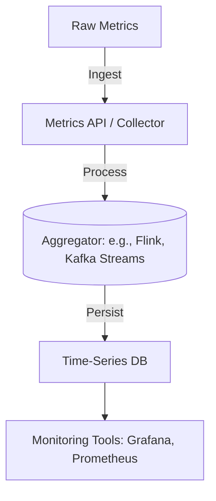

```markdown
---
title: "Metrics Aggregation Pattern: Building Resilient Monitoring Systems"
author: [Your Name]
date: [ Publication Date ]
tags: [backend engineering, database design, observability, metrics, performance, SRE]
---

# Metrics Aggregation Pattern: Building Resilient Monitoring Systems

## Introduction

In modern backend systems, observability is non-negotiable. Metrics—numerical representations of system behavior—are the lifeblood of performance tuning, anomaly detection, and decision-making. But raw metrics are like raw data: voluminous, noisy, and overwhelming if consumed directly. This is where the **Metrics Aggregation Pattern** comes into play.

Aggregation isn’t just about crunching numbers—it’s about distilling meaning from chaos. Whether you’re tracking API latency, database query performance, or microservice uptime, aggregating metrics helps you:
- **Reduce noise**: Ignore outliers and focus on trends.
- **Optimize storage**: Store summaries instead of raw events.
- **Accelerate queries**: Answer "why" questions faster with pre-computed insights.
- **Enforce consistency**: Ensure metrics are aligned across services and teams.

This pattern isn’t new, but its implementation in scalable systems often is. We’ll explore how to design a robust metrics aggregation system from scratch, with tradeoffs, real-world examples, and code to guide you.

---

## The Problem: Why Raw Metrics Fail

Imagine you’re monitoring a high-traffic API with 10,000 requests per second. Storing each request’s latency (a 64-bit float) as a distinct time-series entry would generate **~86.4 GB/day** of raw data. But here’s the catch: most of your queries won’t ask for *every* single data point. Instead, you’ll want to know:

- “What’s the average response time in the last hour?”
- “Are errors spiking in Region A?”
- “How much does this feature impact CPU usage?”

Raw metrics alone don’t help. They’d force your monitoring tools to scan terabytes of data per query, leading to:
- **Performance bottlenecks**: Slow dashboards and alerts.
- **Storage explosion**: Costs skyrocket with unfiltered retention.
- **Analysis paralysis**: Teams drown in irrelevant granularity.

Metrics aggregation solves this by pre-processing data into meaningful units, balancing detail and efficiency.

---

## The Solution: Metrics Aggregation Pattern

The aggregation pattern transforms raw metrics into **time-series data** organized by:
- **Dimensions**: Tags (e.g., `service=auth`, `env=prod`).
- **Metrics types**: Counters, gauges, histograms, sums.
- **Aggregation windows**: Time buckets (e.g., 1 minute, 5 minutes).

Here’s how it works:

1. **Ingestion**: Raw metrics flow into your system (e.g., via Prometheus, OpenTelemetry, or custom telemetry).
2. **Processing**: Aggregators compute sums, averages, or max/min values per window.
3. **Storage**: Aggregated data is stored efficiently (e.g., in time-series databases like InfluxDB or TimescaleDB).
4. **Querying**: Queries retrieve pre-aggregated results, not raw events.

### Simplified Architecture


---

## Components/Solutions

### 1. **Metric Types & Their Aggregations**
Each metric type requires a different aggregation strategy:

| Metric Type | Example                     | Aggregation Goal                     | Common Aggregations       |
|-------------|-----------------------------|--------------------------------------|---------------------------|
| Counter     | HTTP requests (`http_requests`) | Track total increments              | Sum, rate (per window)    |
| Gauge       | Memory usage (`mem.used`)     | Snapshot of a value                 | Max/min per window        |
| Histogram   | Latency distribution         | Understand percentiles               | 95th/99th percentile      |
| Summary     | Request sizes                | Approximate percentiles             | Approximate quantiles     |

**Example**: For `http_requests_total`, you’d track:
- **Sum**: Total requests in a time window.
- **Rate**: Requests per second (counter difference / time delta).

### 2. **Aggregation Windows**
Windows define the granularity of your aggregated data. Common choices:
- **Fine-grained**: 1s–1m (for real-time dashboards).
- **Coarse-grained**: 5m–1h (for trend analysis).

**Tradeoff**:
- Smaller windows = higher storage but more responsive queries.
- Larger windows = lower storage but slower trend detection.

### 3. **Storage Backends**
| Database       | Best For                          | Aggregation Support       |
|----------------|-----------------------------------|---------------------------|
| InfluxDB       | Time-series, high write volume    | Built-in aggregation      |
| TimescaleDB    | PostgreSQL-compatible             | Hyperfunctions (e.g., `hll_agg`) |
| Prometheus     | PromQL queries                    | Retention-based aggregation |
| Custom (e.g., Redis) | Low-latency queries        | Manual rolling aggregates |

### 4. **Processing Engines**
For real-time aggregation, use stream processing frameworks:
- **Apache Flink**: Stateful aggregations (e.g., sliding windows).
- **Kafka Streams**: Lightweight, Kafka-native.
- **Spark Structured Streaming**: Batch-like aggregations.

---

## Code Examples

### Example 1: Python Aggregator (Simplified)
Here’s a basic aggregator for counter metrics (e.g., `http_requests_total`):

```python
from collections import defaultdict
import time

class CounterAggregator:
    def __init__(self, window_size_seconds=60):
        self.window_size = window_size_seconds
        self.buckets = defaultdict(lambda: defaultdict(int))  # {dimension: {window: count}}
        self.current_window = int(time.time() // window_size)

    def add(self, dimension, value=1):
        """Add a raw counter increment."""
        window = self._current_window()
        self.buckets[dimension][window] += value

    def get_sum(self, dimension):
        """Get sum for the current window."""
        window = self._current_window()
        return self.buckets[dimension].get(window, 0)

    def _current_window(self):
        """Round to the nearest aggregation window."""
        return int(time.time() // self.window_size)

# Usage:
aggregator = CounterAggregator(window_size_seconds=60)
aggregator.add("service=auth", 1)  # Simulate 1 request
aggregator.add("service=auth", 1)
print(f"Requests in current window: {aggregator.get_sum('service=auth')}")
```

**Output**:
```
Requests in current window: 2
```

### Example 2: Flink Aggregation (Real-Time)
For a production-grade aggregator, use Flink’s stateful processing:

```java
StreamExecutionEnvironment env = StreamExecutionEnvironment.getExecutionEnvironment();
env.setStateBackend(new RocksDBStateBackend("file:///tmp/flink-state"));

DataStream<CounterEvent> events = env
    .addSource(new PrometheusCounterSource())  // Assume this reads Prometheus metrics
    .name("counter-ingestion");

KeyedStream<CounterEvent, Tuple> keyedStream = events
    .keyBy(CounterEvent::getDimension);  // Partition by service/endpoint

WindowedStream<CounterEvent, TimeWindow> windowed = keyedStream
    .window(Time.window(Time.minutes(5)));  // 5-minute windows

windowed.sum("value")  // Compute sum per window
    .addSink(new InfluxDBSink());  // Persist to InfluxDB
```

### Example 3: SQL Aggregation (TimescaleDB)
Store aggregated metrics in TimescaleDB with hyperfunctions:

```sql
-- Create a hypertable for 5-minute aggregates
CREATE TABLE http_metrics_5m (
    time TIMESTAMPTZ NOT NULL,
    service_name TEXT,
    error_rate DOUBLE PRECISION,
    avg_latency DOUBLE PRECISION
) WITH (
    compression = 'lz4',
    timescaledb.continuous = true
);

-- Insert raw data (simplified)
INSERT INTO http_metrics_raw (time, service_name, latency_ms, error)
VALUES
    ('2023-01-01 00:00:00', 'auth', 120, false),
    ('2023-01-01 00:00:01', 'auth', 80, false),
    ('2023-01-01 00:00:02', 'auth', 200, true);

-- Create a continuous aggregate (5-minute windows)
SELECT
    time_bucket('5 minutes', time) AS bucket,
    service_name,
    sum(error)::DOUBLE / count(*) AS error_rate,
    avg(latency_ms) AS avg_latency
INTO http_metrics_5m
FROM http_metrics_raw
GROUP BY time_bucket('5 minutes', time), service_name;
```

---

## Implementation Guide

### Step 1: Define Your Metrics Schema
Before coding, document:
- Which metrics to track (e.g., `http_requests_total`, `db_queries`).
- Dimensions (tags) like `service`, `environment`, `region`.
- Retention policies (e.g., raw data for 1 day, aggregates for 1 year).

### Step 2: Choose Aggregation Granularity
Start with coarse windows (e.g., 5m) for most metrics, then fine-tune:
- **Dashboards**: Use 1m windows for responsiveness.
- **Alerts**: Use 5m windows to reduce noise.

### Step 3: Ingest Raw Metrics
Use lightweight collectors like:
- **Prometheus**: For PromQL-based metrics.
- **OpenTelemetry**: For distributed tracing + metrics.
- **Custom**: For niche metrics (e.g., business KPIs).

### Step 4: Implement Aggregators
Options:
1. **Embedded**: Use a language like Python/Java with a rolling window.
2. **Stream Processing**: Flink/Kafka Streams for real-time.
3. **Database-Level**: Let the DB (TimescaleDB, InfluxDB) handle aggregation.

### Step 5: Store Aggregates Efficiently
- Use **compression** (e.g., InfluxDB’s Flux compression).
- **Partition data**: By time or dimension (e.g., `service=auth`).
- **Downsample**: Automatically reduce granularity over time (e.g., daily → weekly).

### Step 6: Query Aggregates
Write efficient queries:
```sql
-- Good: Uses pre-aggregated data
SELECT service_name, avg(error_rate)
FROM http_metrics_5m
WHERE time > now() - interval '1 hour'
GROUP BY service_name;

-- Bad: Forces the DB to aggregate on the fly
SELECT service_name, avg(error)::DOUBLE / count(*) AS error_rate
FROM http_metrics_raw
WHERE time > now() - interval '1 hour'
GROUP BY service_name;
```

---

## Common Mistakes to Avoid

1. **Over-Aggregating Too Early**
   - *Problem*: Losing granularity before analyzing raw data.
   - *Fix*: Keep raw data for at least 24 hours, then aggregate.

2. **Ignoring Dimension Cardinality**
   - *Problem*: Too many unique dimensions (e.g., `user_id`) explode storage.
   - *Fix*: Limit dimensions to high-level tags (e.g., `service`, `region`).

3. **Skipping Retention Policies**
   - *Problem*: Unbounded storage costs.
   - *Fix*: Retain raw data for 1 day, aggregates for 1 year, downsample further.

4. **Querying Raw Data for Aggregates**
   - *Problem*: Slow queries on large datasets.
   - *Fix*: Always query pre-aggregated data when possible.

5. **Neglecting Metric Lineage**
   - *Problem*: Debugging becomes hard if raw → aggregated flows aren’t traced.
   - *Fix*: Store metadata (e.g., `aggregated_from_raw_metric_id`) for auditing.

6. **Assuming All Metrics Need Aggregation**
   - *Problem*: Some metrics (e.g., "last error timestamp") don’t aggregate well.
   - *Fix*: Use gauges/counters where appropriate.

---

## Key Takeaways

✅ **Aggregation reduces noise**: Focus on trends, not raw events.
✅ **Tradeoffs matter**: Smaller windows = higher cost/responsiveness.
✅ **Start simple**: Use Prometheus/InfluxDB before custom systems.
✅ **Document your schema**: Metrics are only useful if understood.
✅ **Query aggregates**: Avoid computing sums on the fly in production.
✅ **Retain raw data**: Sometimes you need the original signal.
✅ **Monitor your metrics system**: If aggregation fails, your observability does too.

---

## Conclusion

Metrics aggregation is the backbone of scalable observability. By pre-computing summaries, you transform overwhelming data into actionable insights—without sacrificing performance or storage efficiency.

This pattern isn’t one-size-fits-all. Your choices (e.g., Flink vs. TimescaleDB) depend on:
- **Latency requirements** (real-time vs. batch).
- **Scale** (millions of metrics vs. thousands).
- **Team expertise** (managed services vs. DIY).

Start with a simple aggregator (like the Python example) to validate your approach, then scale up. And remember: the goal isn’t perfect aggregation, but **meaningful insights at the right level of detail**.

Now go build—and monitor—something awesome.

---
```

---
**Note**: This post assumes familiarity with backend concepts like time-series databases, stream processing, and observability tools. Adjust depth based on your audience’s expertise! For deeper dives, explore Flink’s [Windowing Guide](https://nightlies.apache.org/flink/flink-docs-master/docs/learn-flink/windowing/) or TimescaleDB’s [Hyperfunctions](https://docs.timescale.com/latest/hyperfunctions/).