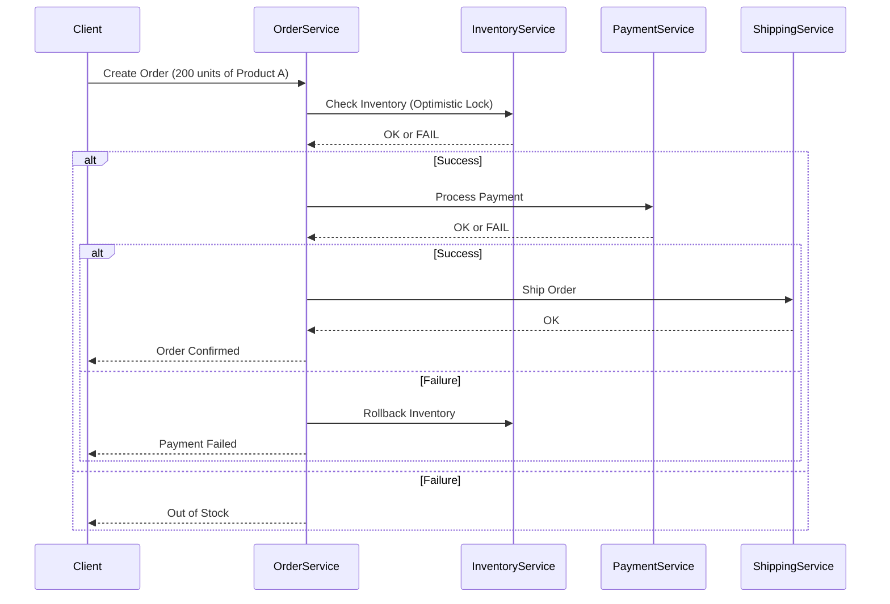

```markdown
---
title: "Building Scalable Systems with Microservices Best Practices"
date: 2024-02-20
author: "Alex Carter"
description: "A pragmatic guide to designing and scaling microservices with real-world examples, tradeoffs, and anti-patterns to avoid."
tags: ["microservices", "backend", "distributed-systems", "scalability"]
---

# Building Scalable Systems with Microservices Best Practices

Microservices architecture has become the de facto standard for building modern, scalable applications. But the shift from monoliths to microservices isn’t just about splitting code—it’s about fundamentally rethinking how you design, deploy, and operate systems at scale. In this post, I’ll break down the best practices that have worked for my team at ScaleTech (a company building high-traffic SaaS platforms) while being brutally honest about the tradeoffs involved.

By the end of this post, you’ll have a clear roadmap for architecting microservices that are performant, resilient, and maintainable.

---

## The Problem

### "We split our monolith into microservices… and it got worse."

If you’ve ever heard this sentiment, you’re not alone. Many teams leap into microservices without a clear strategy, only to face:

- **Increased operational complexity**: Microservices introduce new challenges with service discovery, inter-service communication, and observability.
- **Data consistency nightmares**: Distributing data across services complicates ACID transactions and eventual consistency.
- **Slow releases**: If you have 20 services, merging PRs 20 times is much slower than merging them once.
- **Debugging hell**: Logs and errors are scattered across dozens of services, making incident response a nightmare.
- **Tradeoffs with simplicity**: Microservices often lead to "over-engineering" as teams add complex patterns (e.g., event sourcing, CQRS) prematurely.

### Example: The E-Commerce Checkout System
Imagine an e-commerce platform with these microservices:
1. **Product Catalog Service** (CRUD for products)
2. **User Service** (user accounts)
3. **Cart Service** (user carts)
4. **Order Service** (orders and payments)

At first glance, splitting like this seems logical. But now, when a user checks out, you need to:
- Validate the cart in the Cart Service.
- Deduct inventory in the Product Catalog Service.
- Process payment in a Payment Service.
- Issue an order in the Order Service.

A single checkout request now requires chaining **4+ services**, and something as simple as a payment failure can leave the system in an inconsistent state.

---

## The Solution

The key to successful microservices isn’t just breaking up code—it’s **intentional design**. Here’s how we approach it:

### 1. Domain-Driven Design (DDD) First
**Microservices should align with business domains, not technical concerns.**

#### Key Rules:
- **Bounded Contexts Matter**: Each service should own a single bounded context (a well-defined business domain).
- **Avoid the "Microservice per Feature" Trap**: Don’t split services based on what button a user clicks. Instead, group services by business capabilities (e.g., "Fulfillment" vs. "Billing").

#### Example:
| Service          | Bounded Context                          | Responsibility                          |
|------------------|------------------------------------------|-----------------------------------------|
| Order Service    | Order Management                         | Create, cancel orders                   |
| Payment Service  | Financial Transactions                  | Process payments                        |
| Inventory Service| Product Availability                     | Check stock, update inventory           |

---

### 2. Intentional Communication Patterns
Microservices talk to each other, but how? The right pattern depends on your use case.

#### A. Synchronous APIs (REST/gRPC)
Use when:
- You need a **strongly consistent response**.
- The latency tolerance is low (e.g., checkout flow).

#### B. Asynchronous Events (Kafka/RabbitMQ)
Use when:
- You can tolerate eventual consistency.
- You need to decouple services (e.g., "send a welcome email after signup").

#### C. CQRS (Command Query Responsibility Segregation)
Use when:
- You need high read performance (e.g., analytics dashboards).
- Your writes are sparse but reads are heavy.

---

### 3. Data Management Strategies
Distributed data is hard. Here’s how we handle it:

#### Option A: Database per Service
- **Pros**: High isolation, independent scaling.
- **Cons**: Cross-service transactions are complex.
- **Example**: Order Service has its own database, but it reads user data from the User Service.

#### Option B: Shared Database (Anti-Pattern)
- **Why it fails**: Leads to tight coupling and violates the purpose of microservices.

#### Option C: Saga Pattern (for Distributed Transactions)
When you need to coordinate multiple services, use **sagas** (a sequence of local transactions).

#### Example: Order Fulfillment Saga


---

### 4. Observability & Resilience
Without proper observability, microservices become a "black box."

#### Must-Have Tools:
- **Logging**: Centralized logs (e.g., ELK Stack, Loki).
- **Metrics**: Prometheus + Grafana for service health.
- **Distributed Tracing**: Jaeger or OpenTelemetry for request flows.

#### Example: Instrumenting a gRPC Service
```go
// order_service/main.go
package main

import (
	"context"
	"log"
	"net"
	"google.golang.org/grpc"
	"google.golang.org/grpc/codes"
	"google.golang.org/grpc/status"
)

type OrderServiceServer struct {
	UnimplementedOrderServiceServer
	inventoryClient InventoryClient
}

func (s *OrderServiceServer) CreateOrder(ctx context.Context, req *CreateOrderRequest) (*OrderResponse, error) {
	// Start a span for distributed tracing
	span := trace.StartSpan(ctx, "CreateOrder")
	defer span.End()

	// Check inventory
	inventoryAvailable, err := s.inventoryClient.CheckInventory(ctx, &InventoryCheckRequest{
		ProductID: req.ProductID,
		Quantity:  req.Quantity,
	})
	if err != nil {
		span.RecordError(err)
		return nil, status.Errorf(codes.Internal, "inventory check failed: %v", err)
	}
	if !inventoryAvailable {
		return nil, status.Errorf(codes.OutOfRange, "insufficient inventory")
	}

	// Process payment (simplified)
	// ... payment logic ...

	// Update inventory (optimistic lock)
	_, err = s.inventoryClient.UpdateInventory(ctx, &InventoryUpdateRequest{
		ProductID: req.ProductID,
		Quantity:  -req.Quantity,
	})

	return &OrderResponse{OrderID: "123"}, nil
}
```

---

### 5. Deployment & CI/CD
Microservices change how you deploy.

#### Best Practices:
- **Infrastructure as Code (IaC)**: Use Terraform or Kubernetes manifests.
- **Blue-Green or Canary Deployments**: Reduce downtime.
- **Feature Flags**: Roll out changes gradually.

#### Example: Kubernetes Deployment for Order Service
```yaml
# order-service-deployment.yaml
apiVersion: apps/v1
kind: Deployment
metadata:
  name: order-service
spec:
  replicas: 3
  selector:
    matchLabels:
      app: order-service
  strategy:
    rollingUpdate:
      maxSurge: 1
      maxUnavailable: 0
  template:
    metadata:
      labels:
        app: order-service
    spec:
      containers:
      - name: order-service
        image: registry.company.com/order-service:v1.2.0
        ports:
        - containerPort: 8080
        env:
        - name: INVENTORY_SERVICE_URL
          value: "inventory-service:8080"
        readinessProbe:
          httpGet:
            path: /health/ready
            port: 8080
        livenessProbe:
          httpGet:
            path: /health/live
            port: 8080
```

---

## Implementation Guide

### Step 1: Start Small
Don’t rip out your monolith. Use the **Strangler Fig Pattern**:
1. Identify a bounded context (e.g., "User Management").
2. Extract it into a microservice.
3. Gradually replace monolith functionality.

### Step 2: Define Contracts Early
Use **OpenAPI/Swagger** to document service contracts.

#### Example: Order Service API (OpenAPI)
```yaml
openapi: 3.0.0
info:
  title: Order Service
  version: 1.0.0
paths:
  /orders:
    post:
      summary: Create an order
      requestBody:
        required: true
        content:
          application/json:
            schema:
              $ref: '#/components/schemas/CreateOrderRequest'
      responses:
        '201':
          description: Order created
          content:
            application/json:
              schema:
                $ref: '#/components/schemas/Order'
components:
  schemas:
    CreateOrderRequest:
      type: object
      properties:
        userId:
          type: string
        productId:
          type: string
        quantity:
          type: integer
```

### Step 3: Use Service Meshes (When Needed)
Tools like **Istio** or **Linkerd** help with:
- Retries, circuit breaking.
- Mutual TLS for security.
- Observability.

### Step 4: Automate Everything
- **Testing**: Write unit, integration, and chaos tests.
- **Build**: Use Docker for consistent environments.
- **Deployment**: CI/CD pipelines (GitHub Actions, ArgoCD).

---

## Common Mistakes to Avoid

1. **Premature Microservices**
   - If your team can’t maintain 10 microservices but struggles with 1 monolith, you’re over-engineering.
   - **Rule of Thumb**: Start with 3-5 services max.

2. **Ignoring Data Consistency**
   - Don’t assume "eventual consistency" is always fine. Some use cases (e.g., banking) need strong consistency.

3. **Overusing Sagas**
   - Sagas add complexity. Only use them when you truly need distributed transactions.

4. **Poor Observability**
   - Without logs, metrics, and traces, debugging is impossible.
   - **Fix**: Instrument every service from day one.

5. **Tight Coupling via Shared Libraries**
   - If Service A and Service B share a common library, they’re not truly decoupled.
   - **Fix**: Use published APIs only.

6. **Neglecting Security**
   - Microservices increase the attack surface. Always enforce:
     - Mutual TLS between services.
     - API rate limiting.
     - Secret management (Vault, AWS Secrets Manager).

---

## Key Takeaways

✅ **Align services with business domains** (DDD).
✅ **Choose communication patterns intentionally** (REST for sync, events for async).
✅ **Manage data carefully** (database per service + sagas for transactions).
✅ **Instrument everything** (logs, metrics, traces).
✅ **Automate deployments** (CI/CD, IaC).
✅ **Start small** (Strangler Fig Pattern).
✅ **Avoid common pitfalls** (premature microservices, tight coupling).

❌ **Don’t**: Split based on tech stack (e.g., "All Java services").
❌ **Don’t**: Ignore operational overhead.
❌ **Don’t**: Assume microservices scale automatically.

---

## Conclusion

Microservices aren’t a silver bullet—they’re a tool that requires discipline to wield well. The best architectures balance **decoupling** with **simplicity**. Start with a clear domain model, instrument your services, and automate everything. Over time, you’ll build systems that are resilient, scalable, and maintainable.

As a final thought: **"Microservices are about people as much as they are about code."** If your team can’t operate 10 services, you’re not ready for microservices. Focus on culture, tooling, and incremental improvement.

Now go build something awesome—and remember: *measure twice, cut once*.

---
```