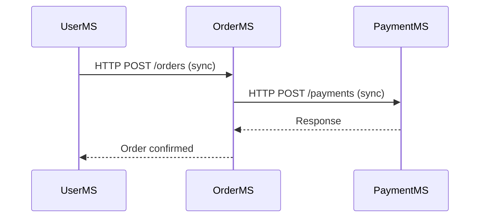

```markdown
# **Microservices Communication Patterns: Synchronous vs. Asynchronous in Distributed Systems**

*How to design resilient, scalable, and maintainable interactions between microservices*

---

## **Introduction**

In modern distributed systems, microservices architecture is a dominant paradigm—breaking monolithic applications into smaller, loosely coupled services. But while this approach offers scalability and agility, it introduces complexity: **how do services communicate?**

Microservices must exchange data, coordinate actions, and share state. The choice of communication pattern significantly impacts performance, reliability, and maintainability. Unfortunately, no single approach works for every scenario. Developers must weigh tradeoffs between **simplicity vs. resilience**, **coupling vs. flexibility**, and **real-time needs vs. eventual consistency**.

In this tutorial, we’ll explore the two primary communication patterns for microservices:
1. **Synchronous (Request-Response)**: Direct HTTP calls or RPC (Remote Procedure Calls).
2. **Asynchronous (Event-Driven)**: Message brokers, event buses, and pub/sub systems.

We’ll dive into **when to use each**, their strengths and weaknesses, and practical implementations using real-world examples. By the end, you’ll have a clear strategy for designing robust microservice interactions.

---

## **The Problem: Choosing Between Coupling and Resilience**

Imagine a **user management service** (UserMS) and an **order processing service** (OrderMS). When a user places an order, these services must work together. But the challenge isn’t just *how*—it’s *when* and *how tightly* they depend on each other.

### **1. The Synchronous Trap: Tight Coupling**
A naive approach is to call OrderMS directly from UserMS via HTTP:
```java
// UserMS (Synchronous Call)
public OrderPlaceResponse placeOrder(Long userId, CreateOrderRequest order) {
    // Validate order...
    OrderMSClient orderService = new OrderMSClient("http://order-ms:8080");
    return orderService.placeOrder(userId, order);
}
```
**Problems with this approach:**
✅ **Simple to implement** – Just call an API.
❌ **Blocking** – UserMS waits for OrderMS, causing cascading failures.
❌ **Single point of failure** – If OrderMS crashes, the entire flow fails.
❌ **Tight coupling** – UserMS knows *exactly* how OrderMS works (its API version, schema, etc.).
❌ **Hard to scale** – Both services must run at the same speed.

### **2. The Asynchronous Dilemma: Eventual Consistency**
An alternative is to publish an event when a user places an order:
```javascript
// UserMS (Asynchronous)
const eventBus = new EventBus('kafka');

// When order is created (but not necessarily processed)
eventBus.publish('order.created', {
  userId,
  orderData,
  status: 'PENDING'
});
```
**Problems with this approach:**
✅ **Decoupled** – UserMS doesn’t wait; OrderMS reacts *when ready*.
✅ **Resilient** – One service failure doesn’t crash the entire system.
❌ **Complexity** – Requires message brokers, idempotency, retries.
❌ **Eventual consistency** – OrderMS may process the event *minutes* later.
❌ **Debugging hell** – "Did the order actually get placed? Was it retried?"

### **The Core Dilemma**
| Pattern          | Pros                                  | Cons                                  | Best For                          |
|------------------|---------------------------------------|---------------------------------------|-----------------------------------|
| **Synchronous**  | Simple, immediate response            | Tight coupling, blocking               | Simple workflows, interior flows  |
| **Asynchronous** | Decoupled, resilient                  | Complex, eventual consistency          | External flows, fault tolerance   |

---

## **The Solution: A Hybrid Approach**

Most production systems use **both patterns** strategically:
- **Synchronous**: For internal, high-velocity workflows (e.g., `UserMS → PaymentMS`).
- **Asynchronous**: For external or long-running processes (e.g., `OrderMS → NotificationMS`).

Let’s explore both in depth.

---

## **1. Synchronous Communication: HTTP/RPC**

### **When to Use**
- **Short-lived operations** (e.g., checking inventory, validating credentials).
- **Internal service calls** where failure should propagate (e.g., `AuthMS → ProfileMS`).
- **Real-time responses** required (e.g., live chat messages).

### **Implementation: REST + API Gateway (or Direct Calls)**

#### **Example: UserMS Calls OrderMS via HTTP**
```java
// OrderMS (Spring Boot REST Endpoint)
@RestController
@RequestMapping("/orders")
public class OrderController {
    @PostMapping
    public ResponseEntity<Order> placeOrder(@RequestBody CreateOrderRequest order) {
        Order saved = orderRepository.save(order.toEntity());
        return ResponseEntity.ok(saved);
    }
}
```

```java
// UserMS (Feign Client for OrderMS)
@FeignClient(name = "order-ms", url = "${order.ms.url}")
public interface OrderServiceClient {
    @PostMapping("/orders")
    OrderResponse placeOrder(@RequestBody CreateOrderRequest order);
}

// Usage in UserMS
@Service
public class OrderService {
    private final OrderServiceClient client;

    public OrderResponse placeOrder(Long userId, CreateOrderRequest order) {
        return client.placeOrder(order); // Blocks until OrderMS responds
    }
}
```

#### **Tradeoffs & Optimizations**
✔ **Use API Gateways** (Kong, Apigee) to route requests, add retries, and handle failures.
✔ **Circuit Breakers** (Resilience4j, Hystrix) to prevent cascading failures:
```java
@CircuitBreaker(name = "orderService", fallbackMethod = "fallbackPlaceOrder")
public OrderResponse placeOrder(...) {
    return client.placeOrder(...);
}

public OrderResponse fallbackPlaceOrder(...) {
    return new OrderResponse("FAILED", "Order service unavailable");
}
```
❌ **Avoid deep call stacks** (e.g., `UserMS → OrderMS → PaymentMS → ...`). Introduce **Saga Pattern** for long transactions.

---

## **2. Asynchronous Communication: Event-Driven**

### **When to Use**
- **Decoupled workflows** (e.g., `OrderMS → NotificationMS`).
- **Long-running processes** (e.g., shipping updates, analytics).
- **External integrations** (e.g., `OrderMS → ERP`).
- **Fault tolerance** (e.g., retries, dead-letter queues).

### **Implementation: Kafka + Event Sourcing**

#### **Example: Order Created Event**
```java
// UserMS (Publishes Event)
@Service
public class OrderService {
    private final EventPublisher publisher;

    public Order createOrder(Long userId, CreateOrderRequest request) {
        Order order = orderRepository.save(request.toEntity());
        publisher.publish("order.created", new OrderCreatedEvent(order));
        return order;
    }
}
```

```java
// OrderMS (Subscribes to Events)
@KafkaListener(topics = "order.created")
public void handleOrderCreated(OrderCreatedEvent event) {
    try {
        // Process order asynchronously
        processOrder(event.getOrder());
    } catch (Exception e) {
        // Retry or log to DLQ
        logger.error("Failed to process order", e);
    }
}

private void processOrder(Order order) {
    // Save to DB, trigger payment, etc.
}
```

#### **Key Components**
1. **Message Broker**: Kafka, RabbitMQ, or AWS SNS/SQS.
2. **Schema Registry**: Avro/Protobuf for backward compatibility.
3. **Idempotency**: Ensure no duplicate processing (e.g., Kafka `transactional.id`).
4. **Dead-Letter Queue (DLQ)**: For failed messages.

#### **Tradeoffs & Optimizations**
✔ **Use Exactly-Once Processing** (Kafka transactions):
```java
@Transactional
public void createOrder(...) {
    orderRepository.save(order);
    publisher.publish("order.created", event); // Atomic with DB
}
```
✔ **Partitioning**: Distribute load across consumers.
✔ **Batching**: Reduce broker load (e.g., `max.in.flight=requests.per.partition=1`).

❌ **Avoid blocking** (e.g., don’t call a sync API inside an async handler).
❌ **Don’t rely on event order** unless using Kafka partitioning.

---

## **Implementation Guide: Choosing the Right Pattern**

### **Step 1: Map Your Workflow**
Draw a sequence diagram for each critical path. Ask:
- Does this require immediate confirmation?
- Can the other service fail without breaking the main flow?
- Is this an external dependency (e.g., payment gateway)?



### **Step 2: Apply the Patterns**
| Workflow Type          | Recommended Pattern       | Example                          |
|------------------------|---------------------------|----------------------------------|
| User places an order   | Async + Sync              | `UserMS -> (event) -> OrderMS`    |
| Check inventory        | Sync                      | `CheckoutMS -> InventoryMS`      |
| Trigger shipment       | Async                     | `OrderMS -> (event) -> ShippingMS`|
| Update analytics        | Async                     | `OrderMS -> (event) -> AnalyticsMS`|

### **Step 3: Implement Safeguards**
- **Sync Calls**:
  - Add retries (Exponential backoff) + circuit breakers.
  - Use timeouts (`spring.cloud.circuitbreaker.resilience4j`).
- **Async Events**:
  - Ensure idempotency (e.g., `order_id` as key).
  - Monitor broker lag (`kafka.consumer.poll.timeout.ms`).

---

## **Common Mistakes to Avoid**

### **1. Overusing Synchronous Calls**
❌ **Bad**: `UserMS → PaymentMS → ShippingMS → NotificationMS`
✅ **Better**: `UserMS → (event) → PaymentMS → (event) → ShippingMS → (event) → NotificationMS`

### **2. Ignoring Event Ordering**
❌ **Bad**: Two orders arrive out of sequence → race condition.
✅ **Better**: Use Kafka partitions + unique keys (`order_id`).

### **3. No Retries for Async Failures**
❌ **Bad**: Silent failure if the broker is down.
✅ **Better**: Configure retries + DLQ:
```yaml
# application.yml (Spring Kafka)
spring:
  kafka:
    producer:
      retries: 3
      max.block.ms: 60000
      delivery.timeout.ms: 120000
```

### **4. Tight Coupling in Events**
❌ **Bad**: Event schema changes break consumers.
✅ **Better**: Use backward-compatible schemas (Avro):
```avro
// Schema for OrderCreatedEvent
{
  "name": "OrderCreatedEvent",
  "type": "record",
  "fields": [
    {"name": "orderId", "type": "string"},
    {"name": "userId", "type": "string"},
    {"name": "status", "type": ["string", "null"]} // Optional field
  ]
}
```

### **5. Forgetting Idempotency**
❌ **Bad**: Duplicate orders if event is reprocessed.
✅ **Better**: Check DB before acting:
```java
if (!orderRepository.existsById(event.getOrderId())) {
    orderRepository.save(event.toOrder());
}
```

---

## **Key Takeaways**

✅ **Use synchronous calls for:**
- Short-lived, fault-sensitive operations.
- Internal service-to-service calls where failure should propagate.

✅ **Use asynchronous events for:**
- Decoupled workflows.
- External integrations.
- Long-running processes.

✅ **Hybrid approach is optimal**:
- Sync for critical paths.
- Async for resilient, decoupled steps.

✅ **Critical safeguards:**
- **Idempotency** (avoid duplicates).
- **Retries + Circuit Breakers** (for sync).
- **Dead-Letter Queues** (for async failures).
- **Schema Evolution** (Avro/Protobuf).

✅ **Tools to consider:**
- **Sync**: Spring Cloud, Feign, Resilience4j.
- **Async**: Kafka, RabbitMQ, Debezium (CDC).
- **Observability**: Prometheus, OpenTelemetry.

---

## **Conclusion**

Microservices communication is an art, not a science. There’s no one-size-fits-all solution, but understanding the tradeoffs between synchronous and asynchronous patterns empowers you to design resilient systems.

**Key lessons:**
1. **Synchronous calls are simple but brittle**—use them judiciously.
2. **Asynchronous events enable resilience but add complexity**—design for failure.
3. **Hybrid workflows are the norm**—combine both patterns strategically.
4. **Always prioritize idempotency and observability**—they save you in production.

**Next steps:**
- Experiment with a **local Kafka setup** to test async patterns.
- Build a **simple API gateway** (e.g., Spring Cloud Gateway) to manage sync calls.
- Monitor your system with **Prometheus + Grafana** to detect slow calls or broker lag.

Distributed systems are hard, but the right communication patterns make them *manageable*. Start small, iterate, and always question whether your current approach is the most resilient one.

---
**Further Reading:**
- ["Building Microservices" by Sam Newman](https://www.oreilly.com/library/view/building-microservices/9781491950352/)
- [Kafka for Microservices](https://www.oreilly.com/library/view/kafka-for-microservices/9781492046157/)
- [Resilience Patterns in Distributed Systems](https://microservices.io/patterns/resilience.html)
```