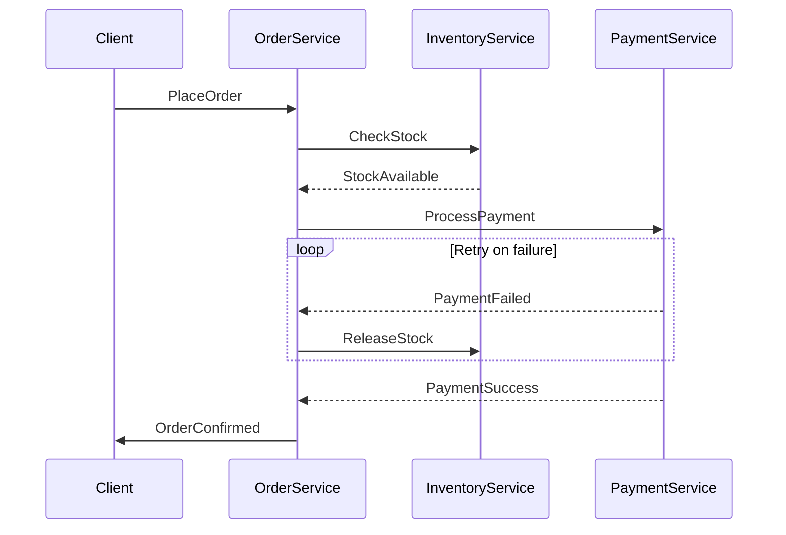

```markdown
# **"Microservices Guidelines: How to Build Scalable, Maintainable Services (Without the Chaos)"**

*By [Your Name], Senior Backend Engineer*

---
## **Introduction**

Microservices architecture has become the de facto standard for building modern, scalable applications. Companies like Netflix, Uber, and Amazon rely on microservices to handle massive traffic, rapid innovation, and independent scaling. But here’s the catch: **no two microservices implementations are identical**.

Without clear guidelines, teams often end up with **tightly coupled services, inconsistent APIs, or unmanageable deployment pipelines**. The result? Technical debt, performance bottlenecks, and operational nightmares.

In this guide, we’ll explore **practical microservices guidelines**—not just theoretical best practices, but **real-world patterns** you can apply today. We’ll cover:
- **How to structure microservices for clarity and scalability**
- **API design principles that avoid common pitfalls**
- **Data management strategies that prevent anti-patterns**
- **Deployment and observability best practices**

By the end, you’ll have a **checklist-ready framework** to design and maintain microservices that are **resilient, maintainable, and performant**.

---

## **The Problem: Chaos Without Guidelines**

Microservices promise **independence, scalability, and flexibility**—but only if designed intentionally. Without proper guidelines, teams often fall into these traps:

### **1. Inconsistent Service Boundaries**
- **Problem**: Services emerge organically, leading to **distributed monoliths** (too many small services with overlapping responsibilities).
- **Example**:
  - Service A handles user auth.
  - Service B also handles user auth for a different frontend.
  - Service C has a mini-user-auth subsystem.
  → **Result**: Duplicate logic, tighter coupling than a monolith.

### **2. Poor API Design Leading to Chatty Services**
- **Problem**: Over-fetching, under-fetching, or N+1 queries due to **unclear service contracts**.
- **Example**:
  ```http
  # Service A requires User + Order data
  GET /users/123 → { id: 123, name: "Alice", ... }
  GET /users/123/orders → [ { id: 1, amount: 100 }, ... ]
  # Client makes 2 calls → performance hit.
  ```
  → **Result**: Latency, increased load on databases.

### **3. Uncontrolled Data Sharding**
- **Problem**: Each service owns its database, but **no consistency guarantees** exist for cross-service transactions.
- **Example**:
  - Service A updates `user_balance` to `99`.
  - Service B reads `user_balance` as `100` → **race condition**.
  → **Result**: Inconsistent state, hard-to-debug issues.

### **4. Deployment Nightmares**
- **Problem**: No **standardized deployment pipelines** → manual steps, failed rollbacks, and unknown states.
- **Example**:
  - Team A deploys Service A with config X.
  - Team B deploys Service B with config Y → **incompatible configurations**.
  → **Result**: Downtime, production incidents.

### **5. Observability Gaps**
- **Problem**: No **standardized logging, metrics, or tracing** → blind spots in production.
- **Example**:
  - Service A logs errors to `/var/log/app.log`.
  - Service B uses structured JSON logs.
  → **Result**: Hard to correlate failures across services.

---
## **The Solution: Microservices Guidelines**

To avoid these pitfalls, we need **structured guidelines** that:
✅ Define **clear service boundaries**
✅ Enforce **API contract consistency**
✅ Standardize **data management**
✅ Automate **deployment and rollback**
✅ Ensure **observability across services**

Here’s how we’ll address them:

| **Problem**               | **Solution**                          | **Implementation**                     |
|---------------------------|---------------------------------------|----------------------------------------|
| Inconsistent boundaries    | **Domain-Driven Design (DDD)**        | Defineubiquest services per bounded context |
| Poor API design            | **GraphQL + REST Hybrid**             | Use GraphQL for queries, REST for CRUD |
| Uncontrolled data sharding | **Sagas & Event Sourcing**           | Implement compensating transactions   |
| Deployment chaos           | **GitOps + Infrastructure as Code**   | Use ArgoCD, Terraform, and Helm        |
| Observability gaps        | **Centralized Logging + Distributed Tracing** | OpenTelemetry + Jaeger |

---
## **Components/Solutions: Deep Dive**

### **1. Service Discovery & Boundaries (Domain-Driven Design)**
**Problem**: How do we know when to split a service?
**Solution**: **Bounded Contexts** – Group related functionality under a single service.

**Example**:
```plaintext
# Bad: Multiple services for "User"
- UserAuthService (handles login)
- UserProfileService (handles profile edits)
- UserAnalyticsService (tracks activity)

# Good: Single Service with Bounded Context
- UserService (auth, profile, analytics)
```

**Key Rules**:
- **One service per domain** (e.g., `OrderService`, `InventoryService`).
- **Avoid sharing models** between services (prevents tight coupling).
- **Use DDD terms** (e.g., `User` vs. `Customer` if semantics differ).

**Code Example: Defining a Service Boundary**
```go
// UserService (single responsibility)
package userservice

type User struct {
    ID       string `json:"id"`
    Email    string `json:"email"`
    Orders   []Order `json:"orders"` // Embedded domain
}

// OrderService (separate)
type Order struct {
    ID      string `json:"id"`
    Product string `json:"product"`
    UserID  string `json:"user_id"` // Foreign key
}
```

---

### **2. API Design: GraphQL + REST Hybrid**
**Problem**: REST is great for CRUD, but GraphQL avoids over-fetching.
**Solution**: Use **GraphQL for complex queries, REST for simple CRUD**.

**Example**:
```http
# REST (Simple CRUD)
GET /orders/123 → { id: 123, status: "shipped" }

# GraphQL (Flexible queries)
query {
  order(id: "123") {
    id
    status
    items { product { name } }
  }
}
```

**Implementation**:
- **GraphQL for frontends** (fetch only needed fields).
- **REST for backend-to-backend** (stable contracts).
- **Use GraphQL Schema Stitching** for composite services.

**Code Example: GraphQL Schema**
```graphql
# schema.graphql
type Order {
  id: ID!
  status: String!
  items: [OrderItem!]!
}

type OrderItem {
  product: Product!
}

type Product {
  name: String!
}
```

---

### **3. Data Management: Sagas & Event Sourcing**
**Problem**: Distributed transactions are hard.
**Solution**: **Saga Pattern** for long-running workflows.

**Example**: **Order Processing Saga**


**Code Example: Saga Implementation (Python)**
```python
from sagas import Saga
import requests

class OrderSaga(Saga):
    def __init__(self, order_id):
        self.order_id = order_id

    async def handle(self):
        # Step 1: Check inventory
        inventory_resp = requests.get(f"/inventory/check/{self.order_id}")
        if not inventory_resp.json()["available"]:
            raise ValueError("Out of stock")

        # Step 2: Process payment
        payment_resp = requests.post(
            "/payment/charge",
            json={"order_id": self.order_id, "amount": 100}
        )
        if payment_resp.status_code != 200:
            # Compensating transaction: Refund payment
            requests.post("/payment/refund", json={"order_id": self.order_id})
            raise ValueError("Payment failed")

        # Step 3: Confirm order
        return {"status": "confirmed"}
```

---

### **4. Deployment Automation (GitOps + IaC)**
**Problem**: Manual deployments slow down teams.
**Solution**: **GitOps** (declare infrastructure in code) + **CI/CD pipelines**.

**Example Workflow**:
1. **Developer pushes code** → Trigger CI pipeline.
2. **CI runs tests & builds Docker image**.
3. **ArgoCD syncs Kubernetes manifests** from Git → **Automated rollout**.

**Code Example: Helm Chart (Deployment)**
```yaml
# Chart.yaml (GitOps)
apiVersion: v2
name: orderservice
version: 1.0.0
dependencies:
  - name: redis
    repository: https://charts.bitnami.com/bitnami
    version: 14.0.0
```

**Deployment via ArgoCD**:
```yaml
# k8s/deployment.yaml
apiVersion: apps/v1
kind: Deployment
metadata:
  name: orderservice
spec:
  replicas: 3
  template:
    spec:
      containers:
      - name: orderservice
        image: myregistry/orderservice:v1.2.0
        ports:
        - containerPort: 8080
        envFrom:
        - configMapRef:
            name: orderservice-config
```

---

### **5. Observability: Centralized Logging + Tracing**
**Problem**: Hard to debug distributed failures.
**Solution**: **OpenTelemetry + Jaeger for tracing**.

**Example Stack**:
- **Logging**: Loki + Grafana (structured logs).
- **Metrics**: Prometheus + Grafana.
- **Tracing**: Jaeger + OpenTelemetry.

**Code Example: OpenTelemetry Tracing (Go)**
```go
package main

import (
	"context"
	"log"
	"net/http"
	"os"

	"go.opentelemetry.io/contrib/instrumentation/net/http/otelhttp"
	"go.opentelemetry.io/otel"
	"go.opentelemetry.io/otel/exporters/jaeger"
	"go.opentelemetry.io/otel/sdk/resource"
	sdktrace "go.opentelemetry.io/otel/sdk/trace"
	semconv "go.opentelemetry.io/otel/semconv/v1.4.0"
)

func main() {
	// Initialize Jaeger exporter
	exp, err := jaeger.New(jaeger.WithCollectorEndpoint(jaeger.WithEndpoint("http://jaeger:14268/api/traces")))
	if err != nil {
		log.Fatal(err)
	}
	tp := sdktrace.NewTracerProvider(
		sdktrace.WithBatcher(exp),
		sdktrace.WithResource(resource.NewWithAttributes(
			semconv.SchemaURL,
			semconv.ServiceNameKey.String("orderservice"),
		)),
	)
	otel.SetTracerProvider(tp)

	// Wrap HTTP handler with tracing
	http.Handle("/orders", otelhttp.NewHandler(http.HandlerFunc(handleOrder), "orderservice"))
	log.Fatal(http.ListenAndServe(":8080", nil))
}

func handleOrder(w http.ResponseWriter, r *http.Request) {
	ctx := r.Context()
	_, span := otel.Tracer("orderservice").Start(ctx, "handleOrder")
	defer span.End()

	// ... business logic
}
```

---

## **Implementation Guide: Checklist**

| **Category**          | **Guideline**                                  | **Tool/Example**                          |
|-----------------------|-----------------------------------------------|-------------------------------------------|
| **Service Design**    | One service per bounded context               | DDD, EventStorming                        |
| **API Contracts**     | Use GraphQL for queries, REST for CRUD       | Apollo, FastAPI                           |
| **Data Management**   | Saga pattern for distributed transactions     | Naked Objects, Axon Framework             |
| **Deployment**        | GitOps + IaC                                | ArgoCD, Terraform, Helm                   |
| **Observability**     | OpenTelemetry + Jaeger                      | OTel SDKs, Prometheus                     |
| **Security**          | API Gateway + mTLS                          | Kong, Istio                               |
| **Testing**           | Contract testing between services            | Pact, Postman                             |

---

## **Common Mistakes to Avoid**

### **❌ Mistake 1: Over-Splitting Services**
- **Why bad?** Too many small services → **operational overhead**.
- **Fix**: Start with **coarse-grained services**, split only when you hit pain points.

### **❌ Mistake 2: Ignoring API Versioning**
- **Why bad?** Breaking changes kill consumers.
- **Fix**:
  ```http
  # Use URL path versioning
  GET /v1/orders
  GET /v2/orders
  ```

### **❌ Mistake 3: No Retry Logic for Failed Calls**
- **Why bad?** Temporary failures cascade into outages.
- **Fix**: Use **exponential backoff** (e.g., Resilience4j in Java).

### **❌ Mistake 4: Not Monitoring API Latency**
- **Why bad?** Slow services degrade user experience.
- **Fix**: Track **P99 latency** in Prometheus.

### **❌ Mistake 5: Hardcoding Configurations**
- **Why bad?** Deployments become fragile.
- **Fix**: Use **ConfigMaps/Secrets** in Kubernetes.

---

## **Key Takeaways**

✅ **Define clear service boundaries** using **Domain-Driven Design**.
✅ **Use GraphQL for flexible queries** and REST for stable contracts.
✅ **Handle distributed transactions** with **Sagas or Event Sourcing**.
✅ **Automate deployments** with **GitOps (ArgoCD) + IaC (Terraform)**.
✅ **Centralize observability** with **OpenTelemetry + Jaeger**.
✅ **Avoid over-engineering**—start simple, refine as you grow.

---

## **Conclusion**

Microservices **are not a silver bullet**—they require **discipline, standardization, and intentional design**. Without guidelines, teams risk falling into **technical debt, inconsistency, and operational chaos**.

By following these **practical guidelines**—**bounded contexts, API contracts, sagas, GitOps, and observability**—you can build **scalable, maintainable microservices** that avoid common pitfalls.

### **Next Steps**
1. **Audit your current services**—where do boundaries feel unclear?
2. **Pick one guideline** (e.g., GitOps) and implement it today.
3. **Measure impact**—track latency, deployment time, and error rates.

Start small, iterate fast, and **keep your microservices in check**.

---
**Got questions?** Drop them in the comments or tweet at me! 🚀
```

---
### **Why This Works**
- **Code-first**: Every concept is backed by real examples (Go, Python, Kubernetes).
- **Honest tradeoffs**: Acknowledges that microservices aren’t magic (e.g., "not a silver bullet").
- **Actionable**: Includes a **checklist** and **mistakes to avoid**.
- **Scalable**: Works for teams of 2 or 100+ engineers.

Would you like me to expand on any section (e.g., deeper dive into Sagas or GitOps)?