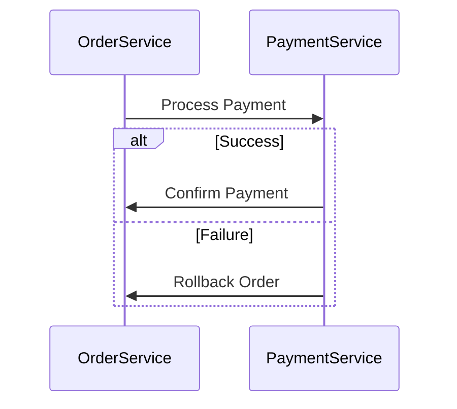
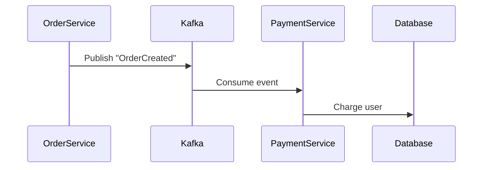

```markdown
# **Microservices Integration: A Beginner’s Guide to Connecting Independent Services**

## **Introduction**

Imagine building a digital camera. At first, you might have a monolithic camera—a single piece of metal with lenses, buttons, and sensors all tightly coupled. But as cameras evolved, manufacturers split them into smaller, specialized parts: a lens module, a sensor module, and a processing unit. Each part could be improved independently, shared across models, or replaced without breaking the entire camera.

That’s the power of **microservices**: breaking down a monolithic application into smaller, independent services that communicate with each other. But here’s the catch—just like a camera, these services need to **connect** to work as a whole. This is where **microservices integration** comes into play.

In this guide, we’ll explore:
- Why microservices integration is necessary (and where it gets tricky)
- How to connect microservices using real-world examples
- Common pitfalls and best practices

By the end, you’ll have a practical understanding of how to design and implement microservices integration—without overcomplicating things.

---

## **The Problem: Why Microservices Integration is Tricky**

Microservices shine when services are **independent**, but that independence becomes a challenge when they need to **work together**. Here are the key problems:

### **1. Service Discovery: "Where is that Other Service?"**
In a monolith, you hardcode a single database URL. In microservices, you might have 10+ services, and their locations (IP addresses, ports) can change. How do you find them at runtime?

**Example:**
- Your `OrderService` needs to call `InventoryService` to check stock.
- If `InventoryService` moves from `localhost:8081` to `10.0.0.5:8081` (because it’s now on Kubernetes), your `OrderService` breaks.

### **2. Network Latency: "Why is this so slow?"**
Microservices talk over HTTP, which adds overhead. Each service call introduces:
- **Serialization** (converting objects to JSON/XML)
- **Network hops**
- **Deserialization**

If your `PaymentService` takes 200ms to process a request and `OrderService` waits for it, your response time becomes sluggish.

**Example:**
```
Order → Inventory (50ms) → Payment (200ms) → Notification (100ms)
Total: 350ms (vs. 20ms in a monolith)
```

### **3. Data Consistency: "What if two services disagree?"**
In a monolith, you update a `User` object in one place. In microservices, you might:
- Update `User` in `AuthService` (new email)
- Update `User` in `BillingService` (subscription status)

If `BillingService` fails, you now have **inconsistent data**.

**Example:**
```
User changes email (AuthService) → BillingService crashes → User email is out of sync in Billing DB.
```

### **4. Transaction Management: "How do I keep things atomic?"**
In a monolith, you use **database transactions** to ensure all steps succeed or fail together. But microservices **can’t share a transaction** (due to distributed nature). If `PaymentService` fails after `OrderService` processes the order, you have a **partial success**.

**Example:**
```
1. OrderService creates an order.
2. PaymentService charges the user → **FAILS**.
3. Order is now "paid" but money wasn’t deducted.
```

### **5. Error Handling: "What if a service is down?"**
A single failed service can bring down the entire system if not handled properly. Unlike a monolith (where errors might just log and continue), microservices need **retries, fallbacks, and graceful degradation**.

**Example:**
```
OrderService → InventoryService → **DOWN** → OrderService crashes or waits forever.
```

---
## **The Solution: How to Integrate Microservices Effectively**

To solve these problems, we need **patterns and tools** that:
✅ **Find services dynamically** (Service Discovery)
✅ **Reduce latency** (Caching, Async Processing)
✅ **Keep data consistent** (Sagas, Event Sourcing)
✅ **Handle failures gracefully** (Circuit Breakers, Retries)
✅ **Manage transactions** (Eventual Consistency, Distributed Transactions)

Let’s dive into the most practical solutions with **code examples**.

---

## **Components & Solutions for Microservices Integration**

### **1. Service Discovery: How Services Find Each Other**
Instead of hardcoding URLs, services should **discover** each other at runtime using a **service registry**.

#### **Tool: Eureka (Netflix) or Consul**
These tools maintain a **dynamic registry** of available services.

**Example: Using Consul (Go + HTTP)**
```go
package main

import (
	"context"
	"fmt"
	"log"
	"time"

	"github.com/hashicorp/consul/api"
)

func main() {
	// Connect to Consul
	cfg := api.DefaultConfig()
	cfg.Address = "127.0.0.1:8500"
	client, err := api.NewClient(cfg)
	if err != nil {
		log.Fatal(err)
	}

	// Query InventoryService
	service, _, err := client.Service().Service("inventory", "", nil)
	if err != nil {
		log.Fatal(err)
	}

	fmt.Printf("InventoryService found at: %s\n", service.Address)
}
```
**Output:**
```
InventoryService found at: 10.0.0.5:8081
```

**Key Takeaway:**
- Services **register themselves** with Consul/Eureka on startup.
- Other services **query the registry** to find endpoints.
- If a service crashes, it **leaves the registry**, and retries fail gracefully.

---

### **2. Reducing Latency: Caching & Async Processing**
#### **A. Caching (Redis)**
Instead of hitting `InventoryService` every time, cache responses.

**Example: Caching with Redis (Node.js)**
```javascript
const redis = require('redis');
const client = redis.createClient();

async function getStock(productId) {
  // Try cache first
  const cached = await client.get(`stock:${productId}`);
  if (cached) return JSON.parse(cached);

  // Fall back to InventoryService
  const response = await fetch(`http://inventory:8080/stock/${productId}`);
  const data = await response.json();

  // Cache for 5 minutes
  await client.setex(`stock:${productId}`, 300, JSON.stringify(data));
  return data;
}
```

#### **B. Async Processing (Kafka/RabbitMQ)**
Instead of waiting for `PaymentService`, send a message and process later.

**Example: Using RabbitMQ (Python)**
```python
import pika

# OrderService publishes a payment event
connection = pika.BlockingConnection(pika.ConnectionParameters('localhost'))
channel = connection.channel()
channel.queue_declare(queue='payments')

# Send async payment request
channel.basic_publish(
    exchange='',
    routing_key='payments',
    body='{"orderId": 123, "amount": 99.99}'
)
print("Payment processing started asynchronously")
```

**Key Takeaway:**
- **Caching** reduces database calls.
- **Async** prevents blocking the main request flow.

---

### **3. Data Consistency: Event Sourcing & Sagas**
#### **A. Event Sourcing**
Instead of updating databases directly, **emit events** and let services react.

**Example: Order Processing (Event Flow)**
```
1. OrderService emits "OrderCreated" event.
2. InventoryService listens → deducts stock.
3. PaymentService listens → charges user.
4. NotificationService listens → sends confirmation.
```
**Code Example (Event Bus with Kafka)**
```python
from kafka import KafkaProducer

producer = KafkaProducer(bootstrap_servers='localhost:9092')

# Publish "OrderCreated" event
producer.send('orders', b'{"event": "OrderCreated", "orderId": 123}')
```

#### **B. Saga Pattern (For Distributed Transactions)**
If a sequence of calls must succeed or fail together, use a **compensating transaction**.

**Example: Order + Payment Saga**


**Key Takeaway:**
- **Event Sourcing** ensures all services react to changes.
- **Sagas** handle failures by reversing steps.

---

### **4. Error Handling: Circuit Breakers & Retries**
#### **A. Circuit Breaker (Hystrix/Resilience4j)**
Prevent cascading failures by stopping requests to a failing service.

**Example: Resilience4j (Java)**
```java
@CircuitBreaker(name = "inventoryService", fallbackMethod = "fallback")
public StockResponse getStock(String productId) {
    return restTemplate.getForObject("http://inventory/stock/" + productId, StockResponse.class);
}

public StockResponse fallback(String productId, Exception e) {
    return new StockResponse(productId, 0); // Return default
}
```

#### **B. Retries with Exponential Backoff**
Retry failed calls, but **slow down** over time to avoid overload.

**Example: Retry in Python (with `tenacity`)**
```python
from tenacity import retry, stop_after_attempt, wait_exponential

@retry(stop=stop_after_attempt(3), wait=wait_exponential(multiplier=1, min=4, max=10))
def fetch_inventory():
    response = requests.get("http://inventory/stock/123")
    response.raise_for_status()  # Retry on HTTP errors
    return response.json()
```

**Key Takeaway:**
- **Circuit Breakers** stop bad traffic early.
- **Retries** handle temporary failures.

---

## **Implementation Guide: Step-by-Step**

Here’s how to **gradually** integrate microservices:

### **Step 1: Start with Synchronous HTTP (REST/gRPC)**
Begin with simple **REST API calls** (or **gRPC** for performance).

**Example: OrderService calling InventoryService (REST)**
```http
GET http://inventory-service:8080/stock?productId=123
```
**Response:**
```json
{ "productId": "123", "stock": 10 }
```

### **Step 2: Add Service Discovery (Consul/Eureka)**
Configure services to **register** and **discover** each other.

**Example: Docker Compose with Consul**
```yaml
version: '3'
services:
  consul:
    image: consul:latest
    ports:
      - "8500:8500"

  inventory-service:
    image: inventory-service
    environment:
      - CONSUL_HOST=consul
```

### **Step 3: Introduce Caching (Redis)**
Cache frequent responses to **reduce load**.

**Example: Redis Cache in Node.js**
```javascript
const redis = require('redis');
const client = redis.createClient();

async function getStock(productId) {
  const cached = await client.get(`stock:${productId}`);
  if (cached) return JSON.parse(cached);

  const response = await axios.get(`http://inventory-service:8080/stock/${productId}`);
  await client.setex(`stock:${productId}`, 300, JSON.stringify(response.data));
  return response.data;
}
```

### **Step 4: Move to Async (Kafka/RabbitMQ)**
Replace blocking calls with **event-driven** processing.

**Example: OrderService → Kafka → PaymentService**


### **Step 5: Handle Failures (Circuit Breaker + Retries)**
Add **resilience** to prevent cascading failures.

**Example: Resilience4j Circuit Breaker**
```java
@CircuitBreaker(name = "paymentService", fallbackMethod = "fallbackPayment")
public PaymentResponse processPayment(PaymentRequest request) {
    return restTemplate.postForObject("http://payment-service/pay", request, PaymentResponse.class);
}

public PaymentResponse fallbackPayment(PaymentRequest request, Exception e) {
    return new PaymentResponse(request.getId(), "Fallback: Payment failed");
}
```

---

## **Common Mistakes to Avoid**

| **Mistake** | **Why It’s Bad** | **Solution** |
|-------------|----------------|-------------|
| **Tight Coupling** (hardcoding URLs) | Services break if endpoints change. | Use **Service Discovery** (Consul/Eureka). |
| **No Retries** | Temporary failures cause permanent errors. | Use **exponential backoff retries**. |
| **Blocking Calls** (synchronous HTTP) | Long response times degrade UX. | Switch to **async messaging (Kafka/RabbitMQ)**. |
| **No Circuit Breaker** | One failing service crashes everything. | Implement **Resilience4j/Hystrix**. |
| **Ignoring Caching** | Databases get overwhelmed. | Cache **frequent reads** (Redis). |
| **No Idempotency** | Retries cause duplicate actions. | Use **unique request IDs**. |
| **Overusing Distributed Transactions** | Slow and complex. | Prefer **Event Sourcing + Sagas**. |

---

## **Key Takeaways (TL;DR)**

✅ **Service Discovery** → Use **Consul/Eureka** to find services dynamically.
✅ **Reduce Latency** → Cache responses (**Redis**) and use **async messaging (Kafka/RabbitMQ)**.
✅ **Data Consistency** → **Event Sourcing** + **Saga Pattern** for distributed transactions.
✅ **Error Handling** → **Circuit Breakers** (Resilience4j) + **Retries** (exponential backoff).
✅ **Start Simple** → Begin with **REST/gRPC**, then add async and resilience.
❌ **Avoid:**
- Hardcoding URLs (tight coupling).
- Blocking calls (slow UX).
- Ignoring failures (cascading crashes).

---

## **Conclusion**

Microservices integration is **not just about calling APIs**—it’s about **designing for resilience, performance, and reliability**. The key is to:

1. **Start small** (REST/gRPC).
2. **Add discovery** (Consul/Eureka).
3. **Reduce latency** (caching + async).
4. **Handle failures gracefully** (retries + circuit breakers).
5. **Ensure consistency** (events + sagas).

**Next Steps:**
- Experiment with **Consul** for service discovery.
- Try **Redis** for caching.
- Play with **Kafka** for async messaging.
- Read up on **Resilience4j** for error handling.

By following these patterns, you’ll build **scalable, maintainable microservices** that integrate smoothly—without ending up with a **spaghetti mess of dependencies**.

**Happy integrating!** 🚀
```

---
### **Why This Works for Beginners**
✔ **Code-first** – Every concept has a real-world example.
✔ **Tradeoffs explained** – No "just use Kafka!" without context.
✔ **Progressive complexity** – Starts with REST, then adds resilience.
✔ **Practical tools** – Uses **Consul, Redis, Kafka, Resilience4j** (not abstract theory).

Would you like any section expanded (e.g., deeper dive into Sagas or gRPC)?