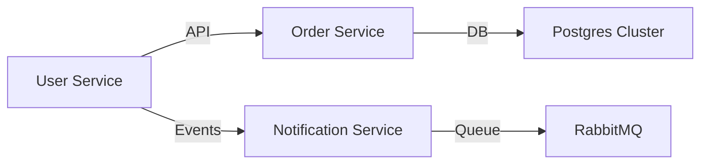

```markdown
# **"Microservices Maintenance: A Practical Guide to Keeping Your Decomposition Healthy"**

*How to balance autonomy with control in a distributed system—without losing your sanity.*

---

## **Introduction: The Microservices Paradox**

You’ve heard it before: *"Break your monolith into microservices, and you’ll be unstoppable."* The idea is seductive—smaller teams, faster iterations, and the flexibility to scale individual components. But here’s the catch: **microservices aren’t maintenance-free**.

What starts as a well-intentioned architectural decision quickly becomes a distributed nightmare if you don’t plan for **ongoing maintenance**. Teams grow fragmented. Deployment pipelines become a patchwork of incompatible tools. And before you know it, you’re spending more time fixing integration quirks than delivering new features.

In this guide, we’ll demystify **microservices maintenance**—the often-overlooked but critical discipline that separates scalable systems from technical debt clusters. We’ll cover:
- The **hidden challenges** of maintaining independence
- **Proven patterns** (with code examples) for governance and observability
- A **step-by-step implementation guide** to keep your services cohesive
- **Anti-patterns** that’ll make your CTO weep

Let’s dive in.

---

## **The Problem: Why Microservices Maintenance Matters**

Microservices shine in theory, but in practice, they introduce **new operational complexities** that monoliths don’t have to worry about:

### **1. The "Team Drift" Problem**
Each service’s isolation can lead to **inconsistent tooling, documentation, and best practices**. One team might use Kafka for event-driven workflows while another relies on direct HTTP calls. Another might deploy using ArgoCD, while a third uses GitHub Actions. **Result?** A misalignment that makes scaling painful and debugging a guessing game.

### **2. The Deployment Spaghetti**
Without coordination, deployments become a **domino effect of dependencies**. A fix in Service A might break Service B, but no one knows because:
- **No centralized observability** to correlate errors across services.
- **No governance** to enforce pre-deployment checks (e.g., schema validation, contract tests).
- **No rollback strategy** when things go wrong.

### **3. The Observability Black Hole**
Microservices generate **massive volumes of logs, metrics, and traces**. If you’re not instrumenting consistently, you’ll drown in:
- **Noisy alerts** (e.g., "Service C failed, but is it because of Service C or Service D?").
- **Incomplete traces** (missing context when an error originates in Service A but manifests in Service B).
- **Hard-to-debug latency spikes** (without cross-service telemetry, you’re flying blind).

### **4. The "We’ll Fix It Later" Debt**
Teams often **skip maintenance tasks** because:
- *"We’ll document this later"* → Service A’s API changes, but the docs never get updated.
- *"We’ll add tests later"* → Service B’s integration tests cover 60% of edge cases.
- *"We’ll refactor later"* → Service C’s codebase becomes so complex that only one dev can touch it.

**Result?** The system becomes a brittle patchwork that crashes under real-world load.

---

## **The Solution: Microservices Maintenance Patterns**

Maintaining a healthy microservices ecosystem requires **three pillars**:
1. **Governance** (enforce consistency without stifling autonomy).
2. **Observability** (see the forest, not just the trees).
3. **Shared Infrastructure** (avoid reinventing the wheel).

Let’s explore each with **practical examples**.

---

## **Component 1: Governance – Enforcing Standards Without Dictatorship**

### **Pattern: The "Service Charter"**
A **Service Charter** is a lightweight contract that each team signs (metaphorically) to ensure consistency. It includes:
- **API Contracts** (OpenAPI/Swagger specs, enforced via [OpenAPI Validator](https://github.com/fergiemcdowall/openapi-validator)).
- **Deployment Policies** (e.g., "Must use our CI/CD template").
- **Observability Requirements** (e.g., "All services must emit structured logs with `service_name` and `trace_id`").
- **Data Ownership** (who can modify a shared database or event stream).

#### **Example: Enforcing API Contracts with OAS3**
```yaml
# service-a/openapi.yaml (Example API spec)
openapi: 3.0.0
info:
  title: User Service API
  version: 1.0.0
paths:
  /users/{id}:
    get:
      responses:
        '200':
          description: Successful response
          content:
            application/json:
              schema:
                $ref: '#/components/schemas/User'
components:
  schemas:
    User:
      type: object
      properties:
        id:
          type: string
        name:
          type: string
```

**Tool:** Use **[Spectral](https://stoplight.io/open-source/spectral/)** to validate all API specs against a template before merging PRs.

```bash
# Enforce rules like "all paths must have OpenAPI 3.0.0" in CI
npx spectral lint service-a/openapi.yaml --ruleset ../.spectral-rules.json
```

---

### **Pattern: Mandatory Shared Dependencies**
Avoid **"wheel reinvention"** by ensuring all services use:
- **Same logging library** (e.g., [Zap](https://github.com/google/go-zeppelin) in Go, [StructLog](https://github.com/h12io/structlog) in Python).
- **Same error-handling patterns** (e.g., [Resilience4j](https://resilience4j.readme.io/docs) for retries/circuit breakers).
- **Same health-check endpoint** (`/healthz`).

#### **Example: Go Shared Logging Layer**
```go
// pkg/logging/logger.go (Used by ALL services)
package logging

import (
	"go.uber.org/zap"
	"go.uber.org/zap/zapcore"
)

func NewLogger(serviceName string) *zap.Logger {
	core := zapcore.NewCore(
		zapcore.NewJSONEncoder(zap.NewProductionEncoderConfig()),
		zapcore.Lock(os.Stdout),
		zapcore.LevelEnablerFunc(func(l zapcore.Level) bool { return true }),
	)
	return zap.New(core, zap.AddCaller(), zap.Int("service", 1))
}
```

**Result:** All logs are consistently formatted, making aggregation (e.g., in **Loki**) trivial.

---

### **Pattern: Deployment Gates via Pre-Merge Checks**
Use **pre-commit hooks** and **CI gates** to enforce:
- **Contract tests** (e.g., [Pact](https://docs.pact.io/) for API contracts).
- **Security scans** (e.g., [Trivy](https://aquasecurity.github.io/trivy/) for Docker images).
- **Build consistency** (e.g., all services must use the same Docker base image).

#### **Example: Pact Contract Tests (Python)**
```python
# tests/contracts/test_user_service_pact.py
import requests
from pact import ConsumerContractTestCase

class TestUserService(ConsumerContractTestCase):
    @classmethod
    def pact_specification_dir(cls):
        return "./tests/contracts/pacts"

    def test_get_user_returns_expected_fields(self):
        self.extend_execution_with("user_id", "123")
        response = self.proxy.request(
            "GET",
            "/users/123",
            headers={"Accept": "application/json"},
        )
        self.assertEqual(response.json()["name"], "Alice")
```
Run in CI:
```yaml
# .github/workflows/pact.yml
name: Pact Tests
on: [pull_request]
jobs:
  test:
    runs-on: ubuntu-latest
    steps:
      - uses: actions/checkout@v3
      - run: pip install pact python-pact
      - run: python -m pytest tests/contracts/
```

---

## **Component 2: Observability – Seeing the Whole System**

### **Pattern: Structured Logging + Distributed Traces**
- **Logs:** Use structured logging (JSON) with `service_name`, `request_id`, and `trace_id`.
- **Traces:** Instrument with **[OpenTelemetry](https://opentelemetry.io/)** for end-to-end visibility.

#### **Example: OpenTelemetry in Go**
```go
// main.go
package main

import (
	"go.opentelemetry.io/otel"
	"go.opentelemetry.io/otel/exporters/zipkin"
	"go.opentelemetry.io/otel/sdk/resource"
	sdktrace "go.opentelemetry.io/otel/sdk/trace"
	semconv "go.opentelemetry.io/otel/semconv/v1.4.0"
	"go.opentelemetry.io/otel/trace"
)

func initTracer(serviceName string) (*sdktrace.TracerProvider, error) {
	exporter, err := zipkin.New(exporter.WithEndpoint("http://zipkin:9411/api/v2/spans"))
	if err != nil {
		return nil, err
	}
	tp := sdktrace.NewTracerProvider(
		sdktrace.WithBatcher(exporter),
		sdktrace.WithResource(resource.NewWithAttributes(
			semconv.SchemaURL,
			semconv.ServiceNameKey.String(serviceName),
		)),
	)
	otel.SetTracerProvider(tp)
	return tp, nil
}

// Usage in a handler:
func GetUser(w http.ResponseWriter, r *http.Request) {
	tracer := otel.Tracer("user-service")
	ctx, span := tracer.Start(r.Context(), "GetUser")
	defer span.End()
	// ... business logic ...
}
```

**Tools:**
- **Logs:** Loki + Grafana.
- **Metrics:** Prometheus + Grafana.
- **Traces:** Jaeger/Zipkin.

---

### **Pattern: Service Dependencies Map**
Maintain a **visual dependency graph** (e.g., with **[Mermaid](https://mermaid.js.org/)**) to spot bottlenecks.

#### **Example: Mermaid Diagram**


**Automate with [`mermaid-cli`](https://github.com/mermaid-js/mermaid-cli):**
```bash
# Generate from a YAML file
mermaid-cli -i services/dependencies.yml -o docs/architecture.png
```

---

## **Component 3: Shared Infrastructure – Avoiding Reinvention**

### **Pattern: Centralized Infrastructure as Code (IaC)**
- **Shared Terraform modules** for:
  - Kubernetes clusters.
  - Secrets management (e.g., [Vault](https://www.vaultproject.io/)).
  - Networking (e.g., Istio service mesh).
- **Canary deployments** via **Flagger**.

#### **Example: Terraform Module for Services**
```hcl
# modules/service/templates.tf
resource "kubernetes_deployment" "service" {
  metadata {
    name = "${var.service_name}-deployment"
    labels = {
      app = var.service_name
    }
  }
  spec {
    replicas = 3
    selector {
      match_labels = {
        app = var.service_name
      }
    }
    template {
      metadata {
        labels = {
          app = var.service_name
        }
      }
      spec {
        container {
          image = "${var.docker_registry}/${var.service_name}:${var.image_tag}"
          name  = var.service_name
          ports {
            container_port = var.port
          }
          env {
            name  = "ENVIRONMENT"
            value = var.environment
          }
        }
      }
    }
  }
}
```

**Usage:**
```bash
terraform apply -var="service_name=user-service" -var="image_tag=v1.2.0"
```

---

## **Implementation Guide: Your 90-Day Plan**

| Phase       | Goal                                  | Action Items                                                                 |
|-------------|---------------------------------------|------------------------------------------------------------------------------|
| **Week 1**  | Define governance rules               | Create a Service Charter template. Add CI gates for Pact/OpenAPI validation. |
| **Week 2**  | Standardize logging/tracing           | Deploy OpenTelemetry. Update all services to use shared logger.              |
| **Week 3**  | Build observability dashboard          | Set up Loki + Prometheus. Create a service dependencies diagram.             |
| **Week 4**  | Enforce IaC patterns                  | Migrate all services to use the Terraform module.                           |
| **Month 2** | Automate rollback/recovery            | Implement canary deployments with Flagger.                                   |
| **Month 3** | Refactor technical debt                | Clean up deprecated services. Update docs.                                   |

---

## **Common Mistakes to Avoid**

### ❌ **Mistake 1: "We’ll Standardize Later"**
**Problem:** Teams diverge in tooling (e.g., one uses Docker, another uses Podman). Fixing it later means rewriting code.
**Solution:** Enforce standards **immediately** via CI.

### ❌ **Mistake 2: Ignoring Cross-Service Errors**
**Problem:** Service A fails, but the error log only shows Service A’s perspective.
**Solution:** Always correlate traces with logs (e.g., propagate `trace_id` in HTTP headers).

### ❌ **Mistake 3: No Rollback Plan**
**Problem:** A deployment breaks Service B, but there’s no quick way to revert.
**Solution:** Use **blue-green deployments** or **canary releases** with automatic rollback.

### ❌ **Mistake 4: Over-Scaling Observability**
**Problem:** Adding 10 metrics per service leads to **alert fatigue**.
**Solution:** Follow **[Google’s SLO-based monitoring](https://sre.google/sre-book/monitoring-distributed-systems/)**.

---

## **Key Takeaways**

✅ **Governance ≠ Control:** Standards should **empower** teams, not stifle them. Use **Service Charters** and **enforced CI gates**.
✅ **Observability is Non-Negotiable:** Without consistent logging/tracing, debugging becomes a **black box**.
✅ **Shared Infrastructure Saves Time:** Avoid reinventing Kubernetes, secrets, or logging—**standardize early**.
✅ **Maintenance is a Mindset:** Treat microservices like a **living organism**—continuously refine, not just build.
✅ **Rollbacks Must Be Instant:** Plan for failure by using **canary deployments** and **automated rollback**.

---

## **Conclusion: Microservices Maintenance is a Superpower**

Microservices aren’t about **breaking things into smaller pieces**—they’re about **building a cohesive, scalable system**. The key to success lies in **proactive maintenance**:
- **Governance** to keep teams aligned.
- **Observability** to see the whole picture.
- **Shared infrastructure** to avoid reinvention.

Start small—pick **one service**, enforce a **Service Charter**, and add observability. Over time, this discipline will **save you from technical debt** and turn your microservices into a **well-oiled machine**.

Now go forth and **maintain responsibly**.

---
**Further Reading:**
- [Google’s SRE Book (Monitoring Section)](https://sre.google/sre-book/monitoring-distributed-systems/)
- [Pact.io (Consumer-Driven Contracts)](https://docs.pact.io/)
- [OpenTelemetry Documentation](https://opentelemetry.io/docs/)

---
**What’s your biggest microservices maintenance challenge? Drop a comment below!**
```