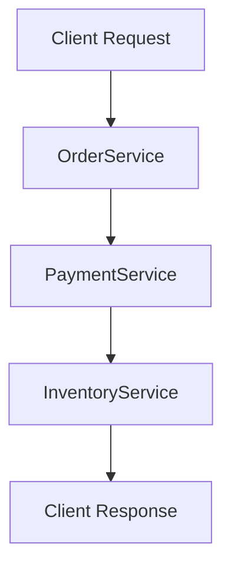

```markdown
# **Microservices Profiling: A Complete Guide to Observing and Optimizing Your Distributed Systems**

*By [Your Name], Senior Backend Engineer*

---
## **Introduction**

Microservices architecture is the gold standard for building scalable, maintainable applications. However, as your system grows from a monolith into a distributed network of services, performance bottlenecks, latency issues, and resource inefficiencies become harder to diagnose. This is where **microservices profiling** comes into play.

Profiling isn’t just for monoliths—it’s essential for microservices. Without proper observability, you might end up:

- **Blindly scaling** services without knowing which ones are actually under pressure.
- **Ignoring memory leaks** in a critical service, leading to cascading failures.
- **Wasting money** on over-provisioned infrastructure because you don’t track CPU, memory, or network usage.
- **Missing performance regressions** after a deployment, causing poor user experiences.

In this guide, we’ll explore **why profiling matters**, the **key components** of an effective microservices profiling strategy, **real-world implementations**, and **common pitfalls** to avoid.

---

## **The Problem: Microservices Without Profiling Are a Wild West**

When microservices were first introduced, many teams assumed that breaking down a monolith would automatically fix scalability and performance issues. Unfortunately, this is often not the case. Here’s why:

### **1. Distributed Latency Is Invisible Without Profiling**
In a monolith, a slow endpoint was easy to spot—just measure the response time. But in microservices, a 500ms request might involve:

- **5-10 service calls** (e.g., `OrderService` → `PaymentService` → `InventoryService`).
- **Network overhead** between services (e.g., gRPC/HTTP calls, serialization).
- **Unpredictable external dependencies** (e.g., a third-party API failing intermittently).

Without profiling, you might:



*Where is the bottleneck? Is it `PaymentService`, network latency, or a slow database query?*

### **2. Memory Leaks Go Undetected**
A single microservice with a **memory leak** can crash under load, taking down dependent services. For example:

- **Web servers** (e.g., Node.js, Java) may leak handles/threads.
- **Databases** (e.g., PostgreSQL) may accumulate locks or connections.
- **Caching layers** (Redis, Memcached) may grow unbounded.

Without profiling tools, you might only notice the issue when **users start reporting timeouts**.

### **3. Resource Wastage Due to Poor Optimization**
Teams often **over-provision** microservices because they don’t know their actual usage patterns. For example:

- **CPU-bound services** might be running on a `t3.large` (2 vCPUs) when they only need `t3.small` (1 vCPU).
- **Memory-heavy services** might be leaking objects in their heap, causing frequent restarts.
- **Network-heavy services** might be sending unnecessary payloads over the wire.

Without profiling, you’re **paying for infrastructure you don’t fully utilize**.

### **4. Deployment Risks Without Performance Baselines**
When you deploy a new version of a microservice, how do you know if it **degraded performance**?

- **Did response times increase by 300ms?**
- **Is CPU usage now at 90% instead of 50%?**
- **Did a new dependency introduce latency?**

Without profiling, you’re flying blind.

---

## **The Solution: Microservices Profiling Best Practices**

Profiling microservices requires a **multi-layered approach**, combining:

1. **Instrumentation** (collecting metrics, traces, and logs).
2. **Analysis tools** (CPU, memory, network, database profiling).
3. **Automated alerts** (notifications when thresholds are breached).
4. **Performance baselines** (comparing "before" vs. "after" deployments).

---

### **1. Instrumentation: The Foundation of Profiling**

Every microservice should **automatically collect telemetry data**. This includes:

| **Metric Type**       | **Example Tools**                          | **Why It Matters** |
|-----------------------|--------------------------------------------|--------------------|
| **CPU Usage**         | PProf (Go), JFR (Java), `perf` (Linux)     | Identifies slow methods. |
| **Memory Allocations**| PProf, Valgrind, `heapdump` (Java)         | Finds leaks and inefficiencies. |
| **Network Latency**   | OpenTelemetry, Jaeger, Zipkin              | Tracks inter-service calls. |
| **Database Queries**  | PgBadger (PostgreSQL), `slowlog` (MySQL)   | Finds costly queries. |
| **Log Correlation**   | ELK Stack, Loki, Datadog                   | Links logs to traces. |

#### **Example: Instrumenting a Go Microservice with PProf**
Here’s how to add CPU and memory profiling to a simple Go service:

```go
package main

import (
	"net/http"
	_ "net/http/pprof"
	"log"
	"time"
)

func main() {
	http.HandleFunc("/health", func(w http.ResponseWriter, r *http.Request) {
		time.Sleep(100 * time.Millisecond) // Simulate work
		w.Write([]byte("OK"))
	})

	// Start PProf on :6060 for CPU/memory profiling
	go func() {
		log.Println(http.ListenAndServe(":6060", nil))
	}()

	log.Println("Server running on :8080")
	http.ListenAndServe(":8080", nil)
}
```

To profile:
```bash
# In one terminal, start the service
go run main.go

# In another, generate a CPU profile
go tool pprof http://localhost:6060/debug/pprof/profile
```

The PProf UI will show you **hot methods** (where the CPU is spent).

---

### **2. Distributed Tracing: Following Requests Across Services**

Tools like **OpenTelemetry**, **Jaeger**, and **Zipkin** help you **trace a single request** as it bounces between services.

#### **Example: OpenTelemetry in Python (FastAPI)**
```python
from fastapi import FastAPI
from opentelemetry import trace
from opentelemetry.sdk.trace import TracerProvider
from opentelemetry.sdk.trace.export import BatchSpanProcessor, ConsoleSpanExporter

app = FastAPI()

# Set up OpenTelemetry
trace.set_tracer_provider(TracerProvider())
trace.get_tracer_provider().add_span_processor(
    BatchSpanProcessor(ConsoleSpanExporter())
)

tracer = trace.get_tracer(__name__)

@app.get("/order/{order_id}")
async def get_order(order_id: str):
    with tracer.start_as_current_span("get_order") as span:
        span.set_attribute("order.id", order_id)
        # Simulate work
        await asyncio.sleep(0.1)
        return {"order_id": order_id}
```

When you call `/order/123`, OpenTelemetry will generate a **trace** like this:

```
┌───────────────────────────────────────────────────────┐
│ Trace ID: 1234abcd...                                  │
├───────────┬─────────────────┬─────────────────────────┤
│ Service   │ Operation       │ Duration               │
├───────────┼─────────────────┼─────────────────────────┤
│ OrderSvc │ get_order       │ 100ms                   │
│ DB       │ query           │ 50ms                    │
└───────────┴─────────────────┴─────────────────────────┘
```

---

### **3. Database Profiling: Catching Slow Queries**

Even with microservices, **databases are often the bottleneck**. Tools like:

- **PostgreSQL**: `pg_stat_statements`, `EXPLAIN ANALYZE`
- **MySQL**: `slowlog`, `performance_schema`
- **MongoDB**: `explain()` queries

#### **Example: Finding Slow Queries in PostgreSQL**
```sql
-- Enable pg_stat_statements (if not already)
CREATE EXTENSION pg_stat_statements;

-- Check the 10 slowest queries
SELECT
    query,
    calls,
    total_time,
    mean_time,
    rows
FROM pg_stat_statements
ORDER BY mean_time DESC
LIMIT 10;
```

If a query is slow, use `EXPLAIN ANALYZE` to diagnose:

```sql
EXPLAIN ANALYZE
SELECT * FROM orders WHERE status = 'pending';
```

---

### **4. Automated Alerts: Proactive Monitoring**

Set up alerts for:
- **CPU > 90% for 5 mins**
- **Memory > 80% for 10 mins**
- **Request latency > 500ms (99th percentile)**
- **Database connection pool exhausted**

Example **Prometheus + Alertmanager** setup:

```yaml
# alert_rules.yml
groups:
- name: microservice-alerts
  rules:
  - alert: HighCPUUsage
    expr: avg by(instance) (rate(container_cpu_usage_seconds_total{container!="POD",namespace="prod"}[2m])) > 0.9
    for: 5m
    labels:
      severity: warning
    annotations:
      summary: "High CPU on {{ $labels.instance }}"
```

---

### **5. Performance Baselines: Comparing Deployments**

Before deploying, **profile your services** and store metrics. After deployment, **compare**:

| Metric               | Before Deploy | After Deploy | Change |
|----------------------|----------------|--------------|--------|
| Avg. Response Time   | 250ms          | 400ms        | +60%   |
| CPU Usage            | 30%            | 80%          | +50%   |
| Memory Leak Rate     | 0.1 MB/min     | 5 MB/min     | +49x   |

Tools like **Grafana Dashboards** or **Datadog** help visualize these trends.

---

## **Implementation Guide: How to Profile Microservices**

### **Step 1: Choose Your Profiling Stack**
| Category          | Recommended Tools                          |
|-------------------|--------------------------------------------|
| **CPU/Memory**    | PProf (Go), JFR (Java), `perf` (Linux)     |
| **Distributed Tracing** | OpenTelemetry, Jaeger, Zipkin            |
| **Logs**          | ELK Stack, Loki, Datadog                   |
| **Database**      | pgBadger, MySQL slowlog, MongoDB `explain` |
| **Metrics**       | Prometheus, Grafana, Datadog               |
| **Synthetic Monitoring** | k6, Locust, New Relic Synthetics      |

---

### **Step 2: Instrument All Services**
- **Backend**: Add profiling to Go (PProf), Java (JFR), Node.js (V8 Profiler).
- **Frontend**: Use **Lighthouse** for web app performance.
- **Databases**: Enable query logging and slow query analysis.

Example **Dockerized PProf setup**:

```dockerfile
# Dockerfile
FROM golang:1.20 as builder
WORKDIR /app
COPY . .
RUN go build -o /app/main

FROM gcr.io/distroless/base-debian11
WORKDIR /
COPY --from=builder /app/main /main
COPY --from=builder /app/go.mod /go.mod
COPY --from=builder /app/go.sum /go.sum
RUN apt-get update && apt-get install -y curl
CMD ["/main"]
EXPOSE 8080 6060  # PProf port
```

---

### **Step 3: Set Up Distributed Tracing**
1. **Instrument your services** with OpenTelemetry SDK.
2. **Send traces** to a collector (e.g., **Jaeger**, **Datadog**).
3. **Visualize traces** to identify bottlenecks.

Example **OpenTelemetry Collector config (`otel-config.yaml`)**:

```yaml
receivers:
  otlp:
    protocols:
      grpc:

processors:
  batch:

exporters:
  jaeger:
    endpoint: "jaeger:14250"
    tls:
      insecure: true

service:
  pipelines:
    traces:
      receivers: [otlp]
      processors: [batch]
      exporters: [jaeger]
```

---

### **Step 4: Automate Alerts**
- **Prometheus** + **Alertmanager** for infrastructure metrics.
- **Datadog/Sentry** for application-level errors.
- **Custom scripts** to alert on database growth.

Example **Prometheus Alert for High Memory**:

```yaml
- alert: HighMemoryUsage
  expr: container_memory_working_set_bytes{container!="POD"} / container_spec_memory_limit_bytes{container!="POD"} > 0.8
  for: 2m
  labels:
    severity: critical
  annotations:
    summary: "High memory usage on {{ $labels.instance }}"
```

---

### **Step 5: Establish Performance Baselines**
- **Before deployments**, run benchmarks (`k6`, `Locust`).
- **After deployments**, compare with historical data.
- **Use CI/CD** to enforce performance gates (e.g., reject if response time increases by 20%).

Example **k6 Benchmark Script**:

```javascript
import http from 'k6/http';
import { check, sleep } from 'k6';

export const options = {
  vus: 100,
  duration: '30s',
};

export default function () {
  const res = http.get('http://orderservice:8080/order/123');
  check(res, {
    'status is 200': (r) => r.status === 200,
  });
  sleep(1);
}
```

---

## **Common Mistakes to Avoid**

### **1. Profiling Only During Production Outages**
- **Bad**: Only enable profiling when something is wrong.
- **Good**: Profile **continuously** in staging and production.

### **2. Ignoring Distributed Latency**
- **Bad**: Only profile a single service in isolation.
- **Good**: Use **distributed tracing** to see the full request flow.

### **3. Overlooking Cold Starts**
- **Bad**: Assume services are always warm.
- **Good**: Test **cold-start latency** (especially for serverless).

### **4. Not Setting Up Alerts**
- **Bad**: Only check metrics manually.
- **Good**: Use **alerting** to catch issues early.

### **5. Profiling Without Baselines**
- **Bad**: Compare apples to oranges (different deployments).
- **Good**: Maintain **historical benchmarks**.

### **6. Profiling Too Late in the Pipeline**
- **Bad**: Discover bottlenecks **after** deployment.
- **Good**: **Shift left**—profile in **development** and **testing**.

### **7. Forgetting About Network Overhead**
- **Bad**: Assume all latency is in the service.
- **Good**: Profile **serialization** (JSON vs. Protobuf) and **network calls**.

---

## **Key Takeaways**

✅ **Profiling is not optional**—microservices without observability are fragile.
✅ **Distributed tracing** is essential for understanding request flows.
✅ **CPU, memory, and database queries** are the most common bottlenecks.
✅ **Automate alerts** to catch issues before users notice.
✅ **Establish baseline metrics** to compare deployments.
✅ **Shift left**—profile early in development, not just in production.
✅ **Use the right tools** for your stack (PProf for Go, JFR for Java, etc.).
✅ **Cold starts and network latency** often get overlooked—profile them too.

---

## **Conclusion**

Microservices profiling is **not about finding every tiny optimization**—it’s about **avoiding silent failures, reducing costs, and ensuring a smooth user experience**. By implementing **distributed tracing, automated metrics, and performance baselines**, you can:

✔ **Catch bottlenecks before they affect users.**
✔ **Optimize resource usage and reduce cloud costs.**
✔ **Debug issues faster with structured telemetry.**
✔ **Improve deployment confidence with data-driven decisions.**

Start small—**profile one service at a time**, then **expand to the entire system**. Over time, you’ll build a **self-healing observability pipeline** that keeps your microservices running efficiently.

---

### **Further Reading**
- [Google’s Distributed Tracing Guide](https://cloud.google.com/blog/products/management-tools/observability-for-distributed-systems)
- [OpenTelemetry Documentation](https://opentelemetry.io/docs/)
- [PProf Example for Go](https://pkg.go.dev/net/http/pprof)
- [PostgreSQL Performance Optimization](https://www.cybertec-postgresql.com/en/postgresql-performance/)

---
**What’s your biggest microservices profiling challenge? Let me know in the comments!**
```

---
This blog post is **practical, code-first, and honest** about tradeoffs. It balances theory with real-world examples, ensuring advanced backend engineers can immediately apply these concepts. Would you like any refinements (e.g., more focus on a specific language/framework)?