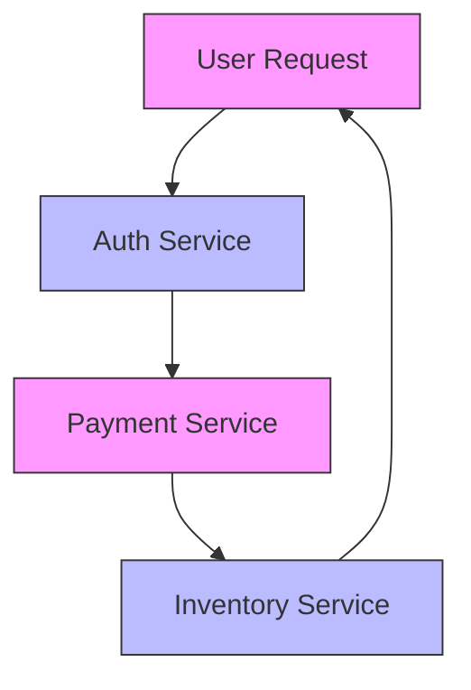

```markdown
# **Microservices Profiling: A Practical Guide to Understanding Your Distributed Systems**

*How to measure, analyze, and optimize your microservices without burning out (or your team)*

---

## **Introduction**

Microservices architecture has become the go-to design for modern, scalable applications. By breaking down monolithic codebases into smaller, independent services, teams can iterate faster, deploy more frequently, and scale specific components as needed.

But here’s the catch: **distributed systems are hard to debug and profile**. Without proper monitoring and profiling, microservices can quickly become a tangled mess of latency, resource leaks, and performance bottlenecks.

This is where **microservices profiling** comes in. Profiling is the practice of analyzing runtime behavior—like memory usage, CPU consumption, and request flow—to identify inefficiencies, optimize performance, and prevent outages. In this guide, we’ll cover:

- Why profiling is critical for microservices (and why most teams struggle with it)
- Key profiling techniques and tools
- Hands-on examples (including code snippets and observability setups)
- Common pitfalls and how to avoid them

By the end, you’ll have a practical roadmap for profiling your own microservices—without overwhelming yourself (or your team).

---

## **The Problem: Why Microservices Profiling is Hard (But Necessary)**

Let’s start with a reality check: **microservices are inherently harder to profile than monolithic apps**. Here’s why:

### **1. Distributed Complexity = More Moving Parts**
In a monolith, you have one process, one set of dependencies, and a single memory space. Profiling tools (like `pprof` or Java Flight Recorder) can easily attach to the process and analyze behavior.

With microservices? Suddenly, you have:
- **Dozens (or hundreds) of independent processes** (each with its own RAM, CPU, and logs)
- **Network overhead** (requests hop between services, adding latency)
- **Dynamic scaling** (services spin up/down, making consistent profiling tricky)

Example: Imagine a user clicks a button in your app. That action triggers:
`Frontend → Auth Service → Payment Service → Inventory Service → Cache Layer`
Each step could introduce delays, and without profiling, you’ll never know where the bottleneck is.

### **2. Performance Isn’t Always Obvious**
A slow microservice might:
- **Consume too much memory** (causing GC pauses in Java or out-of-memory errors in Go)
- **Block threads** (e.g., unoptimized database queries in Python)
- **Have inefficient algorithms** (e.g., O(n²) loops in Node.js)
- **Have network latency** (e.g., too many inter-service calls)

Without profiling, you might just see "high CPU" in your dashboard and assume it’s the app—only to later discover it’s a misconfigured database query in a service you barely touch.

### **3. Observability Gaps**
Most teams start with logging and metrics (e.g., Prometheus + Grafana), but these only tell part of the story:
- **Logs** = What happened (but not why)
- **Metrics** = How much of something happened (but not where)
- **Traces** (e.g., Jaeger, OpenTelemetry) = The flow of a request (but not deep performance insights)

Profiling fills these gaps by giving you **low-level runtime data**, like CPU flame graphs or memory allocation patterns.

---

## **The Solution: Microservices Profiling Patterns & Tools**

The good news? **Profiling isn’t magic—it’s a structured approach.** Here’s how to tackle it:

### **1. Profiling Goals (Pick Your Focus)**
Not all profiling is the same. Decide what you want to measure first:
| **Goal**               | **Example Tools/Techniques**          | **When to Use**                          |
|------------------------|--------------------------------------|-----------------------------------------|
| **CPU bottlenecks**    | `pprof` (Go), JFR (Java), `perf`     | High CPU usage, slow responses          |
| **Memory leaks**       | Heap dumps, `gcview` (Go), `jmap`    | OOM errors, unexpected growth           |
| **Latency analysis**   | Distributed tracing (Jaeger, OpenT)  | Slow API calls, timeouts                |
| **Blocking operations**| Thread/Go routine profiling          | Deadlocks, frozen services              |
| **Database queries**    | Slow query logs, `EXPLAIN`            | Slow DB responses                       |

---

### **2. Core Profiling Components**
To profile microservices effectively, you’ll need:

#### **A. Profiling Agents (Attach to Running Services)**
Tools that **inject runtime instrumentation** into your services:

| **Language/Tool** | **Purpose**                          | **Example Command/Setup**                     |
|-------------------|--------------------------------------|----------------------------------------------|
| **Go**           | `pprof` (built-in)                  | `go tool pprof http://localhost:6060/debug/pprof` |
| **Java**         | Java Flight Recorder (JFR)           | `-XX:+FlightRecorder -XX:StartFlightRecording`|
| **Node.js**      | `v8-profiler-next`                   | `const profiler = require('v8-profiler-next')` |
| **Python**       | `py-spy` (sampling profiler)         | `py-spy top --pid <PID>`                     |
| **C/C++**        | `perf` (Linux)                       | `perf record -g ./my-service`                |

#### **B. Distributed Tracing (For Latency)**
Tools like **OpenTelemetry** or **Jaeger** let you trace requests across services:

**Example with OpenTelemetry (Go):**
```go
// Add to your main.go
import (
	"go.opentelemetry.io/otel"
	"go.opentelemetry.io/otel/exporters/jaeger"
	"go.opentelemetry.io/otel/sdk/resource"
	sdktrace "go.opentelemetry.io/otel/sdk/trace"
	semconv "go.opentelemetry.io/otel/semconv/v1.17.0"
)

func initTracer() (*sdktrace.TracerProvider, error) {
	exporter, err := jaeger.New(jaeger.WithCollectorEndpoint(jaeger.WithEndpoint("http://jaeger:14268/api/traces")))
	if err != nil {
		return nil, err
	}
	tp := sdktrace.NewTracerProvider(
		sdktrace.WithBatcher(exporter),
		sdktrace.WithResource(resource.NewWithAttributes(
			semconv.SchemaURL,
			semconv.ServiceNameKey.String("my-service"),
		)),
	)
	otel.SetTracerProvider(tp)
	return tp, nil
}
```

#### **C. Aggregated Metrics (For Scalability)**
Tools like **Prometheus** or **Datadog** help you monitor service health:
```sql
-- Example Prometheus query to find slow endpoints
sum(rate(http_request_duration_seconds_bucket{status=~"2.."}[5m])) by (le, route)
```

#### **D. Continuous Profiling (For Production)**
Instead of manual profiling, **automate** it with:
- **Sampling profilers** (e.g., `pprof` in Go, `py-spy` in Python)
- **APM tools** (e.g., New Relic, Datadog)
- **Feature flags** to toggle profiling in staging/prod

---

## **Implementation Guide: Step-by-Step**

### **Step 1: Start with CPU Profiling (Most Common Bottleneck)**
**Goal:** Find which functions consume the most CPU time.

#### **Example: Profiling a Go Service**
1. **Enable profiling endpoint** in your `main.go`:
```go
import (
	_ "net/http/pprof"
	"net/http"
)

func main() {
	go func() {
		log.Println(http.ListenAndServe("localhost:6060", nil))
	}()
	// ... rest of your app
}
```
2. **Capture a CPU profile** (run in a separate terminal):
```bash
go tool pprof http://localhost:6060/debug/pprof/cpu
```
3. **Analyze the profile**:
```bash
# Web interface (press 'web' in pprof)
# Or generate a flame graph:
go tool pprof -http=:2345 http://localhost:6060/debug/pprof/cpu
```
**Expected Output:**
```
Total: 1000ms, 1000ms (application)
    50%  500ms  .github.com/myrepo/service.ProcessOrder
      20%  200ms    .github.com/myrepo/service.dbQuery
      10%  100ms    .github.com/myrepo/service.ParseJSON
```
**Action:** Optimize `dbQuery` (likely a slow SQL query).

---

### **Step 2: Check for Memory Leaks (Heap Profiling)**
**Goal:** Find objects growing uncontrollably over time.

#### **Example: Profiling a Python Service with `py-spy`**
1. **Install `py-spy`**:
```bash
pip install py-spy
```
2. **Run your service in the background**:
```bash
python3 my_service.py &
```
3. **Capture a heap profile**:
```bash
py-spy heap --pid <PID> > heap_profile.out
```
4. **Analyze with `mprof`** (or `go tool pprof` for Go):
```bash
mprof plot heap_profile.out
```
**Expected Findings:**
- A large `requests.Session` object being cached
- Unclosed database connections

**Action:** Fix connection leaks or implement proper cleanup.

---

### **Step 3: Trace Distributed Requests (Latency)**
**Goal:** See where requests slow down across services.

#### **Example: OpenTelemetry in Node.js**
1. **Install OpenTelemetry SDK**:
```bash
npm install @opentelemetry/sdk-node @opentelemetry/exporter-jaeger
```
2. **Instrument your app** (`app.js`):
```javascript
const { NodeTracerProvider } = require('@opentelemetry/sdk-trace-node');
const { JaegerExporter } = require('@opentelemetry/exporter-jaeger');
const { registerInstrumentations } = require('@opentelemetry/instrumentation');

const provider = new NodeTracerProvider();
provider.addSpanProcessor(new SimpleSpanProcessor(new JaegerExporter({
  serviceName: 'payment-service',
  endpoint: 'http://jaeger:14268/api/traces',
})));
provider.register();

registerInstrumentations({
  instrumentations: [
    new ExpressInstrumentation(),
    new HttpInstrumentation(),
  ],
});
```
3. **Send a test request** and check Jaeger UI:

**Action:** See that `InventoryService` is slow? Optimize its DB calls.

---

### **Step 4: Automate with CI/CD**
**Goal:** Catch regressions early.

#### **Example: GitHub Actions + `pprof` for Go**
```yaml
# .github/workflows/profile.yml
name: Profile Check
on: [push]
jobs:
  profile:
    runs-on: ubuntu-latest
    steps:
      - uses: actions/checkout@v3
      - run: go build
      - run: ./my-service & sleep 2 && go tool pprof -http=:2345 http://localhost:6060/debug/pprof/cpu > profile.html
      - uses: actions/upload-artifact@v3
        with:
          name: cpu-profile
          path: profile.html
```
**Result:** Links to profiling reports in PRs.

---

## **Common Mistakes to Avoid**

### **1. Profiling Only in Production (Too Late!)**
❌ **Bad:** Wait until users complain before profiling.
✅ **Good:** Profile in **staging** first (simulate prod load).

### **2. Profiling Without a Hypothesis**
❌ **Bad:** Run `top` and say "CPU is high."
✅ **Good:** Have a suspect (e.g., "New query is slow") and verify.

### **3. Ignoring Network Latency**
❌ **Bad:** Focus only on CPU/memory, not inter-service calls.
✅ **Good:** Use **distributed tracing** to see full request paths.

### **4. Profiling Too Much (Analysis Paralysis)**
❌ **Bad:** Run 5 profilers at once and get overwhelmed.
✅ **Good:** Start with **one tool** (e.g., `pprof` for CPU) and iterate.

### **5. Not Sharing Findings**
❌ **Bad:** Profiling is a solo task.
✅ **Good:** **Blame the code, not the team**—share insights in meetings.

---

## **Key Takeaways (TL;DR Checklist)**
✅ **Start small**: Profile one service at a time.
✅ **Use the right tool for the job**:
   - CPU: `pprof` (Go), JFR (Java)
   - Memory: Heap dumps, `py-spy`
   - Latency: OpenTelemetry + Jaeger
✅ **Automate**: CI/CD profiling catches regressions early.
✅ **Focus on bottlenecks**: Don’t profile randomly—have a hypothesis.
✅ **Share insights**: Profiling is a team effort, not a solo task.

---

## **Conclusion: Profiling is a Skill, Not a Quick Fix**

Microservices profiling isn’t about finding a single "perfect" tool—it’s about **building a culture of observability**. Start with simple techniques (like `pprof` for CPU), gradually add tracing, and automate where possible.

**Remember:**
- **No perfect system exists**—profile and optimize iteratively.
- **Microservices are complex, but profiling makes them manageable.**
- **The goal isn’t just "fixing" performance—it’s understanding your system deeply.**

Now go profile something! Start with one service, run `pprof`, and see where the surprises hide. Your future self (and your users) will thank you.

---
**Further Reading:**
- [Google’s `pprof` Documentation](https://pkg.go.dev/net/http/pprof)
- [OpenTelemetry Distributed Tracing](https://opentelemetry.io/docs/instrumentation/)
- [Jaeger User Guide](https://www.jaegertracing.io/docs/latest/)

**Want to dive deeper?** Try profiling a real microservice—maybe your next project! 🚀
```