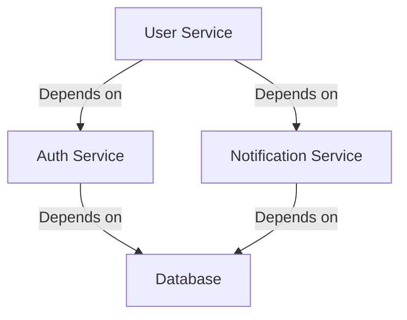
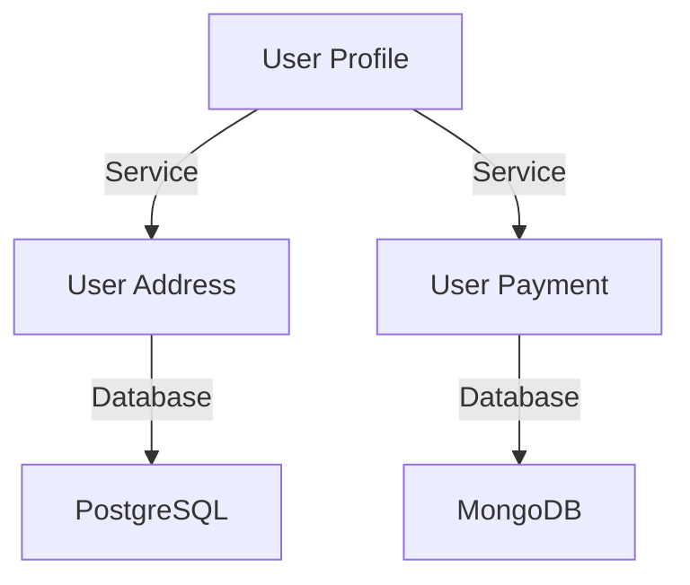
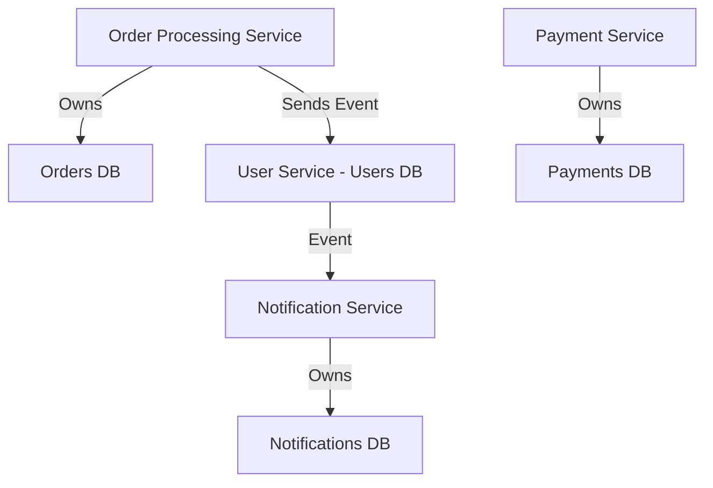
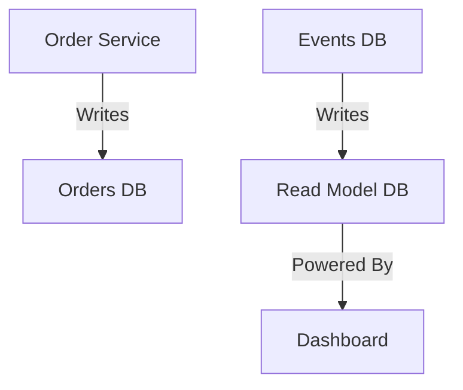
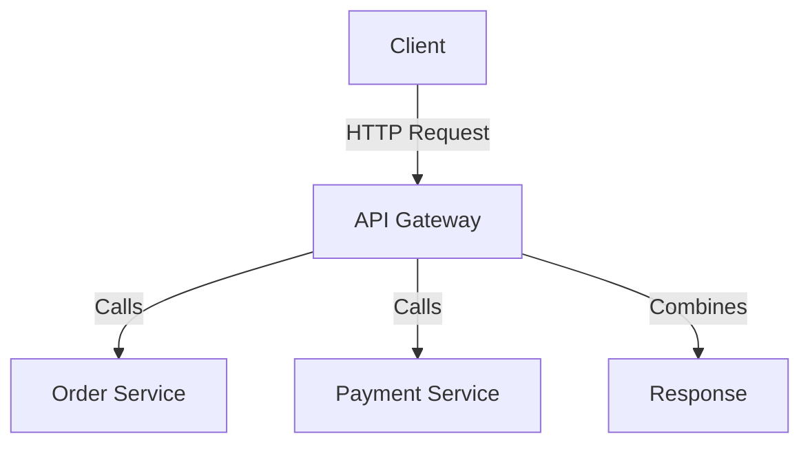
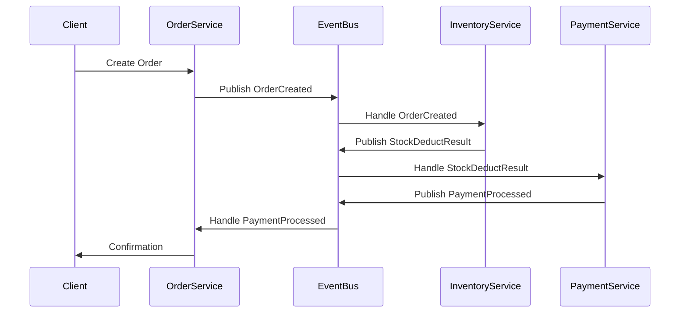

```markdown
# **Microservices Strategies: A Practical Guide to Breaking Down Monoliths Without Regret**


*Image: A modern microservices architecture with clear service boundaries and inter-service communication.*

---

## **Introduction**

You’ve heard the hype: *"Microservices are the future!"* And for many teams, that’s true—**if** you design them right. Microservices let you build scalable, independently deployable services, but without a clear strategy, you risk creating a cluster of tightly coupled, hard-to-maintain mini-monoliths.

This isn’t just theory—**real teams** struggle with microservices because they skip the foundational work:
- **How do you split functionality without causing chaos?**
- **How do you manage inter-service communication without turning your API into a nightmare?**
- **How do you keep your database clean when services share critical data?**

This guide will walk you through **proven microservices strategies**, from **domain-driven design** to **event-driven communication**, with real-world examples. We’ll cover tradeoffs, pitfalls, and—most importantly—**how to avoid the nightmare version of microservices**.

---

## **The Problem: When Microservices Go Wrong**

Before diving into solutions, let’s examine the **common anti-patterns** that make microservices fail:

### **1. Split by Technology, Not Domain**
Some teams chop up monoliths by layer (e.g., "Let’s spin out the auth service" or "Let’s make a separate search service"). This backfires because:
- **Tight coupling remains** – services still depend on each other’s APIs.
- **Inconsistent data** – if two services need a user’s details, they might pull from different sources (leading to stale or conflicting data).
- **Deployment hell** – changing one service now affects multiple others.

**Example:**
A "bad" split:

→ **Problem:** Changing `B` (Auth) requires redeploying `A` (User) because they share the same database schema.

---

### **2. Over-Sharding Without a Strategy**
Some teams go too granular, creating:
- **A service for every CRUD operation** (e.g., `UserProfileService`, `UserAddressService`, `UserPaymentService`).
- **A thousand tiny databases**, making operations complex and slow.

**Example:**
A "bad" over-split:

→ **Problem:** Fetching a user’s full profile now requires **three service calls**, increasing latency.

---

### **3. Ignoring Data Consistency**
Microservices **by definition** can’t all read/write the same database. But if you don’t plan for:
- **Eventual consistency** (vs. strong consistency),
- **Saga patterns** for long-running transactions,
- **Idempotency** for retries,
you end up with **data corruption** or **inconsistent user experiences**.

**Example:**
A checkout process where:
1. `OrderService` creates an order.
2. `PaymentService` processes payment.
3. **But if `PaymentService` fails**, `OrderService` might **not roll back**, leaving users with charged-but-not-delivered orders.

---

### **4. Poor Inter-Service Communication**
Teams often default to **REST APIs** for everything, leading to:
- **Tight coupling** (Service A calls Service B directly → now they’re interdependent).
- **Performance bottlenecks** (chatty APIs with high latency).
- **Hard-to-maintain contracts** (API versions explode).

**Example:**
A monolithic REST flow:
```http
POST /orders/checkout
    -> Calls /users/{id} (UserService)
    -> Calls /payments/process (PaymentService)
    -> Calls /inventories/deduct (InventoryService)
```
→ **Problem:** If `UserService` changes its API, **all clients must update**, including `OrderService`.

---

## **The Solution: Microservices Strategies That Work**

Now, let’s break down **proven strategies** to build microservices **the right way**.

---

### **1. Domain-Driven Design (DDD) for Service Boundaries**
**Rule:** Split by **business capabilities**, not technical layers.

**Key Steps:**
1. **Map your domain** – Identify core business domains (e.g., `OrderProcessing`, `UserManagement`, `Inventory`).
2. **Define bounded contexts** – Each service owns its data and logic.
3. **Avoid shared databases** – If two services need user data, **duplicate it** (but keep it synced via events).

**Example:**
A **good** split using DDD:

→ **Benefit:** Each service is **independently deployable** and **scales its own data**.

**Code Example: Defining a Bounded Context in Python (FastAPI)**
```python
# orders_service/main.py
from fastapi import FastAPI
from pydantic import BaseModel
from typing import Optional

app = FastAPI()

class Order(BaseModel):
    order_id: str
    user_id: str
    items: list[dict]  # Structured like {"product_id": "123", "quantity": 2}

# Orders service owns order data, but may publish events for other services
@app.post("/orders")
async def create_order(order: Order):
    # Save to Orders DB
    # Publish "OrderCreated" event
    return {"status": "created"}
```

---

### **2. Event-Driven Communication (Instead of REST Chains)**
**Rule:** Use **events** (not direct API calls) to decouple services.

**Why?**
- **Loose coupling** – Services don’t need to know about each other.
- **Resilience** – If `PaymentService` fails, `OrderService` can retry later.
- **Scalability** – Events can be processed asynchronously.

**Example Workflow:**
1. `OrderService` creates an order → publishes `OrderCreated` event.
2. `InventoryService` subscribes → deducts stock → publishes `StockDeductEvent`.
3. `PaymentService` subscribes → charges user → publishes `PaymentProcessed`.
4. `NotificationService` subscribes → sends confirmation email.

**Code Example: Kafka Event Publishing (Python)**
```python
# orders_service/event_publisher.py
from confluent_kafka import Producer

config = {'bootstrap.servers': 'kafka:9092'}
producer = Producer(config)

def publish_order_created_event(order_id: str, user_id: str):
    event_data = {
        "order_id": order_id,
        "user_id": user_id,
        "timestamp": datetime.now().isoformat(),
        "type": "OrderCreated"
    }
    producer.produce('order-events', json.dumps(event_data).encode('utf-8'))
    producer.flush()
```

**Code Example: Kafka Consumer (Inventory Service)**
```python
# inventory_service/consumer.py
from confluent_kafka import Consumer

def consume_events():
    conf = {'bootstrap.servers': 'kafka:9092', 'group.id': 'inventory-group'}
    consumer = Consumer(conf)
    consumer.subscribe(['order-events'])

    while True:
        msg = consumer.poll(1.0)
        if msg is None:
            continue
        event = json.loads(msg.value().decode('utf-8'))
        if event['type'] == 'OrderCreated':
            deduct_stock(event['order_id'])  # Business logic
```

**Tradeoffs:**
✅ **Pros:**
- Decoupled services.
- Resilient to failures.
- Scales horizontally.

❌ **Cons:**
- **Eventual consistency** (not immediate).
- **Complex debugging** (follow-the-event tracing).
- **Eventuality** (race conditions if not handled).

---

### **3. Database per Service (With CQRS for Read-Heavy Cases)**
**Rule:** **Each service owns its own database.**
But for **read-heavy** cases (e.g., dashboards), use **CQRS** (Command Query Responsibility Segregation).

**Example Architecture:**


**Code Example: CQRS with Event Sourcing (PostgreSQL)**
```sql
-- Orders DB (Command Model)
CREATE TABLE orders (
    id UUID PRIMARY KEY,
    status VARCHAR(20),
    created_at TIMESTAMP
);

-- Read Model DB (for analytics)
CREATE TABLE order_analytics (
    order_id UUID,
    status VARCHAR(20),
    customer_id UUID,
    created_at TIMESTAMP
);

-- Event Store
CREATE TABLE order_events (
    id UUID PRIMARY KEY,
    order_id UUID,
    event_type VARCHAR(20),
    payload JSONB,
    occurred_at TIMESTAMP
);
```

**Tradeoffs:**
✅ **Pros:**
- Strong **data isolation**.
- **Scalability** (each DB can scale independently).

❌ **Cons:**
- **Eventual consistency** (reads may lag writes).
- **Complexity** (need to manage event sourcing).

---

### **4. API Gateways for Client-Facing APIs**
**Rule:** **Expose a single HTTP/gRPC entry point** to clients (mobile, web, IoT), not raw microservices.

**Why?**
- **Hides complexity** – Clients don’t need to know about `OrderService`, `PaymentService`, etc.
- **Aggregates responses** – Reduces latency (one call instead of 5).
- **Rate limiting & auth** – Managed centrally.

**Example:**


**Code Example: Kong API Gateway (OpenResty)**
```nginx
# Kong config (YAML)
services:
  - name: order-service
    url: http://orders-service:8000
    routes:
      - name: order-route
        methods: [GET, POST]
        paths: [/orders]
```

**Tradeoffs:**
✅ **Pros:**
- **Simplified client architecture**.
- **Centralized auth & rate limiting**.

❌ **Cons:**
- **Single point of failure** (if gateway fails).
- **Latency overhead** (if gateway is slow).

---

### **5. Saga Pattern for Distributed Transactions**
**Rule:** **Use sagas** (choreography or orchestration) to manage long-running transactions.

**Why?**
- Prevents **data corruption** when multiple services fail.
- Ensures **idempotency** (retrying doesn’t cause duplicates).

**Example: Choreography Saga (Event-Driven)**


**Code Example: Orchestration Saga (Python)**
```python
# saga_manager.py (handles failure states)
from fastapi import FastAPI
from enum import Enum

class OrderStatus(Enum):
    CREATED = "created"
    PAID = "paid"
    FAILED = "failed"

app = FastAPI()

@app.post("/orchestrate")
async def orchestrate_order(order_id: str):
    try:
        # Step 1: Reserve inventory
        if not reserve_inventory(order_id):
            raise Exception("Inventory failed")

        # Step 2: Process payment
        if not process_payment(order_id):
            # Compensating transaction
            release_inventory(order_id)
            raise Exception("Payment failed")

        # Success
        return {"status": OrderStatus.PAID}
    except Exception as e:
        return {"status": OrderStatus.FAILED, "error": str(e)}
```

**Tradeoffs:**
✅ **Pros:**
- **No locks** (unlike 2PC).
- **Resilient to failures**.

❌ **Cons:**
- **Complex logic** in saga manager.
- **Eventual consistency** (not immediate).

---

## **Implementation Guide: Step-by-Step**

### **1. Start with a Monolith (or Lightweight Microservices)**
- **Don’t rip-and-replace.** Instead:
  - **Gradually extract** services (e.g., start with `AuthService`).
  - **Use feature flags** to toggle between old and new.

### **2. Define Service Boundaries Using DDD**
- **Ask:** *"What business capability is this service responsible for?"*
- **Avoid:** *"Let’s split the frontend from the backend"* (that’s a frontend-backend split, not microservices).

### **3. Choose Communication Style**
| Pattern          | When to Use                          | Example Tools               |
|------------------|--------------------------------------|-----------------------------|
| **REST APIs**    | Simple, synchronous calls.           | FastAPI, Spring Boot        |
| **gRPC**         | High-performance, internal calls.    | gRPC, Protocol Buffers      |
| **Async Events** | Decoupled, resilient workflows.      | Kafka, RabbitMQ             |
| **CQRS**         | Read-heavy analytics.                | PostgreSQL + Event Sourcing  |

### **4. Database Strategy**
- **Default:** **One DB per service.**
- **Exception:** Use **shared DB** only if:
  - Services **must** have **strong consistency**.
  - **Transaction boundaries** are simple.

### **5. Observability is Non-Negotiable**
- **Logging:** Structured logs (JSON) with correlation IDs.
- **Metrics:** Track latency, error rates, throughput.
- **Tracing:** Distributed tracing (e.g., OpenTelemetry).

**Example: OpenTelemetry in Python**
```python
from opentelemetry import trace
from opentelemetry.sdk.trace import TracerProvider
from opentelemetry.sdk.trace.export import BatchSpanProcessor
from opentelemetry.exporter.otlp.proto.grpc.trace_exporter import OTLPSpanExporter

trace.set_tracer_provider(TracerProvider())
otlp_exporter = OTLPSpanExporter(endpoint="http://otel-collector:4317")
trace.get_tracer_provider().add_span_processor(BatchSpanProcessor(otlp_exporter))
```

---

## **Common Mistakes to Avoid**

| ❌ **Mistake**                          | ❌ **Why It’s Bad**                          | ✅ **Fix**                                  |
|-----------------------------------------|--------------------------------------------|--------------------------------------------|
| **Split by technical layer** (e.g., "Let’s move auth to a separate service") | Leads to tight coupling.                | Split by **business capability**.         |
| **Over-fragmentation** (too many services) | Adds operational overhead.              | Start with **3-5 core services**.          |
| **Ignoring data consistency**          | Leads to duplicates or stale data.       | Use **sagas** or **event sourcing**.      |
| **REST-only APIs between services**    | Creates a single point of failure.      | Use **events + gRPC** for internal calls. |
| **No observability**                   | Makes debugging a nightmare.             | **Always** add tracing & metrics.        |
| **Tight coupling via shared DB**       | Violates microservices principle.         | **Each service owns its data.**           |

---

## **Key Takeaways**

Here’s your **microservices cheat sheet**:

✅ **Do:**
- **Split by domain**, not technology.
- **Use events** for async communication.
- **Own your data** (one DB per service).
- **Expose a gateway** to clients.
- **Manage transactions with sagas**.
- **Observe everything** (logs, metrics, traces).

❌ **Don’t:**
- Split by layer (e.g., "auth service").
- Over-shard (start small).
- Ignore data consistency.
- Use REST for everything.
- Skip testing (use **contract tests**).

🚀 **Mindset Shift:**
Microservices are **not about smaller codebases**—they’re about **independence, scalability, and resilience**. If you’re building them **just for fun** (e.g., "We’ll refactor later"), you’re doing it wrong.

---

## **Conclusion: Microservices Without the Pain**

Microservices **can** be a game-changer, but only if you **design them deliberately**. The key is:
1. **Start small** (extract one service at a time).
2. **Communicate asynchronously** (events > REST).
3. **Own your data** (no shared DBs).
4. **Observe relentlessly** (logs, metrics, traces).

**Remember:** There’s no "perfect" microservices architecture—just **tradeoffs**. Your goal is to **minimize pain points** while gaining **scalability, resilience, and flexibility**.

Now go build something **that won’t haunt you in 6 months**.

---
### **Further Reading**
- [Domain-Driven Design (DDD) by Eric Evans](https://domainlanguage.com/ddd/)
- [Event-Driven Microservices (Martin Fowler)](https://martinfowler.com/articles/201701/event-driven.html)
- [Saga Pattern (Microsoft Docs)](https://learn.microsoft.com/en-us/azure/architecture/patterns/saga)

**What’s your biggest microservices struggle?** Hit reply—I’d love to hear your story!
```

---
### **Why This Works for Intermediate Devs