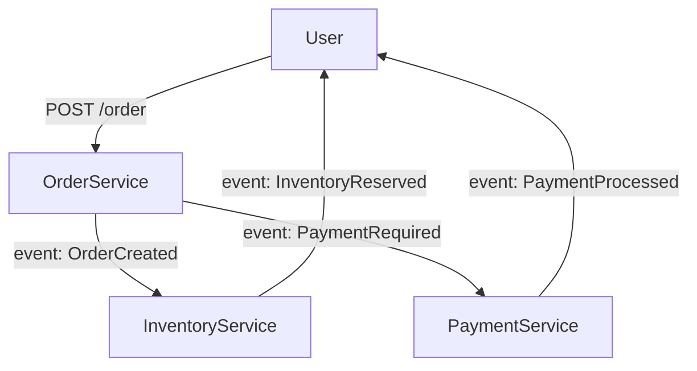

```markdown
---
title: "Microservices Techniques: Advanced Patterns and Anti-Patterns for Scalable Backend Systems"
date: 2023-11-15
tags: ["microservices", "backend design", "distributed systems", "scalability", "techniques"]
---

# **Microservices Techniques: Advanced Patterns for Scalable Backend Systems**

Microservices architecture has evolved from a buzzword to a battle-tested approach for building resilient, scalable, and maintainable backend systems. But raw microservices—without proper techniques—can lead to complexity, latency, and operational nightmares. This guide dives into **advanced microservices techniques**, focusing on real-world patterns, tradeoffs, and pragmatic implementations.

By the end, you’ll know how to design loosely coupled services, avoid common pitfalls, and build systems that scale while remaining maintainable.

---

## **Introduction: Why Microservices Need Techniques**

Microservices empower teams to deploy independent services, scale components, and innovate quickly. However, without the right techniques, you risk:

- **Tight coupling** between services, defeating the purpose of microservices.
- **Performance bottlenecks** from excessive inter-service communication.
- **Operational complexity** from tooling sprawl and distributed debugging.

This isn’t about "doing microservices right" in theory—it’s about **practical techniques** that solve real-world challenges. We’ll cover:

1. **Service Decomposition Strategies** (bounded contexts, domain-driven design)
2. **Inter-Service Communication** (REST, gRPC, event-driven async)
3. **Data Management** (database per service, eventual consistency)
4. **Resilience Patterns** (circuit breakers, retries, timeouts)
5. **Observability & Debugging** (distributed tracing, metrics)

---

## **The Problem: Without Techniques, Microservices Fail**

Let’s examine a common failure scenario:

### **Example: The Monolithic Microservice**
A team starts with one service handling all business logic. Over time, it grows into a monolith disguised as microservices:

```java
// A "microservice" that does too much (anti-pattern)
@RestController
@RequestMapping("/api/v1")
public class OrderService {
    // Handles orders, inventory, payments, and shipping
    @PostMapping("/order")
    public ResponseEntity<Order> createOrder(@RequestBody OrderDto orderDto) {
        // Tightly coupled: 10+ internal service calls
        Order order = orderService.create(orderDto);
        inventoryService.reserve(orderDto.getItems());
        paymentService.charge(order.getTotal());
        shippingService.schedule(order);

        return ResponseEntity.ok(order);
    }
}
```

**Problems:**
❌ **Tight coupling** – One service failure cascades.
❌ **Latency hell** – Each call waits for the next.
❌ **Debugging nightmare** – Where did it fail: inventory, payment, or shipping?

This isn’t microservices—it’s **distributed monoliths**.

---

## **The Solution: Architectural Techniques for Real Microservices**

### **1. Service Decomposition: Bounded Contexts & Domain-Driven Design (DDD)**
**Goal:** Split services by **domain boundaries**, not just tech debt.

**Example:**
Instead of one "order" service, we decompose into:
- `OrderService` (order lifecycle)
- `InventoryService` (stock management)
- `PaymentService` (transactions)
- `ShippingService` (logistics)



**Key Idea:**
- **Bounded contexts** define clear ownership.
- **Ubiquitous language** (e.g., "Order" vs. "Purchase") aligns teams.

---

### **2. Inter-Service Communication: Choose Wisely**

| Pattern          | When to Use                          | Tradeoffs                          |
|------------------|--------------------------------------|------------------------------------|
| **REST (HTTP)**  | Simple CRUD, polyglot clients         | Chatty, latency-sensitive          |
| **gRPC**         | High-performance, internal calls     | Tighter integration, harder for clients |
| **Event-Driven** | Asynchronous workflows (payments, notifications) | Complex event sourcing needing |

**Example: Event-Driven Order Processing**
```java
// Kafka Producer (OrderService)
@KafkaTemplate
public interface OrderEventProducer {
    void send(OrderCreatedEvent event);
}

// Kafka Consumer (PaymentService)
@Component
@KafkaListener(topics = "order.created")
public void handleOrderCreated(OrderCreatedEvent event) {
    paymentService.process(event.getAmount());
}
```

**Tradeoff:** Events introduce eventual consistency but improve decoupling.

---

### **3. Data Management: Database per Service**
**Rule:** Each service owns its database. No shared DBs.

**Example: Order vs. Inventory DBs**
```sql
-- OrderService DB (only knows order IDs)
CREATE TABLE orders (
    id UUID PRIMARY KEY,
    status VARCHAR(20) NOT NULL,
    created_at TIMESTAMP
);

-- InventoryService DB (owns stock)
CREATE TABLE inventory (
    product_id INT PRIMARY KEY,
    quantity INT NOT NULL
);
```

**Anti-Pattern:** A single "orders" table with foreign keys to inventory—**this is a distributed monolith**.

---

### **4. Resilience Patterns: Handle Failures Gracefully**
**Common Failures:**
- Network latency (e.g., PaymentService takes 2s)
- Service outages (e.g., InventoryService crashes)

**Solutions:**
- **Circuit Breaker:** Stop retrying after `N` failures.
- **Retry with Backoff:** Exponential backoff for transient errors.
- **Timeouts:** Force failure after a threshold.

**Example: Resilient REST Client**
```java
// Using Resilience4j (Java)
@CircuitBreaker(name = "inventoryService", fallbackMethod = "fallback")
public InventoryResponse reserveItems(InventoryRequest request) {
    return restTemplate.postForObject("http://inventory/api/reserve", request, InventoryResponse.class);
}

private InventoryResponse fallback(InventoryRequest request, Exception e) {
    // Return cached stock or partial success
    return new InventoryResponse("Partial reserve", true);
}
```

**Tradeoff:** Retries can mask bugs—use **idempotent operations**.

---

### **5. Observability: Debugging Distributed Systems**
Without observability, microservices feel like a **black box**.

**Techniques:**
- **Distributed Tracing** (Jaeger, OpenTelemetry)
- **Metrics** (Prometheus, Grafana)
- **Logging** (ELK Stack, Loki)

**Example: OpenTelemetry Trace**
```java
// Java Span Context Propagation
Tracer spanTracer = TracerProvider.global().get("order-service");
Tracer.Span span = spanTracer.spanBuilder("create-order").startSpan();
try (Tracer.SpanContext context = span.makeCurrent()) {
    inventoryService.reserve(); // Propagates span
} finally {
    span.end();
}
```

---

## **Implementation Guide: Step-by-Step**

### **1. Start Small, Decompose Later**
- Begin with **one service** (e.g., `OrderService`).
- Add **bounded contexts** as complexity grows.
- Avoid **premature decomposition** (YAGNI).

### **2. Design APIs for Resilience**
- Use **versioned endpoints** (`/v2/orders`).
- Document **rate limits** and **timeouts**.
- Prefer **async** for non-critical paths.

```yaml
# OpenAPI (Swagger) Example
paths:
  /orders/{id}:
    get:
      operationId: getOrder
      parameters:
        - name: id
          in: path
          required: true
      responses:
        200:
          description: Order details
        503:
          description: Service unavailable (retries allowed)
```

### **3. Database Strategy**
- **Polyglot persistence:** Use PostgreSQL for transactions, Redis for caching.
- **Eventual consistency:** Accept stale reads for performance.
- **Change data capture (CDC):** Sync data via Kafka (Debezium).

### **4. Test for Failure**
- **Chaos engineering:** Kill services randomly (Gremlin).
- **Load testing:** Simulate traffic spikes (Locust, k6).

---

## **Common Mistakes to Avoid**

| Mistake                          | Why It’s Bad                          | Solution                          |
|----------------------------------|---------------------------------------|-----------------------------------|
| **Tight coupling**               | Services depend on each other’s DBs   | Bounded contexts + events         |
| **Over-fragmentation**           | Too many tiny services               | Aim for "reasonable" granularity  |
| **Ignoring latency**             | Blocking calls in HTTP               | Async + retries + timeouts        |
| **No observability**             | "It works on my machine"              | Distributed tracing + metrics     |
| **Shared databases**             | Violates single responsibility       | Database per service              |

---

## **Key Takeaways**
✅ **Bounded contexts** → Clear ownership.
✅ **Async first** → Avoid latency chains.
✅ **Database per service** → No shared tables.
✅ **Resilience patterns** → Handle failures gracefully.
✅ **Observability** → Debug distributed systems.

---

## **Conclusion: Microservices Are a Craft**
Microservices techniques are **not magic**. They require discipline in decomposition, communication, and resilience. Start small, iterate, and avoid the pitfalls of "distributed monoliths."

**Next Steps:**
1. Audit your current services for tight coupling.
2. Introduce **one bounded context** at a time.
3. Implement **traces + metrics** from day one.

Want to dive deeper? Check out:
- [DDD & Bounded Contexts (Vlad Khononov)](https://www.youtube.com/watch?v=1X4Xp4EJwkY)
- [Resilience4j Documentation](https://resilience4j.readme.io/docs)
- [Kafka for Microservices (Confluent)](https://www.confluent.io/blog/)

Now go build some **real** microservices.
```