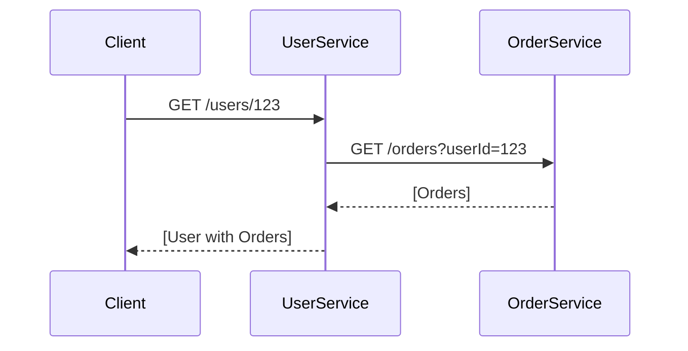

```markdown
# **Microservices Troubleshooting: A Beginner’s Guide to Debugging Distributed Systems**

*How to diagnose, trace, and fix issues in microservices without pulling your hair out.*

---

## **Introduction**

Microservices architecture is a powerful way to build scalable, maintainable systems by breaking monolithic applications into smaller, independent services. But this flexibility comes at a cost: **debugging distributed systems is harder than ever.**

Unlike monoliths, where you can `console.log` everything and still make sense of it, microservices introduce:
- **Network latency** between services
- **Decoupled dependencies** (one service’s failure doesn’t crash the whole system, but it still affects users)
- **Data silos** (logs and metrics are scattered across services)
- **Dynamic scaling** (instances come and go, making tracing tricky)

If you’re new to microservices, you’ve probably experienced:
❌ *"Why is my order processing service slow today?"*
❌ *"This transaction seems to be stuck—where does it go?"*
❌ *"Why are my errors going unnoticed?"*

This guide will equip you with **practical tools and techniques** to troubleshoot microservices like a pro—without relying on magic dust.

---

## **The Problem: Microservices Without Proper Observability Are a Debugging Nightmare**

Let’s say your team built a `UserService` and `OrderService` that communicate via HTTP:



**Sounds simple—right?**

But what happens when:
1. **The OrderService is slow** (maybe a database query is slow).
2. **The UserService times out** waiting for a response.
3. **The client gets a vague 502 Bad Gateway**—no clue where the failure originated.

Worse yet, **logs are scattered**:
- UserService logs: `GET /users/123 completed in 450ms`
- OrderService logs: `Query ran for 300ms, returned 5 orders`
- Client logs: `Error: Timeout waiting for UserService`

Without proper debugging tools, you’re **guessing** where the problem is.

### **Common Microservices Debugging Challenges**
| Challenge | Example Scenario |
|-----------|------------------|
| **Distributed Tracing** | A request spans 3 services—how do you follow it? |
| **Metric Misalignment** | One service is overloaded, but no one notices in aggregate logs. |
| **Configuration Drift** | A service works fine locally but fails in production due to environment variables. |
| **Circuit Breaker Failures** | A service keeps retrying a failed downstream call, flooding the system. |
| **Data Inconsistency** | A transaction succeeds in Service A but fails in Service B—who’s responsible? |

---

## **The Solution: A Structured Approach to Microservices Troubleshooting**

To debug microservices effectively, you need **three pillars**:
1. **Observability** (logs, metrics, traces)
2. **Distributed Tracing** (following requests across services)
3. **Automated Alerts** (catching issues before users do)

Let’s break this down with **real-world examples**.

---

## **1. Observability: The Foundation of Debugging**

Observability means **instrumenting your services** to collect:
- **Logs** (structured, searchable)
- **Metrics** (CPU, latency, error rates)
- **Traces** (request flow across services)

### **Example: Structured Logging in Python (FastAPI)**

Instead of:
```python
# ❌ Bad: Unstructured logs
print("User not found!")
```

Use **structured logging** with JSON or a logging library like `structlog`:

```python
# ✅ Good: Structured logs (easier to parse & query)
import structlog

log = structlog.get_logger()

@router.get("/users/{user_id}")
async def get_user(user_id: int):
    user = await db.get_user(user_id)
    if not user:
        log.error("user_not_found", user_id=user_id)
        raise HTTPException(404, "User not found")
    return user
```

Now, when you search for `"user_not_found"`, you’ll see:
```json
{
  "event": "error",
  "user_id": 123,
  "message": "User not found",
  "timestamp": "2024-05-20T12:34:56Z"
}
```

### **Example: Prometheus Metrics (Tracking Latency)**

Use `prometheus_client` in Python to track request durations:

```python
from prometheus_client import Counter, Histogram

REQUEST_LATENCY = Histogram("request_latency_seconds", "Request latency")
ERROR_COUNTER = Counter("request_errors_total", "Number of errors")

@router.get("/users/{user_id}")
async def get_user(user_id: int):
    REQUEST_LATENCY.start_timer()
    try:
        user = await db.get_user(user_id)
        if not user:
            ERROR_COUNTER.inc()
            raise HTTPException(404)
        return user
    finally:
        REQUEST_LATENCY.observe()
```

Now, **Prometheus** can scrape these metrics and **Grafana** can visualize:
- **Latency percentiles (p90, p99)**
- **Error rates per endpoint**
- **Throughput (requests/sec)**

---

## **2. Distributed Tracing: Following Requests Across Services**

When a request spans multiple services, **you need a way to correlate logs and metrics**.

### **Example: OpenTelemetry in JavaScript (Node.js)**

Install `opentelemetry-sdk-node` and `@opentelemetry/exporter-jaeger`:

```javascript
// Import OpenTelemetry
const { NodeTracerProvider } = require('@opentelemetry/sdk-trace-node');
const { JaegerExporter } = require('@opentelemetry/exporter-jaeger');
const { registerInstrumentations } = require('@opentelemetry/instrumentation');
const { HttpInstrumentation } = require('@opentelemetry/instrumentation-http');

// Configure tracer
const provider = new NodeTracerProvider();
const exporter = new JaegerExporter({ serviceName: 'OrderService' });
provider.addSpanProcessor(new SimpleSpanProcessor(exporter));
provider.register();

// Instrument HTTP requests
registerInstrumentations({
  instrumentations: [
    new HttpInstrumentation()
  ]
});

// Example: A request that calls UserService
app.get('/orders', async (req, res) => {
  const span = provider.activeSpan; // Current trace
  const userId = req.query.userId;

  try {
    const user = await fetch(`http://userservice/users/${userId}`);
    // More business logic...
  } catch (err) {
    span.recordException(err);
    span.setStatus({ code: SpanStatusCode.ERROR });
  } finally {
    span.end();
  }
});
```

Now, when you send a request to `/orders`, **Jaeger** (or another trace viewer) will show:

```
┌───────────────────────────────────────────────────┐
│ Trace ID: abc123...                              │
├───────────┬───────────────────────────────────────┤
│ Service   │ Operation                          │
├───────────┼───────────────────────────────────────┤
│ Client    │ GET /orders?userId=123             │
│ OrderSvc  │ fetch /users/123                   │
│ UserSvc   │ GET /users/123                     │
└───────────┴───────────────────────────────────────┘
```

**Key benefits:**
✅ **See the full request flow** (not just one service’s logs).
✅ **Spot bottlenecks** (e.g., `UserService` is slow).
✅ **Correlate errors** (e.g., a 500 in `OrderService` → 404 in `UserService`).

---

## **3. Automated Alerts: Proactive Debugging**

No one wants to be the person who says, *"We only found out when 50% of users were affected."*

Set up **alerts** for:
- High latency (> 1s)
- Error spikes (> 1% of requests)
- Resource exhaustion (CPU > 90%)

### **Example: Alerting with Prometheus & Alertmanager**

In your `prometheus.yml`:
```yaml
alerting:
  alertmanagers:
    - static_configs:
        - targets: ["alertmanager:9093"]

alerts:
  - alert: HighLatency
    expr: request_latency_seconds > 1
    for: 5m
    labels:
      severity: warning
    annotations:
      summary: "High latency on {{ $labels.service }}"
      description: "Request latency is {{ $value }}s (threshold: 1s)"

  - alert: ErrorSpike
    expr: rate(request_errors_total[5m]) > 0.01
    for: 1m
    labels:
      severity: critical
    annotations:
      summary: "Error spike in {{ $labels.service }}"
      description: "Error rate is {{ $value }} (threshold: 1%)"
```

When triggered, **Alertmanager** sends a Slack/Email/PagerDuty alert:
> **⚠️ High latency on `OrderService`**
> Request latency is **1.8s** (threshold: 1s)

---

## **Implementation Guide: Step-by-Step**

### **1. Start Small (Add Observability Incrementally)**
- **Phase 1:** Add **structured logs** to one service.
- **Phase 2:** Instrument **metrics** for latency/errors.
- **Phase 3:** Enable **tracing** for critical paths.

### **2. Choose the Right Tools**
| Category       | Tools (Beginner-Friendly) |
|----------------|---------------------------|
| **Logs**       | Loki, ELK Stack, Datadog  |
| **Metrics**    | Prometheus + Grafana      |
| **Tracing**    | Jaeger, OpenTelemetry      |
| **Alerts**     | Alertmanager, PagerDuty   |

### **3. Standardize Your Instrumentation**
- Use **the same trace ID** across services (OpenTelemetry helps here).
- Follow **consistent naming** for metrics (e.g., `http_request_duration_seconds`).
- **Tag logs with request IDs** (so they’re searchable).

### **4. Test Before Production**
- **Mock failures** in staging (e.g., slow down `OrderService`).
- **Check traces** in a test environment.
- **Simulate high load** to verify alerts.

---

## **Common Mistakes to Avoid**

### ❌ **1. Ignoring Distributed Tracing**
*"I’ll just check individual service logs."*
→ **Problem:** You’ll never see the full picture.

### ❌ **2. Overloading Logs with Too Much Data**
*"I should log everything!"*
→ **Problem:** Logs become unreadable. Stick to **structured logs** and **filter noise**.

### ❌ **3. No Alert Fatigue**
*"I’ll alert on everything."*
→ **Problem:** Teams ignore alerts if they’re too noisy. **Prioritize critical errors.**

### ❌ **4. Using Local Debugging Tricks in Production**
*"I’ll just add `print()` statements."*
→ **Problem:** Production environments **aren’t for debugging**. Use **structured logs** instead.

### ❌ **5. Not Correlating Logs & Traces**
*"Logs say one thing, traces say another."*
→ **Problem:** **Always include trace IDs in logs** for correlation.

---

## **Key Takeaways**

✅ **Observability is non-negotiable** – Logs, metrics, and traces are your lifeline.
✅ **Distributed tracing solves the "which service failed?" problem.**
✅ **Alerts prevent outages from becoming disasters.**
✅ **Start small** – Instrument one service, then expand.
✅ **Standardize your instrumentation** (consistent naming, tags).
✅ **Avoid "black box" debugging** – Always correlate logs, traces, and metrics.

---

## **Conclusion: Debugging Microservices Doesn’t Have to Be Painful**

Microservices introduce complexity, but **the right debugging tools make it manageable**. By focusing on:
1. **Observability** (logs, metrics, traces)
2. **Distributed tracing** (following requests across services)
3. **Automated alerts** (catching issues early)

you’ll **reduce mean time to resolution (MTTR)** and **prevent outages before they happen**.

### **Next Steps**
- **Try OpenTelemetry** in your next project (it’s the standard now).
- **Set up Prometheus + Grafana** for centralized metrics.
- **Start tracing** just your most critical APIs.

Microservices debugging isn’t about magic—it’s about **intentional instrumentation and smart tooling**. Now go fix those slow requests!

---
**Got questions? Drop them in the comments!** 🚀
```

---

### **Why This Works for Beginners**
✔ **Code-first approach** – Shows real implementations.
✔ **Balances theory & practice** – Explains *why* before *how*.
✔ **Avoids hype** – No "add this one tool and everything will fix itself."
✔ **Actionable next steps** – Clear implementation guide.

Would you like me to expand on any section (e.g., deeper dive into OpenTelemetry or alerting rules)?