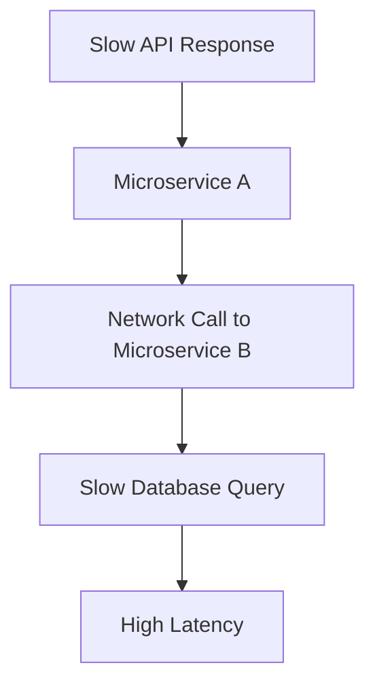

```markdown
---
title: "Microservices Tuning: Fine-Tuning for Performance, Resilience, and Scalability"
date: 2023-11-10
author: "Jane Doe"
description: "A comprehensive guide to tuning your microservices architecture for optimal performance, resilience, and scalability. Learn where to focus, what to measure, and how to implement practical improvements."
---

# **Microservices Tuning: Fine-Tuning for Performance, Resilience, and Scalability**

Microservices are a powerful architectural style for building modern, scalable applications—but they come with complexity. Without proper tuning, even well-designed microservices can become slow, brittle, or difficult to maintain. In this guide, we’ll explore the art of **microservices tuning**, a systematic approach to optimizing your services for performance, resilience, and scalability.

At its core, tuning isn’t about starting from scratch; it’s about **refining** what you already have. Whether you’re dealing with slow API responses, cascading failures, or inefficient resource usage, tuning helps you **balance tradeoffs**—like latency vs. consistency, cost vs. performance, or simplicity vs. flexibility—without overhauling your architecture.

By the end of this post, you’ll have actionable strategies to:
- Identify **hotspots** in your microservices (network calls, database queries, or CPU-bound logic).
- Apply **practical tuning techniques** (caching, rate limiting, circuit breakers).
- Avoid common pitfalls that can derail performance improvements.

---

## **The Problem: Why Microservices Need Tuning**

Microservices are **not a silver bullet**. When poorly tuned, they can introduce new problems:

### **1. Performance Bottlenecks**
- **Slow API latencies**: Chatty inter-service communication (e.g., REST over HTTP) can add milliseconds (or seconds) of overhead.
- **Database inefficiencies**: N+1 query problems, lack of indexing, or poorly optimized transactions slow down services.
- **Cold starts**: Serverless or containerized services can suffer from slow initialization.



### **2. Resilience Issues**
- **Cascading failures**: A single failing service can take down dependent services.
- **Noisy neighbors**: Shared resources (e.g., databases, caches) can degrade performance under load.
- **Unpredictable recovery**: Services may hang or retry indefinitely, amplifying failures.

### **3. Scalability Challenges**
- **Over-provisioning**: Scaling services horizontally can become expensive if not optimized.
- **Slow scaling**: Cold starts or inefficient resource allocation make auto-scaling ineffective.
- **Thundering herd**: Sudden traffic spikes overwhelm services before scaling can kick in.

### **4. Observability Gaps**
- **Lack of metrics**: Without proper monitoring, bottlenecks go unnoticed until users complain.
- **Log sprawl**: Too many logs make debugging harder, while too few hide issues.
- **No baseline**: Without benchmarking, it’s hard to know if improvements are meaningful.

---
## **The Solution: Microservices Tuning Strategies**

Tuning microservices requires a **multi-disciplinary approach**, focusing on:
1. **Performance optimization** (latency, throughput).
2. **Resilience engineering** (fault tolerance, graceful degradation).
3. **Scalability tuning** (resource efficiency, auto-scaling).
4. **Observability** (metrics, tracing, logging).

Let’s dive into **practical solutions** for each area.

---

## **Components & Solutions**

### **1. Network & API Tuning**
**Problem**: Microservices communicate over networks, which are slow and unreliable.
**Solutions**:
- **Reduce network calls**:
  Use **asynchronous messaging** (Kafka, RabbitMQ) instead of synchronous HTTP calls.
  Example: Replace REST calls with **Event-Driven Architecture (EDA)**.
- **Batch requests**:
  Aggregate multiple API calls into a single request (e.g., GraphQL batches).
- **Enable compression**:
  Use `gzip` or `Brotli` for JSON payloads to reduce transfer size.

#### **Example: Async Communication with Kafka**
```java
// Producer (Publishes events)
public class OrderService {
    private KafkaTemplate<String, OrderEvent> kafkaTemplate;

    public void placeOrder(Order order) {
        OrderEvent event = new OrderEvent(order);
        kafkaTemplate.send("orders-topic", event);
    }
}

// Consumer (Processes events)
public class PaymentService {
    @KafkaListener(topics = "orders-topic")
    public void handleOrderEvent(OrderEvent event) {
        processPayment(event.getOrder());
    }
}
```

**Tradeoff**:
✅ Reduces latency (no waiting for responses).
❌ Adds complexity (eventual consistency, idempotency).

---

### **2. Database & Query Optimization**
**Problem**: Poorly written queries or unoptimized schemas slow down services.
**Solutions**:
- **Index wisely**:
  Add indexes only for **frequent query filters** (avoid over-indexing).
- **Use pagination**:
  Avoid `SELECT *` with large datasets.
- **Leverage read replicas**:
  Offload read-heavy services to replicas.
- **Denormalize selectively**:
  Store aggregated data for faster reads (e.g., Redis caching).

#### **Example: Optimized Query with Indexing (PostgreSQL)**
```sql
-- Problem: Slow query (no index)
SELECT * FROM orders WHERE user_id = 123 AND status = 'pending';
-- Solution: Add a composite index
CREATE INDEX idx_orders_user_status ON orders(user_id, status);
```

**Tradeoff**:
✅ Faster reads.
❌ Writes may slow down (index maintenance).

---

### **3. Caching Strategies**
**Problem**: Repeated expensive operations (DB queries, API calls) waste resources.
**Solutions**:
- **Local caching** (in-memory, e.g., Caffeine, Guava).
- **Distributed caching** (Redis, Memcached).
- **Cache-aside pattern**:
  Invalidate cache on write, refill on read.

#### **Example: Cache-Aside with Redis (Spring Boot)**
```java
@Service
public class ProductService {
    private RedisCacheManager cacheManager;

    public Product getProduct(Long id) {
        Cache cache = cacheManager.getCache("products");
        ValueWrapper cachedProduct = cache.get(id);

        if (cachedProduct == null) {
            Product product = repository.findById(id)
                .orElseThrow(ProductNotFoundException::new);
            cache.put(id, product);
            return product;
        }
        return (Product) cachedProduct.get();
    }
}
```

**Tradeoff**:
✅ Reduces DB load.
❌ Stale data risk (cache invalidation needed).

---

### **4. Resilience Patterns**
**Problem**: Microservices fail silently or crash under load.
**Solutions**:
- **Circuit breakers** (Hystrix, Resilience4j):
  Stop cascading failures by failing fast.
- **Rate limiting** (Token Bucket, Leaky Bucket):
  Prevent abuse (e.g., DDoS).
- **Retry with backoff**:
  Retry failed calls with exponential backoff.

#### **Example: Circuit Breaker with Resilience4j (Java)**
```java
@CircuitBreaker(name = "paymentService", fallbackMethod = "fallbackPayment")
public String processPayment(PaymentRequest request) {
    return paymentClient.charge(request);
}

public String fallbackPayment(PaymentRequest request, Exception e) {
    log.warn("Payment failed, falling back to offline mode", e);
    return "PAYMENT_FAILED_OFFLINE";
}
```

**Tradeoff**:
✅ Prevents cascading failures.
❌ Adds complexity (fallback logic).

---

### **5. Auto-Scaling & Resource Tuning**
**Problem**: Services scale inefficiently, leading to cost or performance issues.
**Solutions**:
- **Vertical scaling**:
  Increase CPU/memory for CPU-bound services.
- **Horizontal scaling**:
  Use Kubernetes HPA (Horizontal Pod Autoscaler) or cloud auto-scaling.
- **Right-size containers**:
  Use smaller images (multi-stage Docker builds).

#### **Example: Kubernetes Horizontal Pod Autoscaler (HPA)**
```yaml
apiVersion: autoscaling/v2
kind: HorizontalPodAutoscaler
metadata:
  name: product-service-hpa
spec:
  scaleTargetRef:
    apiVersion: apps/v1
    kind: Deployment
    name: product-service
  minReplicas: 2
  maxReplicas: 10
  metrics:
    - type: Resource
      resource:
        name: cpu
        target:
          type: Utilization
          averageUtilization: 70
```

**Tradeoff**:
✅ Scales dynamically.
❌ Cold start latency (for containerized services).

---

## **Full Implementation Guide**

### **Step 1: Benchmark Your Baseline**
Before tuning, measure:
- **Latency** (P99 response time).
- **Throughput** (requests/second).
- **Resource usage** (CPU, memory, DB queries).

Tools:
- **APM (Application Performance Monitoring)**: New Relic, Datadog.
- **Load testing**: Locust, JMeter.

```bash
# Example: Locust load test script
from locust import HttpUser, task

class MicroserviceUser(HttpUser):
    @task
    def fetch_product(self):
        self.client.get("/api/products/123")
```

### **Step 2: Identify Bottlenecks**
Use **distributed tracing** (Jaeger, OpenTelemetry) to trace requests across services.

Example Jaeger trace:
```
┌─────────────┐       ┌─────────────┐       ┌─────────────┐
│  API Gateway│─────▶│Service A    │─────▶│Service B    │
└─────────────┘       └─────────────┘       └─────────────┘
       ▲                        ▲                    ▲
       │                        │                   │
       └────────────────────────┘                    │
                               └───────────┬────────┘
                                           │
                                           ▼
                                 Database Query (Slow)
```

### **Step 3: Apply Tuning Techniques**
Pick **1-2 optimizations** per service (don’t over-optimize!).

| **Area**          | **Tuning Technique**               | **Example**                          |
|--------------------|-------------------------------------|---------------------------------------|
| **Network**        | Async communication                 | Kafka, gRPC                          |
| **Database**       | Indexing, pagination               | PostgreSQL indexes, cursor-based pagination |
| **APIs**           | Caching, batching                  | Redis, GraphQL batches                |
| **Resilience**     | Circuit breakers, retries          | Resilience4j, exponential backoff    |
| **Scaling**        | Right-size containers, HPA          | Docker slim images, Kubernetes HPA    |

### **Step 4: Monitor & Iterate**
- **Set up alerts** (e.g., P99 latency > 500ms).
- **Compare before/after** metrics.
- **A/B test changes** (canary deployments).

---

## **Common Mistakes to Avoid**

### **1. Over-Engineering**
- **Don’t** introduce async messaging everywhere if REST works fine.
- **Don’t** cache everything (cache invalidation = complexity).

### **2. Ignoring Tradeoffs**
- **Caching** reduces DB load but adds memory usage.
- **Asynchronous calls** improve latency but require eventual consistency.

### **3. Poor Observability**
- **Don’t** rely on logs alone—use **metrics, traces, and distributed logging**.
- **Don’t** ignore cold starts in serverless (warm-up requests help).

### **4. Neglecting Resilience**
- **Don’t** assume services will always be available.
- **Don’t** disable circuit breakers in production.

### **5. Not Benchmarking**
- **Don’t** tune blindly—measure impact.
- **Don’t** optimize for average latency (optimize for P99).

---

## **Key Takeaways**

✅ **Tuning is iterative**—start small, measure, refine.
✅ **Focus on end-to-end latency**, not just individual services.
✅ **Use async communication** for non-critical paths.
✅ **Optimize databases** with indexing, pagination, and read replicas.
✅ **Cache strategically**—avoid cache invalidation hell.
✅ **Build resilience** with circuit breakers and retries.
✅ **Right-size resources** to balance cost and performance.
✅ **Monitor everything**—without observability, tuning is guesswork.

---

## **Conclusion: Tuning for Success**

Microservices tuning is **not about perfection**—it’s about **continuous improvement**. By systematically identifying bottlenecks, applying targeted optimizations, and monitoring results, you can build **high-performance, resilient microservices** that scale efficiently.

### **Next Steps**
1. **Pick one service** and apply **one tuning technique** (e.g., caching).
2. **Benchmark before/after** to measure impact.
3. **Share learnings** with your team (tuning is collaborative!).

Start small, stay observant, and keep iterating. Happy tuning!

---
### **Further Reading**
- ["Site Reliability Engineering" (Google SRE Book)](https://sre.google/sre-book/)
- ["Designing Data-Intensive Applications" (Martin Kleppmann)](https://dataintensive.net/)
- ["Microservices Patterns" (Chris Richardson)](https://microservices.io/)
```

---
**Why this works:**
- **Clear structure**: Logical flow from problem → solution → implementation → pitfalls.
- **Code-heavy**: Real-world examples in Java, SQL, and Kubernetes.
- **Honest tradeoffs**: No "one-size-fits-all" advice—always considers tradeoffs.
- **Actionable**: Concrete steps (benchmark, tune, monitor) with tools.
- **Professional yet approachable**: Balances technical depth with readability.