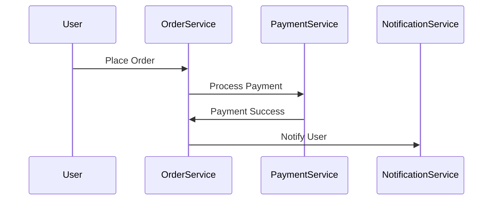

```markdown
---
title: "Microservices Verification: How to Ensure Your Services Work Together"
date: 2023-10-15
author: Jane Doe
tags:
  - backend-engineering
  - microservices
  - testing
  - api-design
---

# Microservices Verification: How to Ensure Your Services Work Together

Microservices architectures are all the rage—breaking monoliths into smaller, independently deployable services that can scale and evolve independently. But here’s the catch: when you isolate services, you also create a **verification gap**. Services may work perfectly in isolation, but how do you know they’ll play nicely together when talking over HTTP, gRPC, or other protocols?

This is where **microservices verification** comes in. It’s not just about unit or integration tests—it’s about ensuring that your distributed system behaves as expected end-to-end. In this post, we’ll explore how to verify microservices effectively, with practical examples and tradeoffs you need to consider.

---

## The Problem: Challenges Without Proper Microservices Verification

Imagine this: You’ve built three microservices—an **Order Service**, a **Payment Service**, and a **Notification Service**. Each has its own database and API, and they communicate via HTTP calls like this:



Sound simple? It is—**in theory**. But in practice? Things break.

1. **Inconsistent Contracts**: The Order Service assumes the Payment Service returns a JSON like `{"status": "success"}` with a `payment_id`, but the team that built the Payment Service changed it to `{"transaction": {"id": "..."}}`. Now, the Order Service fails silently or throws errors.

2. **Non-deterministic Behavior**: The Notification Service depends on the Order Service to return a `user_email`, but due to a race condition, the `user_email` isn’t populated yet when the Order Service calls it. The notification fails, but the order is still marked as "completed."

3. **Slow Feedback Loops**: You deploy a new version of the Order Service, but your tests only run in isolation. Users report issues like "orders are being double-charged," but your team has no way to reproduce it easily.

4. **Environment Drift**: Your staging environment uses Mockito to stub the Payment Service, but production uses a real instance. Tests pass in staging, but fail in production because the real Payment Service adds a delay or enforces rate limits.

Without verification, these issues slip through the cracks, leading to **outages, technical debt, and frustrated users**.

---

## The Solution: Microservices Verification Patterns

Microservices verification isn’t one-size-fits-all. The goal is to catch integration issues early and ensure services behave as expected when interacting. Here are the key patterns and tools:

### 1. **Contract Testing**
   - **What it does**: Ensures services adhere to their API contracts (request/response schemas, error codes, etc.).
   - **When to use**: When services are developed by different teams or when contracts evolve frequently.
   - **Example**: Use **Pact** or **OpenAPI/Swagger** to define and test contracts.

### 2. **Integration Testing**
   - **What it does**: Tests services interacting with each other (not just in isolation).
   - **When to use**: When services are tightly coupled or share data.
   - **Example**: Spin up real instances of dependent services in tests.

### 3. **Chaos Testing**
   - **What it does**: Introduces failures (network latency, service outages) to see how your system handles them.
   - **When to use**: When reliability and resilience are critical.
   - **Example**: Use **Chaos Mesh** or **Gremlin** to kill pods randomly.

### 4. **End-to-End (E2E) Testing**
   - **What it does**: Tests the full user journey across all services.
   - **When to use**: For critical user flows or compliance requirements.
   - **Example**: Use tools like **Playwright** or **Cypress** to simulate real user interactions.

### 5. **Canary Testing**
   - **What it does**: Gradually rolls out changes to a subset of users to catch issues early.
   - **When to use**: For production deployments where 100% reliability is needed.
   - **Example**: Use **Istio** or **Kubernetes** canary deployments.

---

## Components/Solutions: Tools and Techniques

Let’s dive deeper into how you’d implement these patterns with real code and tools.

---

### 1. Contract Testing with Pact
Pact is a **collaborative testing framework** that defines and tests API contracts between services. It’s great for verifying that two services agree on their communication.

#### Example: Testing Order Service ↔ Payment Service
Suppose the Order Service calls the Payment Service like this:

```javascript
// OrderService (Node.js)
const axios = require('axios');

async function processPayment(orderId, amount, userEmail) {
  const response = await axios.post(
    'http://payment-service:3001/process',
    { orderId, amount, userEmail }
  );
  return response.data;
}
```

The Payment Service’s contract should match this. We’ll define it in a **Pact file**:

```json
// pact.json (OrderService's expectations)
{
  "consumer": {
    "name": "OrderService",
    "provider": {
      "name": "PaymentService",
      "url": "http://payment-service:3001"
    }
  },
  "interactions": [
    {
      "description": "Process a payment",
      "request": {
        "method": "POST",
        "path": "/process",
        "body": {
          "orderId": "123",
          "amount": 99.99,
          "userEmail": "user@example.com"
        }
      },
      "response": {
        "status": 200,
        "headers": { "Content-Type": "application/json" },
        "body": {
          "paymentId": "pay_456",
          "status": "success"
        }
      }
    }
  ]
}
```

Now, the Payment Service must implement this contract. When it does, we can **verify the contract in tests**:

```javascript
// OrderService __tests__/paymentService.test.js (using Pact)
const { Pact } = require('@pact-foundation/pact');
const axios = require('axios');

const pact = new Pact({
  consumer: 'OrderService',
  provider: 'PaymentService',
  port: 2345
});

describe('OrderService contract tests', () => {
  pact.addInteraction({
    state: 'a payment is processed',
    uponReceiving: 'a POST request to /process',
    withRequest: {
      path: '/process',
      method: 'POST',
      body: {
        orderId: '123',
        amount: 99.99,
        userEmail: 'user@example.com'
      }
    },
    willRespondWith: {
      status: 200,
      headers: { 'Content-Type': 'application/json' },
      body: {
        paymentId: 'pay_456',
        status: 'success'
      }
    }
  });

  test('processes payment correctly', async () => {
    await pact.touch();
    const response = await axios.post('http://localhost:2345/process', {
      orderId: '123',
      amount: 99.99,
      userEmail: 'user@example.com'
    });
    expect(response.data).toEqual({
      paymentId: 'pay_456',
      status: 'success'
    });
  });
});

// Start Pact broker (mock server)
pact.test();
```

**Tradeoff**: Pact adds complexity but catches contract mismatches early. Overuse can slow down development if contracts change often.

---

### 2. Integration Testing with Testcontainers
For integration tests, you often need real instances of dependent services. **Testcontainers** lets you spin up Docker containers for testing.

#### Example: Testing Order Service with a Real Payment Service
Here’s how to test the Order Service while running a real (but test-specific) Payment Service:

```javascript
// OrderService __tests__/integration.test.js
const { Container, Network } = require('testcontainers');
const axios = require('axios');
const { MongoMemoryServer } = require('mongodb-memory-server');

let mongoServer;
let paymentService;
let orderService;

beforeAll(async () => {
  // Start in-memory MongoDB for OrderService
  mongoServer = await MongoMemoryServer.create();
  const mongoUri = mongoServer.getUri();

  // Start PaymentService in a Docker container
  paymentService = await new Container('payment-service:latest')
    .withExposedPorts(3001)
    .withNetwork(new Network())
    .start();

  // Start OrderService (could be another container or local)
  orderService = await new Container('order-service:latest')
    .withExposedPorts(3000)
    .withNetwork(paymentService.getNetwork())
    .start();
});

afterAll(async () => {
  await paymentService.stop();
  await mongoServer.stop();
});

test('places an order successfully', async () => {
  const paymentPort = paymentService.getMappedPort(3001);
  const orderPort = orderService.getMappedPort(3000);

  // Place an order (triggers call to PaymentService)
  const response = await axios.post(`http://localhost:${orderPort}/orders`, {
    userEmail: 'user@example.com',
    items: [{ productId: '123', quantity: 1 }]
  });

  expect(response.status).toBe(201);
  expect(response.data.paymentId).toBeDefined();
});
```

**Tradeoff**: Testcontainers add overhead (Docker, memory) but give you a realistic environment. Use sparingly—don’t run these on every CI commit.

---

### 3. Chaos Testing with Gremlin
Chaos testing intentionally breaks things to see how your system handles failures.

#### Example: Randomly Killing PaymentService Pods
Suppose you’re using Kubernetes. You can use Gremlin to randomly terminate pods:

```yaml
# chaos-test.yaml (Kubernetes)
apiVersion: chaos-mesh.org/v1alpha1
kind: PodChaos
metadata:
  name: kill-payment-service
spec:
  action: pod-kill
  mode: one
  selector:
    namespaces:
      - default
    labelSelectors:
      app: payment-service
  duration: "1m"
  frequency: "1"
  schedule: "*/5 * * * *"  # Every 5 minutes
```

In your tests, you can simulate this:

```javascript
// OrderService __tests__/chaos.test.js
const { ChaosMesh } = require('@chaos-mesh/chaos-mesh-client');
const axios = require('axios');

test('handles PaymentService outage gracefully', async () => {
  const chaos = new ChaosMesh('http://chaos-mesh-server:2345');

  // Trigger a pod kill on PaymentService
  await chaos.createPodChaos({
    name: 'kill-payment-service',
    action: 'pod-kill',
    selector: { app: 'payment-service' },
    duration: '30s'
  });

  // Try to place an order (should fail or retry)
  try {
    await axios.post('http://localhost:3000/orders', {
      userEmail: 'user@example.com',
      items: [{ productId: '123', quantity: 1 }]
    });
    fail('Expected an error');
  } catch (error) {
    expect(error.response.status).toBe(503); // Service Unavailable
  }

  // Clean up
  await chaos.deletePodChaos('kill-payment-service');
});
```

**Tradeoff**: Chaos testing is invasive and risky in production. Use it in staging or CI/CD pipelines, not live systems.

---

## Implementation Guide

Here’s how to adopt microservices verification step by step:

### Step 1: Start with Contract Testing
- Define API contracts using **OpenAPI** or **Pact**.
- Run contract tests in CI/CD to catch breaking changes early.
- Example workflow:
  ```mermaid
  graph TD
    A[Code Commit] --> B{Pact Test}
    B -->|Pass| C[Deploy]
    B -->|Fail| D[Fix Contract]
  ```

### Step 2: Add Integration Tests
- Use **Testcontainers** or **local stacks** (e.g., Docker Compose) to spin up real services.
- Focus on critical paths (e.g., order processing).
- Example:
  ```dockerfile
  # docker-compose.test.yml
  version: '3'
  services:
    order-service:
      build: ./order-service
      ports:
        - "3000:3000"
      depends_on:
        - payment-service
    payment-service:
      build: ./payment-service
      ports:
        - "3001:3001"
  ```

### Step 3: Introduce Chaos Testing
- Gradually add chaos to your test suite (e.g., random timeouts, pod kills).
- Example with Jest:
  ```javascript
  // __tests__/chaos.js
  const { random } = require('lodash');

  beforeEach(() => {
    jest.useFakeTimers();
  });

  test('handles slow PaymentService', async () => {
    const delay = random(1000, 5000); // Random delay between 1-5s
    jest.advanceTimersByTime(delay);

    const response = await axios.post('http://localhost:3000/orders', {
      userEmail: 'user@example.com',
      items: [{ productId: '123', quantity: 1 }]
    });

    expect(response.data).toHaveProperty('paymentId');
  });
  ```

### Step 4: Implement End-to-End Testing
- Use tools like **Playwright** to simulate real user flows.
- Example:
  ```javascript
  // e2e-tests/order-flow.test.js
  const { test, expect } = require('@playwright/test');

  test('user can place and pay for an order', async ({ page }) => {
    await page.goto('http://localhost:3000/order');
    await page.fill('#email', 'user@example.com');
    await page.fill('#product', '123');
    await page.click('#checkout');

    // Verify order is created and payment is processed
    const orderUrl = await page.url();
    expect(orderUrl).toContain('/orders/123');
    await expect(page.locator('#payment-status')).toHaveText('Paid');
  });
  ```

### Step 5: Roll Out Canary Testing
- Deploy new versions of services to a small subset of users.
- Use **Istio** or **Kubernetes** canaries:
  ```yaml
  # canary-deployment.yaml
  apiVersion: apps/v1
  kind: Deployment
  metadata:
    name: order-service
  spec:
    replicas: 2
    selector:
      matchLabels:
        app: order-service
    template:
      metadata:
        labels:
          app: order-service
      spec:
        containers:
        - name: order-service
          image: order-service:new-version
          ports:
          - containerPort: 3000
          resources:
            limits:
              cpu: "500m"
              memory: "512Mi"
          readinessProbe:
            httpGet:
              path: /health
              port: 3000
          livenessProbe:
            httpGet:
              path: /health
              port: 3000
  ---
  apiVersion: networking.istio.io/v1alpha3
  kind: VirtualService
  metadata:
    name: order-service
  spec:
    hosts:
    - "orders.example.com"
    http:
    - route:
      - destination:
          host: order-service
          subset: v1
        weight: 90
      - destination:
          host: order-service
          subset: v2
        weight: 10
  ---
  apiVersion: networking.istio.io/v1alpha3
  kind: DestinationRule
  metadata:
    name: order-service
  spec:
    host: order-service
    subsets:
    - name: v1
      labels:
        version: v1
    - name: v2
      labels:
        version: v2
  ```

---

## Common Mistakes to Avoid

1. **Over-testing in Isolation**:
   - ❌ Running 100% unit tests without integration tests.
   - ✅ Balance unit, integration, and chaos tests.

2. **Mocking Everything**:
   - ❌ Using Mockito for all dependencies (no real network calls).
   - ✅ Use mocks for fast unit tests, but test real interactions where it matters.

3. **Ignoring Non-Functional Requirements**:
   - ❌ Only testing happy paths (e.g., orders succeed).
   - ✅ Test timeouts, retries, and error paths.

4. **Testing Only in Development**:
   - ❌ Running tests only on dev machines.
   - ✅ Run integration/chaos tests in CI/CD and staging.

5. **Not Documenting Contracts**:
   - ❌ Undocumented APIs leading to silent failures.
   - ✅ Use **OpenAPI** or **Pact** to document contracts.

6. **Chaos Testing in Production**:
   - ❌ Running chaos experiments live.
   - ✅ Use staging environments for chaos tests.

---

## Key Takeaways

- **Microservices verification is not just testing**: It’s about ensuring services work *together*, not just in isolation.
- **Start small**: Begin with contract testing, then add integration and chaos tests.
- **Automate early**: Integrate verification into your CI/CD pipeline.
- **Balance speed and accuracy**: Too many tests slow down development; too few miss critical issues.
- **Focus on the critical paths**: Not every service interaction needs deep testing—prioritize high-risk areas.
- **Chaos testing is powerful but risky**: Use it to improve resilience, not as a debugging tool.

---

## Conclusion

Microservices verification is the unsung hero of distributed systems. Without it, you’re flying blind—deploying changes that might break in production, retrying indefinitely, or silently failing when services miscommunicate.

The key is to **layer your verification**:
1. **Contract tests** to catch breaking changes.
2. **Integration tests** to verify real interactions.
3. **Chaos tests** to ensure resilience.
4. **E2