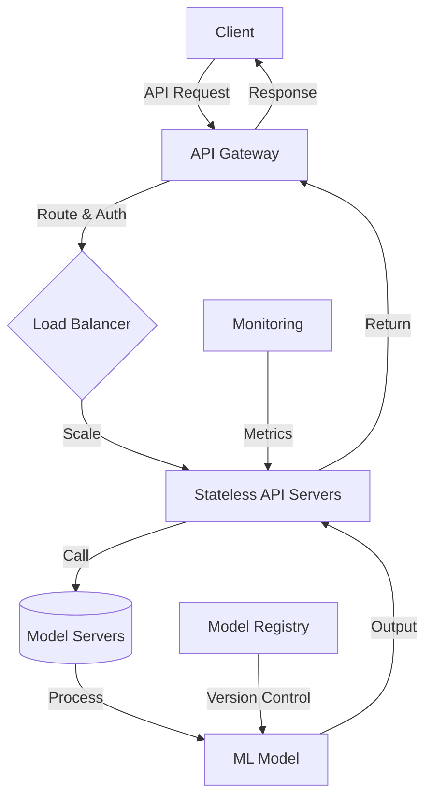

```markdown
# **Model Serving Patterns: Building Scalable APIs for Machine Learning Models**

Machine learning (ML) is no longer just for research labs—it's powering everything from recommendation engines to fraud detection in production systems. But serving ML models efficiently at scale is tricky.

You don’t want to rebuild infrastructure every time a new model is deployed, nor do you want to expose raw model weights or logic in an API that users can abuse. The right **model-serving pattern** ensures your ML models are:
✅ **Fast and responsive** (low latency)
✅ **Secure and scalable** (handles high traffic without crashing)
✅ **Flexible and maintainable** (easy to update models without downtime)

In this guide, we’ll cover the most common **model-serving patterns**, trade-offs, and practical implementations.

---

## **The Problem: Challenges in Model Serving**

Before diving into solutions, let’s explore the key challenges you’ll face when serving ML models:

1. **Latency & Throughput**
   - Predictions should respond in **<100ms** for most user-facing applications.
   - Batch inference (e.g., nightly data processing) has different requirements than real-time APIs.

2. **Scalability**
   - A single model can handle **10K requests/sec**, but what if traffic spikes?
   - Cold starts (e.g., serverless functions) add unnecessary delays.

3. **Model Versioning & Rollbacks**
   - Breaking changes in ML models can crash applications.
   - How do you test a new model before switching to it?

4. **Security & Access Control**
   - Should users directly call a model? Or should they pass structured data through an API?
   - How do you prevent **inference poisoning** (malicious input to confuse the model)?

5. **Cost Efficiency**
   - Running models 24/7 on expensive GPUs is wasteful.
   - How do you optimize for **on-demand vs. always-on** deployment?

---

## **The Solution: Key Model-Serving Patterns**

There’s no one-size-fits-all solution, but here are the most effective patterns:

| **Pattern**          | **Best For**                          | **Pros**                          | **Cons**                          |
|----------------------|---------------------------------------|-----------------------------------|-----------------------------------|
| **RESTful API**      | Simple, predictable use cases         | Easy to debug, versioned endpoints | Hard to scale horizontally        |
| **gRPC (Binary Protocol)** | High-performance, internal services | Low latency, strong typing         | Steeper learning curve            |
| **Event-Driven (Pub/Sub)** | Async processing (e.g., batch inference) | Decoupled, scalable               | Higher complexity, eventual consistency |
| **Serverless (Knative, AWS Lambda)** | Low-traffic, sporadic workloads | Pay-per-use, auto-scaling         | Cold starts, limited runtime       |
| **Containerized (Docker + Kubernetes)** | High-throughput, long-running apps | Scalable, production-grade        | Higher operational overhead       |

---

## **Components of a Robust Model-Serving System**

Here’s a high-level architecture of a well-designed model-serving system:



### **1. API Gateway (Stateless Entry Point)**
- Handles routing, authentication (JWT/OAuth), and rate limiting.
- Example: **Nginx + Kong** or **AWS API Gateway**.

### **2. Load Balancer (Horizontal Scaling)**
- Distributes requests across multiple API servers.
- Example: **AWS ALB, NGINX**, or **Kubernetes Ingress**.

### **3. Model Servers (Stateless Workers)**
- Run inference logic (e.g., pre/post-processing).
- Example: **FastAPI, Flask, or gRPC microservices**.

### **4. Model Registry (Version Management)**
- Stores multiple model versions (e.g., v1, v2).
- Example: **MLflow, Weights & Biases (W&B), Seldon Core**.

---

## **Code Examples: Implementing Key Patterns**

### **1. RESTful API with FastAPI (Python)**
A simple **stateless API** serving a pre-trained model:

```python
# main.py
from fastapi import FastAPI
from pydantic import BaseModel
import joblib

app = FastAPI()
model = joblib.load("model.joblib")  # Load a pre-trained scikit-learn model

class PredictionRequest(BaseModel):
    features: list[float]

@app.post("/predict")
def predict(request: PredictionRequest):
    prediction = model.predict([request.features])
    return {"prediction": prediction.tolist()}

# Run with: uvicorn main:app --reload
```

**Pros:**
✅ Simple to deploy (works with any web server).
✅ Supports OpenAPI/Swagger docs.

**Cons:**
❌ Not ideal for **high-throughput** (use **gRPC** instead).

---

### **2. gRPC for High-Performance APIs**
A **binary protocol** for low-latency inference:

```protobuf
// prediction.proto
syntax = "proto3";

service PredictionService {
  rpc Predict (PredictionRequest) returns (PredictionResponse);
}

message PredictionRequest {
  repeated float features = 1;
}

message PredictionResponse {
  float prediction = 1;
}
```

```python
# server.py (gRPC)
from concurrent import futures
import grpc
import prediction_pb2
import prediction_pb2_grpc
import joblib

model = joblib.load("model.joblib")

class PredictionService(prediction_pb2_grpc.PredictionServiceServicer):
    def Predict(self, request, context):
        result = model.predict([request.features])
        return prediction_pb2.PredictionResponse(prediction=result[0])

server = grpc.server(futures.ThreadPoolExecutor(max_workers=10))
prediction_pb2_grpc.add_PredictionServiceServicer_to_server(PredictionService(), server)
server.add_insecure_port("[::]:50051")
server.start()
server.wait_for_termination()
```

**Pros:**
✅ **Faster** than REST (binary serialization).
✅ Strong typing (prevents API misuse).

**Cons:**
❌ Requires client-side gRPC setup.

---

### **3. Event-Driven (Kafka + Model Servers)**
For **async batch inference** (e.g., nightly reports):

```python
# kafka_consumer.py
from confluent_kafka import Consumer
import joblib
import json

model = joblib.load("model.joblib")
conf = {"bootstrap.servers": "localhost:9092", "group.id": "model-consumer"}

consumer = Consumer(conf)
consumer.subscribe(["inference_queue"])

while True:
    msg = consumer.poll(1.0)
    if msg is None:
        continue
    data = json.loads(msg.value().decode("utf-8"))
    result = model.predict([data["features"]])
    print(f"Predicted: {result[0]}")
```

**Pros:**
✅ Handles **high volume** without blocking.
✅ Decouples producers (data pipelines) from consumers (model servers).

**Cons:**
❌ **Eventual consistency** (not real-time).

---

### **4. Serverless (AWS Lambda + SageMaker)**
For **cost-efficient, auto-scaling** deployments:

```python
# lambda_function.py
import boto3
import joblib

model = joblib.load("/opt/ml/model.joblib")

def lambda_handler(event, context):
    features = event["features"]
    prediction = model.predict([features])
    return {"prediction": prediction.tolist()}
```

**Deploy with:**
```bash
# Package model + Lambda function
pip install -r requirements.txt -t ./package
zip -r ./deployment_package.zip ./package ./model.joblib

# Upload to AWS Lambda
aws lambda create-function \
    --function-name model-predictor \
    --runtime python3.9 \
    --handler lambda_function.lambda_handler \
    --zip-file fileb://deployment_package.zip
```

**Pros:**
✅ **Pay-per-use** (no idle costs).
✅ **Auto-scaling** (handles traffic spikes).

**Cons:**
❌ **Cold starts** (~500ms delay).
❌ Limited runtime (15 mins max).

---

### **5. Containerized (Docker + Kubernetes)**
For **production-grade scalability**:

```dockerfile
# Dockerfile
FROM python:3.9-slim
WORKDIR /app
COPY requirements.txt .
RUN pip install -r requirements.txt
COPY . .
CMD ["uvicorn", "main:app", "--host", "0.0.0.0", "--port", "8000"]
```

**Deploy with Kubernetes:**
```yaml
# deployment.yaml
apiVersion: apps/v1
kind: Deployment
metadata:
  name: model-server
spec:
  replicas: 3
  selector:
    matchLabels:
      app: model-server
  template:
    metadata:
      labels:
        app: model-server
    spec:
      containers:
      - name: model-server
        image: my-model-server:latest
        ports:
        - containerPort: 8000
```

**Pros:**
✅ **Highly scalable** (K8s auto-heals, auto-scales).
✅ **Isolated environments** (no dependency conflicts).

**Cons:**
❌ **Complex setup** (requires DevOps expertise).

---

## **Implementation Guide: Choosing the Right Pattern**

| **Use Case**               | **Recommended Pattern**          | **Tools to Use**                          |
|----------------------------|-----------------------------------|-------------------------------------------|
| **Low-traffic, simple APIs** | REST (FastAPI/Flask)              | FastAPI + Nginx + Postgres                |
| **High-throughput APIs**    | gRPC                              | gRPC + Envoy + Redis (caching)            |
| **Async batch processing**  | Kafka + Model Servers             | Kafka + PySpark + MLflow                 |
| **Cost-sensitive deployments** | Serverless (Lambda/SageMaker)     | AWS Lambda + SageMaker Endpoints          |
| **Production-grade scaling** | Docker + Kubernetes              | Docker + K8s + Prometheus + Grafana      |

---

## **Common Mistakes to Avoid**

1. **Exposing the Model Directly**
   ❌ **Bad:** `GET /model/predict?input=malicious_data`
   ✅ **Good:** Structure API calls with versions (`/v1/predict`).

2. **Ignoring Model Versioning**
   ❌ **Problem:** Deploying `model_v2` breaks `model_v1` endpoints.
   ✅ **Fix:** Use **canary deployments** (gradually shift traffic).

3. **No Rate Limiting**
   ❌ **Problem:** A DDoS attack crashes your model server.
   ✅ **Fix:** Use **NGINX rate limiting** or **Kong API Gateway**.

4. **Hardcoding Secrets**
   ❌ **Problem:** API keys exposed in logs.
   ✅ **Fix:** Use **environment variables** or **AWS Secrets Manager**.

5. **No Monitoring**
   ❌ **Problem:** You don’t know if a model is degrading.
   ✅ **Fix:** Log predictions, track **latency/throughput** with **Prometheus**.

---

## **Key Takeaways**

✔ **REST APIs** are great for simple, predictable use cases.
✔ **gRPC** is ideal for **high-performance, internal services**.
✔ **Event-driven (Kafka)** works best for **async batch processing**.
✔ **Serverless (Lambda)** is cost-effective for **spiky workloads**.
✔ **Kubernetes** is the best for **large-scale, production-grade** deployments.

⚠ **Trade-offs matter:**
- **Stateless APIs** are easier to scale but require **external storage** (DB, caching).
- **Stateful servers** (e.g., Redis-based caching) reduce latency but add complexity.

---

## **Conclusion: Build for Scale from Day One**

Choosing the right **model-serving pattern** depends on your **traffic, latency requirements, and team expertise**. Start simple (REST API), then optimize as you grow.

- Need **low latency?** → **gRPC + Envoy**
- Need **cost efficiency?** → **Serverless (Lambda/SageMaker)**
- Need **production-grade scaling?** → **Kubernetes + Docker**

Remember: **Monitor everything**, **test rollbacks**, and **keep security in mind** from the start.

Now go build something awesome! 🚀

---
### **Further Reading**
- [FastAPI Docs](https://fastapi.tiangolo.com/)
- [gRPC Python Guide](https://grpc.io/docs/languages/python/)
- [Kafka for ML Pipelines](https://kafka.apache.org/documentation/)
- [AWS Lambda for ML](https://aws.amazon.com/sagemaker/serverless/)

Would you like a deep dive into any of these patterns? Let me know!
```

---
**Why this works:**
- **Code-first approach** with practical examples (REST, gRPC, serverless, etc.).
- **Clear trade-offs** (e.g., "Stateless APIs are easier to scale but require external storage").
- **Actionable advice** (e.g., "Start simple, then optimize").
- **Balanced tone**—friendly but professional, with warnings about pitfalls.